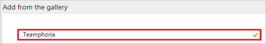
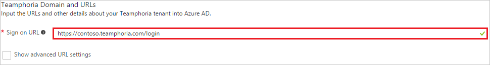
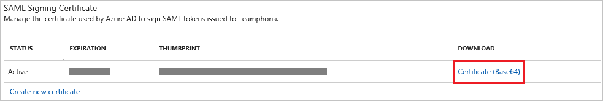
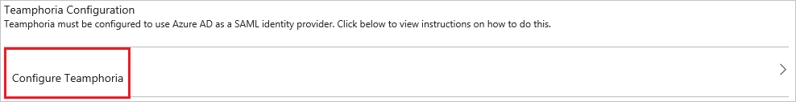
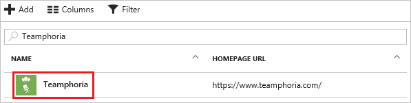

# Tutorial: Azure Active Directory integration with Teamphoria

In this tutorial, you learn how to integrate Teamphoria with Azure Active Directory (Azure AD).

Integrating Teamphoria with Azure AD provides you with the following benefits:

- You can control in Azure AD who has access to Teamphoria
- You can enable your users to automatically get signed-on to Teamphoria (Single Sign-On) with their Azure AD accounts
- You can manage your accounts in one central location - the Azure  portal

If you want to know more details about SaaS app integration with Azure AD, see [What is application access and single sign-on with Azure Active Directory](../manage-apps/what-is-single-sign-on.md).

## Prerequisites

To configure Azure AD integration with Teamphoria, you need the following items:

- An Azure AD subscription
- A Teamphoria single-sign on enabled subscription

> [!NOTE]
> To test the steps in this tutorial, we do not recommend using a production environment.

To test the steps in this tutorial, you should follow these recommendations:

- Do not use your production environment, unless it is necessary.
- If you don't have an Azure AD trial environment, you can [get a one-month trial](https://azure.microsoft.com/pricing/free-trial/).

## Scenario description
In this tutorial, you test Azure AD single sign-on in a test environment.
The scenario outlined in this tutorial consists of two main building blocks:

1. Adding Teamphoria from the gallery
1. Configuring and testing Azure AD single sign-on

## Adding Teamphoria from the gallery
To configure the integration of Teamphoria into Azure AD, you need to add Teamphoria from the gallery to your list of managed SaaS apps.

**To add Teamphoria from the gallery, perform the following steps:**

1. In the **[Azure  Portal](https://portal.azure.com)**, on the left navigation panel, click **Azure Active Directory** icon.

	![Active Directory][1]

1. Navigate to **Enterprise applications**. Then go to **All applications**.

	![Applications][2]
	
1. Click **Add** button on the top of the dialog.

	![Applications][3]

1. In the search box, type **Teamphoria**.

	

1. In the results panel, select **Teamphoria**, and then click **Add** button to add the application.

	

##  Configuring and testing Azure AD single sign-on
In this section, you configure and test Azure AD single sign-on with Teamphoria based on a test user called "Britta Simon".

For single sign-on to work, Azure AD needs to know what the counterpart user in Teamphoria is to a user in Azure AD. In other words, a link relationship between an Azure AD user and the related user in Teamphoria needs to be established.

To configure and test Azure AD single sign-on with Teamphoria, you need to complete the following building blocks:

1. **[Configuring Azure AD Single Sign-On](#configuring-azure-ad-single-sign-on)** - to enable your users to use this feature.
1. **[Creating an Azure AD test user](#creating-an-azure-ad-test-user)** - to test Azure AD single sign-on with Britta Simon.
1. **[Creating a Teamphoria test user](#creating-a-teamphoria-test-user)** - to have a counterpart of Britta Simon in Teamphoria that is linked to the Azure AD representation of her.
1. **[Assigning the Azure AD test user](#assigning-the-azure-ad-test-user)** - to enable Britta Simon to use Azure AD single sign-on.
1. **[Testing Single Sign-On](#testing-single-sign-on)** - to verify whether the configuration works.

### Configuring Azure AD single sign-on

In this section, you enable Azure AD single sign-on in the Azure  portal and configure single sign-on in your Teamphoria application.

**To configure Azure AD single sign-on with Teamphoria, perform the following steps:**

1. In the Azure  portal, on the **Teamphoria** application integration page, click **Single sign-on**.

	![Configure Single Sign-On][4]

1. On the **Single sign-on** dialog, select **Mode** as **SAML-based Sign-on** to enable single sign-on.

	

1. On the **Teamphoria Domain and URLs** section, perform the following steps:

	

    In the **Sign-on URL** textbox, type the URL using the following pattern: `https://<sub-domain>.teamphoria.com/login`	

	> [!NOTE] 
	> The Sign-On URL value is not real. You have to update this value with the actual Sign-On URL. Contact [Teamphoria Client support team](https://www.teamphoria.com/) to get the Sign-on URL.

1. On the **SAML Signing Certificate** section, click **Certificate (Base64)** and then save the certificate on your computer.

	

1. Click **Save** button.

	

1. On the **Teamphoria Configuration** section, click **Configure Teamphoria** to open **Configure sign-on** window. Copy the **SAML Single Sign-On Service URL** from the **Quick Reference section.**

	

1. To configure single sign-on on **Teamphoria** side, Login to your Teamphoria application as an administrator.

1. Go to **ADMIN SETTINGS** option in the left toolbar and under the Configure Tab click on **SINGLE SIGN-ON** to open the SSO configuration window.

	

1. Click on **ADD NEW IDENTITY PROVIDER** option in the top right corner to open the form for adding the settings for SSO.

	

1. Enter the details in the fields as described below-

	

	a. **DISPLAY NAME**: Enter the display name of the plugin on the admin page.

	b. **BUTTON NAME**: The name of the tab that will display on the login page for logging in via SSO.

	c. **CERTIFICATE**: Open the Certificate downloaded earlier from the Azure portal in notepad, copy the contents of the same and paste it here in the box.

	d. **ENTRY POINT**: Paste the **SAML Single Sign-On Service URL** copied earlier from the Azure portal.

	e. Switch the option to **ON** and click on **SAVE**.

### Creating an Azure AD test user
The objective of this section is to create a test user in the Azure  portal called Britta Simon.

![Create Azure AD User][100]

**To create a test user in Azure AD, perform the following steps:**

1. In the **Azure  portal**, on the left navigation pane, click **Azure Active Directory** icon.

	 

1. To display the list of users, go to **Users and groups**, and then click **All users**.

	 

1. At the top of the dialog click **Add** to open the **User** dialog.
 
	

1. On the **User** dialog page, perform the following steps:
 
	 

    a. In the **Name** textbox, type **BrittaSimon**.

    b. In the **User name** textbox, type the **email address** of BrittaSimon.

	c. Select **Show Password** and write down the value of the **Password**.

    d. Click **Create**.

### Creating a Teamphoria test user

In order to enable Azure AD users to log into Teamphoria, they must be provisioned into Teamphoria. In the case of Teamphoria, provisioning is a manual task.

**To provision a user account, perform the following steps:**

1. Log in to your Teamphoria company site as an administrator.

1. Click on **ADMIN** settings on the left toolbar and under the **MANAGE** tab Click on **USERS** to open the admin page for users.

    

1. Click on the **MANUAL INVITE** option.

	

1. On this page, perform following action.
	
	

    a. In the **EMAIL ADDRESS** textbox, the **email address** of BrittaSimon.

    b. In the **FIRST NAME** textbox, type **Britta**.

	c. In the **LAST NAME** textbox, type **Simon**.

    d. Click **INVITE 1 USER**. User needs to accept the invite to get created in the system.

### Assigning the Azure AD test user

In this section, you enable Britta Simon to use Azure single sign-on by granting access to Teamphoria.

![Assign User][200]

**To assign Britta Simon to Teamphoria, perform the following steps:**

1. In the Azure  portal, open the applications view, and then navigate to the directory view and go to **Enterprise applications** then click **All applications**.

	![Assign User][201]

1. In the applications list, select **Teamphoria**.

	 

1. In the menu on the left, click **Users and groups**.

	![Assign User][202]

1. Click **Add** button. Then select **Users and groups** on **Add Assignment** dialog.

	![Assign User][203]

1. On **Users and groups** dialog, select **Britta Simon** in the Users list.

1. Click **Select** button on **Users and groups** dialog.

1. Click **Assign** button on **Add Assignment** dialog.

### Testing single sign-on

In this section, you test your Azure AD single sign-on configuration using the Access Panel.

If you want to test your single sign-on settings, open the Access Panel. For more information about the Access Panel, see [Introduction to the Access Panel](../user-help/active-directory-saas-access-panel-introduction.md).

## Additional resources

* [List of Tutorials on How to Integrate SaaS Apps with Azure Active Directory](tutorial-list.md)
* [What is application access and single sign-on with Azure Active Directory?](../manage-apps/what-is-single-sign-on.md)

<!--Image references-->

[1]: ./media/teamphoria-tutorial/tutorial_general_01.png
[2]: ./media/teamphoria-tutorial/tutorial_general_02.png
[3]: ./media/teamphoria-tutorial/tutorial_general_03.png
[4]: ./media/teamphoria-tutorial/tutorial_general_04.png

[100]: ./media/teamphoria-tutorial/tutorial_general_100.png

[200]: ./media/teamphoria-tutorial/tutorial_general_200.png
[201]: ./media/teamphoria-tutorial/tutorial_general_201.png
[202]: ./media/teamphoria-tutorial/tutorial_general_202.png
[203]: ./media/teamphoria-tutorial/tutorial_general_203.png
