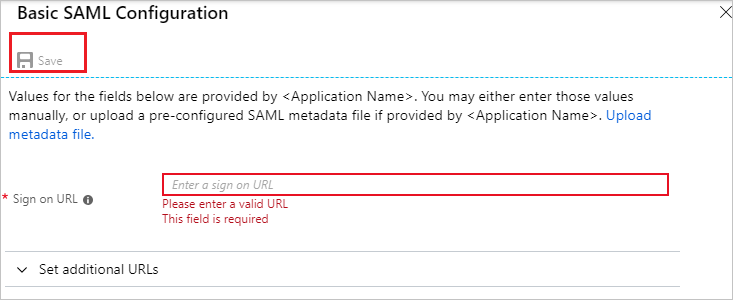

# Tutorial: Azure Active Directory integration with Teamphoria

In this tutorial, you learn how to integrate Teamphoria with Azure Active Directory (Azure AD).
Integrating Teamphoria with Azure AD provides you with the following benefits:

* You can control in Azure AD who has access to Teamphoria.
* You can enable your users to be automatically signed-in to Teamphoria (Single Sign-On) with their Azure AD accounts.
* You can manage your accounts in one central location - the Azure portal.

If you want to know more details about SaaS app integration with Azure AD, see [What is application access and single sign-on with Azure Active Directory](https://docs.microsoft.com/azure/active-directory/active-directory-appssoaccess-whatis).
If you don't have an Azure subscription, [create a free account](https://azure.microsoft.com/free/) before you begin.

## Prerequisites

To configure Azure AD integration with Teamphoria, you need the following items:

* An Azure AD subscription. If you don't have an Azure AD environment, you can get a [free account](https://azure.microsoft.com/free/)
* Teamphoria single sign-on enabled subscription

## Scenario description

In this tutorial, you configure and test Azure AD single sign-on in a test environment.

* Teamphoria supports **SP** initiated SSO

## Adding Teamphoria from the gallery

To configure the integration of Teamphoria into Azure AD, you need to add Teamphoria from the gallery to your list of managed SaaS apps.

**To add Teamphoria from the gallery, perform the following steps:**

1. In the **[Azure portal](https://portal.azure.com)**, on the left navigation panel, click **Azure Active Directory** icon.

	

2. Navigate to **Enterprise Applications** and then select the **All Applications** option.

	

3. To add new application, click **New application** button on the top of dialog.

	

4. In the search box, type **Teamphoria**, select **Teamphoria** from result panel then click **Add** button to add the application.

	 

## Configure and test Azure AD single sign-on

In this section, you configure and test Azure AD single sign-on with Teamphoria based on a test user called **Britta Simon**.
For single sign-on to work, a link relationship between an Azure AD user and the related user in Teamphoria needs to be established.

To configure and test Azure AD single sign-on with Teamphoria, you need to complete the following building blocks:

1. **[Configure Azure AD Single Sign-On](#configure-azure-ad-single-sign-on)** - to enable your users to use this feature.
2. **[Configure Teamphoria Single Sign-On](#configure-teamphoria-single-sign-on)** - to configure the Single Sign-On settings on application side.
3. **[Create an Azure AD test user](#create-an-azure-ad-test-user)** - to test Azure AD single sign-on with Britta Simon.
4. **[Assign the Azure AD test user](#assign-the-azure-ad-test-user)** - to enable Britta Simon to use Azure AD single sign-on.
5. **[Create Teamphoria test user](#create-teamphoria-test-user)** - to have a counterpart of Britta Simon in Teamphoria that is linked to the Azure AD representation of user.
6. **[Test single sign-on](#test-single-sign-on)** - to verify whether the configuration works.

### Configure Azure AD single sign-on

In this section, you enable Azure AD single sign-on in the Azure portal.

To configure Azure AD single sign-on with Teamphoria, perform the following steps:

1. In the [Azure portal](https://portal.azure.com/), on the **Teamphoria** application integration page, select **Single sign-on**.

    

2. On the **Select a Single sign-on method** dialog, select **SAML/WS-Fed** mode to enable single sign-on.

    

3. On the **Set up Single Sign-On with SAML** page, click **Edit** icon to open **Basic SAML Configuration** dialog.

	

4. On the **Basic SAML Configuration** section, perform the following steps:

    

	In the **Sign on URL** text box, type a URL using the following pattern:
    `https://<sub-domain>.teamphoria.com/login`

	> [!NOTE]
	> The Sign-On URL value is not real. You have to update this value with the actual Sign-On URL. Contact [Teamphoria Client support team](https://www.teamphoria.com/) to get the Sign-on URL. You can also refer to the patterns shown in the **Basic SAML Configuration** section in the Azure portal.

5. On the **Set up Single Sign-On with SAML** page, in the **SAML Signing Certificate** section, click **Download** to download the **Certificate (Base64)** from the given options as per your requirement and save it on your computer.

	

6. On the **Set up Teamphoria** section, copy the appropriate URL(s) as per your requirement.

	

	a. Login URL

	b. Azure AD Identifier

	c. Logout URL

### Configure Teamphoria Single Sign-On

1. To configure single sign-on on **Teamphoria** side, Login to your Teamphoria application as an administrator.

1. Go to **ADMIN SETTINGS** option in the left toolbar and under the Configure Tab click on **SINGLE SIGN-ON** to open the SSO configuration window.

	

1. Click on **ADD NEW IDENTITY PROVIDER** option in the top right corner to open the form for adding the settings for SSO.

	

1. Enter the details in the fields as described below-

	

	a. **DISPLAY NAME**: Enter the display name of the plugin on the admin page.

	b. **BUTTON NAME**: The name of the tab that will display on the login page for logging in via SSO.

	c. **CERTIFICATE**: Open the Certificate downloaded earlier from the Azure portal in notepad, copy the contents of the same and paste it here in the box.

	d. **ENTRY POINT**: Paste the **Login URL** copied earlier from the Azure portal.

	e. Switch the option to **ON** and click on **SAVE**.

### Create an Azure AD test user

The objective of this section is to create a test user in the Azure portal called Britta Simon.

1. In the Azure portal, in the left pane, select **Azure Active Directory**, select **Users**, and then select **All users**.

    

2. Select **New user** at the top of the screen.

    

3. In the User properties, perform the following steps.

    

    a. In the **Name** field enter **BrittaSimon**.
  
    b. In the **User name** field type **brittasimon@yourcompanydomain.extension**  
    For example, BrittaSimon@contoso.com

    c. Select **Show password** check box, and then write down the value that's displayed in the Password box.

    d. Click **Create**.

### Assign the Azure AD test user

In this section, you enable Britta Simon to use Azure single sign-on by granting access to Teamphoria.

1. In the Azure portal, select **Enterprise Applications**, select **All applications**, then select **Teamphoria**.

	

2. In the applications list, select **Teamphoria**.

	

3. In the menu on the left, select **Users and groups**.

    

4. Click the **Add user** button, then select **Users and groups** in the **Add Assignment** dialog.

    

5. In the **Users and groups** dialog select **Britta Simon** in the Users list, then click the **Select** button at the bottom of the screen.

6. If you are expecting any role value in the SAML assertion then in the **Select Role** dialog select the appropriate role for the user from the list, then click the **Select** button at the bottom of the screen.

7. In the **Add Assignment** dialog click the **Assign** button.

### Create Teamphoria test user

In order to enable Azure AD users to sign in to Teamphoria, they must be provisioned into Teamphoria. In the case of Teamphoria, provisioning is a manual task.

**To provision a user account, perform the following steps:**

1. Sign in to your Teamphoria company site as an administrator.

1. Click on **ADMIN** settings on the left toolbar and under the **MANAGE** tab Click on **USERS** to open the admin page for users.

    

1. Click on the **MANUAL INVITE** option.

	

1. On this page, perform following action.

	

    a. In the **EMAIL ADDRESS** textbox, enter the **email address** of the user like BrittaSimon.

    b. In the **FIRST NAME** textbox, enter the first name of the user like **Britta**.

	c. In the **LAST NAME** textbox, enter the last name of the user like **Simon**.

    d. Click **INVITE 1 USER**. User needs to accept the invite to get created in the system.

### Test single sign-on

In this section, you test your Azure AD single sign-on configuration using the Access Panel.

When you click the Teamphoria tile in the Access Panel, you should be automatically signed in to the Teamphoria for which you set up SSO. For more information about the Access Panel, see [Introduction to the Access Panel](https://docs.microsoft.com/azure/active-directory/active-directory-saas-access-panel-introduction).

## Additional Resources

- [List of Tutorials on How to Integrate SaaS Apps with Azure Active Directory](https://docs.microsoft.com/azure/active-directory/active-directory-saas-tutorial-list)

- [What is application access and single sign-on with Azure Active Directory?](https://docs.microsoft.com/azure/active-directory/active-directory-appssoaccess-whatis)

- [What is Conditional Access in Azure Active Directory?](https://docs.microsoft.com/azure/active-directory/conditional-access/overview)

