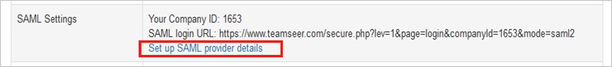
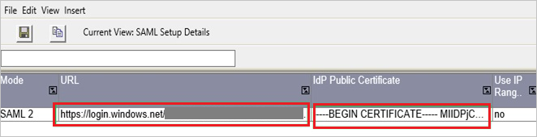
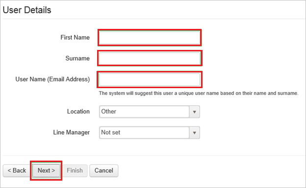

# Tutorial: Azure Active Directory integration with TeamSeer

In this tutorial, you learn how to integrate TeamSeer with Azure Active Directory (Azure AD).
Integrating TeamSeer with Azure AD provides you with the following benefits:

* You can control in Azure AD who has access to TeamSeer.
* You can enable your users to be automatically signed-in to TeamSeer (Single Sign-On) with their Azure AD accounts.
* You can manage your accounts in one central location - the Azure portal.

If you want to know more details about SaaS app integration with Azure AD, see [What is application access and single sign-on with Azure Active Directory](https://docs.microsoft.com/azure/active-directory/active-directory-appssoaccess-whatis).
If you don't have an Azure subscription, [create a free account](https://azure.microsoft.com/free/) before you begin.

## Prerequisites

To configure Azure AD integration with TeamSeer, you need the following items:

* An Azure AD subscription. If you don't have an Azure AD environment, you can get a [free account](https://azure.microsoft.com/free/)
* TeamSeer single sign-on enabled subscription

## Scenario description

In this tutorial, you configure and test Azure AD single sign-on in a test environment.

* TeamSeer supports **SP** initiated SSO

## Adding TeamSeer from the gallery

To configure the integration of TeamSeer into Azure AD, you need to add TeamSeer from the gallery to your list of managed SaaS apps.

**To add TeamSeer from the gallery, perform the following steps:**

1. In the **[Azure portal](https://portal.azure.com)**, on the left navigation panel, click **Azure Active Directory** icon.

	

2. Navigate to **Enterprise Applications** and then select the **All Applications** option.

	

3. To add new application, click **New application** button on the top of dialog.

	

4. In the search box, type **TeamSeer**, select **TeamSeer** from result panel then click **Add** button to add the application.

	 

## Configure and test Azure AD single sign-on

In this section, you configure and test Azure AD single sign-on with TeamSeer based on a test user called **Britta Simon**.
For single sign-on to work, a link relationship between an Azure AD user and the related user in TeamSeer needs to be established.

To configure and test Azure AD single sign-on with TeamSeer, you need to complete the following building blocks:

1. **[Configure Azure AD Single Sign-On](#configure-azure-ad-single-sign-on)** - to enable your users to use this feature.
2. **[Configure TeamSeer Single Sign-On](#configure-teamseer-single-sign-on)** - to configure the Single Sign-On settings on application side.
3. **[Create an Azure AD test user](#create-an-azure-ad-test-user)** - to test Azure AD single sign-on with Britta Simon.
4. **[Assign the Azure AD test user](#assign-the-azure-ad-test-user)** - to enable Britta Simon to use Azure AD single sign-on.
5. **[Create TeamSeer test user](#create-teamseer-test-user)** - to have a counterpart of Britta Simon in TeamSeer that is linked to the Azure AD representation of user.
6. **[Test single sign-on](#test-single-sign-on)** - to verify whether the configuration works.

### Configure Azure AD single sign-on

In this section, you enable Azure AD single sign-on in the Azure portal.

To configure Azure AD single sign-on with TeamSeer, perform the following steps:

1. In the [Azure portal](https://portal.azure.com/), on the **TeamSeer** application integration page, select **Single sign-on**.

    

2. On the **Select a Single sign-on method** dialog, select **SAML/WS-Fed** mode to enable single sign-on.

    

3. On the **Set up Single Sign-On with SAML** page, click **Edit** icon to open **Basic SAML Configuration** dialog.

	

4. On the **Basic SAML Configuration** section, perform the following steps:

    

    In the **Sign-on URL** text box, type a URL using the following pattern:
    `https://www.teamseer.com/<companyid>`

	> [!NOTE]
	> The value is not real. Update the value with the actual Sign-On URL. Contact [TeamSeer Client support team](https://pages.theaccessgroup.com/solutions_business-suite_absence-management_contact.html) to get the value. You can also refer to the patterns shown in the **Basic SAML Configuration** section in the Azure portal.

5. On the **Set up Single Sign-On with SAML** page, in the **SAML Signing Certificate** section, click **Download** to download the **Certificate (Base64)** from the given options as per your requirement and save it on your computer.

	

6. On the **Set up TeamSeer** section, copy the appropriate URL(s) as per your requirement.

	

	a. Login URL

	b. Azure AD Identifier

	c. Logout URL

### Configure TeamSeer Single Sign-On

1. In a different web browser window, sign in to your TeamSeer company site as an administrator.

1. Go to **HR Admin**.

    

1. Click **Setup**.

    

1. Click **Set up SAML provider details**.

    

1. In the SAML provider details section, perform the following steps:

    

    a. In the **URL** textbox, paste the **Login URL** value, which you have copied from the Azure portal.

    b. Open your base-64 encoded certificate in notepad, copy the content of it in to your clipboard, and then paste it to the **IdP Public Certificate** textbox.

1. To complete the SAML provider configuration, perform the following steps:

    

    a. In the **Test Email Addresses**, type the test user’s email address.
  
    b. In the **Issuer** textbox, type the Issuer URL of the service provider.
  
    c. Click **Save**.

### Create an Azure AD test user

The objective of this section is to create a test user in the Azure portal called Britta Simon.

1. In the Azure portal, in the left pane, select **Azure Active Directory**, select **Users**, and then select **All users**.

    

2. Select **New user** at the top of the screen.

    

3. In the User properties, perform the following steps.

    

    a. In the **Name** field enter **BrittaSimon**.
  
    b. In the **User name** field type **brittasimon@yourcompanydomain.extension**  
    For example, BrittaSimon@contoso.com

    c. Select **Show password** check box, and then write down the value that's displayed in the Password box.

    d. Click **Create**.

### Assign the Azure AD test user

In this section, you enable Britta Simon to use Azure single sign-on by granting access to TeamSeer.

1. In the Azure portal, select **Enterprise Applications**, select **All applications**, then select **TeamSeer**.

	

2. In the applications list, select **TeamSeer**.

	

3. In the menu on the left, select **Users and groups**.

    

4. Click the **Add user** button, then select **Users and groups** in the **Add Assignment** dialog.

    

5. In the **Users and groups** dialog select **Britta Simon** in the Users list, then click the **Select** button at the bottom of the screen.

6. If you are expecting any role value in the SAML assertion then in the **Select Role** dialog select the appropriate role for the user from the list, then click the **Select** button at the bottom of the screen.

7. In the **Add Assignment** dialog click the **Assign** button.

### Create TeamSeer test user

To enable Azure AD users to sign in to TeamSeer, they must be provisioned in to ShiftPlanning. In the case of TeamSeer, provisioning is a manual task.

**To provision a user account, perform the following steps:**

1. Sign in to your **TeamSeer** company site as an administrator.

1. Go to **HR Admin \> Users** and then click **Run the New User wizard**.

    

1. In the **User Details** section, perform the following steps:

    

    a. Type the **First Name**, **Surname**, **User name (Email address)** of a valid Azure AD account you want to provision in to the related textboxes.
  
    b. Click **Next**.

1. Follow the on-screen instructions for adding a new user, and click **Finish**.

> [!NOTE]
> You can use any other TeamSeer user account creation tools or APIs provided by TeamSeer to provision Azure AD user accounts.

### Test single sign-on

In this section, you test your Azure AD single sign-on configuration using the Access Panel.

When you click the TeamSeer tile in the Access Panel, you should be automatically signed in to the TeamSeer for which you set up SSO. For more information about the Access Panel, see [Introduction to the Access Panel](https://docs.microsoft.com/azure/active-directory/active-directory-saas-access-panel-introduction).

## Additional Resources

- [List of Tutorials on How to Integrate SaaS Apps with Azure Active Directory](https://docs.microsoft.com/azure/active-directory/active-directory-saas-tutorial-list)

- [What is application access and single sign-on with Azure Active Directory?](https://docs.microsoft.com/azure/active-directory/active-directory-appssoaccess-whatis)

- [What is Conditional Access in Azure Active Directory?](https://docs.microsoft.com/azure/active-directory/conditional-access/overview)
