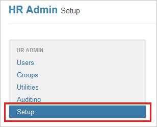
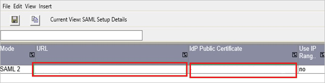
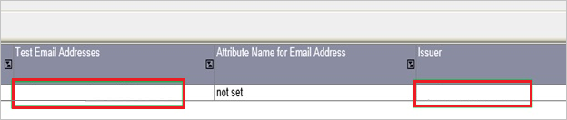
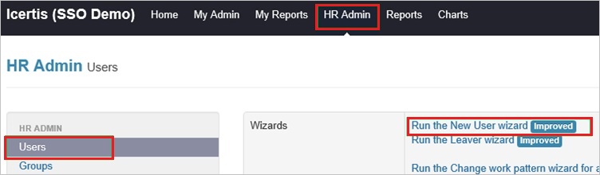

# Tutorial: Microsoft Entra SSO integration with TeamSeer

In this tutorial, you'll learn how to integrate TeamSeer with Microsoft Entra ID. When you integrate TeamSeer with Microsoft Entra ID, you can:

* Control in Microsoft Entra ID who has access to TeamSeer.
* Enable your users to be automatically signed-in to TeamSeer with their Microsoft Entra accounts.
* Manage your accounts in one central location.

## Prerequisites

To configure Microsoft Entra integration with TeamSeer, you need the following items:

* A Microsoft Entra subscription. If you don't have a Microsoft Entra environment, you can get a [free account](https://azure.microsoft.com/free/).
* TeamSeer single sign-on enabled subscription.
* Along with Cloud Application Administrator, Application Administrator can also add or manage applications in Microsoft Entra ID.
For more information, see [Azure built-in roles](../roles/permissions-reference.md).

## Scenario description

In this tutorial, you configure and test Microsoft Entra single sign-on in a test environment.

* TeamSeer supports **SP** initiated SSO.

## Add TeamSeer from the gallery

To configure the integration of TeamSeer into Microsoft Entra ID, you need to add TeamSeer from the gallery to your list of managed SaaS apps.

1. Sign in to the [Microsoft Entra admin center](https://entra.microsoft.com) as at least a [Cloud Application Administrator](../roles/permissions-reference.md#cloud-application-administrator).
1. Browse to **Identity** > **Applications** > **Enterprise applications** > **New application**.
1. In the **Add from the gallery** section, type **TeamSeer** in the search box.
1. Select **TeamSeer** from results panel and then add the app. Wait a few seconds while the app is added to your tenant.

 Alternatively, you can also use the [Enterprise App Configuration Wizard](https://portal.office.com/AdminPortal/home?Q=Docs#/azureadappintegration). In this wizard, you can add an application to your tenant, add users/groups to the app, assign roles, as well as walk through the SSO configuration as well. [Learn more about Microsoft 365 wizards.](/microsoft-365/admin/misc/azure-ad-setup-guides)

## Configure and test Microsoft Entra SSO for TeamSeer

Configure and test Microsoft Entra SSO with TeamSeer using a test user called **B.Simon**. For SSO to work, you need to establish a link relationship between a Microsoft Entra user and the related user in TeamSeer.

To configure and test Microsoft Entra SSO with TeamSeer, perform the following steps:

1. **[Configure Microsoft Entra SSO](#configure-azure-ad-sso)** - to enable your users to use this feature.
    1. **[Create a Microsoft Entra test user](#create-an-azure-ad-test-user)** - to test Microsoft Entra single sign-on with B.Simon.
    1. **[Assign the Microsoft Entra test user](#assign-the-azure-ad-test-user)** - to enable B.Simon to use Microsoft Entra single sign-on.
1. **[Configure TeamSeer SSO](#configure-teamseer-sso)** - to configure the single sign-on settings on application side.
    1. **[Create TeamSeer test user](#create-teamseer-test-user)** - to have a counterpart of B.Simon in TeamSeer that is linked to the Microsoft Entra representation of user.
1. **[Test SSO](#test-sso)** - to verify whether the configuration works.

## Configure Microsoft Entra SSO

Follow these steps to enable Microsoft Entra SSO.

1. Sign in to the [Microsoft Entra admin center](https://entra.microsoft.com) as at least a [Cloud Application Administrator](../roles/permissions-reference.md#cloud-application-administrator).
1. Browse to **Identity** > **Applications** > **Enterprise applications** > **TeamSeer** > **Single sign-on**.
1. On the **Select a single sign-on method** page, select **SAML**.
1. On the **Set up single sign-on with SAML** page, click the pencil icon for **Basic SAML Configuration** to edit the settings.

    

1. On the **Basic SAML Configuration** section, perform the following step:

    In the **Sign-on URL** text box, type a URL using the following pattern:
    `https://www.teamseer.com/<companyid>`

	> [!NOTE]
	> The value is not real. Update the value with the actual Sign-On URL. Contact [TeamSeer Client support team](https://pages.theaccessgroup.com/solutions_business-suite_absence-management_contact.html) to get the value. You can also refer to the patterns shown in the **Basic SAML Configuration** section.

1. On the **Set up Single Sign-On with SAML** page, in the **SAML Signing Certificate** section, click **Download** to download the **Certificate (Base64)** from the given options as per your requirement and save it on your computer.

	

6. On the **Set up TeamSeer** section, copy the appropriate URL(s) as per your requirement.

	

### Create a Microsoft Entra test user

In this section, you'll create a test user called B.Simon.

1. Sign in to the [Microsoft Entra admin center](https://entra.microsoft.com) as at least a [User Administrator](../roles/permissions-reference.md#user-administrator).
1. Browse to **Identity** > **Users** > **All users**.
1. Select **New user** > **Create new user**, at the top of the screen.
1. In the **User** properties, follow these steps:
   1. In the **Display name** field, enter `B.Simon`.  
   1. In the **User principal name** field, enter the username@companydomain.extension. For example, `B.Simon@contoso.com`.
   1. Select the **Show password** check box, and then write down the value that's displayed in the **Password** box.
   1. Select **Review + create**.
1. Select **Create**.

### Assign the Microsoft Entra test user

In this section, you'll enable B.Simon to use single sign-on by granting access to TeamSeer.

1. Sign in to the [Microsoft Entra admin center](https://entra.microsoft.com) as at least a [Cloud Application Administrator](../roles/permissions-reference.md#cloud-application-administrator).
1. Browse to **Identity** > **Applications** > **Enterprise applications** > **TeamSeer**.
1. In the app's overview page, select **Users and groups**.
1. Select **Add user/group**, then select **Users and groups** in the **Add Assignment** dialog.
   1. In the **Users and groups** dialog, select **B.Simon** from the Users list, then click the **Select** button at the bottom of the screen.
   1. If you are expecting a role to be assigned to the users, you can select it from the **Select a role** dropdown. If no role has been set up for this app, you see "Default Access" role selected.
   1. In the **Add Assignment** dialog, click the **Assign** button.

## Configure TeamSeer SSO

1. In a different web browser window, sign in to your TeamSeer company site as an administrator.

1. Go to **HR Admin**.

    

1. Click **Setup**.

    

1. Click **Set up SAML provider details**.

    

1. In the SAML provider details section, perform the following steps:

    

    a. In the **URL** textbox, paste the **Login URL** value, which you copied previously.

    b. Open your base-64 encoded certificate in notepad, copy the content of it in to your clipboard, and then paste it to the **IdP Public Certificate** textbox.

1. To complete the SAML provider configuration, perform the following steps:

    

    a. In the **Test Email Addresses**, type the test user’s email address.
  
    b. In the **Issuer** textbox, type the Issuer URL of the service provider.
  
    c. Click **Save**.

### Create TeamSeer test user

To enable Microsoft Entra users to sign in to TeamSeer, they must be provisioned in to ShiftPlanning. In the case of TeamSeer, provisioning is a manual task.

**To provision a user account, perform the following steps:**

1. Sign in to your **TeamSeer** company site as an administrator.

1. Go to **HR Admin \> Users** and then click **Run the New User wizard**.

    

1. In the **User Details** section, perform the following steps:

    

    a. Type the **First Name**, **Surname**, **User name (Email address)** of a valid Microsoft Entra account you want to provision in to the related textboxes.
  
    b. Click **Next**.

1. Follow the on-screen instructions for adding a new user, and click **Finish**.

> [!NOTE]
> You can use any other TeamSeer user account creation tools or APIs provided by TeamSeer to provision Microsoft Entra user accounts.

## Test SSO

In this section, you test your Microsoft Entra single sign-on configuration with following options. 

* Click on **Test this application**, this will redirect to TeamSeer Sign-on URL where you can initiate the login flow. 

* Go to TeamSeer Sign-on URL directly and initiate the login flow from there.

* You can use Microsoft My Apps. When you click the TeamSeer tile in the My Apps, this will redirect to TeamSeer Sign-on URL. For more information, see [Microsoft Entra My Apps](/azure/active-directory/manage-apps/end-user-experiences#azure-ad-my-apps).

## Next steps

Once you configure TeamSeer you can enforce session control, which protects exfiltration and infiltration of your organization’s sensitive data in real time. Session control extends from Conditional Access. [Learn how to enforce session control with Microsoft Cloud App Security](/cloud-app-security/proxy-deployment-aad).
