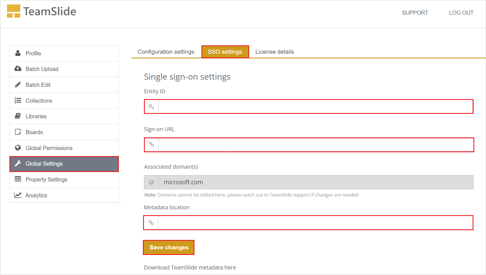

# Tutorial: Azure AD SSO integration with TeamSlide

In this tutorial, you'll learn how to integrate TeamSlide with Azure Active Directory (Azure AD). When you integrate TeamSlide with Azure AD, you can:

* Control in Azure AD who has access to TeamSlide.
* Enable your users to be automatically signed-in to TeamSlide with their Azure AD accounts.
* Manage your accounts in one central location - the Azure portal.

## Prerequisites

To get started, you need the following items:

* An Azure AD subscription. If you don't have a subscription, you can get a [free account](https://azure.microsoft.com/free/).
* TeamSlide single sign-on (SSO) enabled subscription.
* Along with Cloud Application Administrator, Application Administrator can also add or manage applications in Azure AD.
For more information, see [Azure built-in roles](../roles/permissions-reference.md).

## Scenario description

In this tutorial, you configure and test Azure AD SSO in a test environment.

* TeamSlide supports **SP** initiated SSO.
* TeamSlide supports **Just In Time** user provisioning.

> [!NOTE]
> Identifier of this application is a fixed string value so only one instance can be configured in one tenant.

## Add TeamSlide from the gallery

To configure the integration of TeamSlide into Azure AD, you need to add TeamSlide from the gallery to your list of managed SaaS apps.

1. Sign in to the Azure portal using either a work or school account, or a personal Microsoft account.
1. On the left navigation pane, select the **Azure Active Directory** service.
1. Navigate to **Enterprise Applications** and then select **All Applications**.
1. To add new application, select **New application**.
1. In the **Add from the gallery** section, type **TeamSlide** in the search box.
1. Select **TeamSlide** from results panel and then add the app. Wait a few seconds while the app is added to your tenant.

 Alternatively, you can also use the [Enterprise App Configuration Wizard](https://portal.office.com/AdminPortal/home?Q=Docs#/azureadappintegration). In this wizard, you can add an application to your tenant, add users/groups to the app, assign roles, as well as walk through the SSO configuration as well. [Learn more about Microsoft 365 wizards.](/microsoft-365/admin/misc/azure-ad-setup-guides)

## Configure and test Azure AD SSO for TeamSlide

Configure and test Azure AD SSO with TeamSlide using a test user called **B.Simon**. For SSO to work, you need to establish a link relationship between an Azure AD user and the related user in TeamSlide.

To configure and test Azure AD SSO with TeamSlide, perform the following steps:

1. **[Configure Azure AD SSO](#configure-azure-ad-sso)** - to enable your users to use this feature.
    1. **[Create an Azure AD test user](#create-an-azure-ad-test-user)** - to test Azure AD single sign-on with B.Simon.
    1. **[Assign the Azure AD test user](#assign-the-azure-ad-test-user)** - to enable B.Simon to use Azure AD single sign-on.
1. **[Configure TeamSlide SSO](#configure-teamslide-sso)** - to configure the single sign-on settings on application side.
    1. **[Create TeamSlide test user](#create-teamslide-test-user)** - to have a counterpart of B.Simon in TeamSlide that is linked to the Azure AD representation of user.
1. **[Test SSO](#test-sso)** - to verify whether the configuration works.

## Configure Azure AD SSO

Follow these steps to enable Azure AD SSO in the Azure portal.

1. In the Azure portal, on the **TeamSlide** application integration page, find the **Manage** section and select **single sign-on**.
1. On the **Select a single sign-on method** page, select **SAML**.
1. On the **Set up single sign-on with SAML** page, click the pencil icon for **Basic SAML Configuration** to edit the settings.

  

1. On the **Basic SAML Configuration** section, perform the following steps:

    a. In the **Identifier** textbox, type the URL:
    `https://www.teamslide.io/AuthServices/`

    b. In the **Reply URL** textbox, type the URL:
    `https://www.teamslide.io/AuthServices/Acs` 

    c. In the **Sign-on URL** text box, type a URL using the following pattern:
    `https://www.teamslide.io/ChooseSso?domain=<CustomerDomain>`

    > [!NOTE]
	> The Sign-on URL is not real. Update the value with the actual Sign-on URL. Contact [TeamSlide Client support team](mailto:support@aploris.com) to get these values. You can also refer to the patterns shown in the **Basic SAML Configuration** section in the Azure portal.

1. TeamSlide application expects the SAML assertions in a specific format, which requires you to add custom attribute mappings to your SAML token attributes configuration. The following screenshot shows the list of default attributes.

    

1. In addition to above, TeamSlide application expects few more attributes to be passed back in SAML response, which are shown below. These attributes are also pre populated but you can review them as per your requirements.

    | Name | Source Attribute|
    | ------------ | --------- |
    | displayname | user.displayname |
    | groups | user.groups [All] |
   
1. On the **Set up single sign-on with SAML** page, In the **SAML Signing Certificate** section, click copy button to copy **App Federation Metadata Url** and save it on your computer.

	

### Create an Azure AD test user

In this section, you'll create a test user in the Azure portal called B.Simon.

1. From the left pane in the Azure portal, select **Azure Active Directory**, select **Users**, and then select **All users**.
1. Select **New user** at the top of the screen.
1. In the **User** properties, follow these steps:
   1. In the **Name** field, enter `B.Simon`.  
   1. In the **User name** field, enter the username@companydomain.extension. For example, `B.Simon@contoso.com`.
   1. Select the **Show password** check box, and then write down the value that's displayed in the **Password** box.
   1. Click **Create**.

### Assign the Azure AD test user

In this section, you'll enable B.Simon to use Azure single sign-on by granting access to TeamSlide.

1. In the Azure portal, select **Enterprise Applications**, and then select **All applications**.
1. In the applications list, select **TeamSlide**.
1. In the app's overview page, find the **Manage** section and select **Users and groups**.
1. Select **Add user**, then select **Users and groups** in the **Add Assignment** dialog.
1. In the **Users and groups** dialog, select **B.Simon** from the Users list, then click the **Select** button at the bottom of the screen.
1. If you're expecting any role value in the SAML assertion, in the **Select Role** dialog, select the appropriate role for the user from the list and then click the **Select** button at the bottom of the screen.
1. In the **Add Assignment** dialog, click the **Assign** button.

## Configure TeamSlide SSO

1. Log in to your TeamSlide company site as an administrator.

1. Go to **Global Settings** > **SSO Settings** tab.

1. In the **Single sign-on settings** page, perform the following steps:

    

    a. In the **Entity ID** textbox, paste the **Azure AD Identifier** value which you have copied from the Azure portal.

    b. In the **Sign-On URL** textbox, paste the **Login URL** value which you have copied from the Azure portal.

    c. In the **Metadata location** textbox, paste the **App Federation Metadata Url** value which you have copied from the Azure portal.

    d. Click **Save Changes**.

### Create TeamSlide test user

In this section, a user called B.Simon is created in TeamSlide. TeamSlide supports just-in-time user provisioning, which is enabled by default. There is no action item for you in this section. If a user doesn't already exist in TeamSlide, a new one is created after authentication.

## Test SSO

In this section, you test your Azure AD single sign-on configuration with following options. 

* Click on **Test this application** in Azure portal. This will redirect to TeamSlide Sign-on URL where you can initiate the login flow. 

* Go to TeamSlide Sign-on URL directly and initiate the login flow from there.

* You can use Microsoft My Apps. When you click the TeamSlide tile in the My Apps, this will redirect to TeamSlide Sign-on URL. For more information about the My Apps, see [Introduction to the My Apps](../user-help/my-apps-portal-end-user-access.md).

## Next steps

Once you configure TeamSlide you can enforce session control, which protects exfiltration and infiltration of your organization’s sensitive data in real time. Session control extends from Conditional Access. [Learn how to enforce session control with Microsoft Cloud App Security](/cloud-app-security/proxy-deployment-aad).