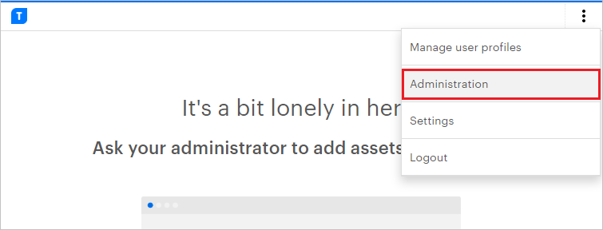
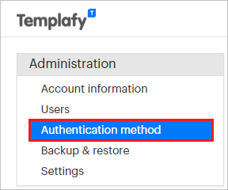
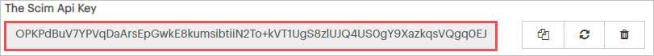
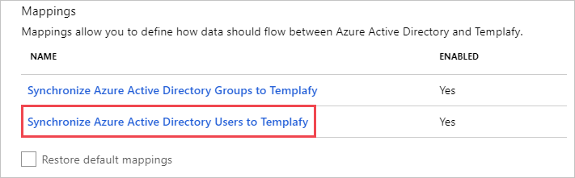

# Tutorial: Configure Templafy OpenID Connect for automatic user provisioning

The objective of this tutorial is to demonstrate the steps to be performed in Templafy OpenID Connect and Microsoft Entra ID to configure Microsoft Entra ID to automatically provision and de-provision users and/or groups to Templafy OpenID Connect.

> [!NOTE]
> This tutorial describes a connector built on top of the Microsoft Entra user Provisioning Service. For important details on what this service does, how it works, and frequently asked questions, see [Automate user provisioning and deprovisioning to SaaS applications with Microsoft Entra ID](../app-provisioning/user-provisioning.md).
>

## Prerequisites

The scenario outlined in this tutorial assumes that you already have the following prerequisites:

* A Microsoft Entra tenant.
* [A Templafy tenant](https://www.templafy.com/pricing/).
* A user account in Templafy with Admin permissions.

## Step 1: Plan your provisioning deployment
1. Learn about [how the provisioning service works](../app-provisioning/user-provisioning.md).
2. Determine who will be in [scope for provisioning](../app-provisioning/define-conditional-rules-for-provisioning-user-accounts.md).
3. Determine what data to [map between Microsoft Entra ID and Templafy OpenID Connect](../app-provisioning/customize-application-attributes.md). 

## Assigning users to Templafy OpenID Connect

Microsoft Entra ID uses a concept called *assignments* to determine which users should receive access to selected apps. In the context of automatic user provisioning, only the users and/or groups that have been assigned to an application in Microsoft Entra ID are synchronized.

Before configuring and enabling automatic user provisioning, you should decide which users and/or groups in Microsoft Entra ID need access to Templafy OpenID Connect. Once decided, you can assign these users and/or groups to Templafy OpenID Connect by following the instructions here:
* [Assign a user or group to an enterprise app](../manage-apps/assign-user-or-group-access-portal.md)

## Important tips for assigning users to Templafy OpenID Connect

* It is recommended that a single Microsoft Entra user is assigned to Templafy OpenID Connect to test the automatic user provisioning configuration. More users and/or groups may be assigned later.

* When assigning a user to Templafy OpenID Connect, you must select any valid application-specific role (if available) in the assignment dialog. Users with the **Default Access** role are excluded from provisioning.

## Step 2: Configure Templafy OpenID Connect to support provisioning with Microsoft Entra ID

Before configuring Templafy OpenID Connect for automatic user provisioning with Microsoft Entra ID, you will need to enable SCIM provisioning on Templafy OpenID Connect.

1. Sign in to your Templafy Admin Console. Click on **Administration**.

	

2. Click on **Authentication Method**.

	

3. Copy the **SCIM Api-key** value. This value will be entered in the **Secret Token** field in the Provisioning tab of your Templafy OpenID Connect application.

	

## Step 3: Add Templafy OpenID Connect from the gallery

To configure Templafy OpenID Connect for automatic user provisioning with Microsoft Entra ID, you need to add Templafy OpenID Connect from the Microsoft Entra application gallery to your list of managed SaaS applications.

**To add Templafy OpenID Connect from the Microsoft Entra application gallery, perform the following steps:**

1. Sign in to the [Microsoft Entra admin center](https://entra.microsoft.com) as at least a [Cloud Application Administrator](../roles/permissions-reference.md#cloud-application-administrator).
1. Browse to **Identity** > **Applications** > **Enterprise applications** > **New application**.
1. In the **Add from the gallery** section, type **Templafy OpenID Connect**, select **Templafy OpenID Connect** in the search box.
1. Select **Templafy OpenID Connect** from results panel and then add the app. Wait a few seconds while the app is added to your tenant.
	

## Step 4: Configure automatic user provisioning to Templafy OpenID Connect 

This section guides you through the steps to configure the Microsoft Entra provisioning service to create, update, and disable users and/or groups in Templafy OpenID Connect based on user and/or group assignments in Microsoft Entra ID.

> [!TIP]
> You may also choose to enable OpenID connect-based single sign-on for Templafy, following the instructions provided in the [Templafy Single sign-on tutorial](templafy-tutorial.md). Single sign-on can be configured independently of automatic user provisioning, though these two features compliment each other.

### To configure automatic user provisioning for Templafy OpenID Connect in Microsoft Entra ID:

1. Sign in to the [Microsoft Entra admin center](https://entra.microsoft.com) as at least a [Cloud Application Administrator](../roles/permissions-reference.md#cloud-application-administrator).
1. Browse to **Identity** > **Applications** > **Enterprise applications**

	

1. In the applications list, select **Templafy OpenID Connect**.

	

3. Select the **Provisioning** tab.

	

4. Set the **Provisioning Mode** to **Automatic**.

	

5. Under the **Admin Credentials** section, input `https://scim.templafy.com/scim` in **Tenant URL**. Input the **SCIM API-key** value retrieved earlier in **Secret Token**. Click **Test Connection** to ensure Microsoft Entra ID can connect to Templafy. If the connection fails, ensure your Templafy account has Admin permissions and try again.

	

6. In the **Notification Email** field, enter the email address of a person or group who should receive the provisioning error notifications and check the checkbox - **Send an email notification when a failure occurs**.

	

7. Click **Save**.

8. Under the **Mappings** section, select **Synchronize Microsoft Entra users to Templafy OpenID Connect**.

	

9. Review the user attributes that are synchronized from Microsoft Entra ID to Templafy OpenID Connect in the **Attribute Mapping** section. The attributes selected as **Matching** properties are used to match the user accounts in Templafy OpenID Connect for update operations. Select the **Save** button to commit any changes.

   |Attribute|Type|Supported for filtering|
   |---|---|---|
   |userName|String|&check;|
   |active|Boolean|
   |displayName|String|
   |title|String|
   |preferredLanguage|String|
   |name.givenName|String|
   |name.familyName|String|
   |phoneNumbers[type eq "work"].value|String|
   |phoneNumbers[type eq "mobile"].value|String|
   |phoneNumbers[type eq "fax"].value|String|
   |externalId|String|
   |addresses[type eq "work"].locality|String|
   |addresses[type eq "work"].postalCode|String|
   |addresses[type eq "work"].region|String|
   |addresses[type eq "work"].streetAddress|String|
   |addresses[type eq "work"].country|String|
   |urn:ietf:params:scim:schemas:extension:enterprise:2.0:User:department|String|
   |urn:ietf:params:scim:schemas:extension:enterprise:2.0:User:organization|String|

      > [!NOTE]
      > Schema Discovery feature is enabled for this application.
      
10. Under the **Mappings** section, select **Synchronize Microsoft Entra groups to Templafy**.

	

11. Review the group attributes that are synchronized from Microsoft Entra ID to Templafy OpenID Connect in the **Attribute Mapping** section. The attributes selected as **Matching** properties are used to match the groups in Templafy OpenID Connect for update operations. Select the **Save** button to commit any changes.

      |Attribute|Type|Supported for filtering|
      |---|---|---|
      |displayName|String|&check;|
      |members|Reference|
      |externalId|String|      

      > [!NOTE]
      > Schema Discovery feature is enabled for this application.

12. To configure scoping filters, refer to the following instructions provided in the [Scoping filter tutorial](../app-provisioning/define-conditional-rules-for-provisioning-user-accounts.md).

13. To enable the Microsoft Entra provisioning service for Templafy OpenID Connect, change the **Provisioning Status** to **On** in the **Settings** section.

	

14. Define the users and/or groups that you would like to provision to Templafy OpenID Connect by choosing the desired values in **Scope** in the **Settings** section.

	

15. When you are ready to provision, click **Save**.

	

	This operation starts the initial synchronization of all users and/or groups defined in **Scope** in the **Settings** section. The initial sync takes longer to perform than subsequent syncs, which occur approximately every 40 minutes as long as the Microsoft Entra provisioning service is running. You can use the **Synchronization Details** section to monitor progress and follow links to provisioning activity report, which describes all actions performed by the Microsoft Entra provisioning service on Templafy OpenID Connect.

## Step 5: Monitor your deployment
Once you've configured provisioning, use the following resources to monitor your deployment:

* Use the [provisioning logs](../reports-monitoring/concept-provisioning-logs.md) to determine which users have been provisioned successfully or unsuccessfully
* Check the [progress bar](../app-provisioning/application-provisioning-when-will-provisioning-finish-specific-user.md) to see the status of the provisioning cycle and how close it is to completion
* If the provisioning configuration seems to be in an unhealthy state, the application will go into quarantine. Learn more about quarantine states [here](../app-provisioning/application-provisioning-quarantine-status.md).

## Change log

* 05/04/2023 - Added support for **Schema Discovery**.

## Additional resources

* [Managing user account provisioning for Enterprise Apps](../app-provisioning/configure-automatic-user-provisioning-portal.md)
* [What is application access and single sign-on with Microsoft Entra ID?](../manage-apps/what-is-single-sign-on.md)

## Next steps

* [Learn how to review logs and get reports on provisioning activity](../app-provisioning/check-status-user-account-provisioning.md)
