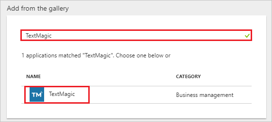
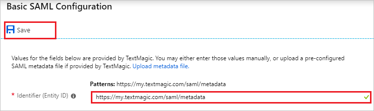
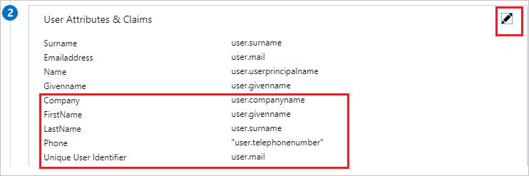

# Tutorial: Azure Active Directory integration with TextMagic

In this tutorial, you learn how to integrate TextMagic with Azure Active Directory (Azure AD).

Integrating TextMagic with Azure AD provides you with the following benefits:

- You can control in Azure AD who has access to TextMagic.
- You can enable your users to automatically get signed-on to TextMagic (Single Sign-On) with their Azure AD accounts.
- You can manage your accounts in one central location - the Azure portal.

If you want to know more details about SaaS app integration with Azure AD, see [what is application access and single sign-on with Azure Active Directory](../manage-apps/what-is-single-sign-on.md)

## Prerequisites

To configure Azure AD integration with TextMagic, you need the following items:

- An Azure AD subscription
- A TextMagic single sign-on enabled subscription

> [!NOTE]
> To test the steps in this tutorial, we do not recommend using a production environment.

To test the steps in this tutorial, you should follow these recommendations:

- Do not use your production environment, unless it is necessary.
- If you don't have an Azure AD trial environment, you can [get a one-month trial](https://azure.microsoft.com/pricing/free-trial/).

## Scenario description

In this tutorial, you test Azure AD single sign-on in a test environment. 
The scenario outlined in this tutorial consists of two main building blocks:

1. Adding TextMagic from the gallery
2. Configuring and testing Azure AD single sign-on

## Adding TextMagic from the gallery

To configure the integration of TextMagic into Azure AD, you need to add TextMagic from the gallery to your list of managed SaaS apps.

**To add TextMagic from the gallery, perform the following steps:**

1. In the **[Azure portal](https://portal.azure.com)**, on the left navigation panel, click **Azure Active Directory** icon. 

	![The Azure Active Directory button][1]

2. Navigate to **Enterprise applications**. Then go to **All applications**.

	![The Enterprise applications blade][2]
	
3. To add new application, click **New application** button on the top of dialog.

	![The New application button][3]

4. In the search box, type **TextMagic**, select **TextMagic** from result panel then click **Add** button to add the application.

	

## Configure and test Azure AD single sign-on

In this section, you configure and test Azure AD single sign-on with TextMagic based on a test user called "Britta Simon".

For single sign-on to work, Azure AD needs to know what the counterpart user in TextMagic is to a user in Azure AD. In other words, a link relationship between an Azure AD user and the related user in TextMagic needs to be established.

To configure and test Azure AD single sign-on with TextMagic, you need to complete the following building blocks:

1. **[Configuring Azure AD Single Sign-On](#configuring-azure-ad-single-sign-on)** - to enable your users to use this feature.
2. **[Creating an Azure AD test user](#creating-an-azure-ad-test-user)** - to test Azure AD single sign-on with Britta Simon.
3. **[Creating a TextMagic test user](#creating-a-textmagic-test-user)** - to have a counterpart of Britta Simon in TextMagic that is linked to the Azure AD representation of user.
4. **[Assigning the Azure AD test user](#assigning-the-azure-ad-test-user)** - to enable Britta Simon to use Azure AD single sign-on.
5. **[Testing single sign-on](#testing-single-sign-on)** - to verify whether the configuration works.

### Configuring Azure AD single sign-on

In this section, you enable Azure AD single sign-on in the Azure portal and configure single sign-on in your TextMagic application.

**To configure Azure AD single sign-on with TextMagic, perform the following steps:**

1. In the Azure portal, on the **TextMagic** application integration page, click **Single sign-on**.

	![Configure single sign-on link][4]

2. On the **Select a Single sign-on method** dialog, Click **Select** for **SAML** mode to enable single sign-on.

    

3. On the **Set up Single Sign-On with SAML** page, click **Edit** icon to open **Basic SAML Configuration** dialog.

	

4. On the **Basic SAML Configuration** section, perform the following steps:

	

    In the **Identifier** textbox, type a URL: `https://my.textmagic.com/saml/metadata`

5. TextMagic application expects the SAML assertions in a specific format. Configure the following claims for this application. You can manage the values of these attributes from the **User Attributes & Claims** section on application integration page. On the **Set up Single Sign-On with SAML** page, click **Edit** button to open **User Attributes & Claims** dialog.

	

6. In the **User Claims** section on the **User Attributes & Claims** dialog, configure SAML token attribute as shown in the image above and perform the following steps:

	| Name  | Source Attribute  | Namespace |
	| --------------- | --------------- | --------------- |
	| company | user.companyname | http://schemas.xmlsoap.org/ws/2005/05/identity/claims |
	| firstName 			  | user.givenname |  http://schemas.xmlsoap.org/ws/2005/05/identity/claims |
	| lastName 			  | user.surname |  http://schemas.xmlsoap.org/ws/2005/05/identity/claims |
	| phone 			  | user.telephonenumber |  http://schemas.xmlsoap.org/ws/2005/05/identity/claims |
    
	a. Click on **Edit icon** to edit the **Name identifier** claim and click on **Add new claim** to open the **Manage user claims** dialog.

	

	

	b. In the **Name**textbox, type the attribute name shown for that row.

	c. Enter the **Namespace** value.

	d. Select Source as **Attribute**.

	e. From the **Source attribute** list, type the attribute value shown for that row.

	f. Click **Ok**.

	g. Click **Save**. 

7. On the **SAML Signing Certificate** page, in the **SAML Signing Certificate** section, click **Download** to download **Certificate (Base64)** and then save certificate file on your computer.

	 

8. On the **Set up TextMagic** section, copy the appropriate URL as per your requirement.

	a. Login URL

	b. Azure AD Identifier

	c. Logout URL

	

9. In a different web browser window, log in to your TextMagic company site as an administrator.

10. Select **Account settings** under the username.

	

11. Click on the TAB  **Single Sign-On (SSO)** and fill in the following fields:  
	
	

	a. In **Identity provider Entity ID:** textbox, paste the value of **Azure AD Identifier**, which you have copied from Azure portal.

	b. In **Identity provider SSO URL:** textbox, paste the value of **Login URL**, which you have copied from Azure portal.

	c. In **Identity provider SLO URL:** textbox, paste the value of **Logout URL**, which you have copied from Azure portal.

	d. Open your **base-64 encoded certificate** in notepad downloaded from Azure portal, copy the content of it into your clipboard, and then paste it to the **Public x509 certificate:** textbox.

### Creating an Azure AD test user

The objective of this section is to create a test user in the Azure portal called Britta Simon.

1. In the Azure portal, in the left pane, select **Azure Active Directory**, select **Users**, and then select **All users**.

	![Create Azure AD User][100]

2. Select **New user** at the top of the screen.

	 

3. In the User properties, perform the following steps.

	

    a. In the **Name** field, enter **BrittaSimon**.
  
    b. In the **User name** field, type **brittasimon@yourcompanydomain.extension**  
    For example, BrittaSimon@contoso.com

    c. Select **Properties**, select the **Show password** check box, and then write down the value that's displayed in the Password box.

    d. Select **Create**.
  
### Creating a TextMagic test user

Application supports **Just in time user provisioning** and after authentication users will be created in the application automatically. You need to fill in the information once at the first login to activate the sub-account into the system.
There is no action item for you in this section.

### Assigning the Azure AD test user

In this section, you enable Britta Simon to use Azure single sign-on by granting access to TextMagic.

1. In the Azure portal, select **Enterprise Applications**, select **All applications**.

	![Assign User][201]

2. In the applications list, select **TextMagic**.

	 

3. In the menu on the left, click **Users and groups**.

	![Assign User][202]

4. Click **Add** button. Then select **Users and groups** on **Add Assignment** dialog.

	![Assign User][203]

5. In the **Users and groups** dialog select **Britta Simon** in the Users list, then click the **Select** button at the bottom of the screen.

6. In the **Add Assignment** dialog select the **Assign** button.

### Testing single sign-on

In this section, you test your Azure AD single sign-on configuration using the Access Panel.

When you click the TextMagic tile in the Access Panel, you should get automatically signed-on to your TextMagic application.
For more information about the Access Panel, see [Introduction to the Access Panel](../user-help/active-directory-saas-access-panel-introduction.md).

## Additional resources

* [List of Tutorials on How to Integrate SaaS Apps with Azure Active Directory](tutorial-list.md)
* [What is application access and single sign-on with Azure Active Directory?](../manage-apps/what-is-single-sign-on.md)

<!--Image references-->

[1]: common/tutorial_general_01.png
[2]: common/tutorial_general_02.png
[3]: common/tutorial_general_03.png
[4]: common/tutorial_general_04.png

[100]: common/tutorial_general_100.png

[201]: common/tutorial_general_201.png
[202]: common/tutorial_general_202.png
[203]: common/tutorial_general_203.png
