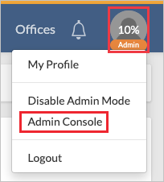
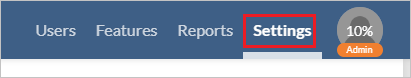
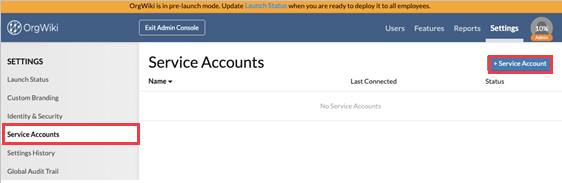
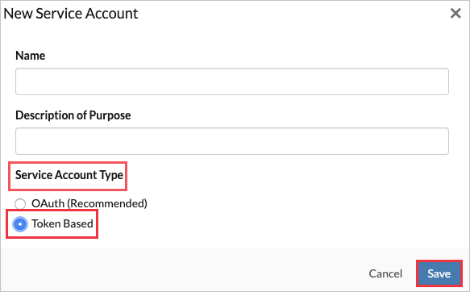
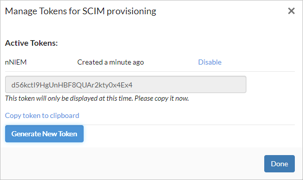
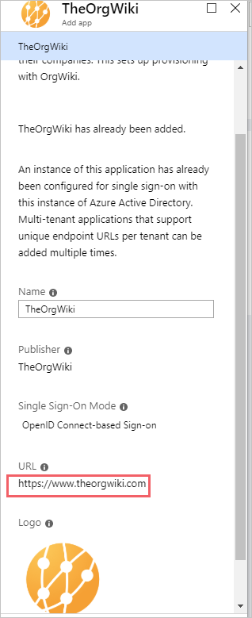
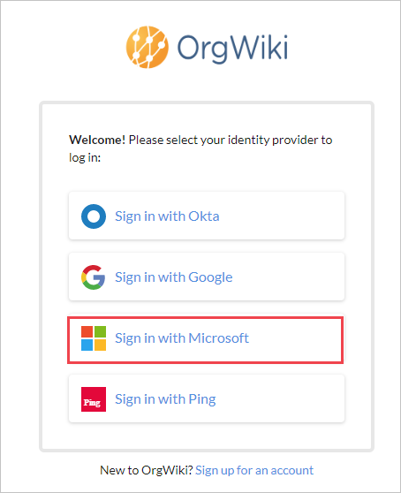
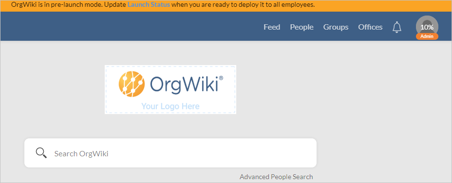
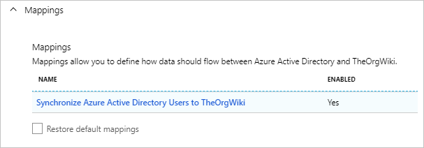
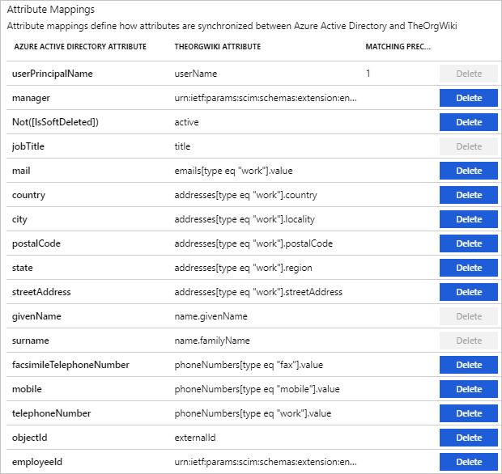

# Tutorial: Configure TheOrgWiki for automatic user provisioning

The objective of this tutorial is to demonstrate the steps to be performed in TheOrgWiki and Microsoft Entra ID to configure Microsoft Entra ID to automatically provision and de-provision users and/or groups to TheOrgWiki.

> [!NOTE]
> This tutorial describes a connector built on top of the Microsoft Entra user Provisioning Service. For important details on what this service does, how it works, and frequently asked questions, see [Automate user provisioning and deprovisioning to SaaS applications with Microsoft Entra ID](../app-provisioning/user-provisioning.md).
>

## Prerequisites

The scenario outlined in this tutorial assumes that you already have the following prerequisites:

* A Microsoft Entra tenant.
* [An OrgWiki tenant](https://www.theorgwiki.com/welcome/).
* A user account in TheOrgWiki with Admin permissions.

## Assign users to TheOrgWiki

Microsoft Entra ID uses a concept called assignments to determine which users should receive access to selected apps. In the context of automatic user provisioning, only the users and/or groups that have been assigned to an application in Microsoft Entra ID are synchronized.

Before configuring and enabling automatic user provisioning, you should decide which users and/or groups in Microsoft Entra ID need access to TheOrgWiki. Once decided, you can assign these users and/or groups to TheOrgWiki by following the instructions here:

* [Assign a user or group to an enterprise app](../manage-apps/assign-user-or-group-access-portal.md)

## Important tips for assigning users to TheOrgWiki

* It is recommended that a single Microsoft Entra user is assigned to TheOrgWiki to test the automatic user provisioning configuration. Additional users and/or groups may be assigned later.

* When assigning a user to TheOrgWiki, you must select any valid application-specific role (if available) in the assignment dialog. Users with the **Default Access** role are excluded from provisioning.

## Set up TheOrgWiki for provisioning

Before configuring TheOrgWiki for automatic user provisioning with Microsoft Entra ID, you will need to enable SCIM provisioning on TheOrgWiki.

1. Sign in to your [TheOrgWiki Admin Console](https://www.theorgwiki.com/login/). Click on **Admin Console**.

	

2. In Admin Console, Click on **Settings tab**. 

	
	
3. Navigate to **Service Accounts**.

	

4. Click on **+Service Account**. Under **Service Account Type**,select **Token Based**. Click **Save**.

	

5. 	Copy the **Active Tokens**. This value will be entered in the Secret Token field in the Provisioning tab of your TheOrgWiki application.
	 
	

## Add TheOrgWiki from the gallery

To configure TheOrgWiki for automatic user provisioning with Microsoft Entra ID, you need to add TheOrgWiki from the Microsoft Entra application gallery to your list of managed SaaS applications.

1. Sign in to the [Microsoft Entra admin center](https://entra.microsoft.com) as at least a [Cloud Application Administrator](../roles/permissions-reference.md#cloud-application-administrator).
1. Browse to **Identity** > **Applications** > **Enterprise applications** > **New application**.
1. In the **Add from the gallery** section, type **TheOrgWiki**, select **TheOrgWiki** in the results panel. 

	

5. Select the **Sign-up for TheOrgWiki** button which will redirect you to TheOrgWiki's login page. 

	

6.  In the top right-hand corner, select **Login**.

	

7. As TheOrgWiki is an OpenIDConnect app, choose to login to OrgWiki using your Microsoft work account.

	
	
8. After a successful authentication, the application will be automatically added to your tenant and you will be redirected to your TheOrgWiki account.

	

## Configure automatic user provisioning to TheOrgWiki 

This section guides you through the steps to configure the Microsoft Entra provisioning service to create, update, and disable users and/or groups in TheOrgWiki based on user and/or group assignments in Microsoft Entra ID.

### To configure automatic user provisioning for TheOrgWiki in Microsoft Entra ID:

1. Sign in to the [Microsoft Entra admin center](https://entra.microsoft.com) as at least a [Cloud Application Administrator](../roles/permissions-reference.md#cloud-application-administrator).
1. Browse to **Identity** > **Applications** > **Enterprise applications**

	

1. In the applications list, select **TheOrgWiki**.

	

3. Select the **Provisioning** tab.

	

4. Set the **Provisioning Mode** to **Automatic**.

	

5. Under the **Admin Credentials** section, input `https://<TheOrgWiki Subdomain 		value>.theorgwiki.com/api/v2/scim/v2/` in **Tenant URL**. 

	Example: `https://test1.theorgwiki.com/api/v2/scim/v2/`

> [!NOTE]
> The **Subdomain Value** can only be set during the initial sign-up process for TheOrgWiki.
 
6. Input the token value in **Secret Token** field, that you retrieved earlier from TheOrgWiki. Click **Test Connection** to ensure Microsoft Entra ID can connect to TheOrgWiki. If the connection fails, ensure your TheOrgWiki account has Admin permissions and try again.

	

7. In the **Notification Email** field, enter the email address of a person or group who should receive the provisioning error notifications and check the checkbox - **Send an email notification when a failure occurs**.

	

8. Click **Save**.

9. Under the **Mappings** section, select **Synchronize Microsoft Entra users to TheOrgWiki**.

	

10. Review the user attributes that are synchronized from Microsoft Entra ID to TheOrgWiki in the **Attribute- Mapping** section. The attributes selected as **Matching** properties are used to match the user accounts in TheOrgWiki for update operations. Select the **Save** button to commit any changes.

	.

11. To configure scoping filters, refer to the following instructions provided in the [Scoping filter tutorial](../app-provisioning/define-conditional-rules-for-provisioning-user-accounts.md).

12. To enable the Microsoft Entra provisioning service for TheOrgWiki, change the **Provisioning Status** to **On** in the **Settings** section.

	

13. Define the users and/or groups that you would like to provision to OrgWiki by choosing the desired values in **Scope** in the **Settings** section.

	

14. When you are ready to provision, click **Save**.

	

This operation starts the initial synchronization of all users and/or groups defined in **Scope** in the **Settings** section. The initial sync takes longer to perform than subsequent syncs. For more information on how long it will take for users and/or groups to provision, see [How long will it take to provision users](../app-provisioning/application-provisioning-when-will-provisioning-finish-specific-user.md#how-long-will-it-take-to-provision-users).

You can use the **Current Status** section to monitor progress and follow links to your provisioning activity report, which describes all actions performed by the Microsoft Entra provisioning service on TheOrgWiki. For more information, see [Check the status of user provisioning](../app-provisioning/application-provisioning-when-will-provisioning-finish-specific-user.md). To read the Microsoft Entra provisioning logs, see [Reporting on automatic user account provisioning](../app-provisioning/check-status-user-account-provisioning.md).

## Additional resources

* [Managing user account provisioning for Enterprise Apps](../app-provisioning/configure-automatic-user-provisioning-portal.md).
* [What is application access and single sign-on with Microsoft Entra ID?](../manage-apps/what-is-single-sign-on.md)

## Next steps

* [Learn how to review logs and get reports on provisioning activity](../app-provisioning/check-status-user-account-provisioning.md).
