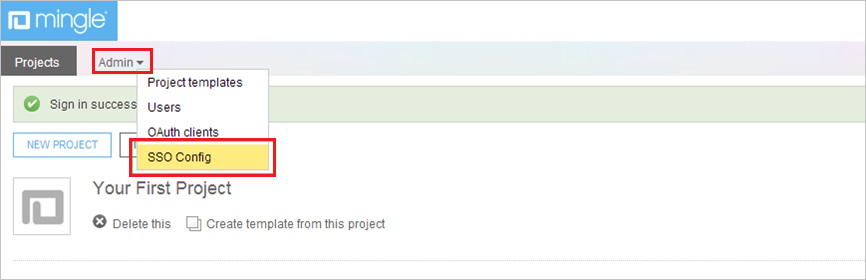
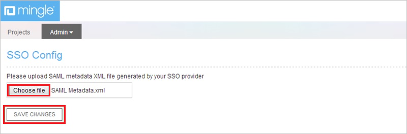
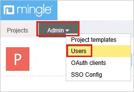

# Tutorial: Azure AD SSO integration with Thoughtworks Mingle

In this tutorial, you'll learn how to integrate Thoughtworks Mingle with Azure Active Directory (Azure AD). When you integrate Thoughtworks Mingle with Azure AD, you can:

* Control in Azure AD who has access to Thoughtworks Mingle.
* Enable your users to be automatically signed-in to Thoughtworks Mingle with their Azure AD accounts.
* Manage your accounts in one central location - the Azure portal.

## Prerequisites

To configure Azure AD integration with Thoughtworks Mingle, you need the following items:

* An Azure AD subscription. If you don't have an Azure AD environment, you can get a [free account](https://azure.microsoft.com/free/).
* Thoughtworks Mingle single sign-on enabled subscription.

## Scenario description

In this tutorial, you configure and test Azure AD SSO in a test environment.

* Thoughtworks Mingle supports **SP** initiated SSO.

## Add Thoughtworks Mingle from the gallery

To configure the integration of Thoughtworks Mingle into Azure AD, you need to add Thoughtworks Mingle from the gallery to your list of managed SaaS apps.

1. Sign in to the Azure portal using either a work or school account, or a personal Microsoft account.
1. On the left navigation pane, select the **Azure Active Directory** service.
1. Navigate to **Enterprise Applications** and then select **All Applications**.
1. To add new application, select **New application**.
1. In the **Add from the gallery** section, type **Thoughtworks Mingle** in the search box.
1. Select **Thoughtworks Mingle** from results panel and then add the app. Wait a few seconds while the app is added to your tenant.

 Alternatively, you can also use the [Enterprise App Configuration Wizard](https://portal.office.com/AdminPortal/home?Q=Docs#/azureadappintegration). In this wizard, you can add an application to your tenant, add users/groups to the app, assign roles, as well as walk through the SSO configuration as well. [Learn more about Microsoft 365 wizards.](/microsoft-365/admin/misc/azure-ad-setup-guides)

## Configure and test Azure AD SSO for Thoughtworks Mingle

Configure and test Azure AD SSO with Thoughtworks Mingle using a test user called **B.Simon**. For SSO to work, you need to establish a link relationship between an Azure AD user and the related user in Thoughtworks Mingle.

To configure and test Azure AD SSO with Thoughtworks Mingle, perform the following steps:

1. **[Configure Azure AD SSO](#configure-azure-ad-sso)** - to enable your users to use this feature.
    1. **[Create an Azure AD test user](#create-an-azure-ad-test-user)** - to test Azure AD single sign-on with B.Simon.
    2. **[Assign the Azure AD test user](#assign-the-azure-ad-test-user)** - to enable B.Simon to use Azure AD single sign-on.
2. **[Configure Thoughtworks Mingle SSO](#configure-thoughtworks-mingle-sso)** - to configure the single sign-on settings on application side.
    1. **[Create Thoughtworks Mingle test user](#create-thoughtworks-mingle-test-user)** - to have a counterpart of B.Simon in Thoughtworks Mingle that is linked to the Azure AD representation of user.
3. **[Test SSO](#test-sso)** - to verify whether the configuration works.

## Configure Azure AD SSO

Follow these steps to enable Azure AD SSO in the Azure portal.

1. In the Azure portal, on the **Thoughtworks Mingle** application integration page, find the **Manage** section and select **single sign-on**.
1. On the **Select a single sign-on method** page, select **SAML**.
1. On the **Set up single sign-on with SAML** page, click the pencil icon for **Basic SAML Configuration** to edit the settings.

   

4. On the **Basic SAML Configuration** section, perform the following steps:

    In the **Sign-on URL** text box, type a URL using the following pattern:
    `https://<companyname>.mingle.thoughtworks.com`

	> [!NOTE]
	> The value is not real. Update the value with the actual Sign-On URL. Contact Thoughtworks Mingle Client support team to get the value. You can also refer to the patterns shown in the **Basic SAML Configuration** section in the Azure portal.

5. On the **Set up Single Sign-On with SAML** page, in the **SAML Signing Certificate** section, click **Download** to download the **Federation Metadata XML** from the given options as per your requirement and save it on your computer.

	

6. On the **Set up Thoughtworks Mingle** section, copy the appropriate URL(s) as per your requirement.

	

### Create an Azure AD test user

In this section, you'll create a test user in the Azure portal called B.Simon.

1. From the left pane in the Azure portal, select **Azure Active Directory**, select **Users**, and then select **All users**.
2. Select **New user** at the top of the screen.
3. In the **User** properties, follow these steps:
   1. In the **Name** field, enter `B.Simon`.  
   2. In the **User name** field, enter the username@companydomain.extension. For example, `B.Simon@contoso.com`.
   3. Select the **Show password** check box, and then write down the value that's displayed in the **Password** box.
   4. Click **Create**.

### Assign the Azure AD test user

In this section, you'll enable B.Simon to use Azure single sign-on by granting access to Thoughtworks Mingle.

1. In the Azure portal, select **Enterprise Applications**, and then select **All applications**.
2. In the applications list, select **Thoughtworks Mingle**.
3. In the app's overview page, find the **Manage** section and select **Users and groups**.
4. Select **Add user**, then select **Users and groups** in the **Add Assignment** dialog.
5. In the **Users and groups** dialog, select **B.Simon** from the Users list, then click the **Select** button at the bottom of the screen.
6. If you are expecting a role to be assigned to the users, you can select it from the **Select a role** dropdown. If no role has been set up for this app, you see "Default Access" role selected.
7. In the **Add Assignment** dialog, click the **Assign** button.

## Configure Thoughtworks Mingle SSO

1. Sign in to your **Thoughtworks Mingle** company site as administrator.

2. Click the **Admin** tab, and then, click **SSO Config**.
   
    

3. In the **SSO Config** section, perform the following steps:
   
    
    
    a. To upload the metadata file, click **Choose file**. 

    b. Click **Save Changes**.

### Create Thoughtworks Mingle test user

For Azure AD users to be able to sign in, they must be provisioned to the Thoughtworks Mingle application using their Azure Active Directory user names. In the case of Thoughtworks Mingle, provisioning is a manual task.

**To configure user provisioning, perform the following steps:**

1. Sign in to your Thoughtworks Mingle company site as administrator.

2. Click **Profile**.
   
    

3. Click the **Admin** tab, and then click **Users**.
   
    

4. Click **New User**.
   
    

5. On the **New User** dialog page, perform the following steps:
   
      
 
    a. Type the **Sign-in name**, **Display name**, **Choose password**, **Confirm password** of a valid Azure AD account you want to provision into the related textboxes. 

    b. As **User type**, select **Full user**.

    c. Click **Create This Profile**.

>[!NOTE]
>You can use any other Thoughtworks Mingle user account creation tools or APIs provided by Thoughtworks Mingle to provision Azure AD user accounts.
> 

## Test SSO

In this section, you test your Azure AD single sign-on configuration with following options. 

* Click on **Test this application** in Azure portal. This will redirect to Thoughtworks Mingle Sign-on URL where you can initiate the login flow. 

* Go to Thoughtworks Mingle Sign-on URL directly and initiate the login flow from there.

* You can use Microsoft My Apps. When you click the Thoughtworks Mingle tile in the My Apps, this will redirect to Thoughtworks Mingle Sign-on URL. For more information about the My Apps, see [Introduction to the My Apps](https://support.microsoft.com/account-billing/sign-in-and-start-apps-from-the-my-apps-portal-2f3b1bae-0e5a-4a86-a33e-876fbd2a4510).

## Next steps

Once you configure Thoughtworks Mingle you can enforce session control, which protects exfiltration and infiltration of your organization’s sensitive data in real time. Session control extends from Conditional Access. [Learn how to enforce session control with Microsoft Defender for Cloud Apps](/cloud-app-security/proxy-deployment-aad).