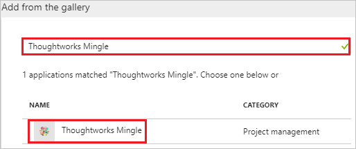

# Tutorial: Azure Active Directory integration with Thoughtworks Mingle

In this tutorial, you learn how to integrate Thoughtworks Mingle with Azure Active Directory (Azure AD).

Integrating Thoughtworks Mingle with Azure AD provides you with the following benefits:

- You can control in Azure AD who has access to Thoughtworks Mingle
- You can enable your users to automatically get signed-on to Thoughtworks Mingle (Single Sign-On) with their Azure AD accounts
- You can manage your accounts in one central location - the Azure portal

If you want to know more details about SaaS app integration with Azure AD, see [what is application access and single sign-on with Azure Active Directory](../manage-apps/what-is-single-sign-on.md).

## Prerequisites

To configure Azure AD integration with Thoughtworks Mingle, you need the following items:

- An Azure AD subscription
- A Thoughtworks Mingle single sign-on enabled subscription

> [!NOTE]
> To test the steps in this tutorial, we do not recommend using a production environment.

To test the steps in this tutorial, you should follow these recommendations:

- Do not use your production environment, unless it is necessary.
- If you don't have an Azure AD trial environment, you can [get a one-month trial](https://azure.microsoft.com/pricing/free-trial/).

## Scenario description
In this tutorial, you test Azure AD single sign-on in a test environment. 
The scenario outlined in this tutorial consists of two main building blocks:

1. Adding Thoughtworks Mingle from the gallery
1. Configuring and testing Azure AD single sign-on

## Adding Thoughtworks Mingle from the gallery
To configure the integration of Thoughtworks Mingle into Azure AD, you need to add Thoughtworks Mingle from the gallery to your list of managed SaaS apps.

**To add Thoughtworks Mingle from the gallery, perform the following steps:**

1. In the **[Azure portal](https://portal.azure.com)**, on the left navigation panel, click **Azure Active Directory** icon. 

	![The Azure Active Directory button][1]

1. Navigate to **Enterprise applications**. Then go to **All applications**.

	![The Enterprise applications blade][2]
	
1. To add new application, click **New application** button on the top of dialog.

	![The New application button][3]

1. In the search box, type **Thoughtworks Mingle**, select **Thoughtworks Mingle** from result panel then click **Add** button to add the application.

	

##  Configure and test Azure AD single sign-on
In this section, you configure and test Azure AD single sign-on with Thoughtworks Mingle based on a test user called "Britta Simon".

For single sign-on to work, Azure AD needs to know what the counterpart user in Thoughtworks Mingle is to a user in Azure AD. In other words, a link relationship between an Azure AD user and the related user in Thoughtworks Mingle needs to be established.

In Thoughtworks Mingle, assign the value of the **user name** in Azure AD as the value of the **Username** to establish the link relationship.

To configure and test Azure AD single sign-on with Thoughtworks Mingle, you need to complete the following building blocks:

1. **[Configure Azure AD Single Sign-On](#configure-azure-ad-single-sign-on)** - to enable your users to use this feature.
1. **[Create an Azure AD test user](#create-an-azure-ad-test-user)** - to test Azure AD single sign-on with Britta Simon.
1. **[Create a Thoughtworks Mingle test user](#create-a-thoughtworks-mingle-test-user)** - to have a counterpart of Britta Simon in Thoughtworks Mingle that is linked to the Azure AD representation of user.
1. **[Assign the Azure AD test user](#assign-the-azure-ad-test-user)** - to enable Britta Simon to use Azure AD single sign-on.
1. **[Test Single Sign-On](#test-single-sign-on)** - to verify whether the configuration works.

### Configure Azure AD single sign-on

In this section, you enable Azure AD single sign-on in the Azure portal and configure single sign-on in your Thoughtworks Mingle application.

**To configure Azure AD single sign-on with Thoughtworks Mingle, perform the following steps:**

1. In the Azure portal, on the **Thoughtworks Mingle** application integration page, click **Single sign-on**.

	![Configure Single Sign-On][4]

1. On the **Single sign-on** dialog, select **Mode** as	**SAML-based Sign-on** to enable single sign-on.
 
	

1. On the **Thoughtworks Mingle Domain and URLs** section, perform the following steps:

	

    In the **Sign-on URL** textbox, type a URL using the following pattern: `https://<companyname>.mingle.thoughtworks.com`

	> [!NOTE] 
	> The value is not real. Update the value with the actual Sign-On URL. Contact [Thoughtworks Mingle Client support team](https://support.thoughtworks.com/hc/categories/201743486-Mingle-Community-Support) to get the value. 
 
1. On the **SAML Signing Certificate** section, click **Metadata XML** and then save the metadata file on your computer.

	 

1. Click **Save** button.

	

1. Log in to your **Thoughtworks Mingle** company site as administrator.

1. Click the **Admin** tab, and then, click **SSO Config**.
   
    

1. In the **SSO Config** section, perform the following steps:
   
    
    
    a. To upload the metadata file, click **Choose file**. 

    b. Click **Save Changes**.

> [!TIP]
> You can now read a concise version of these instructions inside the [Azure portal](https://portal.azure.com), while you are setting up the app!  After adding this app from the **Active Directory > Enterprise Applications** section, simply click the **Single Sign-On** tab and access the embedded documentation through the **Configuration** section at the bottom. You can read more about the embedded documentation feature here: [Azure AD embedded documentation]( https://go.microsoft.com/fwlink/?linkid=845985)
> 

### Create an Azure AD test user
The objective of this section is to create a test user in the Azure portal called Britta Simon.

![Create an Azure AD test user][100]

**To create a test user in Azure AD, perform the following steps:**

1. In the **Azure portal**, on the left navigation pane, click **Azure Active Directory** icon.

	 

1. To display the list of users, go to **Users and groups** and click **All users**.
	
	 

1. To open the **User** dialog, click **Add** on the top of the dialog.
 
	 

1. On the **User** dialog page, perform the following steps:
 
	 

    a. In the **Name** textbox, type **BrittaSimon**.

    b. In the **User name** textbox, type the **email address** of BrittaSimon.

	c. Select **Show Password** and write down the value of the **Password**.

    d. Click **Create**.
 
### Create a Thoughtworks Mingle test user

For Azure AD users to be able to sign in, they must be provisioned to the Thoughtworks Mingle application using their Azure Active Directory user names. In the case of Thoughtworks Mingle, provisioning is a manual task.

**To configure user provisioning, perform the following steps:**

1. Log in to your Thoughtworks Mingle company site as administrator.

1. Click **Profile**.
   
    

1. Click the **Admin** tab, and then click **Users**.
   
    

1. Click **New User**.
   
    

1. On the **New User** dialog page, perform the following steps:
   
      
 
    a. Type the **Sign-in name**, **Display name**, **Choose password**, **Confirm password** of a valid Azure AD account you want to provision into the related textboxes. 

    b. As **User type**, select **Full user**.

    c. Click **Create This Profile**.

>[!NOTE]
>You can use any other Thoughtworks Mingle user account creation tools or APIs provided by Thoughtworks Mingle to provision AAD user accounts.
> 

### Assign the Azure AD test user

In this section, you enable Britta Simon to use Azure single sign-on by granting access to Thoughtworks Mingle.

![Assign the user role][200] 

**To assign Britta Simon to Thoughtworks Mingle, perform the following steps:**

1. In the Azure portal, open the applications view, and then navigate to the directory view and go to **Enterprise applications** then click **All applications**.

	![Assign User][201] 

1. In the applications list, select **Thoughtworks Mingle**.

	 

1. In the menu on the left, click **Users and groups**.

	![The "Users and groups" link][202] 

1. Click **Add** button. Then select **Users and groups** on **Add Assignment** dialog.

	![The Add Assignment pane][203]

1. On **Users and groups** dialog, select **Britta Simon** in the Users list.

1. Click **Select** button on **Users and groups** dialog.

1. Click **Assign** button on **Add Assignment** dialog.
	
### Test single sign-on

The objective of this section is to test your Azure AD single sign-on configuration using the Access Panel.

When you click the Thoughtworks Mingle tile in the Access Panel, you should get automatically signed-on to your Thoughtworks Mingle application.

## Additional resources

* [List of Tutorials on How to Integrate SaaS Apps with Azure Active Directory](tutorial-list.md)
* [What is application access and single sign-on with Azure Active Directory?](../manage-apps/what-is-single-sign-on.md)

<!--Image references-->

[1]: ./media/thoughtworks-mingle-tutorial/tutorial_general_01.png
[2]: ./media/thoughtworks-mingle-tutorial/tutorial_general_02.png
[3]: ./media/thoughtworks-mingle-tutorial/tutorial_general_03.png
[4]: ./media/thoughtworks-mingle-tutorial/tutorial_general_04.png

[100]: ./media/thoughtworks-mingle-tutorial/tutorial_general_100.png

[200]: ./media/thoughtworks-mingle-tutorial/tutorial_general_200.png
[201]: ./media/thoughtworks-mingle-tutorial/tutorial_general_201.png
[202]: ./media/thoughtworks-mingle-tutorial/tutorial_general_202.png
[203]: ./media/thoughtworks-mingle-tutorial/tutorial_general_203.png

