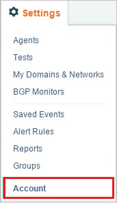
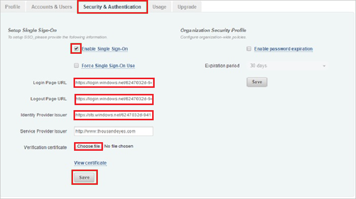

# Tutorial: Azure Active Directory single sign-on (SSO) integration with ThousandEyes

In this tutorial, you'll learn how to integrate ThousandEyes with Azure Active Directory (Azure AD). When you integrate ThousandEyes with Azure AD, you can:

* Control in Azure AD who has access to ThousandEyes.
* Enable your users to be automatically signed-in to ThousandEyes with their Azure AD accounts.
* Manage your accounts in one central location - the Azure portal.

To learn more about SaaS app integration with Azure AD, see [What is application access and single sign-on with Azure Active Directory](../manage-apps/what-is-single-sign-on.md).

## Prerequisites

To get started, you need the following items:

* An Azure AD subscription. If you don't have a subscription, you can get a [free account](https://azure.microsoft.com/free/).
* ThousandEyes single sign-on (SSO) enabled subscription.

## Scenario description

In this tutorial, you configure and test Azure AD SSO in a test environment.

* ThousandEyes supports **SP and IDP** initiated SSO
* ThousandEyes supports [**Automated** user provisioning](./thousandeyes-provisioning-tutorial.md)

> [!NOTE]
> Identifier of this application is a fixed string value so only one instance can be configured in one tenant.

## Adding ThousandEyes from the gallery

To configure the integration of ThousandEyes into Azure AD, you need to add ThousandEyes from the gallery to your list of managed SaaS apps.

1. Sign in to the [Azure portal](https://portal.azure.com) using either a work or school account, or a personal Microsoft account.
1. On the left navigation pane, select the **Azure Active Directory** service.
1. Navigate to **Enterprise Applications** and then select **All Applications**.
1. To add new application, select **New application**.
1. In the **Add from the gallery** section, type **ThousandEyes** in the search box.
1. Select **ThousandEyes** from results panel and then add the app. Wait a few seconds while the app is added to your tenant.

## Configure and test Azure AD single sign-on for ThousandEyes

Configure and test Azure AD SSO with ThousandEyes using a test user called **B.Simon**. For SSO to work, you need to establish a link relationship between an Azure AD user and the related user in ThousandEyes.

To configure and test Azure AD SSO with ThousandEyes, complete the following building blocks:

1. **[Configure Azure AD SSO](#configure-azure-ad-sso)** - to enable your users to use this feature.
    * **[Create an Azure AD test user](#create-an-azure-ad-test-user)** - to test Azure AD single sign-on with B.Simon.
    * **[Assign the Azure AD test user](#assign-the-azure-ad-test-user)** - to enable B.Simon to use Azure AD single sign-on.
1. **[Configure ThousandEyes SSO](#configure-thousandeyes-sso)** - to configure the single sign-on settings on application side.
    * **[Create ThousandEyes test user](#create-thousandeyes-test-user)** - to have a counterpart of B.Simon in ThousandEyes that is linked to the Azure AD representation of user.
1. **[Test SSO](#test-sso)** - to verify whether the configuration works.

## Configure Azure AD SSO

Follow these steps to enable Azure AD SSO in the Azure portal.

1. In the [Azure portal](https://portal.azure.com/), on the **ThousandEyes** application integration page, find the **Manage** section and select **single sign-on**.
1. On the **Select a single sign-on method** page, select **SAML**.
1. On the **Set up single sign-on with SAML** page, click the edit/pen icon for **Basic SAML Configuration** to edit the settings.

   

1. On the **Basic SAML Configuration** section, the application is pre-configured and the necessary URLs are already pre-populated with Azure. The user needs to save the configuration by clicking the **Save** button.

1. Click **Set additional URLs** and perform the following step if you wish to configure the application in **SP** initiated mode:

    In the **Sign-on URL** text box, type a URL:
    `https://app.thousandeyes.com/login/sso`

1. On the **Set up single sign-on with SAML** page, in the **SAML Signing Certificate** section,  find **Certificate (Base64)** and select **Download** to download the certificate and save it on your computer.

	

1. On the **Set up ThousandEyes** section, copy the appropriate URL(s) based on your requirement.

	

### Create an Azure AD test user

In this section, you'll create a test user in the Azure portal called B.Simon.

1. From the left pane in the Azure portal, select **Azure Active Directory**, select **Users**, and then select **All users**.
1. Select **New user** at the top of the screen.
1. In the **User** properties, follow these steps:
   1. In the **Name** field, enter `B.Simon`.  
   1. In the **User name** field, enter the username@companydomain.extension. For example, `B.Simon@contoso.com`.
   1. Select the **Show password** check box, and then write down the value that's displayed in the **Password** box.
   1. Click **Create**.

### Assign the Azure AD test user

In this section, you'll enable B.Simon to use Azure single sign-on by granting access to ThousandEyes.

1. In the Azure portal, select **Enterprise Applications**, and then select **All applications**.
1. In the applications list, select **ThousandEyes**.
1. In the app's overview page, find the **Manage** section and select **Users and groups**.

   

1. Select **Add user**, then select **Users and groups** in the **Add Assignment** dialog.

	

1. In the **Users and groups** dialog, select **B.Simon** from the Users list, then click the **Select** button at the bottom of the screen.
1. If you're expecting any role value in the SAML assertion, in the **Select Role** dialog, select the appropriate role for the user from the list and then click the **Select** button at the bottom of the screen.
1. In the **Add Assignment** dialog, click the **Assign** button.

## Configure ThousandEyes SSO

1. In a different web browser window, sign on to your **ThousandEyes** company site as an administrator.

2. In the menu on the top, click **Settings**.

    

3. Click **Account**

    

4. Click the **Security & Authentication** tab.

    

5. In the **Setup Single Sign-On** section, perform the following steps:

    

    a. Select **Enable Single Sign-On**.

    b. In **Login Page URL** textbox, paste **Login URL**, which you have copied from Azure portal.

    c. In **Logout Page URL** textbox, paste **Logout URL**, which you have copied from Azure portal.

    d. **Identity Provider Issuer** textbox, paste **Azure AD Identifier**, which you have copied from Azure portal.

    e. In **Verification Certificate**, click **Choose file**, and then upload the certificate you have downloaded from Azure portal.

    f. Click **Save**.

### Create ThousandEyes test user

The objective of this section is to create a user called Britta Simon in ThousandEyes. ThousandEyes supports automatic user provisioning, which is by default enabled. You can find more details [here](thousandeyes-provisioning-tutorial.md) on how to configure automatic user provisioning.

**If you need to create user manually, perform following steps:**

1. Sign in to your ThousandEyes company site as an administrator.

2. Click **Settings**.

    

3. Click **Account**.

    

4. Click the **Accounts & Users** tab.

    

5. In the **Add Users & Accounts** section, perform the following steps:

    

    a. In **Name** textbox, type the name of user like **B.Simon**.

    b. In **Email** textbox, type the email of user like b.simon@contoso.com.

    b. Click **Add New User to Account**.

    > [!NOTE]
    > The Azure Active Directory account holder will get an email including a link to confirm and activate the account.

> [!NOTE]
> You can use any other ThousandEyes user account creation tools or APIs provided by ThousandEyes to provision Azure Active Directory user accounts.

## Test SSO 

In this section, you test your Azure AD single sign-on configuration using the Access Panel.

When you click the ThousandEyes tile in the Access Panel, you should be automatically signed in to the ThousandEyes for which you set up SSO. For more information about the Access Panel, see [Introduction to the Access Panel](../user-help/my-apps-portal-end-user-access.md).

## Additional resources

- [ List of Tutorials on How to Integrate SaaS Apps with Azure Active Directory ](./tutorial-list.md)

- [What is application access and single sign-on with Azure Active Directory? ](../manage-apps/what-is-single-sign-on.md)

- [What is conditional access in Azure Active Directory?](../conditional-access/overview.md)

- [Try ThousandEyes with Azure AD](https://aad.portal.azure.com/)

- [Configure User Provisioning](./thousandeyes-provisioning-tutorial.md)