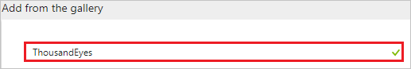
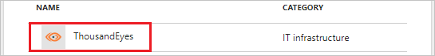
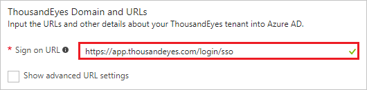
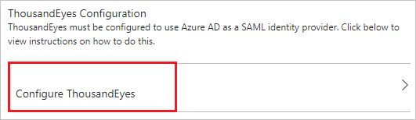
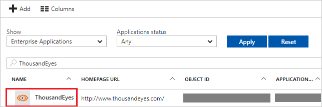

# Tutorial: Azure Active Directory integration with ThousandEyes

In this tutorial, you learn how to integrate ThousandEyes with Azure Active Directory (Azure AD).

Integrating ThousandEyes with Azure AD provides you with the following benefits:

- You can control in Azure AD who has access to ThousandEyes
- You can enable your users to automatically get signed-on to ThousandEyes (Single Sign-On) with their Azure AD accounts
- You can manage your accounts in one central location - the Azure portal

If you want to know more details about SaaS app integration with Azure AD, see [what is application access and single sign-on with Azure Active Directory](../manage-apps/what-is-single-sign-on.md).

## Prerequisites

To configure Azure AD integration with ThousandEyes, you need the following items:

- An Azure AD subscription
- A ThousandEyes single sign-on enabled subscription

> [!NOTE]
> To test the steps in this tutorial, we do not recommend using a production environment.

To test the steps in this tutorial, you should follow these recommendations:

- Do not use your production environment, unless it is necessary.
- If you don't have an Azure AD trial environment, you can get a one-month trial here: [Trial offer](https://azure.microsoft.com/pricing/free-trial/).

## Scenario description
In this tutorial, you test Azure AD single sign-on in a test environment. 
The scenario outlined in this tutorial consists of two main building blocks:

1. Adding ThousandEyes from the gallery
1. Configuring and testing Azure AD single sign-on

## Adding ThousandEyes from the gallery
To configure the integration of ThousandEyes into Azure AD, you need to add ThousandEyes from the gallery to your list of managed SaaS apps.

**To add ThousandEyes from the gallery, perform the following steps:**

1. In the **[Azure portal](https://portal.azure.com)**, on the left navigation panel, click **Azure Active Directory** icon. 

	![Active Directory][1]

1. Navigate to **Enterprise applications**. Then go to **All applications**.

	![Applications][2]
	
1. To add new application, click **New application** button on the top of dialog.

	![Applications][3]

1. In the search box, type **ThousandEyes**.

	

1. In the results panel, select **ThousandEyes**, and then click **Add** button to add the application.

	

##  Configuring and testing Azure AD single sign-on
In this section, you configure and test Azure AD single sign-on with ThousandEyes based on a test user called "Britta Simon".

For single sign-on to work, Azure AD needs to know what the counterpart user in ThousandEyes is to a user in Azure AD. In other words, a link relationship between an Azure AD user and the related user in ThousandEyes needs to be established.

In ThousandEyes, assign the value of the **user name** in Azure AD as the value of the **Username** to establish the link relationship.

To configure and test Azure AD single sign-on with ThousandEyes, you need to complete the following building blocks:

1. **[Configuring Azure AD Single Sign-On](#configuring-azure-ad-single-sign-on)** - to enable your users to use this feature.
1. **[Creating an Azure AD test user](#creating-an-azure-ad-test-user)** - to test Azure AD single sign-on with Britta Simon.
1. **[Creating a ThousandEyes test user](#creating-a-thousandeyes-test-user)** - to have a counterpart of Britta Simon in ThousandEyes that is linked to the Azure AD representation of user.
1. **[Assigning the Azure AD test user](#assigning-the-azure-ad-test-user)** - to enable Britta Simon to use Azure AD single sign-on.
1. **[Testing Single Sign-On](#testing-single-sign-on)** - to verify whether the configuration works.

### Configuring Azure AD single sign-on

In this section, you enable Azure AD single sign-on in the Azure portal and configure single sign-on in your ThousandEyes application.

**To configure Azure AD single sign-on with ThousandEyes, perform the following steps:**

1. In the Azure portal, on the **ThousandEyes** application integration page, click **Single sign-on**.

	![Configure Single Sign-On][4]

1. On the **Single sign-on** dialog, select **Mode** as **SAML-based Sign-on** to enable single sign-on.

	

1. On the **ThousandEyes Domain and URLs** section, perform the following steps:

	

    In the **Sign-on URL** textbox, type a URL as: `https://app.thousandeyes.com/login/sso`

1. On the **SAML Signing Certificate** section, click **Certificate(Base64)** and then save the certificate file on your computer.

	

1. Click **Save** button.

	

1. On the **ThousandEyes Configuration** section, click **Configure ThousandEyes** to open **Configure sign-on** window. Copy the **Sign-Out URL, SAML Entity ID, and SAML Single Sign-On Service URL** from the **Quick Reference section.**

	 

1. In a different web browser window, sign on to your **ThousandEyes** company site as an administrator.

1. In the menu on the top, click **Settings**.

    

1. Click **Account**

    

1. Click the **Security & Authentication** tab.

    

1. In the **Setup Single Sign-On** section, perform the following steps:

    

    a. Select **Enable Single Sign-On**.

    b. In **Login Page URL** textbox, paste **SAML Single Sign-On Service URL**, which you have copied from Azure portal.

    c. In **Logout Page URL** textbox, paste **Sign-Out URL**, which you have copied from Azure portal.

    d. **Identity Provider Issuer** textbox, paste **SAML Entity ID**, which you have copied from Azure portal.

    e. In **Verification Certificate**, click **Choose file**, and then upload the certificate you have downloaded from Azure portal.

    f. Click **Save**.

### Creating an Azure AD test user
The objective of this section is to create a test user in the Azure portal called Britta Simon.

![Create Azure AD User][100]

**To create a test user in Azure AD, perform the following steps:**

1. In the **Azure portal**, on the left navigation pane, click **Azure Active Directory** icon.

	 

1. To display the list of users, go to **Users and groups** and click **All users**.
	
	 

1. To open the **User** dialog, click **Add** on the top of the dialog.

    

1. On the **User** dialog page, perform the following steps:

	

    a. In the **Name** textbox, type **BrittaSimon**.

    b. In the **User name** textbox, type the **email address** of BrittaSimon.

	c. Select **Show Password** and write down the value of the **Password**.

    d. Click **Create**.

### Creating a ThousandEyes test user

The objective of this section is to create a user called Britta Simon in ThousandEyes. ThousandEyes supports automatic user provisioning, which is by default enabled. You can find more details [here](thousandeyes-provisioning-tutorial.md) on how to configure automatic user provisioning.

**If you need to create user manually, perform following steps:**

1. Log into your ThousandEyes company site as an administrator.

1. Click **Settings**.

    

1. Click **Account**.

    

1. Click the **Accounts & Users** tab.

    

1. In the **Add Users & Accounts** section, perform the following steps:

    

    a. In **Name** textbox, type the name of user like **Britta Simon**.

    b. In **Email** textbox, type the email of user like **brittasimon@contoso.com**.

    b. Click **Add New User to Account**.

    > [!NOTE]
    > The Azure Active Directory account holder will get an email including a link to confirm and activate the account.

> [!NOTE]
> You can use any other ThousandEyes user account creation tools or APIs provided by ThousandEyes to provision Azure Active Directory user accounts.

### Assigning the Azure AD test user

In this section, you enable Britta Simon to use Azure single sign-on by granting access to ThousandEyes.

![Assign User][200] 

**To assign Britta Simon to ThousandEyes, perform the following steps:**

1. In the Azure portal, open the applications view, and then navigate to the directory view and go to **Enterprise applications** then click **All applications**.

	![Assign User][201] 

1. In the applications list, select **ThousandEyes**.

	 

1. In the menu on the left, click **Users and groups**.

	![Assign User][202] 

1. Click **Add** button. Then select **Users and groups** on **Add Assignment** dialog.

	![Assign User][203]

1. On **Users and groups** dialog, select **Britta Simon** in the Users list.

1. Click **Select** button on **Users and groups** dialog.

1. Click **Assign** button on **Add Assignment** dialog.
	
### Testing single sign-on

In this section, you test your Azure AD single sign-on configuration using the Access Panel.

When you click the ThousandEyes tile in the Access Panel, you should get automatically signed-on to your ThousandEyes application.

For more information about the Access Panel, see [Introduction to the Access Panel](../user-help/active-directory-saas-access-panel-introduction.md).

## Additional resources

* [List of Tutorials on How to Integrate SaaS Apps with Azure Active Directory](tutorial-list.md)
* [What is application access and single sign-on with Azure Active Directory?](../manage-apps/what-is-single-sign-on.md)
* [Configure User Provisioning](thousandeyes-provisioning-tutorial.md)

<!--Image references-->

[1]: ./media/thousandeyes-tutorial/tutorial_general_01.png
[2]: ./media/thousandeyes-tutorial/tutorial_general_02.png
[3]: ./media/thousandeyes-tutorial/tutorial_general_03.png
[4]: ./media/thousandeyes-tutorial/tutorial_general_04.png

[100]: ./media/thousandeyes-tutorial/tutorial_general_100.png

[200]: ./media/thousandeyes-tutorial/tutorial_general_200.png
[201]: ./media/thousandeyes-tutorial/tutorial_general_201.png
[202]: ./media/thousandeyes-tutorial/tutorial_general_202.png
[203]: ./media/thousandeyes-tutorial/tutorial_general_203.png
