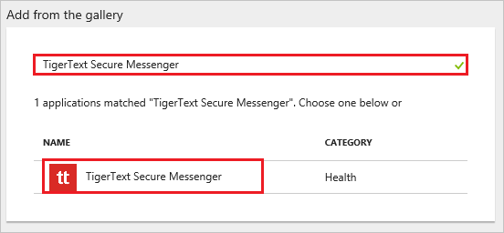

# Tutorial: Azure Active Directory integration with TigerText Secure Messenger

In this tutorial, you learn how to integrate TigerText Secure Messenger with Azure Active Directory (Azure AD).

Integrating TigerText Secure Messenger with Azure AD provides you with the following benefits:

- You can control in Azure AD who has access to TigerText Secure Messenger
- You can enable your users to automatically get signed-on to TigerText Secure Messenger (Single Sign-On) with their Azure AD accounts
- You can manage your accounts in one central location - the Azure portal

If you want to know more details about SaaS app integration with Azure AD, see [what is application access and single sign-on with Azure Active Directory](../manage-apps/what-is-single-sign-on.md).

## Prerequisites

To configure Azure AD integration with TigerText Secure Messenger, you need the following items:

- An Azure AD subscription
- A TigerText Secure Messenger single sign-on enabled subscription

> [!NOTE]
> To test the steps in this tutorial, we do not recommend using a production environment.

To test the steps in this tutorial, you should follow these recommendations:

- Do not use your production environment, unless it is necessary.
- If you don't have an Azure AD trial environment, you can [get a one-month trial](https://azure.microsoft.com/pricing/free-trial/).

## Scenario description
In this tutorial, you test Azure AD single sign-on in a test environment. 
The scenario outlined in this tutorial consists of two main building blocks:

1. Add TigerText Secure Messenger from the gallery
1. Configure and test Azure AD single sign-on

## Add TigerText Secure Messenger from the gallery
To configure the integration of TigerText Secure Messenger into Azure AD, you need to add TigerText Secure Messenger from the gallery to your list of managed SaaS apps.

**To add TigerText Secure Messenger from the gallery, perform the following steps:**

1. In the **[Azure portal](https://portal.azure.com)**, on the left navigation panel, click **Azure Active Directory** icon. 

	![Active Directory][1]

1. Navigate to **Enterprise applications**. Then go to **All applications**.

	![Applications][2]
	
1. To add new application, click **New application** button on the top of dialog.

	![Applications][3]

1. In the search box, type **TigerText Secure Messenger**, select **TigerText Secure Messenger** from result panel then click **Add** button to add the application.

	

##  Configure and test Azure AD single sign-on
In this section, you configure and test Azure AD single sign-on with TigerText Secure Messenger based on a test user called "Britta Simon".

For single sign-on to work, Azure AD needs to know what the counterpart user in TigerText Secure Messenger is to a user in Azure AD. In other words, a link relationship between an Azure AD user and the related user in TigerText Secure Messenger needs to be established.

In TigerText Secure Messenger, assign the value of the **user name** in Azure AD as the value of the **Username** to establish the link relationship.

To configure and test Azure AD single sign-on with TigerText Secure Messenger, you need to complete the following building blocks:

1. **[Configure Azure AD Single Sign-On](#configure-azure-ad-single-sign-on)** - to enable your users to use this feature.
1. **[Create an Azure AD test user](#create-an-azure-ad-test-user)** - to test Azure AD single sign-on with Britta Simon.
1. **[Create a TigerText Secure Messenger test user](#create-a-tigertext-secure-messenger-test-user)** - to have a counterpart of Britta Simon in TigerText Secure Messenger that is linked to the Azure AD representation of user.
1. **[Assign the Azure AD test user](#assign-the-azure-ad-test-user)** - to enable Britta Simon to use Azure AD single sign-on.
1. **[Test Single Sign-On](#test-single-sign-on)** - to verify whether the configuration works.

### Configure Azure AD single sign-on

In this section, you enable Azure AD single sign-on in the Azure portal and configure single sign-on in your TigerText Secure Messenger application.

**To configure Azure AD single sign-on with TigerText Secure Messenger, perform the following steps:**

1. In the Azure portal, on the **TigerText Secure Messenger** application integration page, click **Single sign-on**.

	![Configure Single Sign-On][4]

1. On the **Single sign-on** dialog, select **Mode** as	**SAML-based Sign-on** to enable single sign-on.
 
	

1. On the **TigerText Secure Messenger Domain and URLs** section, perform the following steps:

	

    a. In the **Sign-on URL** textbox, type URL as: `https://home.tigertext.com`

	b. In the **Identifier** textbox, type a URL using the following pattern: `https://saml-lb.tigertext.me/v1/organization/<instance Id>`

	> [!NOTE] 
	> This value is not real. Update this value with the actual Identifier. Contact [TigerText Secure Messenger Client support team](mailTo:prosupport@tigertext.com) to get this value. 
 
1. On the **SAML Signing Certificate** section, click **Metadata XML** and then save the metadata file on your computer.

	 

1. Click **Save** button.

	

1. To get single sign-on configured for your application, contact [TigerText Secure Messenger support team](mailTo:prosupport@tigertext.com) and provide them the **Downloaded metadata**.

> [!TIP]
> You can now read a concise version of these instructions inside the [Azure portal](https://portal.azure.com), while you are setting up the app!  After adding this app from the **Active Directory > Enterprise Applications** section, simply click the **Single Sign-On** tab and access the embedded documentation through the **Configuration** section at the bottom. You can read more about the embedded documentation feature here: [Azure AD embedded documentation]( https://go.microsoft.com/fwlink/?linkid=845985)
> 

### Create an Azure AD test user
The objective of this section is to create a test user in the Azure portal called Britta Simon.

![Create Azure AD User][100]

**To create a test user in Azure AD, perform the following steps:**

1. In the **Azure portal**, on the left navigation pane, click **Azure Active Directory** icon.

	 

1. To display the list of users, go to **Users and groups** and click **All users**.
	
	 

1. To open the **User** dialog, click **Add** on the top of the dialog.
 
	 

1. On the **User** dialog page, perform the following steps:
 
	 

    a. In the **Name** textbox, type **BrittaSimon**.

    b. In the **User name** textbox, type the **email address** of BrittaSimon.

	c. Select **Show Password** and write down the value of the **Password**.

    d. Click **Create**.
 
### Create a TigerText Secure Messenger test user

In this section, you create a user called Britta Simon in TigerText. Please reach out to [TigerText Secure Messenger Client support team](mailTo:prosupport@tigertext.com) to add the users in the TigerText platform.

### Assign the Azure AD test user

In this section, you enable Britta Simon to use Azure single sign-on by granting access to TigerText Secure Messenger.

![Assign User][200] 

**To assign Britta Simon to TigerText Secure Messenger, perform the following steps:**

1. In the Azure portal, open the applications view, and then navigate to the directory view and go to **Enterprise applications** then click **All applications**.

	![Assign User][201] 

1. In the applications list, select **TigerText Secure Messenger**.

	 

1. In the menu on the left, click **Users and groups**.

	![Assign User][202] 

1. Click **Add** button. Then select **Users and groups** on **Add Assignment** dialog.

	![Assign User][203]

1. On **Users and groups** dialog, select **Britta Simon** in the Users list.

1. Click **Select** button on **Users and groups** dialog.

1. Click **Assign** button on **Add Assignment** dialog.
	
### Test single sign-on

In this section, you test your Azure AD single sign-on configuration using the Access Panel.

When you click the TigerText tile in the Access Panel, you should get automatically signed-on to your TigerText application. For more information about the Access Panel, see [Introduction to the Access Panel](../user-help/active-directory-saas-access-panel-introduction.md).

## Additional resources

* [List of Tutorials on How to Integrate SaaS Apps with Azure Active Directory](tutorial-list.md)
* [What is application access and single sign-on with Azure Active Directory?](../manage-apps/what-is-single-sign-on.md)

<!--Image references-->

[1]: ./media/tigertext-tutorial/tutorial_general_01.png
[2]: ./media/tigertext-tutorial/tutorial_general_02.png
[3]: ./media/tigertext-tutorial/tutorial_general_03.png
[4]: ./media/tigertext-tutorial/tutorial_general_04.png

[100]: ./media/tigertext-tutorial/tutorial_general_100.png

[200]: ./media/tigertext-tutorial/tutorial_general_200.png
[201]: ./media/tigertext-tutorial/tutorial_general_201.png
[202]: ./media/tigertext-tutorial/tutorial_general_202.png
[203]: ./media/tigertext-tutorial/tutorial_general_203.png

