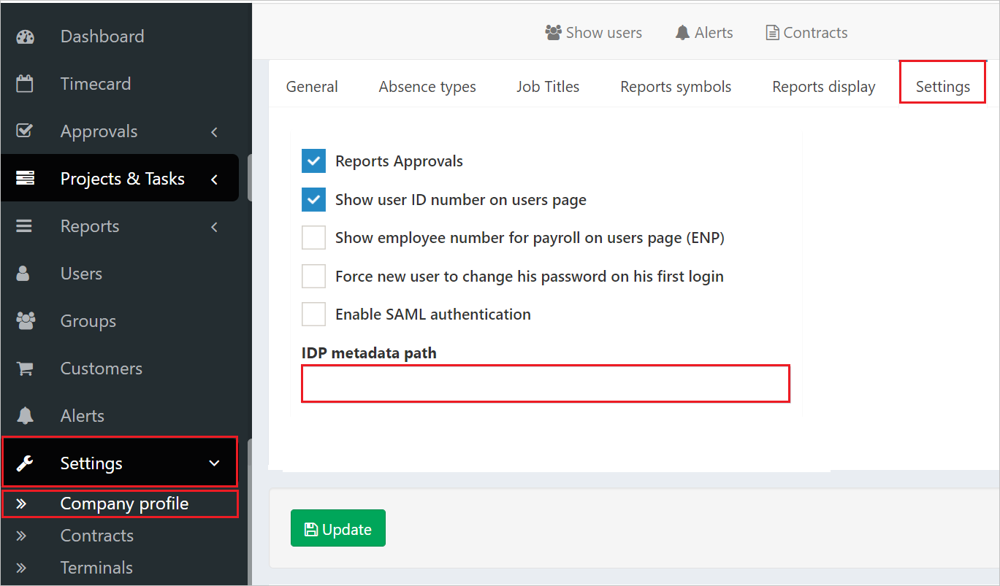
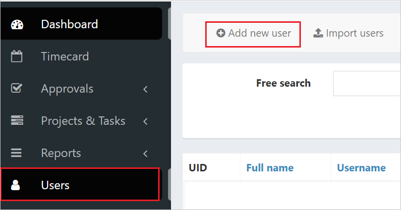
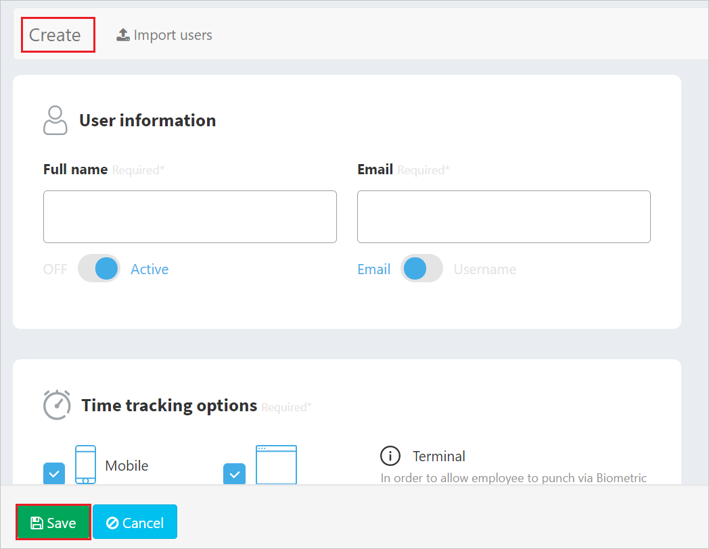

# Tutorial: Azure Active Directory single sign-on (SSO) integration with Timeclock 365 SAML

In this tutorial, you'll learn how to integrate Timeclock 365 SAML with Azure Active Directory (Azure AD). When you integrate Timeclock 365 SAML with Azure AD, you can:

* Control in Azure AD who has access to Timeclock 365 SAML.
* Enable your users to be automatically signed-in to Timeclock 365 SAML with their Azure AD accounts.
* Manage your accounts in one central location - the Azure portal.

## Prerequisites

To get started, you need the following items:

* An Azure AD subscription. If you don't have a subscription, you can get a [free account](https://azure.microsoft.com/free/).
* Timeclock 365 SAML single sign-on (SSO) enabled subscription.

## Scenario description

In this tutorial, you configure and test Azure AD SSO in a test environment.

* Timeclock 365 SAML supports **SP** initiated SSO

## Adding Timeclock 365 SAML from the gallery

To configure the integration of Timeclock 365 SAML into Azure AD, you need to add Timeclock 365 SAML from the gallery to your list of managed SaaS apps.

1. Sign in to the Azure portal using either a work or school account, or a personal Microsoft account.
1. On the left navigation pane, select the **Azure Active Directory** service.
1. Navigate to **Enterprise Applications** and then select **All Applications**.
1. To add new application, select **New application**.
1. In the **Add from the gallery** section, type **Timeclock 365 SAML** in the search box.
1. Select **Timeclock 365 SAML** from results panel and then add the app. Wait a few seconds while the app is added to your tenant.

## Configure and test Azure AD SSO for Timeclock 365 SAML

Configure and test Azure AD SSO with Timeclock 365 SAML using a test user called **B.Simon**. For SSO to work, you need to establish a link relationship between an Azure AD user and the related user in Timeclock 365 SAML.

To configure and test Azure AD SSO with Timeclock 365 SAML, perform the following steps:

1. **[Configure Azure AD SSO](#configure-azure-ad-sso)** - to enable your users to use this feature.
    1. **[Create an Azure AD test user](#create-an-azure-ad-test-user)** - to test Azure AD single sign-on with B.Simon.
    1. **[Assign the Azure AD test user](#assign-the-azure-ad-test-user)** - to enable B.Simon to use Azure AD single sign-on.
1. **[Configure Timeclock 365 SAML SSO](#configure-timeclock-365-saml-sso)** - to configure the single sign-on settings on application side.
    1. **[Create Timeclock 365 SAML test user](#create-timeclock-365-saml-test-user)** - to have a counterpart of B.Simon in Timeclock 365 SAML that is linked to the Azure AD representation of user.
1. **[Test SSO](#test-sso)** - to verify whether the configuration works.

## Configure Azure AD SSO

Follow these steps to enable Azure AD SSO in the Azure portal.

1. In the Azure portal, on the **Timeclock 365 SAML** application integration page, find the **Manage** section and select **single sign-on**.
1. On the **Select a single sign-on method** page, select **SAML**.
1. On the **Set up single sign-on with SAML** page, click the pencil icon for **Basic SAML Configuration** to edit the settings.

   

1. On the **Basic SAML Configuration** section, enter the values for the following fields:

    In the **Sign-on URL** text box, type the URL:
    `https://live.timeclock365.com/login`

1. On the **Set up single sign-on with SAML** page, In the **SAML Signing Certificate** section, click copy button to copy **App Federation Metadata Url** and save it on your computer.

	

### Create an Azure AD test user

In this section, you'll create a test user in the Azure portal called B.Simon.

1. From the left pane in the Azure portal, select **Azure Active Directory**, select **Users**, and then select **All users**.
1. Select **New user** at the top of the screen.
1. In the **User** properties, follow these steps:
   1. In the **Name** field, enter `B.Simon`.  
   1. In the **User name** field, enter the username@companydomain.extension. For example, `B.Simon@contoso.com`.
   1. Select the **Show password** check box, and then write down the value that's displayed in the **Password** box.
   1. Click **Create**.

### Assign the Azure AD test user

In this section, you'll enable B.Simon to use Azure single sign-on by granting access to Timeclock 365 SAML.

1. In the Azure portal, select **Enterprise Applications**, and then select **All applications**.
1. In the applications list, select **Timeclock 365 SAML**.
1. In the app's overview page, find the **Manage** section and select **Users and groups**.
1. Select **Add user**, then select **Users and groups** in the **Add Assignment** dialog.
1. In the **Users and groups** dialog, select **B.Simon** from the Users list, then click the **Select** button at the bottom of the screen.
1. If you are expecting a role to be assigned to the users, you can select it from the **Select a role** dropdown. If no role has been set up for this app, you see "Default Access" role selected.
1. In the **Add Assignment** dialog, click the **Assign** button.

## Configure Timeclock 365 SAML SSO

1. To automate the configuration within Timeclock 365 SAML, you need to install **My Apps Secure Sign-in browser extension** by clicking **Install the extension**.

	

2. After adding extension to the browser, click on **Set up Timeclock 365 SAML** will direct you to the Timeclock 365 SAML application. From there, provide the admin credentials to sign into Timeclock 365 SAML. The browser extension will automatically configure the application for you and automate steps 3-4.

	

3. If you want to set up Timeclock 365 SAML manually, in a different web browser window, sign in to your Timeclock 365 SAML company site as an administrator.

1. Perform the below mentioned steps.

    

    a. Go to the **Settings > Company profile > Settings** tab.

    b. In the **IDP metadata path**, paste the **App Federation Metadata Url** that you have copied from the Azure portal.

    c. Then, click on **Update**.

### Create Timeclock 365 SAML test user

1. Open a new tab in your browser, and sign in to your Timeclock 365 SAML company site as an administrator.

1. Go to the **Users > Add new user**.

    

1. Provide all the required information  in the **User information** page and click on **Save**.

    

1. Click on **Create** button to create the test user.

## Test SSO 

In this section, you test your Azure AD single sign-on configuration with following options. 

* Click on **Test this application** in Azure portal. This will redirect to Timeclock 365 SAML Sign-on URL where you can initiate the login flow. 

* Go to Timeclock 365 SAML Sign-on URL directly and initiate the login flow from there.

* You can use Microsoft My Apps. When you click the Timeclock 365 SAML tile in the My Apps, this will redirect to Timeclock 365 SAML Sign-on URL. For more information about the My Apps, see [Introduction to the My Apps](../user-help/my-apps-portal-end-user-access.md).

## Next steps

Once you configure Timeclock 365 SAML you can enforce session control, which protects exfiltration and infiltration of your organization’s sensitive data in real time. Session control extends from Conditional Access. [Learn how to enforce session control with Microsoft Cloud App Security](/cloud-app-security/proxy-deployment-any-app).
