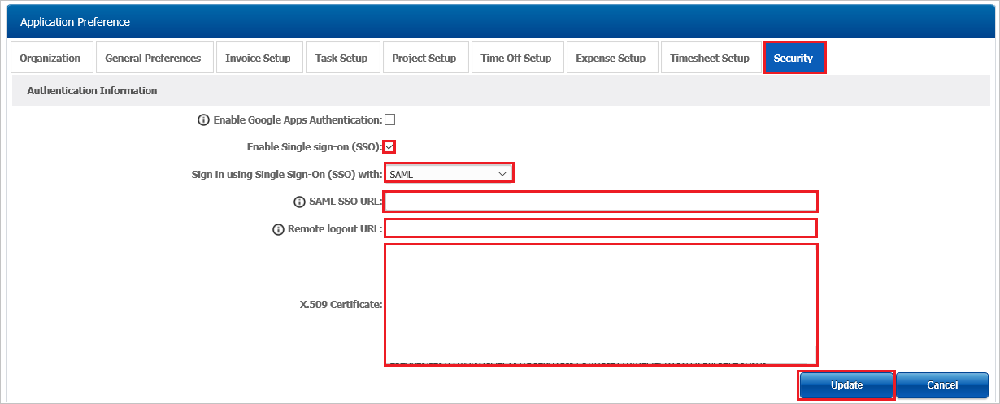

# Tutorial: Azure AD SSO integration with TimeLive

In this tutorial, you'll learn how to integrate TimeLive with Azure Active Directory (Azure AD). When you integrate TimeLive with Azure AD, you can:

* Control in Azure AD who has access to TimeLive.
* Enable your users to be automatically signed-in to TimeLive with their Azure AD accounts.
* Manage your accounts in one central location - the Azure portal.

## Prerequisites

To get started, you need the following items:

* An Azure AD subscription. If you don't have a subscription, you can get a [free account](https://azure.microsoft.com/free/).
* TimeLive single sign-on (SSO) enabled subscription.

## Scenario description

In this tutorial, you configure and test Azure AD single sign-on in a test environment.

* TimeLive supports **SP** initiated SSO.

* TimeLive supports **Just In Time** user provisioning.

## Add TimeLive from the gallery

To configure the integration of TimeLive into Azure AD, you need to add TimeLive from the gallery to your list of managed SaaS apps.

1. Sign in to the Azure portal using either a work or school account, or a personal Microsoft account.
1. On the left navigation pane, select the **Azure Active Directory** service.
1. Navigate to **Enterprise Applications** and then select **All Applications**.
1. To add new application, select **New application**.
1. In the **Add from the gallery** section, type **TimeLive** in the search box.
1. Select **TimeLive** from results panel and then add the app. Wait a few seconds while the app is added to your tenant.

 Alternatively, you can also use the [Enterprise App Configuration Wizard](https://portal.office.com/AdminPortal/home?Q=Docs#/azureadappintegration). In this wizard, you can add an application to your tenant, add users/groups to the app, assign roles, as well as walk through the SSO configuration as well. [Learn more about Microsoft 365 wizards.](/microsoft-365/admin/misc/azure-ad-setup-guides)

## Configure and test Azure AD SSO for TimeLive

Configure and test Azure AD SSO with TimeLive using a test user called **B.Simon**. For SSO to work, you need to establish a link relationship between an Azure AD user and the related user in TimeLive.

To configure and test Azure AD SSO with TimeLive, perform the following steps:

1. **[Configure Azure AD SSO](#configure-azure-ad-sso)** - to enable your users to use this feature.
    1. **[Create an Azure AD test user](#create-an-azure-ad-test-user)** - to test Azure AD single sign-on with B.Simon.
    1. **[Assign the Azure AD test user](#assign-the-azure-ad-test-user)** - to enable B.Simon to use Azure AD single sign-on.
1. **[Configure TimeLive SSO](#configure-timelive-sso)** - to configure the single sign-on settings on application side.
    1. **[Create TimeLive test user](#create-timelive-test-user)** - to have a counterpart of B.Simon in TimeLive that is linked to the Azure AD representation of user.
1. **[Test SSO](#test-sso)** - to verify whether the configuration works.

## Configure Azure AD SSO

Follow these steps to enable Azure AD SSO in the Azure portal.

1. In the Azure portal, on the **TimeLive** application integration page, find the **Manage** section and select **single sign-on**.
1. On the **Select a single sign-on method** page, select **SAML**.
1. On the **Set up single sign-on with SAML** page, click the pencil icon for **Basic SAML Configuration** to edit the settings.

   

4. On the **Basic SAML Configuration** section, perform the following steps:

    a. In the **Identifier (Entity ID)** text box, type a URL using the following pattern:
    `https://<domainname>.livetecs.com/`
	
	b. In the **Sign on URL** text box, type a URL using the following pattern:
    `https://<domainname>.livetecs.com/`

	> [!NOTE]
	> These values are not real. Update these values with the actual Identifier and Sign on URL. Contact [TimeLive Client support team](mailto:support@livetecs.com) to get these values. You can also refer to the patterns shown in the **Basic SAML Configuration** section in the Azure portal.

5. On the **Set up Single Sign-On with SAML** page, in the **SAML Signing Certificate** section, click **Download** to download the **Certificate (Base64)** from the given options as per your requirement and save it on your computer.

	

6. On the **Set up TimeLive** section, copy the appropriate URL(s) as per your requirement.

	

### Create an Azure AD test user 

In this section, you'll create a test user in the Azure portal called B.Simon.

1. From the left pane in the Azure portal, select **Azure Active Directory**, select **Users**, and then select **All users**.
1. Select **New user** at the top of the screen.
1. In the **User** properties, follow these steps:
   1. In the **Name** field, enter `B.Simon`.  
   1. In the **User name** field, enter the username@companydomain.extension. For example, `B.Simon@contoso.com`.
   1. Select the **Show password** check box, and then write down the value that's displayed in the **Password** box.
   1. Click **Create**.

### Assign the Azure AD test user

In this section, you'll enable B.Simon to use Azure single sign-on by granting access to TimeLive.

1. In the Azure portal, select **Enterprise Applications**, and then select **All applications**.
1. In the applications list, select **TimeLive**.
1. In the app's overview page, find the **Manage** section and select **Users and groups**.
1. Select **Add user**, then select **Users and groups** in the **Add Assignment** dialog.
1. In the **Users and groups** dialog, select **B.Simon** from the Users list, then click the **Select** button at the bottom of the screen.
1. If you are expecting a role to be assigned to the users, you can select it from the **Select a role** dropdown. If no role has been set up for this app, you see "Default Access" role selected.
1. In the **Add Assignment** dialog, click the **Assign** button.

## Configure TimeLive SSO

1. In a different web browser window, sign in to your TimeLive company site as an administrator.

2. Select **Preferences** under **Admin Options**.

	

3. In the **Application Preference** section, perform the following steps:
	
	

	a. Select **Security** tab.

	b. Check **Enable Single Sign On (SSO)** checkbox.

	c. Select **SAML** from the drop down menu with heading **Sign in using Single Sign-On (SSO) with**.

	d. In the **SAML SSO URL**, Paste **Login URL** value which you have copied form the Azure portal.

	e. In the **Remote logout URL**, Paste **Logout URL** value which you have copied form the Azure portal.

	f. Open the downloaded **base-64 encoded certificate** from Azure portal in Notepad, copy the content, and then paste it into the **X.509 Certificate** textbox.

	g. Click **Update**.

### Create TimeLive test user

In this section, a user called Britta Simon is created in TimeLive. TimeLive supports just-in-time user provisioning, which is enabled by default. There is no action item for you in this section. If a user doesn't already exist in TimeLive, a new one is created after authentication.

## Test SSO 

In this section, you test your Azure AD single sign-on configuration with following options. 

* Click on **Test this application** in Azure portal. This will redirect to TimeLive Sign-on URL where you can initiate the login flow. 

* Go to TimeLive Sign-on URL directly and initiate the login flow from there.

* You can use Microsoft My Apps. When you click the TimeLive tile in the My Apps, this will redirect to TimeLive Sign-on URL. For more information about the My Apps, see [Introduction to the My Apps](../user-help/my-apps-portal-end-user-access.md).

## Next steps

Once you configure TimeLive you can enforce session control, which protects exfiltration and infiltration of your organization’s sensitive data in real time. Session control extends from Conditional Access. [Learn how to enforce session control with Microsoft Cloud App Security](/cloud-app-security/proxy-deployment-aad).