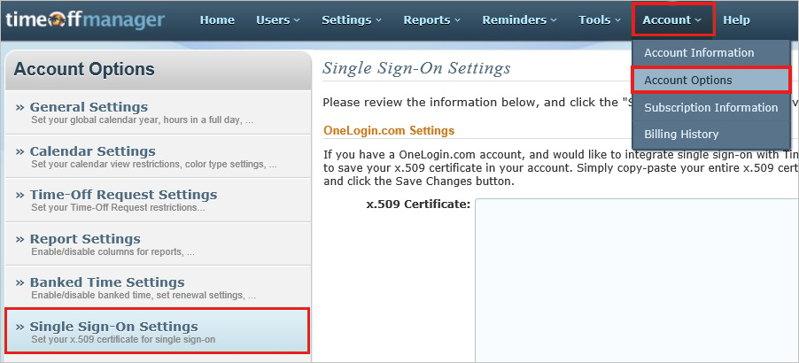
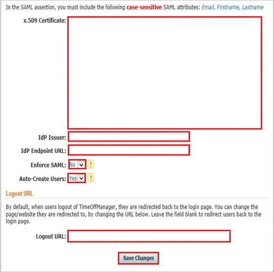
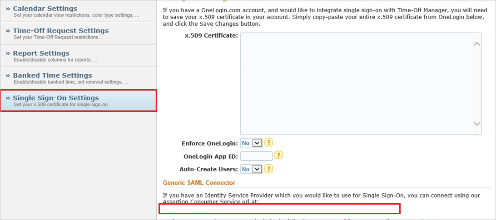

# Tutorial: Microsoft Entra SSO integration with TimeOffManager

In this tutorial, you'll learn how to integrate TimeOffManager with Microsoft Entra ID. When you integrate TimeOffManager with Microsoft Entra ID, you can:

* Control in Microsoft Entra ID who has access to TimeOffManager.
* Enable your users to be automatically signed-in to TimeOffManager with their Microsoft Entra accounts.
* Manage your accounts in one central location.

## Prerequisites

To get started, you need the following items:

* A Microsoft Entra subscription. If you don't have a subscription, you can get a [free account](https://azure.microsoft.com/free/).
* TimeOffManager single sign-on (SSO) enabled subscription.
* Along with Cloud Application Administrator, Application Administrator can also add or manage applications in Microsoft Entra ID.
For more information, see [Azure built-in roles](../roles/permissions-reference.md).

## Scenario description

In this tutorial, you configure and test Microsoft Entra SSO in a test environment.

* TimeOffManager supports **IDP** initiated SSO.

* TimeOffManager supports **Just In Time** user provisioning.

> [!NOTE]
> Identifier of this application is a fixed string value so only one instance can be configured in one tenant.

## Add TimeOffManager from the gallery

To configure the integration of TimeOffManager into Microsoft Entra ID, you need to add TimeOffManager from the gallery to your list of managed SaaS apps.

1. Sign in to the [Microsoft Entra admin center](https://entra.microsoft.com) as at least a [Cloud Application Administrator](../roles/permissions-reference.md#cloud-application-administrator).
1. Browse to **Identity** > **Applications** > **Enterprise applications** > **New application**.
1. In the **Add from the gallery** section, type **TimeOffManager** in the search box.
1. Select **TimeOffManager** from results panel and then add the app. Wait a few seconds while the app is added to your tenant.

 Alternatively, you can also use the [Enterprise App Configuration Wizard](https://portal.office.com/AdminPortal/home?Q=Docs#/azureadappintegration). In this wizard, you can add an application to your tenant, add users/groups to the app, assign roles, as well as walk through the SSO configuration as well. [Learn more about Microsoft 365 wizards.](/microsoft-365/admin/misc/azure-ad-setup-guides)

## Configure and test Microsoft Entra SSO for TimeOffManager

Configure and test Microsoft Entra SSO with TimeOffManager using a test user called **B.Simon**. For SSO to work, you need to establish a link relationship between a Microsoft Entra user and the related user in TimeOffManager.

To configure and test Microsoft Entra SSO with TimeOffManager, perform the following steps:

1. **[Configure Microsoft Entra SSO](#configure-azure-ad-sso)** - to enable your users to use this feature.
    1. **[Create a Microsoft Entra test user](#create-an-azure-ad-test-user)** - to test Microsoft Entra single sign-on with B.Simon.
    1. **[Assign the Microsoft Entra test user](#assign-the-azure-ad-test-user)** - to enable B.Simon to use Microsoft Entra single sign-on.
1. **[Configure TimeOffManager SSO](#configure-timeoffmanager-sso)** - to configure the single sign-on settings on application side.
    1. **[Create TimeOffManager test user](#create-timeoffmanager-test-user)** - to have a counterpart of B.Simon in TimeOffManager that is linked to the Microsoft Entra representation of user.
1. **[Test SSO](#test-sso)** - to verify whether the configuration works.

## Configure Microsoft Entra SSO

Follow these steps to enable Microsoft Entra SSO.

1. Sign in to the [Microsoft Entra admin center](https://entra.microsoft.com) as at least a [Cloud Application Administrator](../roles/permissions-reference.md#cloud-application-administrator).
1. Browse to **Identity** > **Applications** > **Enterprise applications** > **TimeOffManager** > **Single sign-on**.
1. On the **Select a single sign-on method** page, select **SAML**.
1. On the **Set up single sign-on with SAML** page, click the pencil icon for **Basic SAML Configuration** to edit the settings.

   

1. On the **Basic SAML Configuration** section, perform the following step:

    In the **Reply URL** text box, type a URL using the following pattern:
    `https://www.timeoffmanager.com/cpanel/sso/consume.aspx?company_id=<companyid>`

	> [!NOTE]
	> This value is not real. Update this value with the actual Reply URL. You can get this value from **Single Sign on settings page** which is explained later in the tutorial or Contact [TimeOffManager support team](https://www.purelyhr.com/contact-us). You can also refer to the patterns shown in the **Basic SAML Configuration** section.

1. TimeOffManager application expects the SAML assertions in a specific format, which requires you to add custom attribute mappings to your SAML token attributes configuration. The following screenshot shows the list of default attributes.

	

1. In addition to above, TimeOffManager application expects few more attributes to be passed back in SAML response which are shown below. These attributes are also pre populated but you can review them as per your requirement.

	| Name | Source Attribute|
	| --- | --- |
	| Firstname |User.givenname |
	| Lastname |User.surname |
	| Email |User.mail |

1. On the **Set up single sign-on with SAML** page, in the **SAML Signing Certificate** section,  find **Certificate (Base64)** and select **Download** to download the certificate and save it on your computer.

	

1. On the **Set up TimeOffManager** section, copy the appropriate URL(s) based on your requirement.

	

### Create a Microsoft Entra test user

In this section, you'll create a test user called B.Simon.

1. Sign in to the [Microsoft Entra admin center](https://entra.microsoft.com) as at least a [User Administrator](../roles/permissions-reference.md#user-administrator).
1. Browse to **Identity** > **Users** > **All users**.
1. Select **New user** > **Create new user**, at the top of the screen.
1. In the **User** properties, follow these steps:
   1. In the **Display name** field, enter `B.Simon`.  
   1. In the **User principal name** field, enter the username@companydomain.extension. For example, `B.Simon@contoso.com`.
   1. Select the **Show password** check box, and then write down the value that's displayed in the **Password** box.
   1. Select **Review + create**.
1. Select **Create**.

### Assign the Microsoft Entra test user

In this section, you'll enable B.Simon to use single sign-on by granting access to TimeOffManager.

1. Sign in to the [Microsoft Entra admin center](https://entra.microsoft.com) as at least a [Cloud Application Administrator](../roles/permissions-reference.md#cloud-application-administrator).
1. Browse to **Identity** > **Applications** > **Enterprise applications** > **TimeOffManager**.
1. In the app's overview page, find the **Manage** section and select **Users and groups**.
1. Select **Add user**, then select **Users and groups** in the **Add Assignment** dialog.
1. In the **Users and groups** dialog, select **B.Simon** from the Users list, then click the **Select** button at the bottom of the screen.
1. If you're expecting any role value in the SAML assertion, in the **Select Role** dialog, select the appropriate role for the user from the list and then click the **Select** button at the bottom of the screen.
1. In the **Add Assignment** dialog, click the **Assign** button.

## Configure TimeOffManager SSO

1. In a different web browser window, sign into your TimeOffManager company site as an administrator.

2. Go to **Account \> Account Options \> Single Sign-On Settings**.
   
	

3. In the **Single Sign-On Settings** section, perform the following steps:
   
	
   
	a. Open your base-64 encoded certificate in notepad, copy the content of it into your clipboard, and then paste the entire Certificate into **X.509 Certificate** textbox.
   
	b. In **Idp Issuer** textbox, paste the value of **Microsoft Entra Identifier**..
   
	c. In **IdP Endpoint URL** textbox, paste the value of **Login URL**..
   
	d. As **Enforce SAML**, select **No**.
   
	e. As **Auto-Create Users**, select **Yes**.
   
	f. In **Logout URL** textbox, paste the value of **Logout URL**..
   
	g. click **Save Changes**.

4. In **Single Sign on settings** page, copy the value of **Assertion Consumer Service URL** and paste it in the **Reply URL** text box under **Basic SAML Configuration** section in Azure portal. 

    

### Create TimeOffManager test user

In this section, a user called Britta Simon is created in TimeOffManager. TimeOffManager supports just-in-time user provisioning, which is enabled by default. There is no action item for you in this section. If a user doesn't already exist in TimeOffManager, a new one is created after authentication.

>[!NOTE]
>You can use any other TimeOffManager user account creation tools or APIs provided by TimeOffManager to provision Microsoft Entra user accounts.

## Test SSO 

In this section, you test your Microsoft Entra single sign-on configuration with following options.

* Click on **Test this application**, and you should be automatically signed in to the TimeOffManager for which you set up the SSO.

* You can use Microsoft My Apps. When you click the TimeOffManager tile in the My Apps, you should be automatically signed in to the TimeOffManager for which you set up the SSO. For more information, see [Microsoft Entra My Apps](/azure/active-directory/manage-apps/end-user-experiences#azure-ad-my-apps).

## Next steps

Once you configure TimeOffManager you can enforce session control, which protects exfiltration and infiltration of your organization’s sensitive data in real time. Session control extends from Conditional Access. [Learn how to enforce session control with Microsoft Cloud App Security](/cloud-app-security/proxy-deployment-aad).
