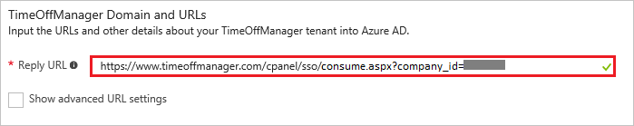
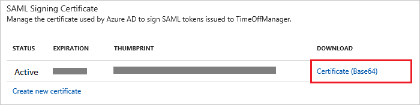

---
title: 'Tutorial: Azure Active Directory integration with TimeOffManager | Microsoft Docs'
description: Learn how to configure single sign-on between Azure Active Directory and TimeOffManager.
services: active-directory
documentationCenter: na
author: jeevansd
manager: mtillman
ms.reviewer: joflore

ms.assetid: 3685912f-d5aa-4730-ab58-35a088fc1cc3
ms.service: active-directory
ms.component: saas-app-tutorial
ms.workload: identity
ms.tgt_pltfrm: na
ms.devlang: na
ms.topic: article
ms.date: 07/27/2017
ms.author: jeedes

---
# Tutorial: Azure Active Directory integration with TimeOffManager

In this tutorial, you learn how to integrate TimeOffManager with Azure Active Directory (Azure AD).

Integrating TimeOffManager with Azure AD provides you with the following benefits:

- You can control in Azure AD who has access to TimeOffManager
- You can enable your users to automatically get signed-on to TimeOffManager (Single Sign-On) with their Azure AD accounts
- You can manage your accounts in one central location - the Azure portal

If you want to know more details about SaaS app integration with Azure AD, see [what is application access and single sign-on with Azure Active Directory](../manage-apps/what-is-single-sign-on.md).

## Prerequisites

To configure Azure AD integration with TimeOffManager, you need the following items:

- An Azure AD subscription
- A TimeOffManager single sign-on enabled subscription

> [!NOTE]
> To test the steps in this tutorial, we do not recommend using a production environment.

To test the steps in this tutorial, you should follow these recommendations:

- Do not use your production environment, unless it is necessary.
- If you don't have an Azure AD trial environment, you can [get a one-month trial](https://azure.microsoft.com/pricing/free-trial/).

## Scenario description
In this tutorial, you test Azure AD single sign-on in a test environment. 
The scenario outlined in this tutorial consists of two main building blocks:

1. Add TimeOffManager from the gallery
1. Configure and test Azure AD single sign-on

## Add TimeOffManager from the gallery
To configure the integration of TimeOffManager into Azure AD, you need to add TimeOffManager from the gallery to your list of managed SaaS apps.

**To add TimeOffManager from the gallery, perform the following steps:**

1. In the **[Azure portal](https://portal.azure.com)**, on the left navigation panel, click **Azure Active Directory** icon. 

	![Active Directory][1]

1. Navigate to **Enterprise applications**. Then go to **All applications**.

	![Applications][2]
	
1. To add new application, click **New application** button on the top of dialog.

	![Applications][3]

1. In the search box, type **TimeOffManager**, select **TimeOffManager** from result panel and then click **Add** button to add the application.

	

##  Configure and test Azure AD single sign-on
In this section, you configure and test Azure AD single sign-on with TimeOffManager based on a test user called "Britta Simon".

For single sign-on to work, Azure AD needs to know what the counterpart user in TimeOffManager is to a user in Azure AD. In other words, a link relationship between an Azure AD user and the related user in TimeOffManager needs to be established.

In TimeOffManager, assign the value of the **user name** in Azure AD as the value of the **Username** to establish the link relationship.

To configure and test Azure AD single sign-on with TimeOffManager, you need to complete the following building blocks:

1. **[Configure Azure AD Single Sign-On](#configure-azure-ad-single-sign-on)** - to enable your users to use this feature.
1. **[Create an Azure AD test user](#create-an-azure-ad-test-user)** - to test Azure AD single sign-on with Britta Simon.
1. **[Create a TimeOffManager test user](#create-a-timeoffmanager-test-user)** - to have a counterpart of Britta Simon in TimeOffManager that is linked to the Azure AD representation of user.
1. **[Assign the Azure AD test user](#assign-the-azure-ad-test-user)** - to enable Britta Simon to use Azure AD single sign-on.
1. **[Test Single Sign-On](#test-single-sign-on)** - to verify whether the configuration works.

### Configure Azure AD single sign-on

In this section, you enable Azure AD single sign-on in the Azure portal and configure single sign-on in your TimeOffManager application.

**To configure Azure AD single sign-on with TimeOffManager, perform the following steps:**

1. In the Azure portal, on the **TimeOffManager** application integration page, click **Single sign-on**.

	![Configure Single Sign-On][4]

1. On the **Single sign-on** dialog, select **Mode** as	**SAML-based Sign-on** to enable single sign-on.
 
	

1. On the **TimeOffManager Domain and URLs** section, perform the following:

	 

	In the **Reply URL** textbox, type a URL using the following pattern: `https://www.timeoffmanager.com/cpanel/sso/consume.aspx?company_id=<companyid>`

	> [!NOTE] 
	> This value is not real. Update this value with the actual Reply URL. You can get this value from **Single Sign on settings page** which is explained later in the tutorial or Contact [TimeOffManager support team](https://www.purelyhr.com/contact-us).
 
1. On the **SAML Signing Certificate** section, click **Certificate (Base64)** and then save the certificate file on your computer.

	 

1. The objective of this section is to outline how to enable users to authenticate to TimeOffManger with their account in Azure AD using federation based on the SAML protocol.
	
	Your TimeOffManger application expects the SAML assertions in a specific format, which requires you to add custom attribute mappings to your SAML token attributes configuration. The following screenshot shows an example for this.

	
	
	| Attribute Name | Attribute Value |
	| --- | --- |
	| Firstname |User.givenname |
	| Lastname |User.surname |
	| Email |User.mail |
	
	a.  For each data row in the table above, click **add user attribute**.
	
	
	
	
	
	b.  In the **Attribute Name** textbox, type the attribute name shown for that row.
	
	c.  In the **Attribute Value** textbox, select the attribute  value shown for that row.
	
	d.  Click **Ok**.
	
1. Click **Save** button.

	

1. On the **TimeOffManager Configuration** section, click **Configure TimeOffManager** to open **Configure sign-on** window. Copy the **Sign-Out URL, SAML Entity ID, and SAML Single Sign-On Service URL** from the **Quick Reference section.**

	 

1. In a different web browser window, log into your TimeOffManager company site as an administrator.

1. Go to **Account \> Account Options \> Single Sign-On Settings**.
   
   
1. In the **Single Sign-On Settings** section, perform the following steps:
   
   
   
   a. Open your base-64 encoded certificate in notepad, copy the content of it into your clipboard, and then paste the entire Certificate into **X.509 Certificate** textbox.
   
   b. In **Idp Issuer** textbox, paste the value of **SAML Entity ID** which you have copied from Azure portal.
   
   c. In **IdP Endpoint URL** textbox, paste the value of **SAML Single Sign-On Service URL** which you have copied from Azure portal.
   
   d. As **Enforce SAML**, select **No**.
   
   e. As **Auto-Create Users**, select **Yes**.
   
   f. In **Logout URL** textbox, paste the value of **Sign-Out URL** which you have copied from Azure portal.
   
   g. click **Save Changes**.

1. In **Single Sign on settings** page, copy the value of **Assertion Consumer Service URL** and paste it in the **Reply URL** text box under **TimeOffManager Domain and URLs** section in Azure portal. 

	  

> [!TIP]
> You can now read a concise version of these instructions inside the [Azure portal](https://portal.azure.com), while you are setting up the app!  After adding this app from the **Active Directory > Enterprise Applications** section, simply click the **Single Sign-On** tab and access the embedded documentation through the **Configuration** section at the bottom. You can read more about the embedded documentation feature here: [Azure AD embedded documentation]( https://go.microsoft.com/fwlink/?linkid=845985)
> 

### Create an Azure AD test user
The objective of this section is to create a test user in the Azure portal called Britta Simon.

![Create Azure AD User][100]

**To create a test user in Azure AD, perform the following steps:**

1. In the **Azure portal**, on the left navigation pane, click **Azure Active Directory** icon.

	 

1. To display the list of users, go to **Users and groups** and click **All users**.
	
	 

1. To open the **User** dialog, click **Add** on the top of the dialog.
 
	 

1. On the **User** dialog page, perform the following steps:
 
	 

    a. In the **Name** textbox, type **BrittaSimon**.

    b. In the **User name** textbox, type the **email address** of BrittaSimon.

	c. Select **Show Password** and write down the value of the **Password**.

    d. Click **Create**.
 
### Create a TimeOffManager test user

In order to enable Azure AD users to log into TimeOffManager, they must be provisioned to TimeOffManager.  

TimeOffManager supports just in time user provisioning. There is no action item for you.  

The users are added automatically during the first login using single sign on.

>[!NOTE]
>You can use any other TimeOffManager user account creation tools or APIs provided by TimeOffManager to provision Azure AD user accounts.
> 

### Assign the Azure AD test user

In this section, you enable Britta Simon to use Azure single sign-on by granting access to TimeOffManager.

![Assign User][200] 

**To assign Britta Simon to TimeOffManager, perform the following steps:**

1. In the Azure portal, open the applications view, and then navigate to the directory view and go to **Enterprise applications** then click **All applications**.

	![Assign User][201] 

1. In the applications list, select **TimeOffManager**.

	 

1. In the menu on the left, click **Users and groups**.

	![Assign User][202] 

1. Click **Add** button. Then select **Users and groups** on **Add Assignment** dialog.

	![Assign User][203]

1. On **Users and groups** dialog, select **Britta Simon** in the Users list.

1. Click **Select** button on **Users and groups** dialog.

1. Click **Assign** button on **Add Assignment** dialog.
	
### Test single sign-on

In this section, you test your Azure AD single sign-on configuration using the Access Panel.

When you click the TimeOffManager tile in the Access Panel, you should get automatically signed-on to your TimeOffManager application. For more information about the Access Panel, see [Introduction to the Access Panel](../user-help/active-directory-saas-access-panel-introduction.md).

## Additional resources

* [List of Tutorials on How to Integrate SaaS Apps with Azure Active Directory](tutorial-list.md)
* [What is application access and single sign-on with Azure Active Directory?](../manage-apps/what-is-single-sign-on.md)

<!--Image references-->

[1]: ./media/timeoffmanager-tutorial/tutorial_general_01.png
[2]: ./media/timeoffmanager-tutorial/tutorial_general_02.png
[3]: ./media/timeoffmanager-tutorial/tutorial_general_03.png
[4]: ./media/timeoffmanager-tutorial/tutorial_general_04.png

[100]: ./media/timeoffmanager-tutorial/tutorial_general_100.png

[200]: ./media/timeoffmanager-tutorial/tutorial_general_200.png
[201]: ./media/timeoffmanager-tutorial/tutorial_general_201.png
[202]: ./media/timeoffmanager-tutorial/tutorial_general_202.png
[203]: ./media/timeoffmanager-tutorial/tutorial_general_203.png

