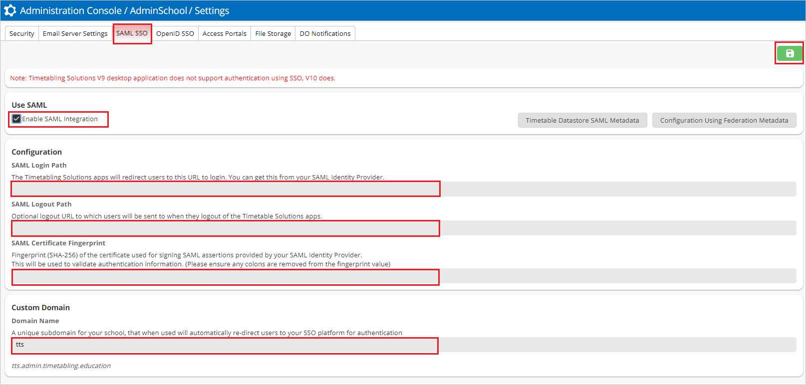

# Tutorial: Microsoft Entra SSO integration with Timetabling Solutions

In this tutorial, you'll learn how to integrate Timetabling Solutions with Microsoft Entra ID. When you integrate Timetabling Solutions with Microsoft Entra ID, you can:

* Control in Microsoft Entra ID who has access to Timetabling Solutions.
* Enable your users to be automatically signed-in to Timetabling Solutions with their Microsoft Entra accounts.
* Manage your accounts in one central location.

## Prerequisites

To get started, you need the following items:

* A Microsoft Entra subscription. If you don't have a subscription, you can get a [free account](https://azure.microsoft.com/free/).
* Timetabling Solutions single sign-on (SSO) enabled subscription.
* Along with Cloud Application Administrator, Application Administrator can also add or manage applications in Microsoft Entra ID.
For more information, see [Azure built-in roles](../roles/permissions-reference.md).

## Scenario description

In this tutorial, you configure and test Microsoft Entra SSO in a test environment.

* Timetabling Solutions supports **SP** initiated SSO.

> [!NOTE]
> Identifier of this application is a fixed string value so only one instance can be configured in one tenant.

## Add Timetabling Solutions from the gallery

To configure the integration of Timetabling Solutions into Microsoft Entra ID, you need to add Timetabling Solutions from the gallery to your list of managed SaaS apps.

1. Sign in to the [Microsoft Entra admin center](https://entra.microsoft.com) as at least a [Cloud Application Administrator](../roles/permissions-reference.md#cloud-application-administrator).
1. Browse to **Identity** > **Applications** > **Enterprise applications** > **New application**.
1. In the **Add from the gallery** section, type **Timetabling Solutions** in the search box.
1. Select **Timetabling Solutions** from results panel and then add the app. Wait a few seconds while the app is added to your tenant.

## Configure and test Microsoft Entra SSO for Timetabling Solutions

Configure and test Microsoft Entra SSO with Timetabling Solutions using a test user called **B.Simon**. For SSO to work, you need to establish a link relationship between a Microsoft Entra user and the related user in Timetabling Solutions.

To configure and test Microsoft Entra SSO with Timetabling Solutions, perform the following steps:

1. **[Configure Microsoft Entra SSO](#configure-azure-ad-sso)** - to enable your users to use this feature.
    1. **[Create a Microsoft Entra test user](#create-an-azure-ad-test-user)** - to test Microsoft Entra single sign-on with B.Simon.
    1. **[Assign the Microsoft Entra test user](#assign-the-azure-ad-test-user)** - to enable B.Simon to use Microsoft Entra single sign-on.
1. **[Configure Timetabling Solutions SSO](#configure-timetabling-solutions-sso)** - to configure the single sign-on settings on application side.
    1. **[Create Timetabling Solutions test user](#create-timetabling-solutions-test-user)** - to have a counterpart of B.Simon in Timetabling Solutions that is linked to the Microsoft Entra representation of user.
1. **[Test SSO](#test-sso)** - to verify whether the configuration works.

## Configure Microsoft Entra SSO

Follow these steps to enable Microsoft Entra SSO.

1. Sign in to the [Microsoft Entra admin center](https://entra.microsoft.com) as at least a [Cloud Application Administrator](../roles/permissions-reference.md#cloud-application-administrator).
1. Browse to **Identity** > **Applications** > **Enterprise applications** > **Timetabling Solutions** > **Single sign-on**.
1. On the **Select a single sign-on method** page, select **SAML**.
1. On the **Set up single sign-on with SAML** page, click the pencil icon for **Basic SAML Configuration** to edit the settings.

   

1. On the **Basic SAML Configuration** section, perform the following step:

    In the **Sign-on URL** text box, type the URL:
    `https://auth.timetabling.education/login`

1. In the **SAML Signing Certificate** section, click **Edit** button to open **SAML Signing Certificate** dialog.

	

1. In the **SAML Signing Certificate** section, copy the **Thumbprint Value** and save it on your computer.

    

1. On the **Set up Timetabling Solutions** section, copy the appropriate URL(s) based on your requirement.

	

### Create a Microsoft Entra test user

In this section, you'll create a test user called B.Simon.

1. Sign in to the [Microsoft Entra admin center](https://entra.microsoft.com) as at least a [User Administrator](../roles/permissions-reference.md#user-administrator).
1. Browse to **Identity** > **Users** > **All users**.
1. Select **New user** > **Create new user**, at the top of the screen.
1. In the **User** properties, follow these steps:
   1. In the **Display name** field, enter `B.Simon`.  
   1. In the **User principal name** field, enter the username@companydomain.extension. For example, `B.Simon@contoso.com`.
   1. Select the **Show password** check box, and then write down the value that's displayed in the **Password** box.
   1. Select **Review + create**.
1. Select **Create**.

### Assign the Microsoft Entra test user

In this section, you'll enable B.Simon to use single sign-on by granting access to Timetabling Solutions.

1. Sign in to the [Microsoft Entra admin center](https://entra.microsoft.com) as at least a [Cloud Application Administrator](../roles/permissions-reference.md#cloud-application-administrator).
1. Browse to **Identity** > **Applications** > **Enterprise applications** > **Timetabling Solutions**.
1. In the app's overview page, find the **Manage** section and select **Users and groups**.
1. Select **Add user**, then select **Users and groups** in the **Add Assignment** dialog.
1. In the **Users and groups** dialog, select **B.Simon** from the Users list, then click the **Select** button at the bottom of the screen.
1. If you're expecting any role value in the SAML assertion, in the **Select Role** dialog, select the appropriate role for the user from the list and then click the **Select** button at the bottom of the screen.
1. In the **Add Assignment** dialog, click the **Assign** button.

## Configure Timetabling Solutions SSO

In this section, you'll populate the relevant SSO values in the Timetabling Solutions Administration Console.

1. In the [Administration Console](https://admin.timetabling.education/), select **5 Settings**, and then select the **SAML SSO** tab.
1. Perform the following steps in the **SAML SSO** section:
 
    

    a. Enable SAML Integration.

    b. In the **SAML Login Path** textbox, paste the **Login URL** value, which you copied previously.

    c. In the **SAML Logout Path** textbox, paste the **Logout URL** value, which you copied previously.

    d. In the **SAML Certificate Fingerprint** textbox, paste the **Thumbprint Value**, which you copied previously.

    e. Enter the **Custom Domain** name.
    
    f. **Save** the settings. 

## Create Timetabling Solutions test user

In this section, you create a user called Britta Simon in the Timetabling Solutions Administration Console. 

1. In the [Administration Console](https://admin.timetabling.education/), select **1 Manage Users**, and click **Add**.
2. Enter the mandatory fields **First Name**, **Family Name** and **Email Address**. Add other appropriate values in the non-mandatory fields.
3. Ensure **Online** is active in Status.
4. Click **Save and Next**.

> [!NOTE]
> To add the users in the Timetabling Solutions platform. Users must be created and activated before you use single sign-on.

## Test SSO 

In this section, you test your Microsoft Entra single sign-on configuration with following options. 

* Click on **Test this application**, this will redirect to Timetabling Solutions Sign-On URL where you can initiate the login flow. 

* Go to Timetabling Solutions Sign-On URL directly and initiate the login flow from there.

* You can use Microsoft My Apps. When you click the Timetabling Solutions tile in the My Apps, this will redirect to Timetabling Solutions Sign-On URL. For more information, see [Microsoft Entra My Apps](/azure/active-directory/manage-apps/end-user-experiences#azure-ad-my-apps).

## Next steps

Once you configure Timetabling Solutions you can enforce session control, which protects exfiltration and infiltration of your organization’s sensitive data in real time. Session control extends from Conditional Access. [Learn how to enforce session control with Microsoft Cloud App Security](/cloud-app-security/proxy-deployment-aad).
