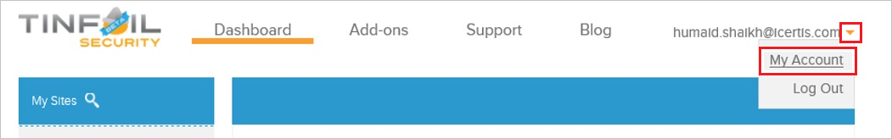

# Tutorial: Azure Active Directory integration with TINFOIL SECURITY

In this tutorial, you learn how to integrate TINFOIL SECURITY with Azure Active Directory (Azure AD).
Integrating TINFOIL SECURITY with Azure AD provides you with the following benefits:

* You can control in Azure AD who has access to TINFOIL SECURITY.
* You can enable your users to be automatically signed-in to TINFOIL SECURITY (Single Sign-On) with their Azure AD accounts.
* You can manage your accounts in one central location - the Azure portal.

If you want to know more details about SaaS app integration with Azure AD, see [What is application access and single sign-on with Azure Active Directory](https://docs.microsoft.com/azure/active-directory/active-directory-appssoaccess-whatis).
If you don't have an Azure subscription, [create a free account](https://azure.microsoft.com/free/) before you begin.

## Prerequisites

To configure Azure AD integration with TINFOIL SECURITY, you need the following items:

* An Azure AD subscription. If you don't have an Azure AD environment, you can get one-month trial [here](https://azure.microsoft.com/pricing/free-trial/)
* TINFOIL SECURITY single sign-on enabled subscription

## Scenario description

In this tutorial, you configure and test Azure AD single sign-on in a test environment.

* TINFOIL SECURITY supports **IDP** initiated SSO

## Adding TINFOIL SECURITY from the gallery

To configure the integration of TINFOIL SECURITY into Azure AD, you need to add TINFOIL SECURITY from the gallery to your list of managed SaaS apps.

**To add TINFOIL SECURITY from the gallery, perform the following steps:**

1. In the **[Azure portal](https://portal.azure.com)**, on the left navigation panel, click **Azure Active Directory** icon.

	

2. Navigate to **Enterprise Applications** and then select the **All Applications** option.

	

3. To add new application, click **New application** button on the top of dialog.

	

4. In the search box, type **TINFOIL SECURITY**, select **TINFOIL SECURITY** from result panel then click **Add** button to add the application.

	 

## Configure and test Azure AD single sign-on

In this section, you configure and test Azure AD single sign-on with TINFOIL SECURITY based on a test user called **Britta Simon**.
For single sign-on to work, a link relationship between an Azure AD user and the related user in TINFOIL SECURITY needs to be established.

To configure and test Azure AD single sign-on with TINFOIL SECURITY, you need to complete the following building blocks:

1. **[Configure Azure AD Single Sign-On](#configure-azure-ad-single-sign-on)** - to enable your users to use this feature.
2. **[Configure TINFOIL SECURITY Single Sign-On](#configure-tinfoil-security-single-sign-on)** - to configure the Single Sign-On settings on application side.
3. **[Create an Azure AD test user](#create-an-azure-ad-test-user)** - to test Azure AD single sign-on with Britta Simon.
4. **[Assign the Azure AD test user](#assign-the-azure-ad-test-user)** - to enable Britta Simon to use Azure AD single sign-on.
5. **[Create TINFOIL SECURITY test user](#create-tinfoil-security-test-user)** - to have a counterpart of Britta Simon in TINFOIL SECURITY that is linked to the Azure AD representation of user.
6. **[Test single sign-on](#test-single-sign-on)** - to verify whether the configuration works.

### Configure Azure AD single sign-on

In this section, you enable Azure AD single sign-on in the Azure portal.

To configure Azure AD single sign-on with TINFOIL SECURITY, perform the following steps:

1. In the [Azure portal](https://portal.azure.com/), on the **TINFOIL SECURITY** application integration page, select **Single sign-on**.

    

2. On the **Select a Single sign-on method** dialog, select **SAML/WS-Fed** mode to enable single sign-on.

    

3. On the **Set up Single Sign-On with SAML** page, click **Edit** icon to open **Basic SAML Configuration** dialog.

	

4. On the **Basic SAML Configuration** section, the user does not have to perform any step as the app is already pre-integrated with Azure.

    

5. Your TINFOIL SECURITY application expects the SAML assertions in a specific format, which requires you to add custom attribute mappings to your SAML token attributes configuration. The following screenshot shows the list of default attributes. Click **Edit** icon to open **User Attributes** dialog.

	    

6. In addition to above, TINFOIL SECURITY application expects few more attributes to be passed back in SAML response. In the **User Claims** section on the **User Attributes** dialog, perform the following steps to add SAML token attribute as shown in the below table:

	| Name | Source Attribute |
	| ------------------- | -------------|
	| accountid | UXXXXXXXXXXXXX |

	a. Click **Add new claim** to open the **Manage user claims** dialog.

	

	

	b. In the **Name** textbox, type the attribute name shown for that row.

	c. Leave the **Namespace** blank.

	d. Select Source as **Attribute**.

	e. In the **Source attribute** textbox, paste the account ID value which you will get later on the tutorial.

	f. Click **Ok**

	g. Click **Save**.

7. In the **SAML Signing Certificate** section, click **Edit** button to open **SAML Signing Certificate** dialog.

	

8. In the **SAML Signing Certificate** section, copy the **Thumbprint** and save it on your computer.

    

9. On the **Set up TINFOIL SECURITY** section, copy the appropriate URL(s) as per your requirement.

	

	a. Login URL

	b. Azure AD Identifier

	c. Logout URL

### Configure TINFOIL SECURITY Single Sign-On

1. In a different web browser window, sign into your TINFOIL SECURITY company site as an administrator.

2. In the toolbar on the top, click **My Account**.
   
    

3. Click **Security**.
   
    

4. On the **Single Sign-On** configuration page, perform the following steps:
   
    
   
    a. Select **Enable SAML**.
   
    b. Click **Manual Configuration**.
   
    c. In **SAML Post URL** textbox, paste the value of **Login URL** which you have copied from Azure portal
   
    d. In **SAML Certificate Fingerprint** textbox, paste the value of **Thumbprint** which you have copied from **SAML Signing Certificate** section.
  
    e. Copy **Your Account ID** value and paste the value in **Attribute Value** textbox under **Add Attribute** section in Azure portal.
   
    f. Click **Save**.

### Create an Azure AD test user 

The objective of this section is to create a test user in the Azure portal called Britta Simon.

1. In the Azure portal, in the left pane, select **Azure Active Directory**, select **Users**, and then select **All users**.

    

2. Select **New user** at the top of the screen.

    

3. In the User properties, perform the following steps.

    

    a. In the **Name** field enter **BrittaSimon**.
  
    b. In the **User name** field type brittasimon@yourcompanydomain.extension. For example, BrittaSimon@contoso.com

    c. Select **Show password** check box, and then write down the value that's displayed in the Password box.

    d. Click **Create**.

### Assign the Azure AD test user

In this section, you enable Britta Simon to use Azure single sign-on by granting access to TINFOIL SECURITY.

1. In the Azure portal, select **Enterprise Applications**, select **All applications**, then select **TINFOIL SECURITY**.

	

2. In the applications list, select **TINFOIL SECURITY**.

	

3. In the menu on the left, select **Users and groups**.

    

4. Click the **Add user** button, then select **Users and groups** in the **Add Assignment** dialog.

    

5. In the **Users and groups** dialog select **Britta Simon** in the Users list, then click the **Select** button at the bottom of the screen.

6. If you are expecting any role value in the SAML assertion then in the **Select Role** dialog select the appropriate role for the user from the list, then click the **Select** button at the bottom of the screen.

7. In the **Add Assignment** dialog click the **Assign** button.

### Create TINFOIL SECURITY test user

In order to enable Azure AD users to sign in to TINFOIL SECURITY, they must be provisioned into TINFOIL SECURITY. In the case of TINFOIL SECURITY, provisioning is a manual task.

**To get a user provisioned, perform the following steps:**

1. If the user is a part of an Enterprise account, you need to [contact the TINFOIL SECURITY support team](https://www.tinfoilsecurity.com/contact) to get the user account created.

1. If the user is a regular TINFOIL SECURITY SaaS user, then the user can add a collaborator to any of the user’s sites. This triggers a process to send an invitation to the specified email to create a new TINFOIL SECURITY user account.

> [!NOTE]
> You can use any other TINFOIL SECURITY user account creation tools or APIs provided by TINFOIL SECURITY to provision Azure AD user accounts.
> 

### Test single sign-on 

In this section, you test your Azure AD single sign-on configuration using the Access Panel.

When you click the TINFOIL SECURITY tile in the Access Panel, you should be automatically signed in to the TINFOIL SECURITY for which you set up SSO. For more information about the Access Panel, see [Introduction to the Access Panel](https://docs.microsoft.com/azure/active-directory/active-directory-saas-access-panel-introduction).

## Additional Resources

- [List of Tutorials on How to Integrate SaaS Apps with Azure Active Directory](https://docs.microsoft.com/azure/active-directory/active-directory-saas-tutorial-list)

- [What is application access and single sign-on with Azure Active Directory?](https://docs.microsoft.com/azure/active-directory/active-directory-appssoaccess-whatis)

- [What is Conditional Access in Azure Active Directory?](https://docs.microsoft.com/azure/active-directory/conditional-access/overview)

