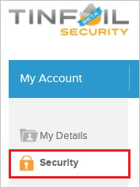
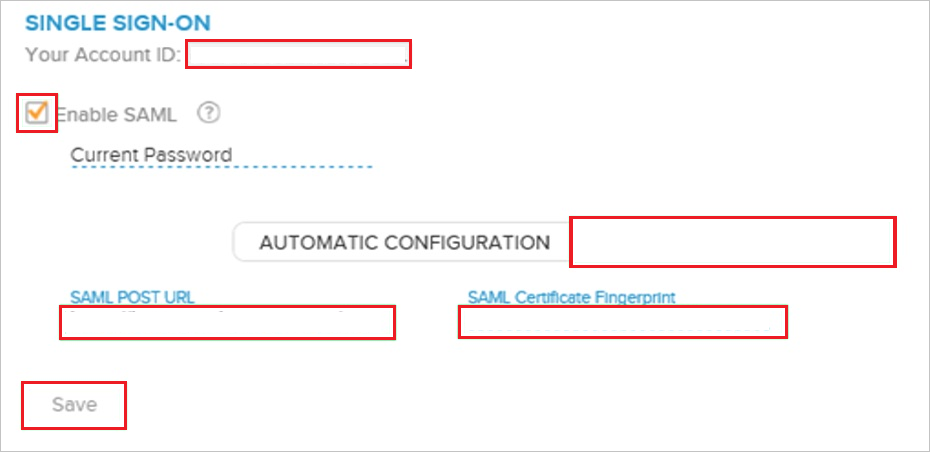

# Tutorial: Azure AD SSO integration with TINFOIL SECURITY

In this tutorial, you'll learn how to integrate TINFOIL SECURITY with Azure Active Directory (Azure AD). When you integrate TINFOIL SECURITY with Azure AD, you can:

* Control in Azure AD who has access to TINFOIL SECURITY.
* Enable your users to be automatically signed-in to TINFOIL SECURITY with their Azure AD accounts.
* Manage your accounts in one central location - the Azure portal.

## Prerequisites

To get started, you need the following items:

* An Azure AD subscription. If you don't have a subscription, you can get a [free account](https://azure.microsoft.com/free/).
* TINFOIL SECURITY single sign-on (SSO) enabled subscription.

## Scenario description

In this tutorial, you configure and test Azure AD SSO in a test environment.

* TINFOIL SECURITY supports **IDP** initiated SSO.

> [!NOTE]
> Identifier of this application is a fixed string value so only one instance can be configured in one tenant.

## Add TINFOIL SECURITY from the gallery

To configure the integration of TINFOIL SECURITY into Azure AD, you need to add TINFOIL SECURITY from the gallery to your list of managed SaaS apps.

1. Sign in to the Azure portal using either a work or school account, or a personal Microsoft account.
1. On the left navigation pane, select the **Azure Active Directory** service.
1. Navigate to **Enterprise Applications** and then select **All Applications**.
1. To add new application, select **New application**.
1. In the **Add from the gallery** section, type **TINFOIL SECURITY** in the search box.
1. Select **TINFOIL SECURITY** from results panel and then add the app. Wait a few seconds while the app is added to your tenant.

 Alternatively, you can also use the [Enterprise App Configuration Wizard](https://portal.office.com/AdminPortal/home?Q=Docs#/azureadappintegration). In this wizard, you can add an application to your tenant, add users/groups to the app, assign roles, as well as walk through the SSO configuration as well. [Learn more about Microsoft 365 wizards.](/microsoft-365/admin/misc/azure-ad-setup-guides)

## Configure and test Azure AD SSO for TINFOIL SECURITY

Configure and test Azure AD SSO with TINFOIL SECURITY using a test user called **B.Simon**. For SSO to work, you need to establish a link relationship between an Azure AD user and the related user in TINFOIL SECURITY.

To configure and test Azure AD SSO with TINFOIL SECURITY, perform the following steps:

1. **[Configure Azure AD SSO](#configure-azure-ad-sso)** - to enable your users to use this feature.
    1. **[Create an Azure AD test user](#create-an-azure-ad-test-user)** - to test Azure AD single sign-on with B.Simon.
    1. **[Assign the Azure AD test user](#assign-the-azure-ad-test-user)** - to enable B.Simon to use Azure AD single sign-on.
1. **[Configure TINFOIL SECURITY SSO](#configure-tinfoil-security-sso)** - to configure the single sign-on settings on application side.
    1. **[Create TINFOIL SECURITY test user](#create-tinfoil-security-test-user)** - to have a counterpart of B.Simon in TINFOIL SECURITY that is linked to the Azure AD representation of user.
1. **[Test SSO](#test-sso)** - to verify whether the configuration works.

## Configure Azure AD SSO

Follow these steps to enable Azure AD SSO in the Azure portal.

1. In the Azure portal, on the **TINFOIL SECURITY** application integration page, find the **Manage** section and select **single sign-on**.
1. On the **Select a single sign-on method** page, select **SAML**.
1. On the **Set up single sign-on with SAML** page, click the pencil icon for **Basic SAML Configuration** to edit the settings.

   

1. On the **Basic SAML Configuration** section, the application is pre-configured and the necessary URLs are already pre-populated with Azure. The user needs to save the configuration by clicking the **Save** button.

1. Visitly application expects the SAML assertions in a specific format, which requires you to add custom attribute mappings to your SAML token attributes configuration. The following screenshot shows the list of default attributes.

	

1. In addition to above, Visitly application expects few more attributes to be passed back in SAML response which are shown below. These attributes are also pre populated but you can review them as per your requirements.

	| Name | Source Attribute |
	| ------------------- | -------------|
	| accountid | UXXXXXXXXXXXXX |

	> [!NOTE]
	> You will get the accountid value explained later in the tutorial.

1. In the **SAML Signing Certificate** section, click **Edit** button to open **SAML Signing Certificate** dialog.

	

1. In the **SAML Signing Certificate** section, copy the **Thumbprint Value** and save it on your computer.

    

1. On the **Set up TINFOIL SECURITY** section, copy the appropriate URL(s) based on your requirement.

	

### Create an Azure AD test user

In this section, you'll create a test user in the Azure portal called B.Simon.

1. From the left pane in the Azure portal, select **Azure Active Directory**, select **Users**, and then select **All users**.
1. Select **New user** at the top of the screen.
1. In the **User** properties, follow these steps:
   1. In the **Name** field, enter `B.Simon`.  
   1. In the **User name** field, enter the username@companydomain.extension. For example, `B.Simon@contoso.com`.
   1. Select the **Show password** check box, and then write down the value that's displayed in the **Password** box.
   1. Click **Create**.

### Assign the Azure AD test user

In this section, you'll enable B.Simon to use Azure single sign-on by granting access to TINFOIL SECURITY.

1. In the Azure portal, select **Enterprise Applications**, and then select **All applications**.
1. In the applications list, select **TINFOIL SECURITY**.
1. In the app's overview page, find the **Manage** section and select **Users and groups**.
1. Select **Add user**, then select **Users and groups** in the **Add Assignment** dialog.
1. In the **Users and groups** dialog, select **B.Simon** from the Users list, then click the **Select** button at the bottom of the screen.
1. If you're expecting any role value in the SAML assertion, in the **Select Role** dialog, select the appropriate role for the user from the list and then click the **Select** button at the bottom of the screen.
1. In the **Add Assignment** dialog, click the **Assign** button.

## Configure TINFOIL SECURITY SSO

1. In a different web browser window, sign into your TINFOIL SECURITY company site as an administrator.

1. In the toolbar on the top, click **My Account**.

    

1. Click **Security**.

    

1. On the **Single Sign-On** configuration page, perform the following steps:

    

    a. Select **Enable SAML**.

    b. Click **Manual Configuration**.

    c. In **SAML Post URL** textbox, paste the value of **Login URL** which you have copied from Azure portal

    d. In **SAML Certificate Fingerprint** textbox, paste the value of **Thumbprint** which you have copied from **SAML Signing Certificate** section.
  
    e. Copy **Your Account ID** value and paste the value in **Source Attribute** textbox under **User Attributes & Claims** section in Azure portal.

    f. Click **Save**.

### Create TINFOIL SECURITY test user

In order to enable Azure AD users to sign in to TINFOIL SECURITY, they must be provisioned into TINFOIL SECURITY. In the case of TINFOIL SECURITY, provisioning is a manual task.

**To get a user provisioned, perform the following steps:**

1. If the user is a part of an Enterprise account, you need to [contact the TINFOIL SECURITY support team](https://www.tinfoilsecurity.com/contact) to get the user account created.

1. If the user is a regular TINFOIL SECURITY SaaS user, then the user can add a collaborator to any of the user’s sites. This triggers a process to send an invitation to the specified email to create a new TINFOIL SECURITY user account.

> [!NOTE]
> You can use any other TINFOIL SECURITY user account creation tools or APIs provided by TINFOIL SECURITY to provision Azure AD user accounts.

## Test SSO

In this section, you test your Azure AD single sign-on configuration with following options.

* Click on Test this application in Azure portal and you should be automatically signed in to the TINFOIL SECURITY for which you set up the SSO.

* You can use Microsoft My Apps. When you click the TINFOIL SECURITY tile in the My Apps, you should be automatically signed in to the TINFOIL SECURITY for which you set up the SSO. For more information about the My Apps, see [Introduction to the My Apps](../user-help/my-apps-portal-end-user-access.md).

## Next steps

Once you configure TINFOIL SECURITY you can enforce session control, which protects exfiltration and infiltration of your organization’s sensitive data in real time. Session control extends from Conditional Access. [Learn how to enforce session control with Microsoft Defender for Cloud Apps](/cloud-app-security/proxy-deployment-aad).
