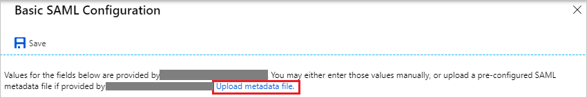
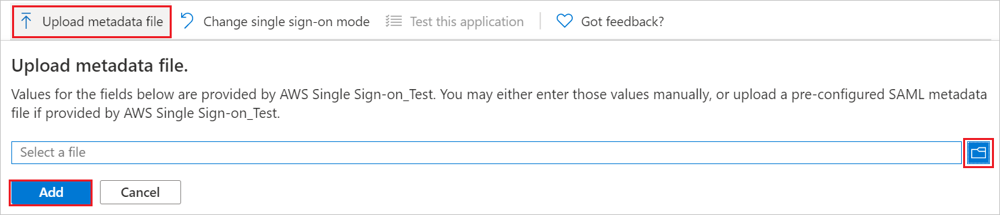
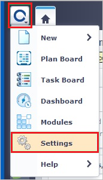
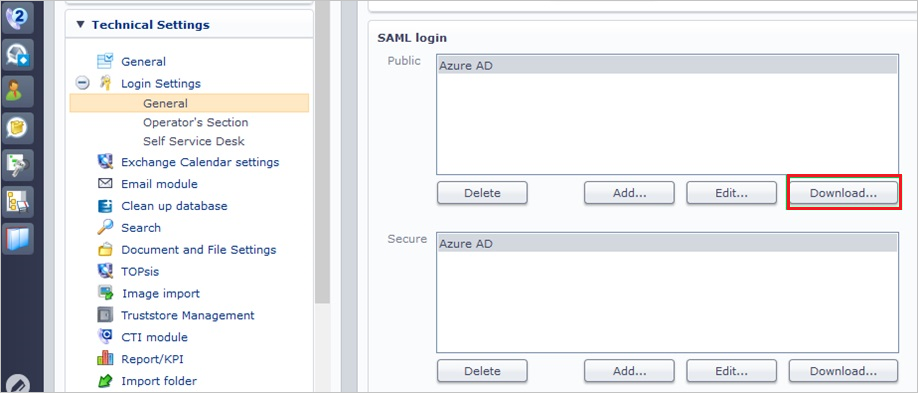
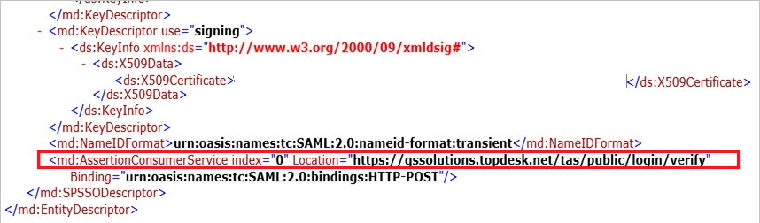
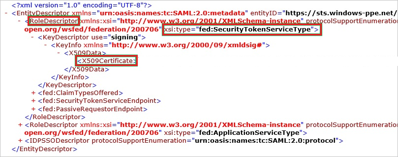
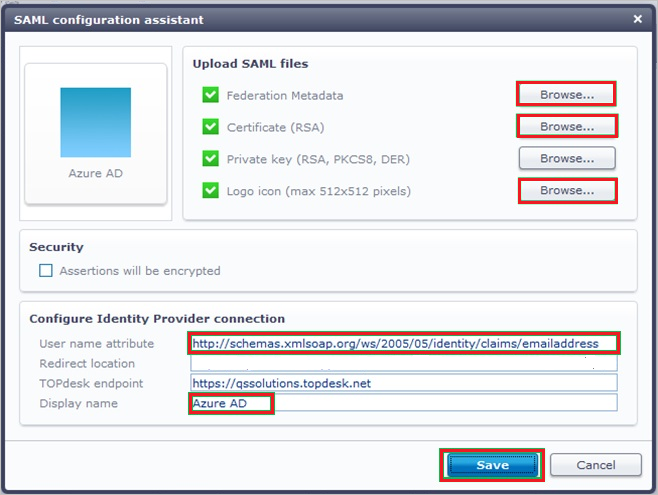
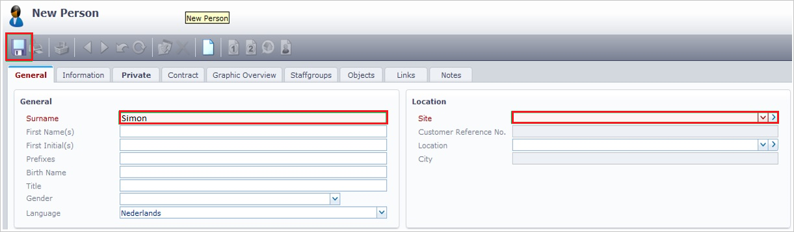

# Tutorial: Microsoft Entra integration with TOPdesk - Public

In this tutorial, you'll learn how to integrate TOPdesk - Public with Microsoft Entra ID. When you integrate TOPdesk - Public with Microsoft Entra ID, you can:

* Control in Microsoft Entra ID who has access to TOPdesk - Public.
* Enable your users to be automatically signed-in to TOPdesk - Public with their Microsoft Entra accounts.
* Manage your accounts in one central location.

## Prerequisites

To get started, you need the following items:

* A Microsoft Entra subscription. If you don't have a subscription, you can get a [free account](https://azure.microsoft.com/free/).
* TOPdesk - Public single sign-on (SSO) enabled subscription.

## Scenario description

In this tutorial, you configure and test Microsoft Entra single sign-on in a test environment.

* TOPdesk - Public supports **SP** initiated SSO.

## Add TOPdesk - Public from the gallery

To configure the integration of TOPdesk - Public into Microsoft Entra ID, you need to add TOPdesk - Public from the gallery to your list of managed SaaS apps.

1. Sign in to the [Microsoft Entra admin center](https://entra.microsoft.com) as at least a [Cloud Application Administrator](../roles/permissions-reference.md#cloud-application-administrator).
1. Browse to **Identity** > **Applications** > **Enterprise applications** > **New application**.
1. In the **Add from the gallery** section, type **TOPdesk - Public** in the search box.
1. Select **TOPdesk - Public** from results panel and then add the app. Wait a few seconds while the app is added to your tenant.

 Alternatively, you can also use the [Enterprise App Configuration Wizard](https://portal.office.com/AdminPortal/home?Q=Docs#/azureadappintegration). In this wizard, you can add an application to your tenant, add users/groups to the app, assign roles, as well as walk through the SSO configuration as well. [Learn more about Microsoft 365 wizards.](/microsoft-365/admin/misc/azure-ad-setup-guides)

## Configure and test Microsoft Entra SSO for TOPdesk - Public

Configure and test Microsoft Entra SSO with TOPdesk - Public using a test user called **B.Simon**. For SSO to work, you need to establish a link relationship between a Microsoft Entra user and the related user in TOPdesk - Public.

To configure and test Microsoft Entra SSO with TOPdesk - Public, perform the following steps:

1. **[Configure Microsoft Entra SSO](#configure-azure-ad-sso)** - to enable your users to use this feature.
    1. **[Create a Microsoft Entra test user](#create-an-azure-ad-test-user)** - to test Microsoft Entra single sign-on with B.Simon.
    1. **[Assign the Microsoft Entra test user](#assign-the-azure-ad-test-user)** - to enable B.Simon to use Microsoft Entra single sign-on.
1. **[Configure TOPdesk - Public SSO](#configure-topdesk---public-sso)** - to configure the single sign-on settings on application side.
    1. **[Create TOPdesk - Public test user](#create-topdesk---public-test-user)** - to have a counterpart of B.Simon in TOPdesk - Public that is linked to the Microsoft Entra representation of user.
1. **[Test SSO](#test-sso)** - to verify whether the configuration works.

## Configure Microsoft Entra SSO

Follow these steps to enable Microsoft Entra SSO.

1. Sign in to the [Microsoft Entra admin center](https://entra.microsoft.com) as at least a [Cloud Application Administrator](../roles/permissions-reference.md#cloud-application-administrator).
1. Browse to **Identity** > **Applications** > **Enterprise applications** > **TOPdesk - Public** > **Single sign-on**.
1. On the **Select a single sign-on method** page, select **SAML**.
1. On the **Set up single sign-on with SAML** page, click the pencil icon for **Basic SAML Configuration** to edit the settings.

   

4.	On the **Basic SAML Configuration** section, if you have **Service Provider metadata file**, perform the following steps:

	>[!NOTE]
	>You will get the **Service Provider metadata file** from the **Configure TOPdesk - Public Single Sign-On** section which is explained later in the tutorial.

	a. Click **Upload metadata file**.
	
	

	b. Click on **folder logo** to select the metadata file and click **Upload**.

	

	c. After the metadata file is successfully uploaded, the **Identifier** and **Reply URL** values get auto populated in Basic SAML Configuration section.

    d. In the **Sign-on URL** text box, type a URL using the following pattern:
    `https://<companyname>.topdesk.net`

	e. In the **Identifier URL** textbox, fill in the TOPdesk metadata URL that you can retrieve from the TOPdesk configuration. It should use the following pattern: `https://<companyname>.topdesk.net/saml-metadata/<identifier>`
	
	f. In the **Reply URL** textbox, type a URL using the following pattern:
    `https://<companyname>.topdesk.net/tas/public/login/verify`
	
	> [!NOTE] 
	> If the **Identifier** and **Reply URL** values do not get auto populated, you need to enter them manually. For Identifier, follow the pattern as mentioned above and you get Reply URL value from the **Configure TOPdesk - Public Single Sign-On** section which is explained later in the tutorial. The **Sign-on URL** value is not real, so you need to update the value with the actual Sign-On URL. Contact [TOPdesk - Public Client support team](https://my.topdesk.com/) to get the value. You can also refer to the patterns shown in the **Basic SAML Configuration** section.

1. On the **Set up Single Sign-On with SAML** page, in the **SAML Signing Certificate** section, click **Download** to download the **Federation Metadata XML** from the given options as per your requirement and save it on your computer.

	

6. On the **Set up TOPdesk - Public** section, copy the appropriate URL(s) as per your requirement.

	

### Create a Microsoft Entra test user 

In this section, you'll create a test user called B.Simon.

1. Sign in to the [Microsoft Entra admin center](https://entra.microsoft.com) as at least a [User Administrator](../roles/permissions-reference.md#user-administrator).
1. Browse to **Identity** > **Users** > **All users**.
1. Select **New user** > **Create new user**, at the top of the screen.
1. In the **User** properties, follow these steps:
   1. In the **Display name** field, enter `B.Simon`.  
   1. In the **User principal name** field, enter the username@companydomain.extension. For example, `B.Simon@contoso.com`.
   1. Select the **Show password** check box, and then write down the value that's displayed in the **Password** box.
   1. Select **Review + create**.
1. Select **Create**.

### Assign the Microsoft Entra test user

In this section, you'll enable B.Simon to use single sign-on by granting access to TOPdesk - Public.

1. Sign in to the [Microsoft Entra admin center](https://entra.microsoft.com) as at least a [Cloud Application Administrator](../roles/permissions-reference.md#cloud-application-administrator).
1. Browse to **Identity** > **Applications** > **Enterprise applications** > **TOPdesk - Public**.
1. In the app's overview page, select **Users and groups**.
1. Select **Add user/group**, then select **Users and groups** in the **Add Assignment** dialog.
   1. In the **Users and groups** dialog, select **B.Simon** from the Users list, then click the **Select** button at the bottom of the screen.
   1. If you are expecting a role to be assigned to the users, you can select it from the **Select a role** dropdown. If no role has been set up for this app, you see "Default Access" role selected.
   1. In the **Add Assignment** dialog, click the **Assign** button.

## Configure TOPdesk - Public SSO

1. Sign on to your **TOPdesk - Public** company site as an administrator.

2. In the **TOPdesk** menu, click **Settings**.
   
    

3. Click **Login Settings**.
   
    

4. Expand the **Login Settings** menu, and then click **General**.
   
    

5. In the **Public** section of the **SAML login** configuration section, perform the following steps:
   
    
   
    a. Click **Download** to download the public metadata file, and then save it locally on your computer.
   
    b. Open the downloaded metadata file, and then locate the **AssertionConsumerService** node.

    
   
    c. Copy the **AssertionConsumerService** value, paste this value in the **Reply URL** textbox in **Basic SAML Configuration** section.      
   
6. To create a certificate file, perform the following steps:
    
    
    
    a. Open the downloaded metadata file from Azure portal.
    
    b. Expand the **RoleDescriptor** node that has a **xsi:type** of **fed:ApplicationServiceType**.
    
    c. Copy the value of the **X509Certificate** node.
    
    d. Save the copied **X509Certificate** value locally on your computer in a file.

7. In the **Public** section, click **Add**.
    
    

8. On the **SAML configuration assistant** dialog page, perform the following steps:
    
    
    
    a. To upload your downloaded metadata file from Azure portal, under **Federation Metadata**, click **Browse**.

    b. To upload your certificate file, under **Certificate (RSA)**, click **Browse**.

    c. To upload the logo file you got from the TOPdesk support team, under **Logo icon**, click **Browse**.

    d. In the **User name attribute** textbox, type `http://schemas.xmlsoap.org/ws/2005/05/identity/claims/emailaddress`.

    e. In the **Display name** textbox, type a name for your configuration.

    f. Click **Save**.

### Create TOPdesk - Public test user

In order to enable Microsoft Entra users to sign into TOPdesk - Public, they must be provisioned into TOPdesk - Public. In the case of TOPdesk - Public, provisioning is a manual task.

### To configure user provisioning, perform the following steps:

1. Sign on to your **TOPdesk - Public** company site as administrator.

2. In the menu on the top, click **TOPdesk \> New \> Support Files \> Person**.
   
    

3. On the New Person dialog, perform the following steps:
   
    
   
    a. Click the General tab.

    b. In the **Surname** textbox, type Surname of the user like Simon
 
    c. Select a **Site** for the account.
 
    d. Click **Save**.

> [!NOTE]
> You can use any other TOPdesk - Public user account creation tools or APIs provided by TOPdesk - Public to provision Microsoft Entra user accounts.

## Test SSO 

In this section, you test your Microsoft Entra single sign-on configuration with following options. 

* Click on **Test this application**, this will redirect to TOPdesk - Public Sign-on URL where you can initiate the login flow. 

* Go to TOPdesk - Public Sign-on URL directly and initiate the login flow from there.

* You can use Microsoft My Apps. When you click the TOPdesk - Public tile in the My Apps, this will redirect to TOPdesk - Public Sign-on URL. For more information about the My Apps, see [Introduction to the My Apps](https://support.microsoft.com/account-billing/sign-in-and-start-apps-from-the-my-apps-portal-2f3b1bae-0e5a-4a86-a33e-876fbd2a4510).

## Next steps

Once you configure TOPdesk - Public you can enforce session control, which protects exfiltration and infiltration of your organization’s sensitive data in real time. Session control extends from Conditional Access. [Learn how to enforce session control with Microsoft Defender for Cloud Apps](/cloud-app-security/proxy-deployment-any-app).
