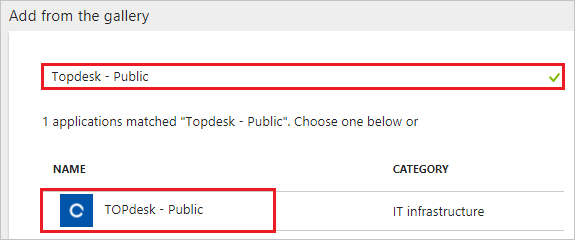
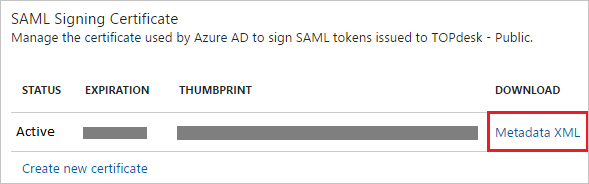
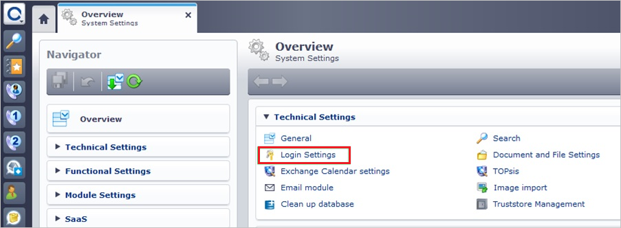
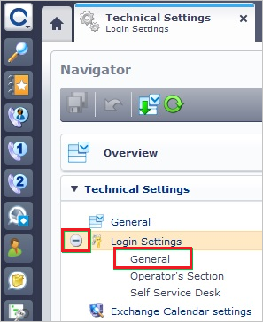
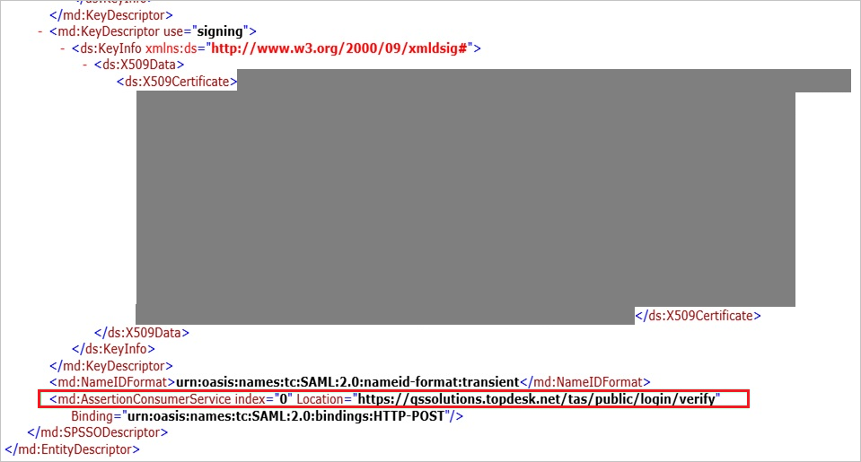
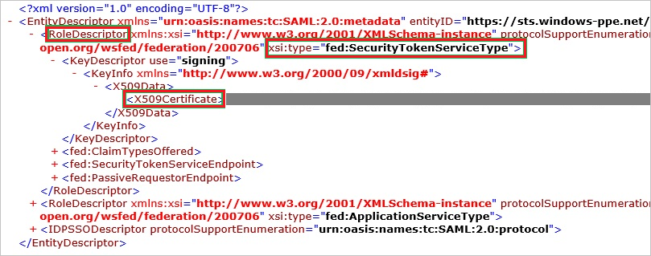
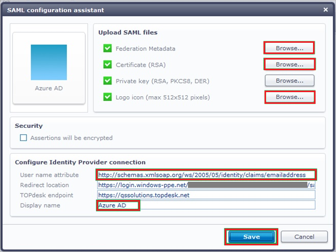
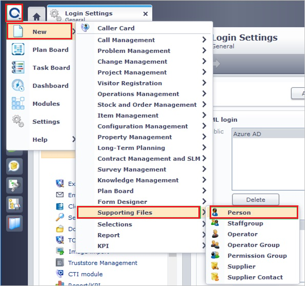
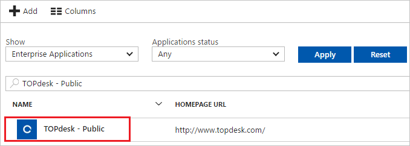

---
title: 'Tutorial: Azure Active Directory integration with TOPdesk - Public | Microsoft Docs'
description: Learn how to configure single sign-on between Azure Active Directory and TOPdesk - Public.
services: active-directory
documentationCenter: na
author: jeevansd
manager: mtillman
ms.reviewer: joflore

ms.assetid: 0873299f-ce70-457b-addc-e57c5801275f
ms.service: active-directory
ms.component: saas-app-tutorial
ms.workload: identity
ms.tgt_pltfrm: na
ms.devlang: na
ms.topic: article
ms.date: 07/25/2017
ms.author: jeedes

---
# Tutorial: Azure Active Directory integration with TOPdesk - Public

In this tutorial, you learn how to integrate TOPdesk - Public with Azure Active Directory (Azure AD).

Integrating TOPdesk - Public with Azure AD provides you with the following benefits:

- You can control in Azure AD who has access to TOPdesk - Public.
- You can enable your users to automatically get signed-on to TOPdesk - Public (Single Sign-On) with their Azure AD accounts.
- You can manage your accounts in one central location - the Azure portal.

If you want to know more details about SaaS app integration with Azure AD, see [what is application access and single sign-on with Azure Active Directory](../manage-apps/what-is-single-sign-on.md).

## Prerequisites

To configure Azure AD integration with TOPdesk - Public, you need the following items:

- An Azure AD subscription
- A TOPdesk - Public single-sign on enabled subscription

> [!NOTE]
> To test the steps in this tutorial, we do not recommend using a production environment.

To test the steps in this tutorial, you should follow these recommendations:

- Do not use your production environment, unless it is necessary.
- If you don't have an Azure AD trial environment, you can [get a one-month trial](https://azure.microsoft.com/pricing/free-trial/).

## Scenario description
In this tutorial, you test Azure AD single sign-on in a test environment. 
The scenario outlined in this tutorial consists of two main building blocks:

1. Adding TOPdesk - Public from the gallery
1. Configuring and testing Azure AD single sign-on

## Adding TOPdesk - Public from the gallery
To configure the integration of TOPdesk - Public into Azure AD, you need to add TOPdesk - Public from the gallery to your list of managed SaaS apps.

**To add TOPdesk - Public from the gallery, perform the following steps:**

1. In the **[Azure portal](https://portal.azure.com)**, on the left navigation panel, click **Azure Active Directory** icon. 

	![The Azure Active Directory button][1]

1. Navigate to **Enterprise applications**. Then go to **All applications**.

	![The Enterprise applications blade][2]
	
1. To add new application, click **New application** button on the top of dialog.

	![The New application button][3]

1. In the search box, type **TOPdesk - Public**, select **TOPdesk - Public** from result panel then click **Add** button to add the application.

	

## Configure and test Azure AD single sign-on

In this section, you configure and test Azure AD single sign-on with TOPdesk - Public based on a test user called "Britta Simon".

For single sign-on to work, Azure AD needs to know what the counterpart user in TOPdesk - Public is to a user in Azure AD. In other words, a link relationship between an Azure AD user and the related user in TOPdesk - Public needs to be established.

In TOPdesk - Public, assign the value of the **user name** in Azure AD as the value of the **Username** to establish the link relationship.

To configure and test Azure AD single sign-on with TOPdesk - Public, you need to complete the following building blocks:

1. **[Configure Azure AD Single Sign-On](#configure-azure-ad-single-sign-on)** - to enable your users to use this feature.
1. **[Create an Azure AD test user](#create-an-azure-ad-test-user)** - to test Azure AD single sign-on with Britta Simon.
1. **[Create a TOPdesk - Public test user](#create-a-topdesk---public-test-user)** - to have a counterpart of Britta Simon in TOPdesk - Public that is linked to the Azure AD representation of user.
1. **[Assign the Azure AD test user](#assign-the-azure-ad-test-user)** - to enable Britta Simon to use Azure AD single sign-on.
1. **[Test single sign-on](#test-single-sign-on)** - to verify whether the configuration works.

### Configure Azure AD single sign-on

In this section, you enable Azure AD single sign-on in the Azure portal and configure single sign-on in your TOPdesk - Public application.

**To configure Azure AD single sign-on with TOPdesk - Public, perform the following steps:**

1. In the Azure portal, on the **TOPdesk - Public** application integration page, click **Single sign-on**.

	![Configure single sign-on link][4]

1. On the **Single sign-on** dialog, select **Mode** as	**SAML-based Sign-on** to enable single sign-on.
 
	

1. On the **TOPdesk - Public Domain and URLs** section, perform the following steps:

	

    a. In the **Sign-on URL** textbox, type a URL using the following pattern: `https://<companyname>.topdesk.net`
	
	b. In the **Identifier** textbox, type a URL using the following pattern: `https://<companyname>.topdesk.net/tas/public/login/verify`

	c. In the **Reply URL** textbox, type a URL using the following pattern: `https://<companyname>.topdesk.net/tas/public/login/saml`
	 
	> [!NOTE] 
	> These values are not real. Update these values with the actual Identifier, Reply URL, and Sign-On URL. Reply URL is explaned later in tutorial. Contact [TOPdesk - Public Client support team](https://help.topdesk.com/saas/enterprise/user/) to get these values.  

1. On the **SAML Signing Certificate** section, click **Metadata XML** and then save the metadata file on your computer.

	 

1. Click **Save** button.

	
	
1. On the **TOPdesk - Public Configuration** section, click **Configure TOPdesk - Public** to open **Configure sign-on** window. Copy the **Sign-Out URL, SAML Entity ID, and SAML Single Sign-On Service URL** from the **Quick Reference section.**

	 

1. Sign on to your **TOPdesk - Public** company site as an administrator.

1. In the **TOPdesk** menu, click **Settings**.
   
    

1. Click **Login Settings**.
   
    

1. Expand the **Login Settings** menu, and then click **General**.
   
    

1. In the **Public** section of the **SAML login** configuration section, perform the following steps:
   
    
   
    a. Click **Download** to download the public metadata file, and then save it locally on your computer.
   
    b. Open the downloaded metadata file, and then locate the **AssertionConsumerService** node.

    
   
    c. Copy the **AssertionConsumerService** value, paste this value in the **Reply URL** textbox in **TOPdesk - Public Domain and URLs** section.      
   
1. To create a certificate file, perform the following steps:
    
    
    
    a. Open the downloaded metadata file from Azure portal.
    
    b. Expand the **RoleDescriptor** node that has a **xsi:type** of **fed:ApplicationServiceType**.
    
    c. Copy the value of the **X509Certificate** node.
    
    d. Save the copied **X509Certificate** value locally on your computer in a file.

1. In the **Public** section, click **Add**.
    
    

1. On the **SAML configuration assistant** dialog page, perform the following steps:
    
    
    
    a. To upload your downloaded metadata file from Azure portal, under **Federation Metadata**, click **Browse**.

    b. To upload your certificate file, under **Certificate (RSA)**, click **Browse**.

    c. To upload the logo file you got from the TOPdesk support team, under **Logo icon**, click **Browse**.

    d. In the **User name attribute** textbox, type `http://schemas.xmlsoap.org/ws/2005/05/identity/claims/emailaddress`.

    e. In the **Display name** textbox, type a name for your configuration.

    f. Click **Save**.

> [!TIP]
> You can now read a concise version of these instructions inside the [Azure portal](https://portal.azure.com), while you are setting up the app!  After adding this app from the **Active Directory > Enterprise Applications** section, simply click the **Single Sign-On** tab and access the embedded documentation through the **Configuration** section at the bottom. You can read more about the embedded documentation feature here: [Azure AD embedded documentation]( https://go.microsoft.com/fwlink/?linkid=845985)

### Create an Azure AD test user

The objective of this section is to create a test user in the Azure portal called Britta Simon.

   ![Create an Azure AD test user][100]

**To create a test user in Azure AD, perform the following steps:**

1. In the Azure portal, in the left pane, click the **Azure Active Directory** button.

    

1. To display the list of users, go to **Users and groups**, and then click **All users**.

    

1. To open the **User** dialog box, click **Add** at the top of the **All Users** dialog box.

    

1. In the **User** dialog box, perform the following steps:

    

    a. In the **Name** box, type **BrittaSimon**.

    b. In the **User name** box, type the email address of user Britta Simon.

    c. Select the **Show Password** check box, and then write down the value that's displayed in the **Password** box.

    d. Click **Create**.
 
### Create a TOPdesk - Public test user

In order to enable Azure AD users to log into TOPdesk - Public, they must be provisioned into TOPdesk - Public.  
In the case of TOPdesk - Public, provisioning is a manual task.

### To configure user provisioning, perform the following steps:
1. Sign on to your **TOPdesk - Public** company site as administrator.

1. In the menu on the top, click **TOPdesk \> New \> Support Files \> Person**.
   
    

1. On the New Person dialog, perform the following steps:
   
    
   
    a. Click the General tab.

    b. In the **Surname** textbox, type Surname of the user like Simon
 
    c. Select a **Site** for the account.
 
    d. Click **Save**.

> [!NOTE]
> You can use any other TOPdesk - Public user account creation tools or APIs provided by TOPdesk - Public to provision Azure AD user accounts.

### Assign the Azure AD test user

In this section, you enable Britta Simon to use Azure single sign-on by granting access to TOPdesk - Public.

![Assign the user role][200] 

**To assign Britta Simon to TOPdesk - Public, perform the following steps:**

1. In the Azure portal, open the applications view, and then navigate to the directory view and go to **Enterprise applications** then click **All applications**.

	![Assign User][201] 

1. In the applications list, select **TOPdesk - Public**.

	  

1. In the menu on the left, click **Users and groups**.

	![The "Users and groups" link][202]

1. Click **Add** button. Then select **Users and groups** on **Add Assignment** dialog.

	![The Add Assignment pane][203]

1. On **Users and groups** dialog, select **Britta Simon** in the Users list.

1. Click **Select** button on **Users and groups** dialog.

1. Click **Assign** button on **Add Assignment** dialog.
	
### Test single sign-on

In this section, you test your Azure AD single sign-on configuration using the Access Panel.

When you click the TOPdesk - Public tile in the Access Panel, you should get automatically signed-on to your TOPdesk - Public application.
For more information about the Access Panel, see [Introduction to the Access Panel](../user-help/active-directory-saas-access-panel-introduction.md). 

## Additional resources

* [List of Tutorials on How to Integrate SaaS Apps with Azure Active Directory](tutorial-list.md)
* [What is application access and single sign-on with Azure Active Directory?](../manage-apps/what-is-single-sign-on.md)

<!--Image references-->

[1]: ./media/topdesk-public-tutorial/tutorial_general_01.png
[2]: ./media/topdesk-public-tutorial/tutorial_general_02.png
[3]: ./media/topdesk-public-tutorial/tutorial_general_03.png
[4]: ./media/topdesk-public-tutorial/tutorial_general_04.png

[100]: ./media/topdesk-public-tutorial/tutorial_general_100.png

[200]: ./media/topdesk-public-tutorial/tutorial_general_200.png
[201]: ./media/topdesk-public-tutorial/tutorial_general_201.png
[202]: ./media/topdesk-public-tutorial/tutorial_general_202.png
[203]: ./media/topdesk-public-tutorial/tutorial_general_203.png

