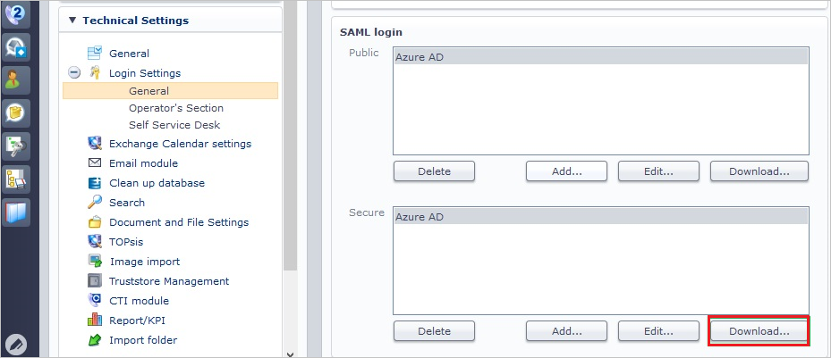
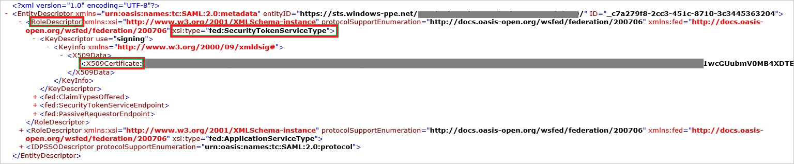
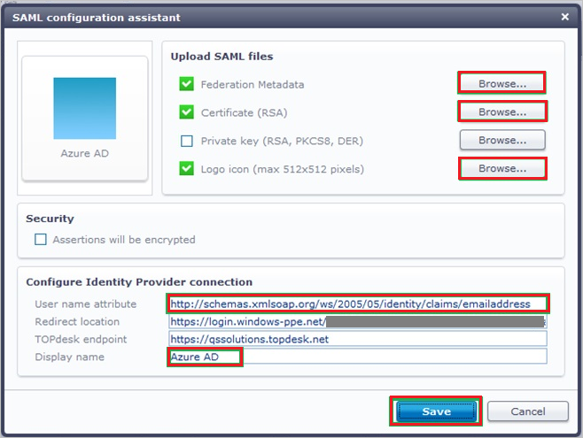

# Tutorial: Azure Active Directory integration with TOPdesk - Secure

In this tutorial, you learn how to integrate TOPdesk - Secure with Azure Active Directory (Azure AD).
Integrating TOPdesk - Secure with Azure AD provides you with the following benefits:

* You can control in Azure AD who has access to TOPdesk - Secure.
* You can enable your users to be automatically signed-in to TOPdesk - Secure (Single Sign-On) with their Azure AD accounts.
* You can manage your accounts in one central location - the Azure portal.

If you want to know more details about SaaS app integration with Azure AD, see [What is application access and single sign-on with Azure Active Directory](https://docs.microsoft.com/azure/active-directory/active-directory-appssoaccess-whatis).
If you don't have an Azure subscription, [create a free account](https://azure.microsoft.com/free/) before you begin.

## Prerequisites

To configure Azure AD integration with TOPdesk - Secure, you need the following items:

* An Azure AD subscription. If you don't have an Azure AD environment, you can get one-month trial [here](https://azure.microsoft.com/pricing/free-trial/)
* TOPdesk - Secure single sign-on enabled subscription

## Scenario description

In this tutorial, you configure and test Azure AD single sign-on in a test environment.

* TOPdesk - Secure supports **SP** initiated SSO

## Adding TOPdesk - Secure from the gallery

To configure the integration of TOPdesk - Secure into Azure AD, you need to add TOPdesk - Secure from the gallery to your list of managed SaaS apps.

**To add TOPdesk - Secure from the gallery, perform the following steps:**

1. In the **[Azure portal](https://portal.azure.com)**, on the left navigation panel, click **Azure Active Directory** icon.

	

2. Navigate to **Enterprise Applications** and then select the **All Applications** option.

	

3. To add new application, click **New application** button on the top of dialog.

	

4. In the search box, type **TOPdesk - Secure**, select **TOPdesk - Secure** from result panel then click **Add** button to add the application.

	 

## Configure and test Azure AD single sign-on

In this section, you configure and test Azure AD single sign-on with TOPdesk - Secure based on a test user called **Britta Simon**.
For single sign-on to work, a link relationship between an Azure AD user and the related user in TOPdesk - Secure needs to be established.

To configure and test Azure AD single sign-on with TOPdesk - Secure, you need to complete the following building blocks:

1. **[Configure Azure AD Single Sign-On](#configure-azure-ad-single-sign-on)** - to enable your users to use this feature.
2. **[Configure TOPdesk - Secure Single Sign-On](#configure-topdesk---secure-single-sign-on)** - to configure the Single Sign-On settings on application side.
3. **[Create an Azure AD test user](#create-an-azure-ad-test-user)** - to test Azure AD single sign-on with Britta Simon.
4. **[Assign the Azure AD test user](#assign-the-azure-ad-test-user)** - to enable Britta Simon to use Azure AD single sign-on.
5. **[Create TOPdesk - Secure test user](#create-topdesk---secure-test-user)** - to have a counterpart of Britta Simon in TOPdesk - Secure that is linked to the Azure AD representation of user.
6. **[Test single sign-on](#test-single-sign-on)** - to verify whether the configuration works.

### Configure Azure AD single sign-on

In this section, you enable Azure AD single sign-on in the Azure portal.

To configure Azure AD single sign-on with TOPdesk - Secure, perform the following steps:

1. In the [Azure portal](https://portal.azure.com/), on the **TOPdesk - Secure** application integration page, select **Single sign-on**.

    

2. On the **Select a Single sign-on method** dialog, select **SAML/WS-Fed** mode to enable single sign-on.

    

3. On the **Set up Single Sign-On with SAML** page, click **Edit** icon to open **Basic SAML Configuration** dialog.

	

4. On the **Basic SAML Configuration** section, perform the following steps:

    

    a. In the **Sign-on URL** text box, type a URL using the following pattern:
    `https://<companyname>.topdesk.net`

    b. In the **Identifier** box, type a URL using the following pattern:
    `https://<companyname>.topdesk.net/tas/secure/login/verify`

    c. In the **Reply URL** text box, type a URL using the following pattern:
    `https://<companyname>.topdesk.net/tas/public/login/saml`

	> [!NOTE]
	> These values are not real. Update these values with the actual Sign-On URL, Identifier and Reply URL. Contact [TOPdesk - Secure Client support team](https://www.topdesk.com/us/support/) to get these values. You can also refer to the patterns shown in the **Basic SAML Configuration** section in the Azure portal.

5. On the **Set up Single Sign-On with SAML** page, in the **SAML Signing Certificate** section, click **Download** to download the **Federation Metadata XML** from the given options as per your requirement and save it on your computer.

	

6. On the **Set up TOPdesk - Secure** section, copy the appropriate URL(s) as per your requirement.

	

	a. Login URL

	b. Azure Ad Identifier

	c. Logout URL

### Configure TOPdesk - Secure Single Sign-On

1. Sign on to your **TOPdesk - Secure** company site as an administrator.

2. In the **TOPdesk** menu, click **Settings**.

	

3. Click **Login Settings**.

	

4. Expand the **Login Settings** menu, and then click **General**.

	

5. In the **Secure** section of the **SAML login** configuration section, perform the following steps:

	

    a. Click **Download** to download the public metadata file, and then save it locally on your computer.

    b. Open the metadata file, and then locate the **AssertionConsumerService** node.

    

    c. Copy the **AssertionConsumerService** value, paste this value in the Reply URL textbox in **TOPdesk - Secure Domain and URLs** section.

6. To create a certificate file, perform the following steps:

    

    a. Open the downloaded metadata file from Azure portal.

    b. Expand the **RoleDescriptor** node that has a **xsi:type** of **fed:ApplicationServiceType**.

    c. Copy the value of the **X509Certificate** node.

    d. Save the copied **X509Certificate** value locally on your computer in a file.

7. In the **Public** section, click **Add**.

    

8. On the **SAML configuration assistant** dialog page, perform the following steps:

    

    a. To upload your downloaded metadata file from Azure portal, under **Federation Metadata**, click **Browse**.

    b. To upload your certificate file, under **Certificate (RSA)**, click **Browse**.

    c. For **Private key(RSA, PKCS8, DER)**, you can upload your own private key or you can contact [TOPdesk - Secure Client support team](https://www.topdesk.com/us/support) to get the private key.

    d. To upload the logo file you got from the TOPdesk support team, under **Logo icon**, click **Browse**.

    e. In the **User name attribute** textbox, type `http://schemas.xmlsoap.org/ws/2005/05/identity/claims/emailaddress`.

    f. In the **Display name** textbox, type a name for your configuration.

    g. Click **Save**.

### Create an Azure AD test user 

The objective of this section is to create a test user in the Azure portal called Britta Simon.

1. In the Azure portal, in the left pane, select **Azure Active Directory**, select **Users**, and then select **All users**.

    

2. Select **New user** at the top of the screen.

    

3. In the User properties, perform the following steps.

    

    a. In the **Name** field enter **BrittaSimon**.
  
    b. In the **User name** field type **brittasimon\@yourcompanydomain.extension**  
    For example, BrittaSimon@contoso.com

    c. Select **Show password** check box, and then write down the value that's displayed in the Password box.

    d. Click **Create**.

### Assign the Azure AD test user

In this section, you enable Britta Simon to use Azure single sign-on by granting access to TOPdesk - Secure.

1. In the Azure portal, select **Enterprise Applications**, select **All applications**, then select **TOPdesk - Secure**.

	

2. In the applications list, type and select **TOPdesk - Secure**.

	

3. In the menu on the left, select **Users and groups**.

    

4. Click the **Add user** button, then select **Users and groups** in the **Add Assignment** dialog.

    

5. In the **Users and groups** dialog select **Britta Simon** in the Users list, then click the **Select** button at the bottom of the screen.

6. If you are expecting any role value in the SAML assertion then in the **Select Role** dialog select the appropriate role for the user from the list, then click the **Select** button at the bottom of the screen.

7. In the **Add Assignment** dialog click the **Assign** button.

### Create TOPdesk - Secure test user

In order to enable Azure AD users to log into TOPdesk - Secure, they must be provisioned into TOPdesk - Secure.  
In the case of TOPdesk - Secure, provisioning is a manual task.

### To configure user provisioning, perform the following steps:

1. Sign on to your **TOPdesk - Secure** company site as administrator.

2. In the menu on the top, click **TOPdesk \> New \> Support Files \> Operator**.

    

3. On the **New Operator** dialog, perform the following steps:

    

    a. Click the **General** tab.

    b. In the **Surname** textbox, type Surname of the user like **Simon**.

    c. Select a **Site** for the account in the **Location** section.

    d. In the **Login Name** textbox of the **TOPdesk Login** section, type a login name for your user.

    e. Click **Save**.

> [!NOTE]
> You can use any other TOPdesk - Secure user account creation tools or APIs provided by TOPdesk - Secure to provision AAD user accounts.

### Test single sign-on 

In this section, you test your Azure AD single sign-on configuration using the Access Panel.

When you click the TOPdesk - Secure tile in the Access Panel, you should be automatically signed in to the TOPdesk - Secure for which you set up SSO. For more information about the Access Panel, see [Introduction to the Access Panel](https://docs.microsoft.com/azure/active-directory/active-directory-saas-access-panel-introduction).

## Additional Resources

- [List of Tutorials on How to Integrate SaaS Apps with Azure Active Directory](https://docs.microsoft.com/azure/active-directory/active-directory-saas-tutorial-list)

- [What is application access and single sign-on with Azure Active Directory?](https://docs.microsoft.com/azure/active-directory/active-directory-appssoaccess-whatis)

- [What is Conditional Access in Azure Active Directory?](https://docs.microsoft.com/azure/active-directory/conditional-access/overview)

