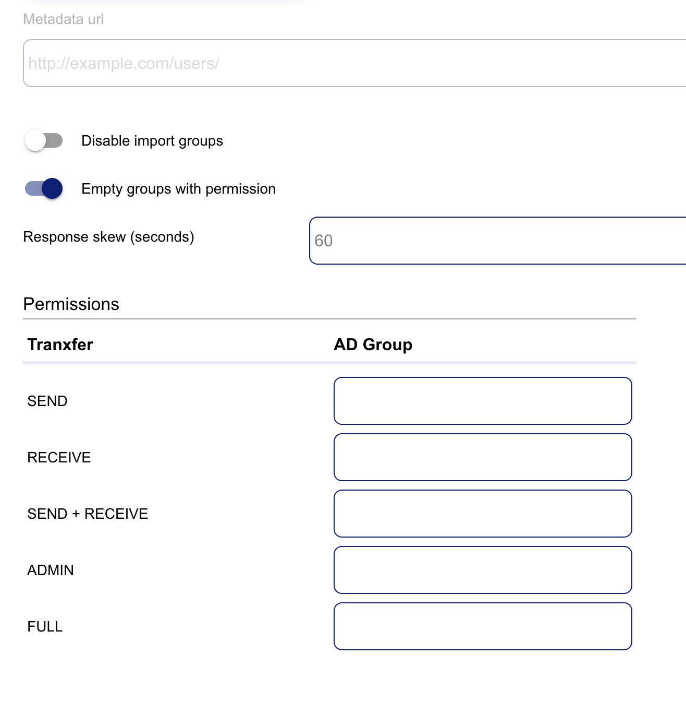

# Microsoft Entra SSO integration with Tranxfer

In this article, you'll learn how to integrate Tranxfer with Microsoft Entra ID. Tranxfer provides the safest and easiest to use business solution for sending and receiving files. When you integrate Tranxfer with Microsoft Entra ID, you can:

* Control in Microsoft Entra ID who has access to Tranxfer.
* Enable your users to be automatically signed-in to Tranxfer with their Microsoft Entra accounts.
* Manage your accounts in one central location.

You'll configure and test Microsoft Entra single sign-on for Tranxfer in a test environment. Tranxfer supports **SP** initiated single sign-on and **Just In Time** user provisioning.

## Prerequisites

To integrate Microsoft Entra ID with Tranxfer, you need:

* A Microsoft Entra user account. If you don't already have one, you can [Create an account for free](https://azure.microsoft.com/free/?WT.mc_id=A261C142F).
* One of the following roles: Global Administrator, Cloud Application Administrator, Application Administrator, or owner of the service principal.
* A Microsoft Entra subscription. If you don't have a subscription, you can get a [free account](https://azure.microsoft.com/free/).
* Tranxfer single sign-on (SSO) enabled subscription.

## Add application and assign a test user

Before you begin the process of configuring single sign-on, you need to add the Tranxfer application from the Microsoft Entra gallery. You need a test user account to assign to the application and test the single sign-on configuration.

### Add Tranxfer from the Microsoft Entra gallery

Add Tranxfer from the Microsoft Entra application gallery to configure single sign-on with Tranxfer. For more information on how to add application from the gallery, see the [Quickstart: Add application from the gallery](../manage-apps/add-application-portal.md).

### Create and assign Microsoft Entra test user

Follow the guidelines in the [create and assign a user account](../manage-apps/add-application-portal-assign-users.md) article to create a test user account called B.Simon.

Alternatively, you can also use the [Enterprise App Configuration Wizard](https://portal.office.com/AdminPortal/home?Q=Docs#/azureadappintegration). In this wizard, you can add an application to your tenant, add users/groups to the app, and assign roles. The wizard also provides a link to the single sign-on configuration pane. [Learn more about Microsoft 365 wizards.](/microsoft-365/admin/misc/azure-ad-setup-guides). 

## Configure Microsoft Entra SSO

Complete the following steps to enable Microsoft Entra single sign-on.

1. Sign in to the [Microsoft Entra admin center](https://entra.microsoft.com) as at least a [Cloud Application Administrator](../roles/permissions-reference.md#cloud-application-administrator).
1. Browse to **Identity** > **Applications** > **Enterprise applications** > **Tranxfer** > **Single sign-on**.
1. On the **Select a single sign-on method** page, select **SAML**.
1. On the **Set up single sign-on with SAML** page, select the pencil icon for **Basic SAML Configuration** to edit the settings.

   

1. On the **Basic SAML Configuration** section, perform the following steps:-

    a. In the **Identifier** textbox, type a URL using the following pattern:
    `https://<SUBDOMAIN>.tranxfer.com`

    b. In the **Reply URL** textbox, type a URL using the following pattern:
    `https://<SUBDOMAIN>.tranxfer.com/SAMLResponse`

    c. In the **Sign on URL** textbox, type a URL using the following pattern:
    `https://<SUBDOMAIN>.tranxfer.com/saml/login`

	> [!NOTE]
	> These values are not real. Update these values with the actual Identifier, Reply URL and Sign on URL. Contact [Tranxfer Client support team](mailto:soporte@tranxfer.com) to get these values. You can also refer to the patterns shown in the **Basic SAML Configuration** section.

1. Tranxfer application expects the SAML assertions in a specific format, which requires you to add custom attribute mappings to your SAML token attributes configuration. The following screenshot shows the list of default attributes.

    

1. In addition to above, Tranxfer application expects few more attributes to be passed back in SAML response, which are shown below. These attributes are also pre populated but you can review them as per your requirements.

    | Name | Source Attribute|
    | ------------ | --------- |
    | groups | user.groups [All] |

1. On the **Set up single sign-on with SAML** page, In the **SAML Signing Certificate** section, select copy button to copy **App Federation Metadata Url** and save it on your computer.

	

## Configure Tranxfer SSO

You'll need to log in to your Tranxfer application with the company administrator account.

1. Go to **Settings -> SAML** and paste **App Federation Metadata Url** to **Metadata URL** field.
1. If you want to give specific permissions to different user groups, you can match Microsoft Entra groups to common **Tranxfer** permissions. To do so, fill in Microsoft Entra group ID for each permission:

    a. SEND permission to send files.

    b. RECEIVE to receive files.

    c. SEND + RECEIVE both of the above.

    d. ADMIN company administration permission but not sending nor receiving files.

    e. FULL all of the above.

    

1. If you want to give any user of your organization, the simple Send and Receive permission no matter which groups they have, enable the **Empty groups with permission** option.
1. If you want only match permissions by groups but don't want to import Microsoft Entra groups to Tranxfer groups enable the **Disable import groups** option.

If you find any problems, please contact [Tranxfer support team](mailto:soporte@tranxfer.com). The support team will assist you in configuring the single sign-on on the application.

### Create Tranxfer test user

In this section, a user called B.Simon is created in Tranxfer. Tranxfer supports just-in-time user provisioning, which is enabled by default. There is no action item for you in this section. If a user doesn't already exist in Tranxfer, a new one is created after authentication.

## Test SSO 

In this section, you test your Microsoft Entra single sign-on configuration with following options. 

* Click on **Test this application**, this will redirect to Tranxfer Sign-on URL where you can initiate the login flow. 

* Go to Tranxfer Sign-on URL directly and initiate the login flow from there.

* You can use Microsoft My Apps. When you click the Tranxfer tile in the My Apps, this will redirect to Tranxfer Sign-on URL. For more information, see [Microsoft Entra My Apps](/azure/active-directory/manage-apps/end-user-experiences#azure-ad-my-apps).

## Additional resources

* [What is single sign-on with Microsoft Entra ID?](../manage-apps/what-is-single-sign-on.md)
* [Plan a single sign-on deployment](../manage-apps/plan-sso-deployment.md).

## Next steps

Once you configure Tranxfer you can enforce session control, which protects exfiltration and infiltration of your organization’s sensitive data in real time. Session control extends from Conditional Access. [Learn how to enforce session control with Microsoft Cloud App Security](/cloud-app-security/proxy-deployment-aad).
