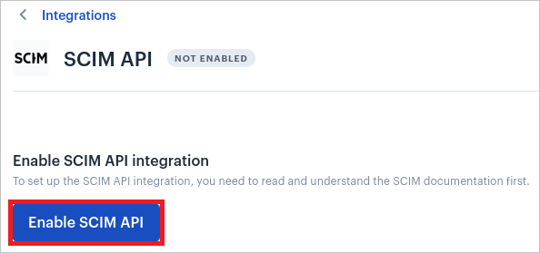
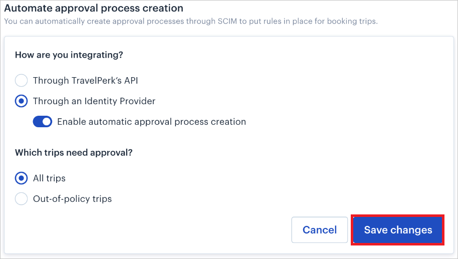
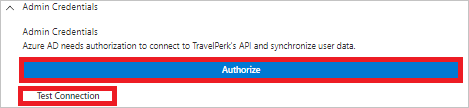
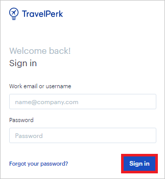
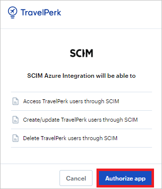

# Tutorial: Configure TravelPerk for automatic user provisioning

This tutorial describes the steps you need to perform in both TravelPerk and Microsoft Entra ID to configure automatic user provisioning. When configured, Microsoft Entra ID automatically provisions and deprovisions users and groups to [TravelPerk](https://www.travelperk.com/) using the Microsoft Entra provisioning service. For important details on what this service does, how it works, and frequently asked questions, see [Automate user provisioning and deprovisioning to SaaS applications with Microsoft Entra ID](../app-provisioning/user-provisioning.md).

## Capabilities supported

> [!div class="checklist"]
>
> - Create users in TravelPerk
> - Remove users in TravelPerk when they do not require access anymore
> - Keep user attributes synchronized between Microsoft Entra ID and TravelPerk
> - [Single sign-on](./travelperk-tutorial.md) to TravelPerk (recommended)

## Prerequisites

The scenario outlined in this tutorial assumes that you already have the following prerequisites:

- [A Microsoft Entra tenant](../develop/quickstart-create-new-tenant.md).
- A user account in Microsoft Entra ID with [permission](../roles/permissions-reference.md) to configure provisioning (for example, Application Administrator, Cloud Application administrator, Application Owner, or Global Administrator).
- An active [TravelPerk](https://app.travelperk.com/signup) admin account.
- A Premium/Pro [plan](https://www.travelperk.com/pricing/).

## Step 1: Plan your provisioning deployment

1. Learn about [how the provisioning service works](../app-provisioning/user-provisioning.md).
2. Determine who will be in [scope for provisioning](../app-provisioning/define-conditional-rules-for-provisioning-user-accounts.md).
3. Determine what data to [map between Microsoft Entra ID and TravelPerk](../app-provisioning/customize-application-attributes.md).

## Step 2: Configure TravelPerk to support provisioning with Microsoft Entra ID

1. Login to the [TravelPerk](https://app.travelperk.com/company/integrations/scim) Application with your admin account.

2. Navigate to **Company Settings** > **Integrations** > **SCIM**

3. Click **Enable SCIM API**

   

4. You can also enable approvals through SCIM. Approvals help you set additional governance by ensuring trips get approved first by the specified approvers. You can learn more about this [here](https://support.travelperk.com/hc/en-us/articles/360044168971-How-do-approval-processes-work-).

5. You can specify whether you want every person's manager to automatically become the user responsible for the approval of trips. Therefore an approver will be assigned in the corresponding automatic approval process. TravelPerk will map Azure's **manager** value, to the user's desired approver. The user needs to exist on the platform before becoming the provisioned user approver.
Approvers will not be created if they are not properly configured on TravelPerk.

6. Automatic approval process creation is available in the **SCIM settings** after enabling SCIM from the integrations page. To turn it on, select **Through an Identity Provider** and switch the toggle for **Enable automatic approval process creation**.

7. Click on **Save changes** once the necessary approval process is configured.

   

## Step 3: Add TravelPerk from the Microsoft Entra application gallery

Add TravelPerk from the Microsoft Entra application gallery to start managing provisioning to TravelPerk. If you have previously setup TravelPerk for SSO, you can use the same application. However it is recommended that you create a separate app when testing out the integration initially. Learn more about adding an application from the gallery [here](../manage-apps/add-application-portal.md).

## Step 4: Define who will be in scope for provisioning

The Microsoft Entra provisioning service allows you to scope who will be provisioned based on assignment to the application and or based on attributes of the user / group. If you choose to scope who will be provisioned to your app based on assignment, you can use the following [steps](../manage-apps/assign-user-or-group-access-portal.md) to assign users and groups to the application. If you choose to scope who will be provisioned based solely on attributes of the user or group, you can use a scoping filter as described [here](../app-provisioning/define-conditional-rules-for-provisioning-user-accounts.md).

* Start small. Test with a small set of users and groups before rolling out to everyone. When scope for provisioning is set to assigned users and groups, you can control this by assigning one or two users or groups to the app. When scope is set to all users and groups, you can specify an [attribute based scoping filter](../app-provisioning/define-conditional-rules-for-provisioning-user-accounts.md).

* If you need additional roles, you can [update the application manifest](../develop/howto-add-app-roles-in-azure-ad-apps.md) to add new roles.

## Step 5: Configure automatic user provisioning to TravelPerk

This section guides you through the steps to configure the Microsoft Entra provisioning service to create, update, and disable users and/or groups in TestApp based on user and/or group assignments in Microsoft Entra ID.

### To configure automatic user provisioning for TravelPerk in Microsoft Entra ID:

1. Sign in to the [Microsoft Entra admin center](https://entra.microsoft.com) as at least a [Cloud Application Administrator](../roles/permissions-reference.md#cloud-application-administrator).
1. Browse to **Identity** > **Applications** > **Enterprise applications**

   

1. In the applications list, select **TravelPerk**.

   

3. Select the **Provisioning** tab.

   

4. Set the **Provisioning Mode** to **Automatic**.

   

5. Under the **Admin Credentials** section, click on **Authorize**. You will be redirected to **TravelPerk**'s Login page. Input your **Username** and **Password** and click on the **Sign In** button. Click on **Authorize App** on the Authorization page. Click **Test Connection** to ensure Microsoft Entra ID can connect to TravelPerk. If the connection fails, ensure your SecureLogin account has Admin permissions and try again.

   

   

   

6. In the **Notification Email** field, enter the email address of a person or group who should receive the provisioning error notifications and select the **Send an email notification when a failure occurs** check box.

   

7. Select **Save**.

8. Under the **Mappings** section, select **Synchronize Microsoft Entra users to TravelPerk**.

9. Review the user attributes that are synchronized from Microsoft Entra ID to TravelPerk in the **Attribute-Mapping** section. The attributes selected as **Matching** properties are used to match the user accounts in TravelPerk for update operations. If you choose to change the [matching target attribute](../app-provisioning/customize-application-attributes.md), you will need to ensure that the TravelPerk API supports filtering users based on that attribute. Select the **Save** button to commit any changes.

   | Attribute                                                                         | Type      | Supported For Filtering |
   | --------------------------------------------------------------------------------- | --------- | ----------------------- |
   | userName                                                                          | String    | &check;                 |
   | externalId                                                                        | String    |
   | active                                                                            | Boolean   |
   | name.honorificPrefix                                                              | String    |
   | name.familyName                                                                   | String    |
   | name.givenName                                                                    | String    |
   | name.middleName                                                                   | String    |
   | preferredLanguage                                                                 | String    |
   | locale                                                                            | String    |
   | phoneNumbers[type eq "work"].value                                                | String    |
   | externalId                                                                        | String    |
   | title                                                                             | String    |
   | urn:ietf:params:scim:schemas:extension:enterprise:2.0:User:costCenter             | String    |
   | urn:ietf:params:scim:schemas:extension:enterprise:2.0:User:manager                | Reference |
   | urn:ietf:params:scim:schemas:extension:travelperk:2.0:User:gender                 | String    |
   | urn:ietf:params:scim:schemas:extension:travelperk:2.0:User:dateOfBirth            | String    |
   | urn:ietf:params:scim:schemas:extension:travelperk:2.0:User:invoiceProfiles        | Array     |
   | urn:ietf:params:scim:schemas:extension:travelperk:2.0:User:emergencyContact.name  | String    |
   | urn:ietf:params:scim:schemas:extension:travelperk:2.0:User:emergencyContact.phone | String    |
   | urn:ietf:params:scim:schemas:extension:travelperk:2.0:User:travelPolicy           | String    |

10. To configure scoping filters, refer to the following instructions provided in the [Scoping filter tutorial](../app-provisioning/define-conditional-rules-for-provisioning-user-accounts.md).

11. To enable the Microsoft Entra provisioning service for TravelPerk, change the **Provisioning Status** to **On** in the **Settings** section.

    

12. Define the users and/or groups that you would like to provision to TravelPerk by choosing the desired values in **Scope** in the **Settings** section.

    

13. When you are ready to provision, click **Save**.

    

This operation starts the initial synchronization cycle of all users and groups defined in **Scope** in the **Settings** section. The initial cycle takes longer to perform than subsequent cycles, which occur approximately every 40 minutes as long as the Microsoft Entra provisioning service is running.

## Step 6: Monitor your deployment

Once you've configured provisioning, use the following resources to monitor your deployment:

1. Use the [provisioning logs](../reports-monitoring/concept-provisioning-logs.md) to determine which users have been provisioned successfully or unsuccessfully
2. Check the [progress bar](../app-provisioning/application-provisioning-when-will-provisioning-finish-specific-user.md) to see the status of the provisioning cycle and how close it is to completion
3. If the provisioning configuration seems to be in an unhealthy state, the application will go into quarantine. Learn more about quarantine states [here](../app-provisioning/application-provisioning-quarantine-status.md).

## Additional resources

- [Managing user account provisioning for Enterprise Apps](../app-provisioning/configure-automatic-user-provisioning-portal.md)
- [What is application access and single sign-on with Microsoft Entra ID?](../manage-apps/what-is-single-sign-on.md)

## Next steps

- [Learn how to review logs and get reports on provisioning activity](../app-provisioning/check-status-user-account-provisioning.md)
