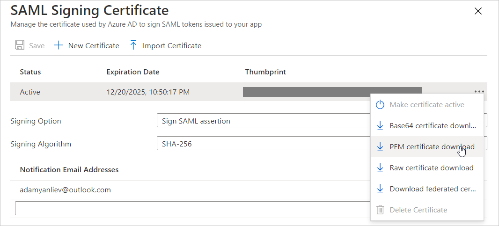

# Microsoft Entra SSO integration with Treasury Intelligence Solutions (TIS)

In this tutorial, you'll learn how to integrate Treasury Intelligence Solutions (TIS) with Microsoft Entra ID. When you integrate Treasury Intelligence Solutions (TIS) with Microsoft Entra ID, you can:

* Control in Microsoft Entra ID who has access to Treasury Intelligence Solutions (TIS).
* Enable your users to be automatically signed-in to Treasury Intelligence Solutions (TIS) with their Microsoft Entra accounts.
* Manage your accounts in one central location.

## Prerequisites

To integrate Microsoft Entra ID with Treasury Intelligence Solutions (TIS), you need:

* A Microsoft Entra subscription. If you don't have a subscription, you can get a [free account](https://azure.microsoft.com/free/).
* Treasury Intelligence Solutions (TIS) single sign-on (SSO) enabled subscription.

## Scenario description

In this tutorial, you configure and test Microsoft Entra SSO in a test environment.

* Treasury Intelligence Solutions (TIS) supports both **SP and IDP** initiated SSO.

## Add Treasury Intelligence Solutions (TIS) from the gallery

To configure the integration of Treasury Intelligence Solutions (TIS) into Microsoft Entra ID, you need to add Treasury Intelligence Solutions (TIS) from the gallery to your list of managed SaaS apps.

1. Sign in to the [Microsoft Entra admin center](https://entra.microsoft.com) as at least a [Cloud Application Administrator](../roles/permissions-reference.md#cloud-application-administrator).
1. Browse to **Identity** > **Applications** > **Enterprise applications** > **New application**.
1. In the **Add from the gallery** section, type **Treasury Intelligence Solutions (TIS)** in the search box.
1. Select **Treasury Intelligence Solutions (TIS)** from results panel and then add the app. Wait a few seconds while the app is added to your tenant.

Alternatively, you can also use the [Enterprise App Configuration Wizard](https://portal.office.com/AdminPortal/home?Q=Docs#/azureadappintegration). In this wizard, you can add an application to your tenant, add users/groups to the app, assign roles, and walk through the SSO configuration as well. [Learn more about Microsoft 365 wizards.](/microsoft-365/admin/misc/azure-ad-setup-guides)

## Configure and test Microsoft Entra SSO for Treasury Intelligence Solutions (TIS)

Configure and test Microsoft Entra SSO with Treasury Intelligence Solutions (TIS) using a test user called **B.Simon**. For SSO to work, you need to establish a link relationship between a Microsoft Entra user and the related user in Treasury Intelligence Solutions (TIS).

To configure and test Microsoft Entra SSO with Treasury Intelligence Solutions (TIS), perform the following steps:

1. **[Configure Microsoft Entra SSO](#configure-microsoft-entra-sso)** - to enable your users to use this feature.
    1. **[Create a Microsoft Entra ID test user](#create-a-microsoft-entra-id-test-user)** - to test Microsoft Entra single sign-on with B.Simon.
    1. **[Assign the Microsoft Entra ID test user](#assign-the-microsoft-entra-id-test-user)** - to enable B.Simon to use Microsoft Entra single sign-on.
1. **[Configure Treasury Intelligence Solutions (TIS) SSO](#configure-treasury-intelligence-solutions-tis-sso)** - to configure the single sign-on settings on application side.
    1. **[Create Treasury Intelligence Solutions (TIS) test user](#create-treasury-intelligence-solutions-tis-test-user)** - to have a counterpart of B.Simon in Treasury Intelligence Solutions (TIS) that is linked to the Microsoft Entra ID representation of user.
1. **[Test SSO](#test-sso)** - to verify whether the configuration works.

## Configure Microsoft Entra SSO

Follow these steps to enable Microsoft Entra SSO in the Microsoft Entra admin center.

1. Sign in to the [Microsoft Entra admin center](https://entra.microsoft.com) as at least a [Cloud Application Administrator](../roles/permissions-reference.md#cloud-application-administrator).
1. Browse to **Identity** > **Applications** > **Enterprise applications** > **Treasury Intelligence Solutions (TIS)** > **Single sign-on**.
1. On the **Select a single sign-on method** page, select **SAML**.
1. On the **Set up single sign-on with SAML** page, click the pencil icon for **Basic SAML Configuration** to edit the settings.

   

1. On the **Basic SAML Configuration** section, perform the following steps:

    a. In the **Identifier** text box, type one of the following URLs:

    | Environment | URL |
    |----|----|
    | Production| `https://eu.tispayments.com` , `https://us.tispayments.com` |
    | Staging | `https://eu-test.tispayments.com` , `https://us-test.tispayments.com` |

    b. In the **Reply URL** text box, type one of the following URLs:

    | Environment | URL |
    |----|----|
    | Production| `https://login.eu.tispayments.com/iam-server/SamlSsoLogin` , `https://login.us.tispayments.com/iam-server/SamlSsoLogin` |
    | Staging | `https://login.eu-test.tispayments.com/iam-server/SamlSsoLogin` , `https://login.us-test.tispayments.com/iam-server/SamlSsoLogin` |

1. Perform the following step, if you wish to configure the application in **SP** initiated mode:

    In the **Sign-on URL** text box, type any one of the URLs:

    | Environment | URL |
    |----|----|
    | Production| `https://login.eu.tispayments.com` , `https://login.us.tispayments.com` |
    | Staging | `https://login.eu-test.tispayments.com` , `https://login.us-test.tispayments.com` |

1. On the **Set up single sign-on with SAML** page, in the **SAML Signing Certificate** section, find **Certificate (PEM)** and select **Download** to download the certificate and save it on your computer.

	

### Create a Microsoft Entra ID test user

In this section, you'll create a test user in the Microsoft Entra admin center called B.Simon.

1. Sign in to the [Microsoft Entra admin center](https://entra.microsoft.com) as at least a [User Administrator](../roles/permissions-reference.md#user-administrator).
1. Browse to **Identity** > **Users** > **All users**.
1. Select **New user** > **Create new user**, at the top of the screen.
1. In the **User** properties, follow these steps:
   1. In the **Display name** field, enter `B.Simon`.  
   1. In the **User principal name** field, enter the username@companydomain.extension. For example, `B.Simon@contoso.com`.
   1. Select the **Show password** check box, and then write down the value that's displayed in the **Password** box.
   1. Select **Review + create**.
1. Select **Create**.

### Assign the Microsoft Entra ID test user

In this section, you'll enable B.Simon to use Microsoft Entra single sign-on by granting access to Treasury Intelligence Solutions (TIS).

1. Sign in to the [Microsoft Entra admin center](https://entra.microsoft.com) as at least a [Cloud Application Administrator](../roles/permissions-reference.md#cloud-application-administrator).
1. Browse to **Identity** > **Applications** > **Enterprise applications** > **Treasury Intelligence Solutions (TIS)**.
1. In the app's overview page, select **Users and groups**.
1. Select **Add user/group**, then select **Users and groups** in the **Add Assignment** dialog.
   1. In the **Users and groups** dialog, select **B.Simon** from the Users list, then click the **Select** button at the bottom of the screen.
   1. If you are expecting a role to be assigned to the users, you can select it from the **Select a role** dropdown. If no role has been set up for this app, you see "Default Access" role selected.
   1. In the **Add Assignment** dialog, click the **Assign** button.

## Configure Treasury Intelligence Solutions (TIS) SSO

To configure single sign-on on **Treasury Intelligence Solutions** side, you need to send the downloaded **Certificate (PEM)** and appropriate copied URLs from Microsoft Entra admin center to [Treasury Intelligence Solutions support team](mailto:support@tispayments.com). They set this setting to have the SAML SSO connection set properly on both sides.

### Create Treasury Intelligence Solutions (TIS) test user

In this section, you create a user called B.Simon in Treasury Intelligence Solutions (TIS). Work with [Treasury Intelligence Solutions (TIS) support team](mailto:support@tispayments.com) to add the users in the Treasury Intelligence Solutions (TIS) platform. Users must be created and activated before you use single sign-on.

## Test SSO 

In this section, you test your Microsoft Entra single sign-on configuration with following options.
 
#### SP initiated:
 
* Click on **Test this application** in Microsoft Entra admin center. This will redirect to Treasury Intelligence Solution Sign on URL where you can initiate the login flow.  
 
* Go to Treasury Intelligence Solution Sign-on URL directly and initiate the login flow from there.
 
#### IDP initiated:
 
* Click on **Test this application** in Microsoft Entra admin center and you should be automatically signed in to the Treasury Intelligence Solution for which you set up the SSO.
 
You can also use Microsoft My Apps to test the application in any mode. When you click the Treasury Intelligence Solution tile in the My Apps, if configured in SP mode you would be redirected to the application sign on page for initiating the login flow and if configured in IDP mode, you should be automatically signed in to the Treasury Intelligence Solution for which you set up the SSO. For more information about the My Apps, see [Introduction to the My Apps](../user-help/my-apps-portal-end-user-access.md).

## Next steps

Once you configure Treasury Intelligence Solutions (TIS) you can enforce session control, which protects exfiltration and infiltration of your organization's sensitive data in real time. Session control extends from Conditional Access. [Learn how to enforce session control with Microsoft Defender for Cloud Apps](/cloud-app-security/proxy-deployment-any-app).