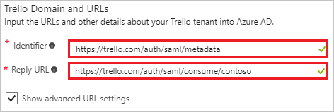
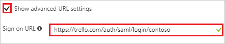
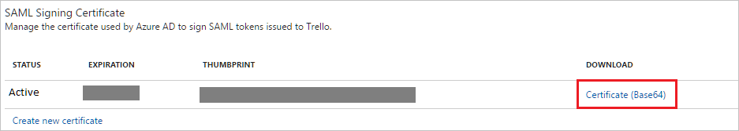
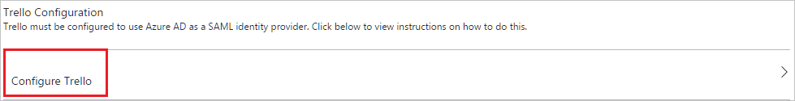
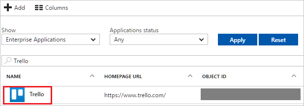

---
title: 'Tutorial: Azure Active Directory integration with Trello | Microsoft Docs'
description: Learn how to configure single sign-on between Azure Active Directory and Trello.
services: active-directory
documentationCenter: na
author: jeevansd
manager: mtillman
ms.reviewer: joflore

ms.assetid: cd5ae365-9ed6-43a6-920b-f7814b993949
ms.service: active-directory
ms.component: saas-app-tutorial
ms.workload: identity
ms.tgt_pltfrm: na
ms.devlang: na
ms.topic: article
ms.date: 12/04/2017
ms.author: jeedes

---
# Tutorial: Azure Active Directory integration with Trello

In this tutorial, you learn how to integrate Trello with Azure Active Directory (Azure AD).

Integrating Trello with Azure AD provides you with the following benefits:

- You can control in Azure AD who has access to Trello.
- You can enable your users to automatically get signed-on to Trello (Single Sign-On) with their Azure AD accounts.
- You can manage your accounts in one central location - the Azure portal.

If you want to know more details about SaaS app integration with Azure AD, see [what is application access and single sign-on with Azure Active Directory](../manage-apps/what-is-single-sign-on.md).

## Prerequisites

To configure Azure AD integration with Trello, you need the following items:

- An Azure AD subscription
- A Trello single-sign on enabled subscription

> [!NOTE]
> To test the steps in this tutorial, we do not recommend using a production environment.

To test the steps in this tutorial, you should follow these recommendations:

- Do not use your production environment, unless it is necessary.
- If you don't have an Azure AD trial environment, you can [get a one-month trial](https://azure.microsoft.com/pricing/free-trial/).

## Scenario description
In this tutorial, you test Azure AD single sign-on in a test environment. 
The scenario outlined in this tutorial consists of two main building blocks:

1. Adding Trello from the gallery
1. Configuring and testing Azure AD single sign-on

## Adding Trello from the gallery
To configure the integration of Trello into Azure AD, you need to add Trello from the gallery to your list of managed SaaS apps.

**To add Trello from the gallery, perform the following steps:**

1. In the **[Azure portal](https://portal.azure.com)**, on the left navigation panel, click **Azure Active Directory** icon. 

	![The Azure Active Directory button][1]

1. Navigate to **Enterprise applications**. Then go to **All applications**.

	![The Enterprise applications blade][2]
	
1. To add new application, click **New application** button on the top of dialog.

	![The New application button][3]

1. In the search box, type **Trello**, select **Trello** from result panel then click **Add** button to add the application.

	

## Configure and test Azure AD single sign-on

In this section, you configure and test Azure AD single sign-on with Trello based on a test user called "Britta Simon".

For single sign-on to work, Azure AD needs to know what the counterpart user in Trello is to a user in Azure AD. In other words, a link relationship between an Azure AD user and the related user in Trello needs to be established.

In Trello, assign the value of the **user name** in Azure AD as the value of the **Username** to establish the link relationship.

To configure and test Azure AD single sign-on with Trello, you need to complete the following building blocks:

1. **[Configure Azure AD Single Sign-On](#configure-azure-ad-single-sign-on)** - to enable your users to use this feature.
1. **[Create an Azure AD test user](#create-an-azure-ad-test-user)** - to test Azure AD single sign-on with Britta Simon.
1. **[Create a Trello test user](#create-a-trello-test-user)** - to have a counterpart of Britta Simon in Trello that is linked to the Azure AD representation of user.
1. **[Assign the Azure AD test user](#assign-the-azure-ad-test-user)** - to enable Britta Simon to use Azure AD single sign-on.
1. **[Test single sign-on](#test-single-sign-on)** - to verify whether the configuration works.

### Configure Azure AD single sign-on

In this section, you enable Azure AD single sign-on in the Azure portal and configure single sign-on in your Trello application.

>[!NOTE]
>You should get the **\<enterprise\>** slug from Trello. If you don't have the slug value, contact [Trello support team](mailto:support@trello.com) to get the slug for you enterprise.
    > 

**To configure Azure AD single sign-on with Trello, perform the following steps:**

1. In the Azure portal, on the **Trello** application integration page, click **Single sign-on**.

	![Configure single sign-on link][4]

1. On the **Single sign-on** dialog, select **Mode** as	**SAML-based Sign-on** to enable single sign-on.
 
	

1. On the **Trello Domain and URLs** section, if you wish to configure the application in **IDP initiated mode**, perform the following steps:

	
	
	a. In the **Identifier** textbox, type the following URL: `https://trello.com/auth/saml/metadata`
	
	b. In the **Reply URL** textbox, type a URL using the following pattern: `https://trello.com/auth/saml/consume/<enterprise>`

1. If you wish to configure the application in **SP initiated mode**, perform the following steps:

	

	a. Check **Show advanced URL settings**.

    b. In the **Sign-on URL** textbox, type a URL using the following pattern: `https://trello.com/auth/saml/login/<enterprise>` 

1. Trello application expects the SAML assertions to contain specific attributes. Configure the following attributes  for this application. You can manage the values of these attributes from the **"User Attributes"** of the application. The following screenshot shows an example for this.

    

1. On the **SAML token attributes** dialog, for each row shown in the table below, perform the following steps:
 
    | Attribute Name | Attribute Value |
    | --- | --- |
	| User.Email | user.mail |
	| User.FirstName | user.givenname |
	| User.LastName | user.surname |

    a. Click **Add attribute** to open the **Add Attribute** dialog.

    

	

    b. In the **Name** textbox, type the attribute name shown for that row. 

    c. From the **Value** list, type the attribute value shown for that row.
	
    d. Click **Ok**. 

1. On the **SAML Signing Certificate** section, click **Certificate (Base64)** and then save the metadata file on your computer.

	 

1. Click **Save** button.

	
	
1. On the **Trello Configuration** section, click **Configure Trello** to open **Configure sign-on** window. Copy the **SAML Single Sign-On Service URL** from the **Quick Reference section.**

	 

1. To configure single sign-on on **Trello** side, you need to go to the [Trello enterprise SSO configuration](https://trello.com/sso-configuration) page to send the downloaded **Certificate (Base64)** and **SAML Single Sign-On Service URL** to [Trello support team](mailto:support@trello.com). They set this setting to have the SAML SSO connection set properly on both sides.

> [!TIP]
> You can now read a concise version of these instructions inside the [Azure portal](https://portal.azure.com), while you are setting up the app!  After adding this app from the **Active Directory > Enterprise Applications** section, simply click the **Single Sign-On** tab and access the embedded documentation through the **Configuration** section at the bottom. You can read more about the embedded documentation feature here: [Azure AD embedded documentation]( https://go.microsoft.com/fwlink/?linkid=845985)

### Create an Azure AD test user

The objective of this section is to create a test user in the Azure portal called Britta Simon.

   ![Create an Azure AD test user][100]

**To create a test user in Azure AD, perform the following steps:**

1. In the Azure portal, in the left pane, click the **Azure Active Directory** button.

    

1. To display the list of users, go to **Users and groups**, and then click **All users**.

    

1. To open the **User** dialog box, click **Add** at the top of the **All Users** dialog box.

    

1. In the **User** dialog box, perform the following steps:

    

    a. In the **Name** box, type **BrittaSimon**.

    b. In the **User name** box, type the email address of user Britta Simon.

    c. Select the **Show Password** check box, and then write down the value that's displayed in the **Password** box.

    d. Click **Create**.
 
### Create a Trello test user

The objective of this section is to create a user called Britta Simon in Trello. Trello supports just-in-time provisioning, which is by default enabled. There is no action item for you in this section. A new user is created during an attempt to access Trello if it doesn't exist yet.

>[!Note]
>If you need to create a user manually, Contact [Trello support team](mailto:support@trello.com).

### Assign the Azure AD test user

In this section, you enable Britta Simon to use Azure single sign-on by granting access to Trello.

![Assign the user role][200] 

**To assign Britta Simon to Trello, perform the following steps:**

1. In the Azure portal, open the applications view, and then navigate to the directory view and go to **Enterprise applications** then click **All applications**.

	![Assign User][201] 

1. In the applications list, select **Trello**.

	  

1. In the menu on the left, click **Users and groups**.

	![The "Users and groups" link][202]

1. Click **Add** button. Then select **Users and groups** on **Add Assignment** dialog.

	![The Add Assignment pane][203]

1. On **Users and groups** dialog, select **Britta Simon** in the Users list.

1. Click **Select** button on **Users and groups** dialog.

1. Click **Assign** button on **Add Assignment** dialog.
	
### Test single sign-on

In this section, you test your Azure AD single sign-on configuration using the Access Panel.

When you click the Trello tile in the Access Panel, you should get automatically signed-on to your Trello application.
For more information about the Access Panel, see [Introduction to the Access Panel](../user-help/active-directory-saas-access-panel-introduction.md). 

## Additional resources

* [List of Tutorials on How to Integrate SaaS Apps with Azure Active Directory](tutorial-list.md)
* [What is application access and single sign-on with Azure Active Directory?](../manage-apps/what-is-single-sign-on.md)

<!--Image references-->

[1]: ./media/trello-tutorial/tutorial_general_01.png
[2]: ./media/trello-tutorial/tutorial_general_02.png
[3]: ./media/trello-tutorial/tutorial_general_03.png
[4]: ./media/trello-tutorial/tutorial_general_04.png

[100]: ./media/trello-tutorial/tutorial_general_100.png

[200]: ./media/trello-tutorial/tutorial_general_200.png
[201]: ./media/trello-tutorial/tutorial_general_201.png
[202]: ./media/trello-tutorial/tutorial_general_202.png
[203]: ./media/trello-tutorial/tutorial_general_203.png

