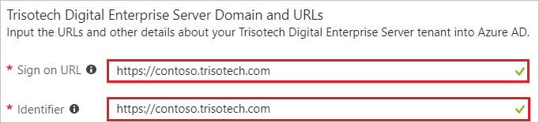
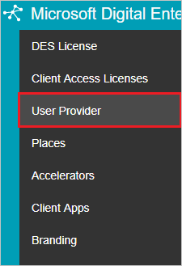
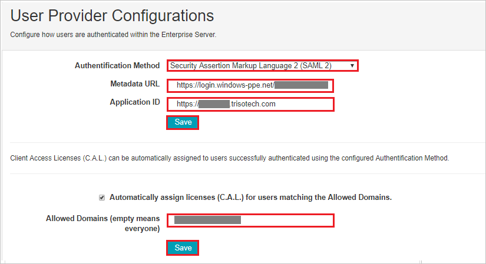
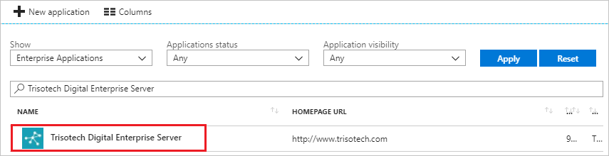

---
title: 'Tutorial: Azure Active Directory integration with Trisotech Digital Enterprise Server | Microsoft Docs'
description: Learn how to configure single sign-on between Azure Active Directory and Trisotech Digital Enterprise Server.
services: active-directory
documentationCenter: na
author: jeevansd
manager: femila
ms.reviewer: joflore

ms.assetid: 6d54d20c-eca1-4fa6-b56a-4c3ed0593db0
ms.service: active-directory
ms.component: saas-app-tutorial
ms.workload: identity
ms.tgt_pltfrm: na
ms.devlang: na
ms.topic: article
ms.date: 04/16/2018
ms.author: jeedes

---
# Tutorial: Azure Active Directory integration with Trisotech Digital Enterprise Server

In this tutorial, you learn how to integrate Trisotech Digital Enterprise Server with Azure Active Directory (Azure AD).

Integrating Trisotech Digital Enterprise Server with Azure AD provides you with the following benefits:

- You can control in Azure AD who has access to Trisotech Digital Enterprise Server.
- You can enable your users to automatically get signed-on to Trisotech Digital Enterprise Server (Single Sign-On) with their Azure AD accounts.
- You can manage your accounts in one central location - the Azure portal.

If you want to know more details about SaaS app integration with Azure AD, see [what is application access and single sign-on with Azure Active Directory](../manage-apps/what-is-single-sign-on.md).

## Prerequisites

To configure Azure AD integration with Trisotech Digital Enterprise Server, you need the following items:

- An Azure AD subscription
- A Trisotech Digital Enterprise Server single sign-on enabled subscription

> [!NOTE]
> To test the steps in this tutorial, we do not recommend using a production environment.

To test the steps in this tutorial, you should follow these recommendations:

- Do not use your production environment, unless it is necessary.
- If you don't have an Azure AD trial environment, you can [get a one-month trial](https://azure.microsoft.com/pricing/free-trial/).

## Scenario description
In this tutorial, you test Azure AD single sign-on in a test environment. 
The scenario outlined in this tutorial consists of two main building blocks:

1. Adding Trisotech Digital Enterprise Server from the gallery
1. Configuring and testing Azure AD single sign-on

## Adding Trisotech Digital Enterprise Server from the gallery
To configure the integration of Trisotech Digital Enterprise Server into Azure AD, you need to add Trisotech Digital Enterprise Server from the gallery to your list of managed SaaS apps.

**To add Trisotech Digital Enterprise Server from the gallery, perform the following steps:**

1. In the **[Azure portal](https://portal.azure.com)**, on the left navigation panel, click **Azure Active Directory** icon. 

	![The Azure Active Directory button][1]

1. Navigate to **Enterprise applications**. Then go to **All applications**.

	![The Enterprise applications blade][2]
	
1. To add new application, click **New application** button on the top of dialog.

	![The New application button][3]

1. In the search box, type **Trisotech Digital Enterprise Server**, select **Trisotech Digital Enterprise Server** from result panel then click **Add** button to add the application.

	

## Configure and test Azure AD single sign-on

In this section, you configure and test Azure AD single sign-on with Trisotech Digital Enterprise Server based on a test user called "Britta Simon".

For single sign-on to work, Azure AD needs to know what the counterpart user in Trisotech Digital Enterprise Server is to a user in Azure AD. In other words, a link relationship between an Azure AD user and the related user in Trisotech Digital Enterprise Server needs to be established.

To configure and test Azure AD single sign-on with Trisotech Digital Enterprise Server, you need to complete the following building blocks:

1. **[Configure Azure AD Single Sign-On](#configure-azure-ad-single-sign-on)** - to enable your users to use this feature.
1. **[Create an Azure AD test user](#create-an-azure-ad-test-user)** - to test Azure AD single sign-on with Britta Simon.
1. **[Create a Trisotech Digital Enterprise Server test user](#create-a-trisotech-digital-enterprise-server-test-user)** - to have a counterpart of Britta Simon in Trisotech Digital Enterprise Server that is linked to the Azure AD representation of user.
1. **[Assign the Azure AD test user](#assign-the-azure-ad-test-user)** - to enable Britta Simon to use Azure AD single sign-on.
1. **[Test single sign-on](#test-single-sign-on)** - to verify whether the configuration works.

### Configure Azure AD single sign-on

In this section, you enable Azure AD single sign-on in the Azure portal and configure single sign-on in your Trisotech Digital Enterprise Server application.

**To configure Azure AD single sign-on with Trisotech Digital Enterprise Server, perform the following steps:**

1. In the Azure portal, on the **Trisotech Digital Enterprise Server** application integration page, click **Single sign-on**.

	![Configure single sign-on link][4]

1. On the **Single sign-on** dialog, select **Mode** as	**SAML-based Sign-on** to enable single sign-on.
 
	

1. On the **Trisotech Digital Enterprise Server Domain and URLs** section, perform the following steps:

	

    a. In the **Sign-on URL** textbox, type a URL using the following pattern: `https://<companyname>.trisotech.com`

	b. In the **Identifier** textbox, type a URL using the following pattern: `https://<companyname>.trisotech.com`

	> [!NOTE] 
	> These values are not real. Update these values with the actual Sign-On URL and Identifier. Contact [Trisotech Digital Enterprise Server Client support team](mailto:support@trisotech.com) to get these values.

1. On the **SAML Signing Certificate** section, click the copy button to copy **App Federation Metadata Url** and paste it into notepad. 

	

1. Click **Save** button.

	

1. In a different web browser window, log in to your Trisotech Digital Enterprise Server Configuration company site as an administrator.

1. Click on the **Menu icon** and then select **Administration**.

	

1. Select **User Provider**.

	

1. In the **User Provider Configurations** section, perform the following steps:

	

	a. Select **Secured Assertion Markup Language 2 (SAML 2)** from the dropdown in the **Authentication Method**.

	b. In the **Metadata URL** textbox, paste the **App Federation Metadata Url** value, which you have copied form the Azure portal.

	c. In the **Application ID** textbox, enter the URL using the following pattern: `https://<companyname>.trisotech.com`.

	d. Click **Save**

	e. Enter the domain name in the **Allowed Domains (empty means everyone)** textbox, it automatically assigns licenses for users matching the Allowed Domains

	f. Click **Save**

 ### Create an Azure AD test user

The objective of this section is to create a test user in the Azure portal called Britta Simon.

   ![Create an Azure AD test user][100]

**To create a test user in Azure AD, perform the following steps:**

1. In the Azure portal, in the left pane, click the **Azure Active Directory** button.

    

1. To display the list of users, go to **Users and groups**, and then click **All users**.

    

1. To open the **User** dialog box, click **Add** at the top of the **All Users** dialog box.

    

1. In the **User** dialog box, perform the following steps:

    

    a. In the **Name** box, type **BrittaSimon**.

    b. In the **User name** box, type the email address of user Britta Simon.

    c. Select the **Show Password** check box, and then write down the value that's displayed in the **Password** box.

    d. Click **Create**.
 
### Create a Trisotech Digital Enterprise Server test user

The objective of this section is to create a user called Britta Simon in Trisotech Digital Enterprise Server. Trisotech Digital Enterprise Server supports just-in-time provisioning, which is by default enabled. There is no action item for you in this section. A new user is created during an attempt to access Trisotech Digital Enterprise Server if it doesn't exist yet.
>[!Note]
>If you need to create a user manually, contact [Trisotech Digital Enterprise Server support team](mailto:support@trisotech.com).

### Assign the Azure AD test user

In this section, you enable Britta Simon to use Azure single sign-on by granting access to Trisotech Digital Enterprise Server.

![Assign the user role][200] 

**To assign Britta Simon to Trisotech Digital Enterprise Server, perform the following steps:**

1. In the Azure portal, open the applications view, and then navigate to the directory view and go to **Enterprise applications** then click **All applications**.

	![Assign User][201] 

1. In the applications list, select **Trisotech Digital Enterprise Server**.

	  

1. In the menu on the left, click **Users and groups**.

	![The "Users and groups" link][202]

1. Click **Add** button. Then select **Users and groups** on **Add Assignment** dialog.

	![The Add Assignment pane][203]

1. On **Users and groups** dialog, select **Britta Simon** in the Users list.

1. Click **Select** button on **Users and groups** dialog.

1. Click **Assign** button on **Add Assignment** dialog.
	
### Test single sign-on

In this section, you test your Azure AD single sign-on configuration using the Access Panel.

When you click the Trisotech Digital Enterprise Server tile in the Access Panel, you should get automatically signed-on to your Trisotech Digital Enterprise Server application.
For more information about the Access Panel, see [Introduction to the Access Panel](../user-help/active-directory-saas-access-panel-introduction.md). 

## Additional resources

* [List of Tutorials on How to Integrate SaaS Apps with Azure Active Directory](tutorial-list.md)
* [What is application access and single sign-on with Azure Active Directory?](../manage-apps/what-is-single-sign-on.md)

<!--Image references-->

[1]: ./media/trisotechdigitalenterpriseserver-tutorial/tutorial_general_01.png
[2]: ./media/trisotechdigitalenterpriseserver-tutorial/tutorial_general_02.png
[3]: ./media/trisotechdigitalenterpriseserver-tutorial/tutorial_general_03.png
[4]: ./media/trisotechdigitalenterpriseserver-tutorial/tutorial_general_04.png

[100]: ./media/trisotechdigitalenterpriseserver-tutorial/tutorial_general_100.png

[200]: ./media/trisotechdigitalenterpriseserver-tutorial/tutorial_general_200.png
[201]: ./media/trisotechdigitalenterpriseserver-tutorial/tutorial_general_201.png
[202]: ./media/trisotechdigitalenterpriseserver-tutorial/tutorial_general_202.png
[203]: ./media/trisotechdigitalenterpriseserver-tutorial/tutorial_general_203.png

