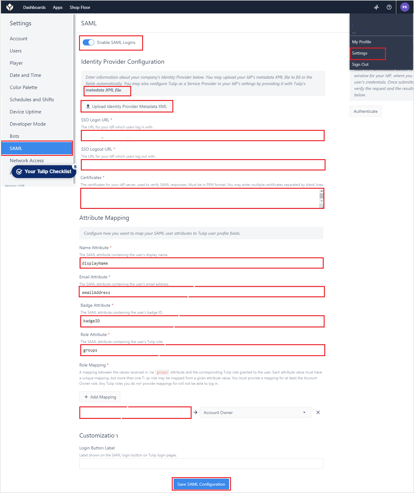

# Tutorial: Azure AD SSO integration with Tulip

In this tutorial, you'll learn how to integrate Tulip with Azure Active Directory (Azure AD). When you integrate Tulip with Azure AD, you can:

* Control in Azure AD who has access to Tulip.
* Enable your users to be automatically signed-in to Tulip with their Azure AD accounts.
* Manage your accounts in one central location - the Azure portal.

## Prerequisites

To get started, you need the following items:

* An Azure AD subscription. If you don't have a subscription, you can get a [free account](https://azure.microsoft.com/free/).
* Tulip single sign-on (SSO) enabled subscription.

> [!NOTE]
> This integration is also available to use from Azure AD US Government Cloud environment. You can find this application in the Azure AD US Government Cloud Application Gallery and configure it in the same way as you do from public cloud.

## Scenario description

In this tutorial, you configure and test Azure AD SSO in a test environment.

* Tulip supports **IDP** initiated SSO.

## Add Tulip from the gallery

To configure the integration of Tulip into Azure AD, you need to add Tulip from the gallery to your list of managed SaaS apps.

1. Sign in to the Azure portal using either a work or school account, or a personal Microsoft account.
1. On the left navigation pane, select the **Azure Active Directory** service.
1. Navigate to **Enterprise Applications** and then select **All Applications**.
1. To add new application, select **New application**.
1. In the **Add from the gallery** section, type **Tulip** in the search box.
1. Select **Tulip** from results panel and then add the app. Wait a few seconds while the app is added to your tenant.

 Alternatively, you can also use the [Enterprise App Configuration Wizard](https://portal.office.com/AdminPortal/home?Q=Docs#/azureadappintegration). In this wizard, you can add an application to your tenant, add users/groups to the app, assign roles, as well as walk through the SSO configuration as well. [Learn more about Microsoft 365 wizards.](/microsoft-365/admin/misc/azure-ad-setup-guides)

## Configure and test Azure AD SSO for Tulip

Configure and test Azure AD SSO with Tulip using a test user called **B.Simon**. For SSO to work, you need to establish a link relationship between an Azure AD user and the related user in Tulip.

To configure and test Azure AD SSO with Tulip, perform the following steps:

1. **[Configure Azure AD SSO](#configure-azure-ad-sso)** - to enable your users to use this feature.
    1. **[Create an Azure AD test user](#create-an-azure-ad-test-user)** - to test Azure AD single sign-on with B.Simon.
    1. **[Assign the Azure AD test user](#assign-the-azure-ad-test-user)** - to enable B.Simon to use Azure AD single sign-on.
1. **[Configure Tulip SSO](#configure-tulip-sso)** - to configure the single sign-on settings on application side.
    1. **[Create Tulip test user](#create-tulip-test-user)** - to have a counterpart of B.Simon in Tulip that is linked to the Azure AD representation of user.
1. **[Test SSO](#test-sso)** - to verify whether the configuration works.

## Configure Azure AD SSO

Follow these steps to enable Azure AD SSO in the Azure portal.

1. In the Azure portal, on the **Tulip** application integration page, find the **Manage** section and select **single sign-on**.
1. On the **Select a single sign-on method** page, select **SAML**.
1. On the **Set up single sign-on with SAML** page, click the pencil icon for **Basic SAML Configuration** to edit the settings.

   

1. On the **Basic SAML Configuration** section, if you have **Service Provider metadata file**, perform the following steps:

	a. Click **Upload metadata file**.

    

	b. Click on **folder logo** to select the metadata file and click **Upload**.

	

	c. Once the metadata file is successfully uploaded, the **Identifier** and **Reply URL** values get auto populated in Basic SAML Configuration section:

	

	> [!Note]
	> If the **Identifier** and **Reply URL** values are not getting auto populated, then fill in the values manually according to your requirement.

1. Tulip application expects the SAML assertions in a specific format, which requires you to add custom attribute mappings to your SAML token attributes configuration. The following screenshot shows the list of default attributes.

	

1. In addition to above, Tulip application expects few more attributes to be passed back in SAML response which are shown below. These attributes are also pre populated but you can review them as per your requirements.
	
	| Name |Source Attribute|
	| -------------- | --------- |
	| displayName | user.displayname |
	| emailAddress |user.mail |
	| badgeID |	user.employeeid |
	| groups |user.groups |

1. On the **Set up single sign-on with SAML** page, in the **SAML Signing Certificate** section,  find **Certificate (Base64)** and select **Download** to download the certificate and save it on your computer.

	

1. On the **Set up Tulip** section, copy the appropriate URL(s) based on your requirement.

	

### Create an Azure AD test user

In this section, you'll create a test user in the Azure portal called B.Simon.

1. From the left pane in the Azure portal, select **Azure Active Directory**, select **Users**, and then select **All users**.
1. Select **New user** at the top of the screen.
1. In the **User** properties, follow these steps:
   1. In the **Name** field, enter `B.Simon`.  
   1. In the **User name** field, enter the username@companydomain.extension. For example, `B.Simon@contoso.com`.
   1. Select the **Show password** check box, and then write down the value that's displayed in the **Password** box.
   1. Click **Create**.

### Assign the Azure AD test user

In this section, you'll enable B.Simon to use Azure single sign-on by granting access to Tulip.

1. In the Azure portal, select **Enterprise Applications**, and then select **All applications**.
1. In the applications list, select **Tulip**.
1. In the app's overview page, find the **Manage** section and select **Users and groups**.
1. Select **Add user**, then select **Users and groups** in the **Add Assignment** dialog.
1. In the **Users and groups** dialog, select **B.Simon** from the Users list, then click the **Select** button at the bottom of the screen.
1. If you are expecting a role to be assigned to the users, you can select it from the **Select a role** dropdown. If no role has been set up for this app, you see "Default Access" role selected.
1. In the **Add Assignment** dialog, click the **Assign** button.

## Configure Tulip SSO

1. Log in to your Tulip website as administrator.

1. Go to the **Settings** -> **SAML** and perform the following steps in the below page.

	

	a. **Enable SAML Logins**. 

	b. Click on **metadata xml file** to download the **Service Provider metadata file** and use this file to upload in the **Basic SAML Configuration** section in Azure portal.

	c. In the **SSO Login URL** textbox, paste the **Login URL** value which you have copied from the Azure portal.

	d. In the **SSO Logout URL** textbox, paste the **Logout URL** value which you have copied from the Azure portal.

	e. Open the downloaded **Certificate (Base64)** from the Azure portal into Notepad and paste the content into the **Certificates** textbox.

	f. In the **Attribute Mapping**,
	
	 * give the **Name Attribute** value as **displayName**.

	 * give the **Email Attribute** value as **emailAddress**.

	 * give the **Badge Attribute** value as **badgeID**.

	 * give the **Role Attribute** value as **groups**.

	g. In the **Role Mapping**, map the group's ObjectID with Account Owner.

	h. Click **Save SAML Configuration**.

### Create Tulip test user

In this section, you create a user called Britta Simon in Tulip. Work with [Tulip support team](mailto:support@tulip.co) to add the users in the Tulip platform. Users must be created and activated before you use single sign-on.

## Test SSO 

In this section, you test your Azure AD single sign-on configuration with following options.

* Click on Test this application in Azure portal and you should be automatically signed in to the Tulip for which you set up the SSO.

* You can use Microsoft My Apps. When you click the Tulip tile in the My Apps, you should be automatically signed in to the Tulip for which you set up the SSO. For more information about the My Apps, see [Introduction to the My Apps](https://support.microsoft.com/account-billing/sign-in-and-start-apps-from-the-my-apps-portal-2f3b1bae-0e5a-4a86-a33e-876fbd2a4510).

## Next steps

Once you configure Tulip you can enforce session control, which protects exfiltration and infiltration of your organization’s sensitive data in real time. Session control extends from Conditional Access. [Learn how to enforce session control with Microsoft Defender for Cloud Apps](/cloud-app-security/proxy-deployment-any-app).