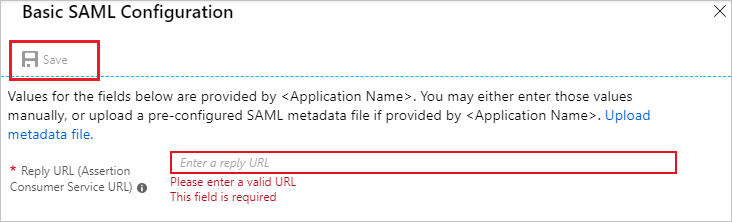

# Tutorial: Azure Active Directory integration with Uberflip

In this tutorial, you learn how to integrate Uberflip with Azure Active Directory (Azure AD).

Integrating Uberflip with Azure AD provides you with the following benefits:

* You can control in Azure AD who has access to Uberflip.
* You can enable your users to be automatically signed in to Uberflip (single sign-on) with their Azure AD accounts.
* You can manage your accounts in one central location: the Azure portal.

For details about software as a service (SaaS) app integration with Azure AD, see [What is application access and single sign-on with Azure Active Directory?](https://docs.microsoft.com/azure/active-directory/active-directory-appssoaccess-whatis).

## Prerequisites

To configure Azure AD integration with Uberflip, you need the following items:

* An Azure AD subscription. If you don't have an Azure subscription, [create a free account](https://azure.microsoft.com/free/) before you begin.
* An Uberflip subscription with single sign-on enabled.

## Scenario description

In this tutorial, you configure and test Azure AD single sign-on in a test environment.

Uberflip supports the following features:

* SP-initiated and IDP-initiated single sign-on (SSO).
* Just-in-time user provisioning.

## Add Uberflip from the Azure Marketplace

To configure the integration of Uberflip into Azure AD, you need to add Uberflip from the Azure Marketplace to your list of managed SaaS apps:

1. Sign in to the [Azure portal](https://portal.azure.com).
1. In the left pane, select **Azure Active Directory**.

   

1. Go to **Enterprise Applications**, and then select **All Applications**.

   

1. To add a new application, select **+ New application** at the top of the pane.

   

1. In the search box, enter **Uberflip**. In the search results, select **Uberflip**, and then select **Add** to add the application.

   

## Configure and test Azure AD single sign-on

In this section, you configure and test Azure AD single sign-on with Uberflip based on a test user named **B Simon**. For single sign-on to work, you need to establish a link between an Azure AD user and a related user in Uberflip.

To configure and test Azure AD single sign-on with Uberflip, you need to complete the following building blocks:

1. **[Configure Azure AD single sign-on](#configure-azure-ad-single-sign-on)** to enable your users to use this feature.
1. **[Configure Uberflip single sign-on](#configure-uberflip-single-sign-on)** to configure the single sign-on settings on the application side.
1. **[Create an Azure AD test user](#create-an-azure-ad-test-user)** to test Azure AD single sign-on with B. Simon.
1. **[Assign the Azure AD test user](#assign-the-azure-ad-test-user)** to enable B. Simon to use Azure AD single sign-on.
1. **[Create an Uberflip test user](#create-an-uberflip-test-user)** so that there's a user named B. Simon in Uberflip who's linked to the Azure AD user named B. Simon.
1. **[Test single sign-on](#test-single-sign-on)** to verify whether the configuration works.

### Configure Azure AD single sign-on

In this section, you enable Azure AD single sign-on in the Azure portal.

To configure Azure AD single sign-on with Uberflip, take the following steps:

1. In the [Azure portal](https://portal.azure.com/), on the **Uberflip** application integration page, select **Single sign-on**.

    

1. In the **Select a single sign-on method** pane, select **SAML/WS-Fed** mode to enable single sign-on.

    

1. On the **Set up Single Sign-On with SAML** pane, select **Edit** (the pencil icon) to open the **Basic SAML Configuration** pane.

   

1. On the **Basic SAML Configuration** pane, do one of the following steps, depending on which SSO mode you want to configure:

   * To configure the application in IDP-initiated SSO mode, in the **Reply URL (Assertion Consumer Service URL)** box, enter a URL by using the following pattern:

     `https://app.uberflip.com/sso/saml2/<IDPID>/<ACCOUNTID>`

     

     > [!NOTE]
     > This value isn't real. Update this value with the actual reply URL. To get the actual value, contact the [Uberflip support team](mailto:support@uberflip.com). You can also refer to the patterns shown in the **Basic SAML Configuration** pane in the Azure portal.

   * To configure the application in SP-initiated SSO mode, select **Set additional URLs**, and in the **Sign-on URL** box, enter this URL:

     `https://app.uberflip.com/users/login`

     

1. On the **Set up Single Sign-On with SAML** pane, in the **SAML Signing Certificate** section, select **Download** to download the **Federation Metadata XML** from the given options and save it on your computer.

   

1. In the **Set up Uberflip** pane, copy the URL or URLs that you need:

   * **Login URL**
   * **Azure AD Identifier**
   * **Logout URL**

   

### Configure Uberflip single sign-on

To configure single sign-on on the Uberflip side, you need to send the downloaded Federation Metadata XML and the appropriate copied URLs from the Azure portal to the [Uberflip support team](mailto:support@uberflip.com). The Uberflip team will make sure the SAML SSO connection is set properly on both sides.

### Create an Azure AD test user

In this section, you create a test user named B. Simon in the Azure portal.

1. In the Azure portal, in the left pane, select **Azure Active Directory** > **Users** > **All users**.

    

1. At the top of the screen, select **+ New user**.

    

1. In the **User** pane, do the following steps:

    

    1. In the **Name** box, enter **BSimon**.
  
    1. In the **User name** box, enter **BSimon\@\<yourcompanydomain>.\<extension>**. For example, **BSimon\@contoso.com**.

    1. Select the **Show password** check box, and then write down the value that's displayed in the **Password** box.

    1. Select **Create**.

### Assign the Azure AD test user

In this section, you enable B. Simon to use Azure single sign-on by granting their access to Uberflip.

1. In the Azure portal, select **Enterprise Applications** > **All applications** > **Uberflip**.

    

1. In the applications list, select **Uberflip**.

    

1. In the left pane, under **MANAGE**, select **Users and groups**.

    

1. Select **+ Add user**, and then select **Users and groups** in the **Add Assignment** pane.

    

1. In the **Users and groups** pane, select **B Simon** in the **Users** list, and then choose **Select** at the bottom of the pane.

1. If you're expecting a role value in the SAML assertion, then in the **Select Role** pane, select the appropriate role for the user from the list. At the bottom of the pane, choose **Select**.

1. In the **Add Assignment** pane, select **Assign**.

### Create an Uberflip test user

A user named B. Simon is now created in Uberflip. You don't have to do anything to create this user. Uberflip supports just-in-time user provisioning, which is enabled by default. If a user named B. Simon doesn't already exist in Uberflip, a new one is created after authentication.

> [!NOTE]
> If you need to create a user manually, contact the [Uberflip support team](mailto:support@uberflip.com).

### Test single sign-on

In this section, you test your Azure AD single sign-on configuration by using the My Apps portal.

When you select **Uberflip** in the My Apps portal, you should be automatically signed in to the Uberflip subscription for which you set up single sign-on. For more information about the My Apps portal, see [Access and use apps on the My Apps portal](https://docs.microsoft.com/azure/active-directory/active-directory-saas-access-panel-introduction).

## Additional resources

* [List of tutorials for integrating SaaS applications with Azure Active Directory](https://docs.microsoft.com/azure/active-directory/active-directory-saas-tutorial-list)

* [What is application access and single sign-on with Azure Active Directory?](https://docs.microsoft.com/azure/active-directory/active-directory-appssoaccess-whatis)

* [What is Conditional Access in Azure Active Directory?](https://docs.microsoft.com/azure/active-directory/conditional-access/overview)
