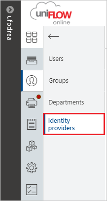

# Tutorial: Azure Active Directory single sign-on (SSO) integration with uniFLOW Online

In this tutorial, you'll learn how to integrate uniFLOW Online with Azure Active Directory (Azure AD). When you integrate uniFLOW Online with Azure AD, you can:

* Control in Azure AD who has access to uniFLOW Online.
* Enable your users to sign in to uniFLOW Online with their Azure AD accounts.
* Manage your accounts in one central location - the Azure portal.

## Prerequisites

To get started, you need the following items:

* An Azure AD subscription. If you don't have a subscription, you can get a [free account](https://azure.microsoft.com/free/).
* uniFLOW Online tenant.

## Scenario description

In this tutorial, you configure and test Azure AD SSO in a test environment.

* uniFLOW Online supports **SP** initiated SSO

## Add uniFLOW Online from the gallery

To configure the integration of uniFLOW Online into Azure AD, you need to add uniFLOW Online from the gallery to your list of managed SaaS apps.

1. Sign in to the Azure portal using either a work or school account, or a personal Microsoft account.
1. On the left navigation pane, select the **Azure Active Directory** service.
1. Navigate to **Enterprise Applications** and then select **All Applications**.
1. To add new application, select **New application**.
1. In the **Add from the gallery** section, type **uniFLOW Online** in the search box.
1. Select **uniFLOW Online** from results panel and then add the app. Wait a few seconds while the app is added to your tenant.

## Configure and test Azure AD SSO for uniFLOW Online

Configure and test Azure AD SSO with uniFLOW Online using a test user called **B.Simon**. For SSO to work, you need to establish a link relationship between an Azure AD user and the related user in uniFLOW Online.

To configure and test Azure AD SSO with uniFLOW Online, perform the following steps:

1. **[Configure Azure AD SSO](#configure-azure-ad-sso)** - to enable your users to use this feature.
   1. **[Create an Azure AD test user](#create-an-azure-ad-test-user)** - to test Azure AD single sign-on with B.Simon.
   1. **[Assign the Azure AD test user](#assign-the-azure-ad-test-user)** - to enable B.Simon to use Azure AD single sign-on.
1. **[Configure uniFLOW Online SSO](#configure-uniflow-online-sso)** - to configure the single sign-on settings on application side.
    1. **[Sign in to uniFLOW Online using the created test user](#sign-in-to-uniflow-online-using-the-created-test-user)** - to test user sign-in on the application side.
1. **[Test SSO](#test-sso)** - to verify whether the configuration works.

## Configure Azure AD SSO

Follow these steps to enable Azure AD SSO in the Azure portal.

1. In the Azure portal, on the **uniFLOW Online** application integration page, find the **Manage** section and select **single sign-on**.
1. On the **Select a single sign-on method** page, select **SAML**.
1. On the **Set up single sign-on with SAML** page, click the pencil icon for **Basic SAML Configuration** to edit the settings.

   

1. On the **Basic SAML Configuration** section, enter the values for the following fields:

	a. In the **Sign on URL** text box, type a URL using one of the following patterns:

	- `https://<tenant_domain_name>.eu.uniflowonline.com`
	- `https://<tenant_domain_name>.us.uniflowonline.com`
	- `https://<tenant_domain_name>.sg.uniflowonline.com`
	- `https://<tenant_domain_name>.jp.uniflowonline.com`
	- `https://<tenant_domain_name>.au.uniflowonline.com`

    b. In the **Identifier (Entity ID)** text box, type a URL using one of the following patterns:

	- `https://<tenant_domain_name>.eu.uniflowonline.com`
	- `https://<tenant_domain_name>.us.uniflowonline.com`
	- `https://<tenant_domain_name>.sg.uniflowonline.com`
	- `https://<tenant_domain_name>.jp.uniflowonline.com`
	- `https://<tenant_domain_name>.au.uniflowonline.com`

	> [!NOTE]
	> These values are not real. Update these values with the actual Sign on URL and Identifier. Contact [uniFLOW Online Client support team](mailto:support@nt-ware.com) to get these values. You can also refer to the patterns shown in the **Basic SAML Configuration** section in the Azure portal or refer to the reply URL displayed in your uniFLOW Online tenant.

1. uniFLOW Online application expects the SAML assertions in a specific format, which requires you to add custom attribute mappings to your SAML token attributes configuration. The following screenshot shows the list of default attributes.

	

1. In addition to above, uniFLOW Online application expects few more attributes to be passed back in SAML response which are shown below. These attributes are also pre populated but you can review them as per your requirements.

	| Name |  Source Attribute|
	| -----------| --------------- |
	| displayname | user.displayname |
	| nickname | user.onpremisessamaccountname |

   > [!NOTE]
   > The `user.onpremisessamaccountname` attribute will contain a value only if your Azure AD users are synced from a local Windows Active Directory.

1. On the **Set up single sign-on with SAML** page, In the **SAML Signing Certificate** section, click copy button to copy **App Federation Metadata Url** and save it on your computer.

	

### Create an Azure AD test user

In this section, you'll create a test user in the Azure portal called B.Simon.

1. From the left pane in the Azure portal, select **Azure Active Directory**, select **Users**, and then select **All users**.
1. Select **New user** at the top of the screen.
1. In the **User** properties, follow these steps:
   1. In the **Name** field, enter `B.Simon`.  
   1. In the **User name** field, enter the username@companydomain.extension. For example, `B.Simon@contoso.com`.
   1. Select the **Show password** check box, and then write down the value that's displayed in the **Password** box.
   1. Click **Create**.

### Assign the Azure AD test user

In this section, you'll enable B.Simon to use Azure single sign-on by granting access to uniFLOW Online.

1. In the Azure portal, select **Enterprise Applications**, and then select **All applications**.
1. In the applications list, select **uniFLOW Online**.
1. In the app's overview page, find the **Manage** section and select **Users and groups**.
1. Select **Add user**, then select **Users and groups** in the **Add Assignment** dialog.
1. In the **Users and groups** dialog, select **B.Simon** from the Users list, then click the **Select** button at the bottom of the screen.
1. If you are expecting a role to be assigned to the users, you can select it from the **Select a role** dropdown. If no role has been set up for this app, you see "Default Access" role selected.
1. In the **Add Assignment** dialog, click the **Assign** button.

> [!NOTE]
> To allow all users to access the application without manual assignment, go to the **Manage** section and select **Properties**. Then, change the **User assignment required** parameter to **NO**.

## Configure uniFLOW Online SSO

1. In a different web browser window, sign in to uniFLOW Online website as an administrator.

1. From the left navigation panel, select **User** tab.

	

1. Click **Identity providers**.

	

1. Click on **Add identity provider**.

	

1. On the **ADD IDENTITY PROVIDER** section, perform the following steps:

	

	a. Enter the Display name Ex: *AzureAD SSO*.

	b. For **Provider type**, select **WS-Fed** option from the dropdown.

	c. For **WS-Fed type**, select **Azure Active Directory** option from the dropdown.

	d. Click **Save**.

1. On the **General** tab, perform the following steps:

	

	a. Enter the Display name Ex: *AzureAD SSO*.

	b. Select the **From URL** option for the **ADFS Federation Metadata**.

	c. In the **Federation Metadata URl** textbox, paste the **App Federation Metadata Url** value, which you have copied from the Azure portal.

	d. Select **Identity provider** as **Enabled**.

	e. Select **Automatic user registration** as **Activated**.

	f. Click **Save**.

### Sign in to uniFLOW Online using the created test user

1. In a different web browser window, go to the uniFLOW Online URL for your tenant.

1. Select the previously created identity provider to sign-in via your Azure AD instance.

1. Sign in using the test user.

## Test SSO

In this section, you test your Azure AD single sign-on configuration with following options. 

* Click on **Test this application** in Azure portal. This will redirect to uniFLOW Online Sign-on URL where you can initiate the login flow. 

* Go to uniFLOW Online Sign-on URL directly and initiate the login flow from there.

* You can use Microsoft My Apps. When you click the uniFLOW Online tile in the My Apps, this will redirect to uniFLOW Online Sign-on URL. For more information about the My Apps, see [Introduction to the My Apps](../user-help/my-apps-portal-end-user-access.md).

## Next steps

Once you configure uniFLOW Online you can enforce session control, which protects exfiltration and infiltration of your organization’s sensitive data in real time. Session control extends from Conditional Access. [Learn how to enforce session control with Microsoft Cloud App Security](/cloud-app-security/proxy-deployment-any-app).