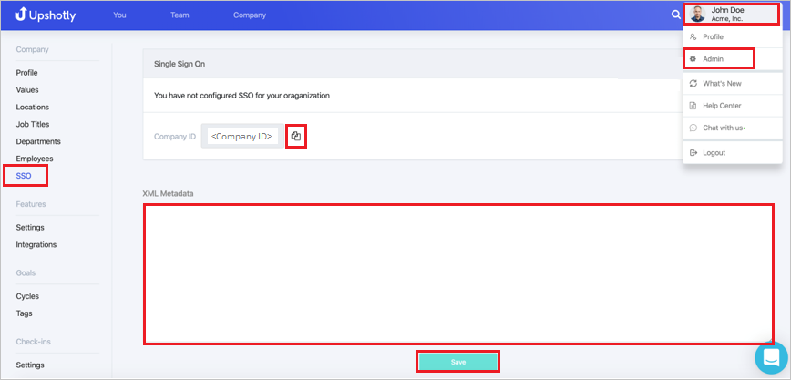

# Tutorial: Azure Active Directory single sign-on (SSO) integration with Upshotly

In this tutorial, you'll learn how to integrate Upshotly with Azure Active Directory (Azure AD). When you integrate Upshotly with Azure AD, you can:

* Control in Azure AD who has access to Upshotly.
* Enable your users to be automatically signed-in to Upshotly with their Azure AD accounts.
* Manage your accounts in one central location - the Azure portal.

To learn more about SaaS app integration with Azure AD, see [What is application access and single sign-on with Azure Active Directory](https://docs.microsoft.com/azure/active-directory/active-directory-appssoaccess-whatis).

## Prerequisites

To get started, you need the following items:

* An Azure AD subscription. If you don't have a subscription, you can get a [free account](https://azure.microsoft.com/free/).
* Upshotly single sign-on (SSO) enabled subscription.

## Scenario description

In this tutorial, you configure and test Azure AD SSO in a test environment.

* Upshotly supports **SP and IDP** initiated SSO

## Adding Upshotly from the gallery

To configure the integration of Upshotly into Azure AD, you need to add Upshotly from the gallery to your list of managed SaaS apps.

1. Sign in to the [Azure portal](https://portal.azure.com) using either a work or school account, or a personal Microsoft account.
1. On the left navigation pane, select the **Azure Active Directory** service.
1. Navigate to **Enterprise Applications** and then select **All Applications**.
1. To add new application, select **New application**.
1. In the **Add from the gallery** section, type **Upshotly** in the search box.
1. Select **Upshotly** from results panel and then add the app. Wait a few seconds while the app is added to your tenant.

## Configure and test Azure AD single sign-on for Upshotly

Configure and test Azure AD SSO with Upshotly using a test user called **B.Simon**. For SSO to work, you need to establish a link relationship between an Azure AD user and the related user in Upshotly.

To configure and test Azure AD SSO with Upshotly, complete the following building blocks:

1. **[Configure Azure AD SSO](#configure-azure-ad-sso)** - to enable your users to use this feature.
    * **[Create an Azure AD test user](#create-an-azure-ad-test-user)** - to test Azure AD single sign-on with B.Simon.
    * **[Assign the Azure AD test user](#assign-the-azure-ad-test-user)** - to enable B.Simon to use Azure AD single sign-on.
1. **[Configure Upshotly SSO](#configure-upshotly-sso)** - to configure the single sign-on settings on application side.
    * **[Create Upshotly test user](#create-upshotly-test-user)** - to have a counterpart of B.Simon in Upshotly that is linked to the Azure AD representation of user.
1. **[Test SSO](#test-sso)** - to verify whether the configuration works.

## Configure Azure AD SSO

Follow these steps to enable Azure AD SSO in the Azure portal.

1. In the [Azure portal](https://portal.azure.com/), on the **Upshotly** application integration page, find the **Manage** section and select **single sign-on**.
1. On the **Select a single sign-on method** page, select **SAML**.
1. On the **Set up single sign-on with SAML** page, click the edit/pen icon for **Basic SAML Configuration** to edit the settings.

   

1. On the **Basic SAML Configuration** section, if you wish to configure the application in **IDP** initiated mode, the application is pre-configured and the necessary URLs are already pre-populated with Azure. The user needs to save the configuration by clicking the **Save** button.

1. Click **Set additional URLs** and perform the following step if you wish to configure the application in **SP** initiated mode:

    In the **Sign-on URL** text box, type a URL using the following pattern:
    `https://app.upshotly.com/api/sso/login/<companyID>`

	> [!NOTE]
	> The Sign-on URL value is not real. Update this values with the actual Sign-on URL. You will get the **companyID** value explained later in the tutorial. Contact [Upshotly Client support team](mailto:support@upshotly.com) for queries. You can also refer to the patterns shown in the **Basic SAML Configuration** section in the Azure portal.

1. On the **Set up single sign-on with SAML** page, in the **SAML Signing Certificate** section,  find **Federation Metadata XML** and select **Download** to download the certificate and save it on your computer.

	

1. On the **Set up Upshotly** section, copy the appropriate URL(s) based on your requirement.

	

### Create an Azure AD test user

In this section, you'll create a test user in the Azure portal called B.Simon.

1. From the left pane in the Azure portal, select **Azure Active Directory**, select **Users**, and then select **All users**.
1. Select **New user** at the top of the screen.
1. In the **User** properties, follow these steps:
   1. In the **Name** field, enter `B.Simon`.  
   1. In the **User name** field, enter the username@companydomain.extension. For example, `B.Simon@contoso.com`.
   1. Select the **Show password** check box, and then write down the value that's displayed in the **Password** box.
   1. Click **Create**.

### Assign the Azure AD test user

In this section, you'll enable B.Simon to use Azure single sign-on by granting access to Upshotly.

1. In the Azure portal, select **Enterprise Applications**, and then select **All applications**.
1. In the applications list, select **Upshotly**.
1. In the app's overview page, find the **Manage** section and select **Users and groups**.

   

1. Select **Add user**, then select **Users and groups** in the **Add Assignment** dialog.

	

1. In the **Users and groups** dialog, select **B.Simon** from the Users list, then click the **Select** button at the bottom of the screen.
1. If you're expecting any role value in the SAML assertion, in the **Select Role** dialog, select the appropriate role for the user from the list and then click the **Select** button at the bottom of the screen.
1. In the **Add Assignment** dialog, click the **Assign** button.

## Configure Upshotly SSO

1. In a different web browser window, sign in to your Upshotly company site as an administrator.

1. Click on the **User Profile** and navigate to **Admin > SSO** and perform the following steps:

	

	a. Copy the **Company ID** value and use this **Company ID** value to replace **Company ID** value present in the **Sign On URL** in the **Basic SAML Configuration** section in the Azure portal.

	b. Open downloaded **Federation metadata XML** from Azure portal into Notepad, copy the content of metadata XML and paste it into **XML metadata** textbox.

### Create Upshotly test user

In this section, you create a user called B.Simon in Upshotly Edge Cloud. Work with [Upshotly Client support team](mailto:support@upshotly.com) to add the users in the Upshotly Edge Cloud platform. Users must be created and activated before you use single sign-on.

## Test SSO 

In this section, you test your Azure AD single sign-on configuration using the Access Panel.

When you click the Upshotly tile in the Access Panel, you should be automatically signed in to the Upshotly for which you set up SSO. For more information about the Access Panel, see [Introduction to the Access Panel](https://docs.microsoft.com/azure/active-directory/active-directory-saas-access-panel-introduction).

## Additional resources

- [ List of Tutorials on How to Integrate SaaS Apps with Azure Active Directory ](https://docs.microsoft.com/azure/active-directory/active-directory-saas-tutorial-list)

- [What is application access and single sign-on with Azure Active Directory? ](https://docs.microsoft.com/azure/active-directory/active-directory-appssoaccess-whatis)

- [What is conditional access in Azure Active Directory?](https://docs.microsoft.com/azure/active-directory/conditional-access/overview)

- [Try Upshotly with Azure AD](https://aad.portal.azure.com/)