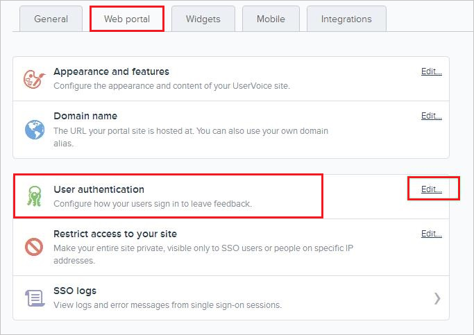
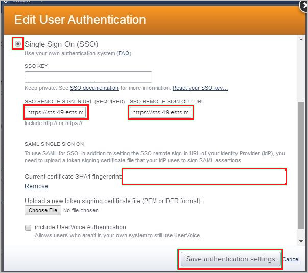
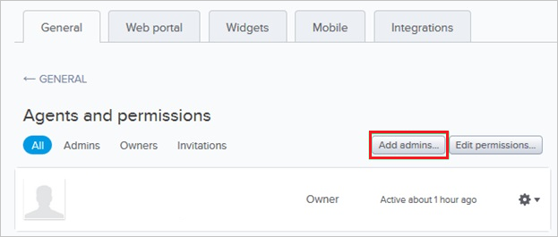

# Tutorial: Azure Active Directory integration with UserVoice

In this tutorial, you'll learn how to integrate UserVoice with Azure Active Directory (Azure AD). When you integrate UserVoice with Azure AD, you can:

* Control in Azure AD who has access to UserVoice.
* Enable your users to be automatically signed-in to UserVoice with their Azure AD accounts.
* Manage your accounts in one central location - the Azure portal.

## Prerequisites

To configure Azure AD integration with UserVoice, you need the following items:

* An Azure AD subscription. If you don't have an Azure AD environment, you can get a [free account](https://azure.microsoft.com/free/).
* UserVoice single sign-on enabled subscription.

## Scenario description

In this tutorial, you configure and test Azure AD single sign-on in a test environment.

* UserVoice supports **SP** initiated SSO.

## Add UserVoice from the gallery

To configure the integration of UserVoice into Azure AD, you need to add UserVoice from the gallery to your list of managed SaaS apps.

1. Sign in to the Azure portal using either a work or school account, or a personal Microsoft account.
1. On the left navigation pane, select the **Azure Active Directory** service.
1. Navigate to **Enterprise Applications** and then select **All Applications**.
1. To add new application, select **New application**.
1. In the **Add from the gallery** section, type **UserVoice** in the search box.
1. Select **UserVoice** from results panel and then add the app. Wait a few seconds while the app is added to your tenant.

 Alternatively, you can also use the [Enterprise App Configuration Wizard](https://portal.office.com/AdminPortal/home?Q=Docs#/azureadappintegration). In this wizard, you can add an application to your tenant, add users/groups to the app, assign roles, as well as walk through the SSO configuration as well. [Learn more about Microsoft 365 wizards.](/microsoft-365/admin/misc/azure-ad-setup-guides)

## Configure and test Azure AD SSO for UserVoice

Configure and test Azure AD SSO with UserVoice using a test user called **B.Simon**. For SSO to work, you need to establish a link relationship between an Azure AD user and the related user in UserVoice.

To configure and test Azure AD SSO with UserVoice, perform the following steps:

1. **[Configure Azure AD SSO](#configure-azure-ad-sso)** - to enable your users to use this feature.
    1. **[Create an Azure AD test user](#create-an-azure-ad-test-user)** - to test Azure AD single sign-on with B.Simon.
    1. **[Assign the Azure AD test user](#assign-the-azure-ad-test-user)** - to enable B.Simon to use Azure AD single sign-on.
1. **[Configure UserVoice SSO](#configure-uservoice-sso)** - to configure the single sign-on settings on application side.
    1. **[Create UserVoice test user](#create-uservoice-test-user)** - to have a counterpart of B.Simon in UserVoice that is linked to the Azure AD representation of user.
1. **[Test SSO](#test-sso)** - to verify whether the configuration works.

## Configure Azure AD SSO

Follow these steps to enable Azure AD SSO in the Azure portal.

1. In the Azure portal, on the **UserVoice** application integration page, find the **Manage** section and select **single sign-on**.
1. On the **Select a single sign-on method** page, select **SAML**.
1. On the **Set up single sign-on with SAML** page, click the pencil icon for **Basic SAML Configuration** to edit the settings.

   

4. On the **Basic SAML Configuration** section, perform the following steps:

    a. In the **Identifier (Entity ID)** text box, type a URL using the following pattern:
    `https://<TENANT_NAME>.UserVoice.com`

    b. In the **Sign on URL** text box, type a URL using the following pattern:
    `https://<TENANT_NAME>.UserVoice.com`

	> [!NOTE]
	> These values are not real. Update these values with the actual Identifier and Sign on URL. Contact [UserVoice Client support team](https://www.uservoice.com/) to get these values. You can also refer to the patterns shown in the **Basic SAML Configuration** section in the Azure portal.

5. In the **SAML Signing Certificate** section, click **Edit** button to open **SAML Signing Certificate** dialog.

	

6. In the **SAML Signing Certificate** section, copy the **Thumbprint** and save it on your computer.

    

7. On the **Set up UserVoice** section, copy the appropriate URL(s) as per your requirement.

	

### Create an Azure AD test user 

In this section, you'll create a test user in the Azure portal called B.Simon.

1. From the left pane in the Azure portal, select **Azure Active Directory**, select **Users**, and then select **All users**.
1. Select **New user** at the top of the screen.
1. In the **User** properties, follow these steps:
   1. In the **Name** field, enter `B.Simon`.  
   1. In the **User name** field, enter the username@companydomain.extension. For example, `B.Simon@contoso.com`.
   1. Select the **Show password** check box, and then write down the value that's displayed in the **Password** box.
   1. Click **Create**.

### Assign the Azure AD test user

In this section, you'll enable B.Simon to use Azure single sign-on by granting access to UserVoice.

1. In the Azure portal, select **Enterprise Applications**, and then select **All applications**.
1. In the applications list, select **UserVoice**.
1. In the app's overview page, find the **Manage** section and select **Users and groups**.
1. Select **Add user**, then select **Users and groups** in the **Add Assignment** dialog.
1. In the **Users and groups** dialog, select **B.Simon** from the Users list, then click the **Select** button at the bottom of the screen.
1. If you are expecting a role to be assigned to the users, you can select it from the **Select a role** dropdown. If no role has been set up for this app, you see "Default Access" role selected.
1. In the **Add Assignment** dialog, click the **Assign** button.

## Configure UserVoice SSO

1. In a different web browser window, sign in to your UserVoice company site as an administrator.

2. In the toolbar on the top, click **Settings**, and then select **Web portal** from the menu.
   
    

3. On the **Web portal** tab, in the **User authentication** section, click **Edit** to open the **Edit User Authentication** dialog page.
   
    

4. On the **Edit User Authentication** dialog page, perform the following steps:
   
    
   
    a. Click **Single Sign-On (SSO)**.
 
    b. Paste the **Login URL** value, which you have copied from the Azure portal into the **SSO Remote Sign-In** textbox.

    c. Paste the **Logout URL** value, which you have copied from the Azure portal into the **SSO Remote Sign-Out textbox**.
 
    d. Paste the **Thumbprint** value, which you have copied from Azure portal  into the **Current certificate SHA1 fingerprint** textbox.
	
	e. Click **Save authentication settings**.

### Create UserVoice test user

To enable Azure AD users to sign in to UserVoice, they must be provisioned into UserVoice. In the case of UserVoice, provisioning is a manual task.

### To provision a user account, perform the following steps:

1. Sign in to your **UserVoice** tenant.

2. Go to **Settings**.
   
    

3. Click **General**.

4. Click **Agents and permissions**.
   
    

5. Click **Add admins**.
   
    

6. On the **Invite admins** dialog, perform the following steps:
   
    
   
    a. In the Emails textbox, type the email address of the account you want to provision, and then click **Add**.
   
    b. Click **Invite**.

> [!NOTE]
> You can use any other UserVoice user account creation tools or APIs provided by UserVoice to provision Azure AD user accounts.

## Test SSO 

In this section, you test your Azure AD single sign-on configuration with following options. 

* Click on **Test this application** in Azure portal. This will redirect to UserVoice Sign-on URL where you can initiate the login flow. 

* Go to UserVoice Sign-on URL directly and initiate the login flow from there.

* You can use Microsoft My Apps. When you click the UserVoice tile in the My Apps, this will redirect to UserVoice Sign-on URL. For more information about the My Apps, see [Introduction to the My Apps](https://support.microsoft.com/account-billing/sign-in-and-start-apps-from-the-my-apps-portal-2f3b1bae-0e5a-4a86-a33e-876fbd2a4510).

## Next steps

Once you configure UserVoice you can enforce session control, which protects exfiltration and infiltration of your organization’s sensitive data in real time. Session control extends from Conditional Access. [Learn how to enforce session control with Microsoft Defender for Cloud Apps](/cloud-app-security/proxy-deployment-aad).
