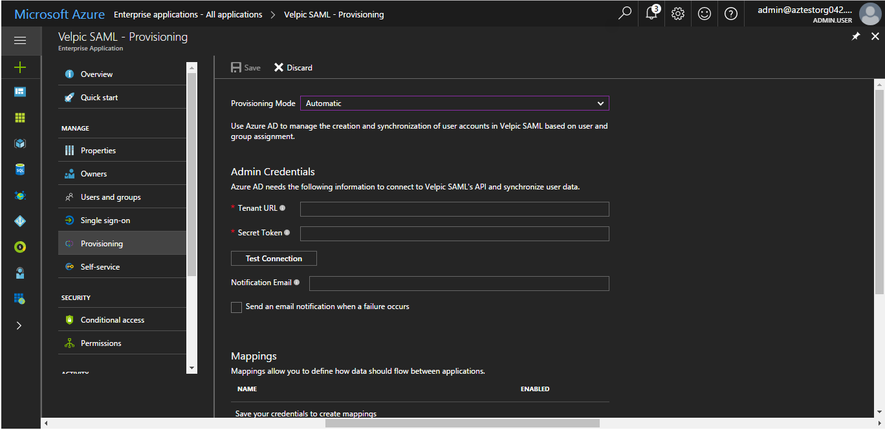
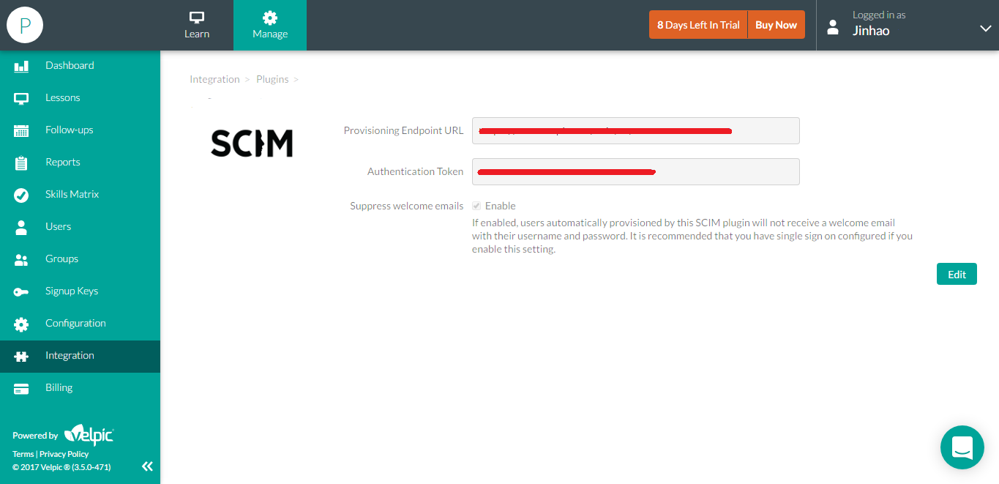

# Tutorial: Configuring Velpic for Automatic User Provisioning

The objective of this tutorial is to show you the steps you need to perform in Velpic and Azure AD to automatically provision and de-provision user accounts from Azure AD to Velpic.

> [!NOTE]
> This tutorial describes a connector built on top of the Azure AD User Provisioning Service. For important details on what this service does, how it works, and frequently asked questions, see [Automate user provisioning and deprovisioning to SaaS applications with Azure Active Directory](../app-provisioning/user-provisioning.md).

## Prerequisites

The scenario outlined in this tutorial assumes that you already have the following items:

* An Azure Active Directory tenant
* A Velpic tenant with the [Enterprise plan](https://www.velpic.com/pricing.html) or better enabled
* A user account in Velpic with Admin permissions

## Assigning users to Velpic

Azure Active Directory uses a concept called "assignments" to determine which users should receive access to selected apps. In the context of automatic user account provisioning, only the users and groups that have been "assigned" to an application in Azure AD will be synchronized. 

Before configuring and enabling the provisioning service, you will need to decide what users and/or groups in Azure AD represent the users who need access to your Velpic app. Once decided, you can assign these users to your Velpic app by following the instructions here:

[Assign a user or group to an enterprise app](../manage-apps/assign-user-or-group-access-portal.md)

### Important tips for assigning users to Velpic

* It is recommended that a single Azure AD user be assigned to Velpic to test the provisioning configuration. Additional users and/or groups may be assigned later.

* When assigning a user to Velpic, you must select either the **User** role, or another valid application-specific role (if available) in the assignment dialog. Note that the **Default Access** role does not work for provisioning, and these users will be skipped.

## Configuring user provisioning to Velpic

This section guides you through connecting your Azure AD to Velpic's user account provisioning API, and configuring the provisioning service to create, update and disable assigned user accounts in Velpic based on user and group assignment in Azure AD.

> [!TIP]
> You may also choose to enabled SAML-based Single Sign-On for Velpic, following the instructions provided in [Azure portal](https://portal.azure.com). Single sign-on can be configured independently of automatic provisioning, though these two features compliment each other.

### To configure automatic user account provisioning to Velpic in Azure AD:

1. In the [Azure portal](https://portal.azure.com), browse to the **Azure Active Directory > Enterprise Apps > All applications**  section.

2. If you have already configured Velpic for single sign-on, search for your instance of Velpic using the search field. Otherwise, select **Add** and search for **Velpic** in the application gallery. Select Velpic from the search results, and add it to your list of applications.

3. Select your instance of Velpic, then select the **Provisioning** tab.

4. Set the **Provisioning Mode** to **Automatic**.

    

5. Under the **Admin Credentials** section, input the **Tenant URL&Secret Token** of Velpic.(You can find these values under your Velpic account: **Manage** > **Integration** > **Plugin** > **SCIM**)

    

6. In the Azure portal, click **Test Connection** to ensure Azure AD can connect to your Velpic app. If the connection fails, ensure your Velpic account has Admin permissions and try step 5 again.

7. Enter the email address of a person or group who should receive provisioning error notifications in the **Notification Email** field, and check the checkbox below.

8. Click **Save**.

9. Under the Mappings section, select **Synchronize Azure Active Directory Users to Velpic**.

10. In the **Attribute Mappings** section, review the user attributes that will be synchronized from Azure AD to Velpic. Note that the attributes selected as **Matching** properties will be used to match the user accounts in Velpic for update operations. Select the Save button to commit any changes.

11. To enable the Azure AD provisioning service for Velpic, change the **Provisioning Status** to **On** in the **Settings** section

12. Click **Save**.

This will start the initial synchronization of any users and/or groups assigned to Velpic in the Users and Groups section. Note that the initial sync will take longer to perform than subsequent syncs, which occur approximately every 40 minutes as long as the service is running. You can use the **Synchronization Details** section to monitor progress and follow links to provisioning activity reports, which describe all actions performed by the provisioning service.

For more information on how to read the Azure AD provisioning logs, see [Reporting on automatic user account provisioning](../app-provisioning/check-status-user-account-provisioning.md).

## Additional resources

* [Managing user account provisioning for Enterprise Apps](../app-provisioning/configure-automatic-user-provisioning-portal.md)
* [What is application access and single sign-on with Azure Active Directory?](../manage-apps/what-is-single-sign-on.md)

## Next steps

* [Learn how to review logs and get reports on provisioning activity](../app-provisioning/check-status-user-account-provisioning.md)