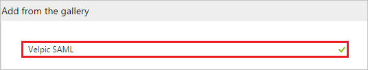
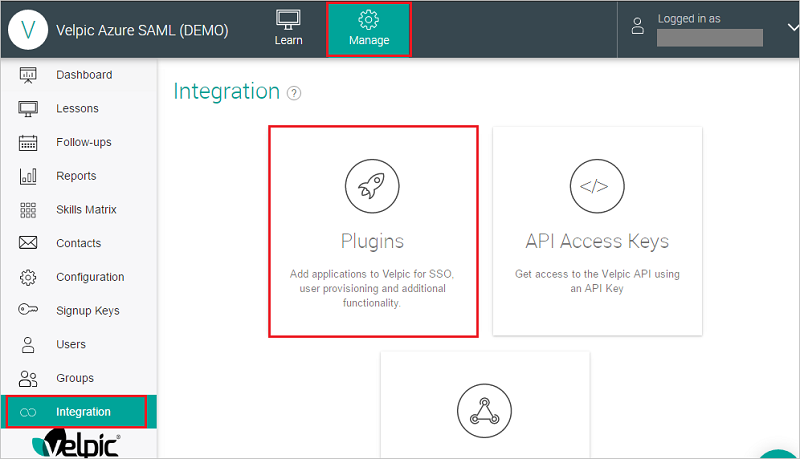
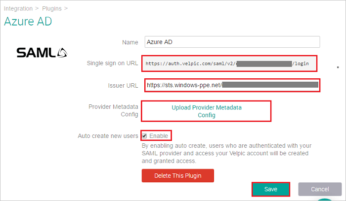
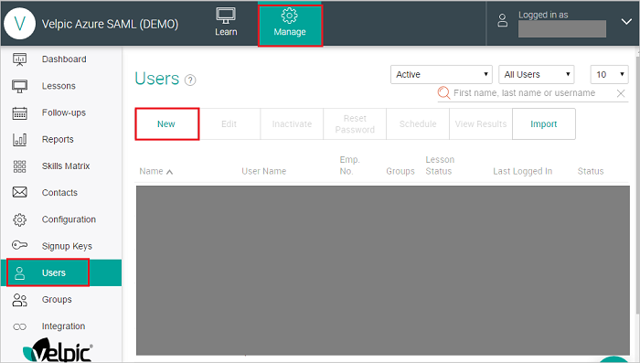
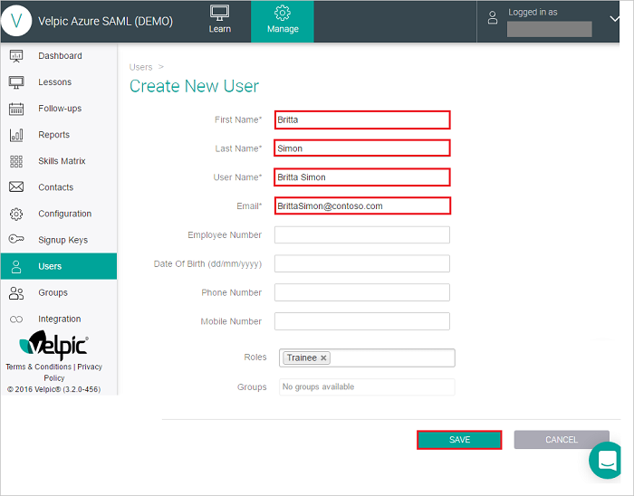
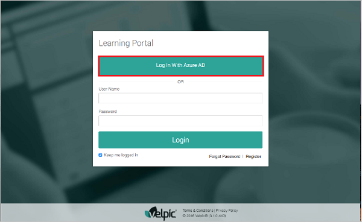

---
title: 'Tutorial: Azure Active Directory integration with Velpic SAML | Microsoft Docs'
description: Learn how to configure single sign-on between Azure Active Directory and Velpic SAML.
services: active-directory
documentationCenter: na
author: jeevansd
manager: mtillman

ms.assetid: 28acce3e-22a0-4a37-8b66-6e518d777350
ms.service: active-directory
ms.component: saas-app-tutorial
ms.workload: identity
ms.tgt_pltfrm: na
ms.devlang: na
ms.topic: article
ms.date: 04/04/2017
ms.author: jeedes

---
# Tutorial: Azure Active Directory integration with Velpic SAML

In this tutorial, you learn how to integrate Velpic SAML with Azure Active Directory (Azure AD).

Integrating Velpic SAML with Azure AD provides you with the following benefits:

- You can control in Azure AD who has access to Velpic SAML
- You can enable your users to automatically get signed-on to Velpic SAML (Single Sign-On) with their Azure AD accounts
- You can manage your accounts in one central location - the Azure Management portal

If you want to know more details about SaaS app integration with Azure AD, see [What is application access and single sign-on with Azure Active Directory](../manage-apps/what-is-single-sign-on.md).

## Prerequisites

To configure Azure AD integration with Velpic SAML, you need the following items:

- An Azure AD subscription
- A Velpic SAML single-sign on enabled subscription

> [!NOTE]
> To test the steps in this tutorial, we do not recommend using a production environment.

To test the steps in this tutorial, you should follow these recommendations:

- You should not use your production environment, unless this is necessary.
- If you don't have an Azure AD trial environment, you can get a one-month trial [here](https://azure.microsoft.com/pricing/free-trial/).

## Scenario description
In this tutorial, you test Azure AD single sign-on in a test environment. 
The scenario outlined in this tutorial consists of two main building blocks:

1. Adding Velpic SAML from the gallery
1. Configuring and testing Azure AD single sign-on

## Adding Velpic SAML from the gallery
To configure the integration of Velpic SAML into Azure AD, you need to add Velpic SAML from the gallery to your list of managed SaaS apps.

**To add Velpic SAML from the gallery, perform the following steps:**

1. In the **[Azure Management Portal](https://portal.azure.com)**, on the left navigation panel, click **Azure Active Directory** icon. 

	![Active Directory][1]

1. Navigate to **Enterprise applications**. Then go to **All applications**.

	![Applications][2]
	
1. Click **Add** button on the top of the dialog.

	![Applications][3]

1. In the search box, type **Velpic SAML**.

	

1. In the results panel, select **Velpic SAML**, and then click **Add** button to add the application.

	

##  Configuring and testing Azure AD single sign-on
In this section, you configure and test Azure AD single sign-on with Velpic SAML based on a test user called "Britta Simon".

For single sign-on to work, Azure AD needs to know what the counterpart user in Velpic SAML is to a user in Azure AD. In other words, a link relationship between an Azure AD user and the related user in Velpic SAML needs to be established.

This link relationship is established by assigning the value of the **user name** in Azure AD as the value of the **Username** in Velpic SAML.

To configure and test Azure AD single sign-on with Velpic SAML, you need to complete the following building blocks:

1. **[Configuring Azure AD Single Sign-On](#configuring-azure-ad-single-sign-on)** - to enable your users to use this feature.
1. **[Creating an Azure AD test user](#creating-an-azure-ad-test-user)** - to test Azure AD single sign-on with Britta Simon.
1. **[Creating a Velpic SAML test user](#creating-a-velpic-saml-test-user)** - to have a counterpart of Britta Simon in Velpic SAML that is linked to the Azure AD representation of her.
1. **[Assigning the Azure AD test user](#assigning-the-azure-ad-test-user)** - to enable Britta Simon to use Azure AD single sign-on.
1. **[Testing Single Sign-On](#testing-single-sign-on)** - to verify whether the configuration works.

### Configuring Azure AD single sign-on

In this section, you enable Azure AD single sign-on in the Azure Management portal and configure single sign-on in your Velpic SAML application.

**To configure Azure AD single sign-on with Velpic SAML, perform the following steps:**

1. In the Azure Management portal, on the **Velpic SAML** application integration page, click **Single sign-on**.

	![Configure Single Sign-On][4]

1. On the **Single sign-on** dialog, as **Mode** select **SAML-based Sign-on** to enable single sign on.
 
	

1. Enter the details in the **Velpic SAML Domain and URLs** section-

	

    a. In the **Sign-on URL** textbox, type the value as: `https://<sub-domain>.velpicsaml.net`

	b. In the **Identifier** textbox, paste the **‘Single sign on URL’** value `https://auth.velpic.com/saml/v2/<entity-id>/login`
	
	> [!NOTE]
	> Please note that the Sign on URL will be provided by the Velpic SAML team and Identifier value will be available when you configure the SSO Plugin on Velpic SAML side. You need to copy that value from Velpic SAML application  page and paste it here.

1. On the **SAML Signing Certificate** section, click **Metadata XML** and then save the XML file on your computer.

	 

1. Click **Save** button.

	

1. On the Velpic SAML Configuration section, click Configure Velpic SAML to open Configure sign-on window. Copy the SAML Entity ID from the Quick Reference section.

1. In a different web browser window, log into your Velpic SAML company site as an administrator.

1. Click on **Manage** tab and go to **Integration** section where you need to click on **Plugins** button to create new plugin for Sign-In.

	

1. Click on the **‘Add plugin’** button.
	
	

1. Click on the **SAML** tile in the Add Plugin page.
	
	

1. Enter the name of the new SAML plugin and click the **‘Add’** button.

	

1. Enter the details as follows:

	

	a. In the **Name** textbox, type the name of SAML plugin.

	b. In the **Issuer URL** textbox, paste the **SAML Entity ID** you copied from the **Configure sign-on** window of the Azure portal.

	c. In the **Provider Metadata Config** upload the Metadata XML file which you downloaded from Azure portal.

	d. You can also choose to enable SAML just in time provisioning by enabling the **‘Auto create new users’** checkbox. If a user doesn’t exist in Velpic and this flag is not enabled, the login from Azure will fail. If the flag is enabled the user will automatically be provisioned into Velpic at the time of login. 

	e. Copy the **Single sign on URL** from the text box and paste it in the Azure portal.
	
	f. Click **Save**.

### Creating an Azure AD test user
The objective of this section is to create a test user in the Azure Management portal called Britta Simon.

![Create Azure AD User][100]

**To create a test user in Azure AD, perform the following steps:**

1. In the **Azure Management portal**, on the left navigation pane, click **Azure Active Directory** icon.

	 

1. Go to **Users and groups** and click **All users** to display the list of users.
	
	 

1. At the top of the dialog click **Add** to open the **User** dialog.
 
	 

1. On the **User** dialog page, perform the following steps:
 
	 

    a. In the **Name** textbox, type **BrittaSimon**.

    b. In the **User name** textbox, type the **email address** of BrittaSimon.

	c. Select **Show Password** and write down the value of the **Password**.

    d. Click **Create**.
 
### Creating a Velpic SAML test user

This step is usually not required as the application supports just in time user provisioning. If the automatic user provisioning is not enabled then manual user creation can be done as described below.

Log into your Velpic SAML company site as an administrator and perform following steps:
	
1. Click on Manage tab and go to Users section, then click on New button to add users.

	

1. On the **“Create New User”** dialog page, perform the following steps.

	
	
	a. In the **First Name** textbox, type the first name of Britta Simon.

	b. In the **Last Name** textbox, type the last name of Britta Simon.

	c. In the **User Name** textbox, type the user name of Britta Simon.

	d. In the **Email** textbox, type the email address of Britta Simon account.

	e. Rest of the information is optional, you can fill it if needed.
	
	f. Click **SAVE**.	

### Assigning the Azure AD test user

In this section, you enable Britta Simon to use Azure single sign-on by granting her access to Velpic SAML.

![Assign User][200] 

**To assign Britta Simon to Velpic SAML, perform the following steps:**

1. In the Azure Management portal, open the applications view, and then navigate to the directory view and go to **Enterprise applications** then click **All applications**.

	![Assign User][201] 

1. In the applications list, select **Velpic SAML**.

	 

1. In the menu on the left, click **Users and groups**.

	![Assign User][202] 

1. Click **Add** button. Then select **Users and groups** on **Add Assignment** dialog.

	![Assign User][203]

1. On **Users and groups** dialog, select **Britta Simon** in the Users list.

1. Click **Select** button on **Users and groups** dialog.

1. Click **Assign** button on **Add Assignment** dialog.
	
### Testing single sign-on

In this section, you test your Azure AD single sign-on configuration using the Access Panel.

1. When you click the Velpic SAML tile in the Access Panel, you should get login page of Velpic SAML application. You should see the **‘Log In With Azure AD’** button on the sign in page.

	

1. Click on the **‘Log In With Azure AD’** button to log in to Velpic using your Azure AD account.

## Additional resources

* [List of Tutorials on How to Integrate SaaS Apps with Azure Active Directory](tutorial-list.md)
* [What is application access and single sign-on with Azure Active Directory?](../manage-apps/what-is-single-sign-on.md)

<!--Image references-->

[1]: ./media/velpicsaml-tutorial/tutorial_general_01.png
[2]: ./media/velpicsaml-tutorial/tutorial_general_02.png
[3]: ./media/velpicsaml-tutorial/tutorial_general_03.png
[4]: ./media/velpicsaml-tutorial/tutorial_general_04.png

[100]: ./media/velpicsaml-tutorial/tutorial_general_100.png

[200]: ./media/velpicsaml-tutorial/tutorial_general_200.png
[201]: ./media/velpicsaml-tutorial/tutorial_general_201.png
[202]: ./media/velpicsaml-tutorial/tutorial_general_202.png
[203]: ./media/velpicsaml-tutorial/tutorial_general_203.png

