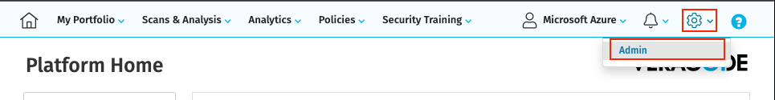
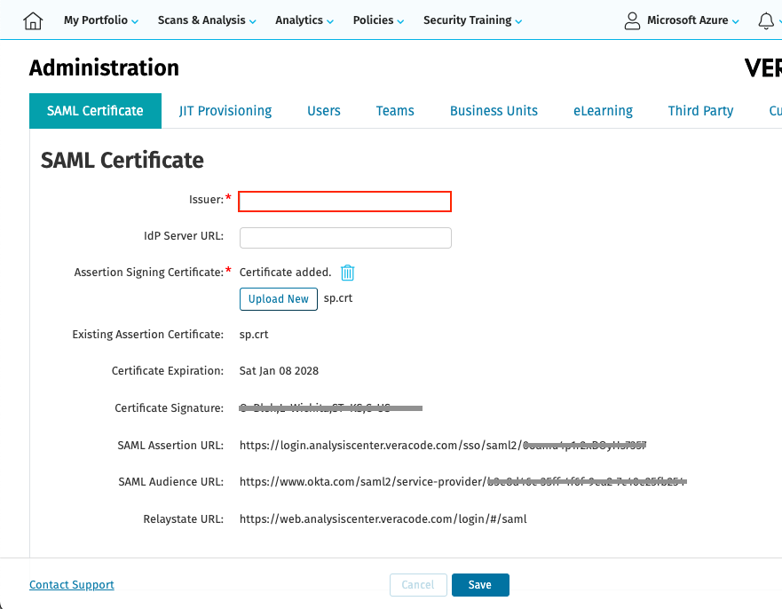
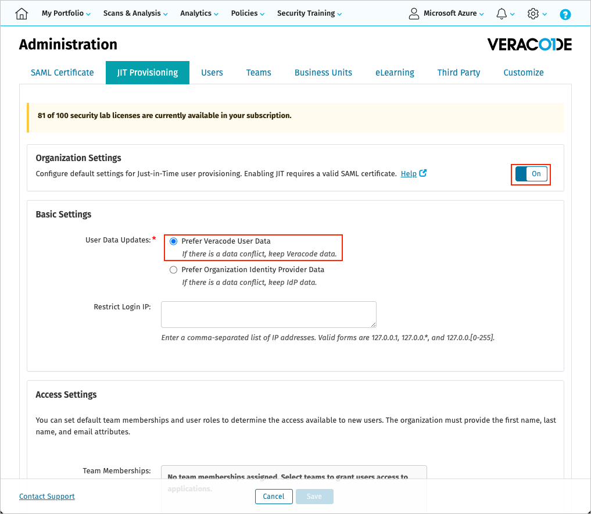
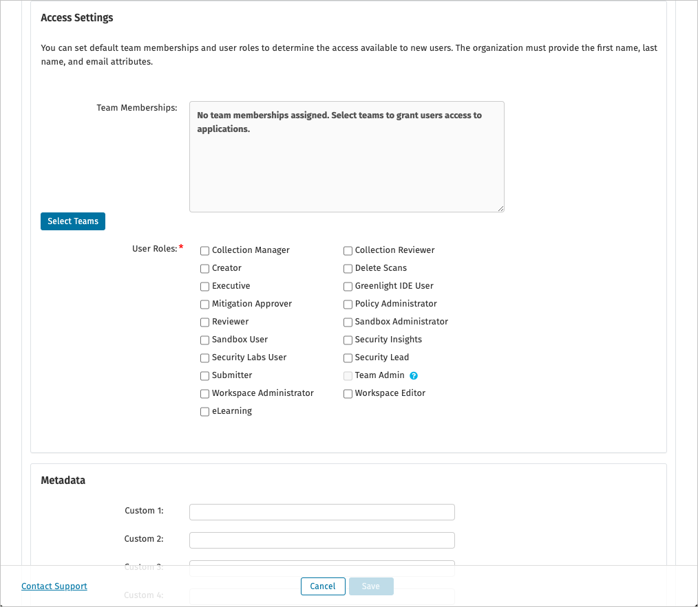

# Tutorial: Azure Active Directory single sign-on (SSO) integration with Veracode

In this tutorial, you'll learn how to integrate Veracode with Azure Active Directory (Azure AD). When you integrate Veracode with Azure AD, you can:

* Control in Azure AD who has access to Veracode.
* Enable your users to be automatically signed-in to Veracode with their Azure AD accounts.
* Manage your accounts in one central location: the Azure portal.

## Prerequisites

To get started, you need the following items:

* An Azure AD subscription. If you don't have a subscription, you can get a [free account](https://azure.microsoft.com/free/).
* A Veracode single sign-on (SSO)-enabled subscription.

## Scenario description

In this tutorial, you configure and test Azure AD SSO in a test environment. Veracode supports identity provider initiated SSO and just-in-time user provisioning.

## Add Veracode from the gallery

To configure the integration of Veracode into Azure AD, add Veracode from the gallery to your list of managed SaaS apps.

1. Sign in to the Azure portal by using either a work or school account, or a personal Microsoft account.
1. On the left navigation pane, select the **Azure Active Directory** service.
1. Go to **Enterprise Applications**, and then select **All Applications**.
1. To add a new application, select **New application**.
1. In the **Add from the gallery** section, type "Veracode" in the search box.
1. Select **Veracode** from the results panel, and then add the app. Wait a few seconds while the app is added to your tenant.

 Alternatively, you can also use the [Enterprise App Configuration Wizard](https://portal.office.com/AdminPortal/home?Q=Docs#/azureadappintegration). In this wizard, you can add an application to your tenant, add users/groups to the app, assign roles, as well as walk through the SSO configuration as well. [Learn more about Microsoft 365 wizards.](/microsoft-365/admin/misc/azure-ad-setup-guides)

## Configure and test Azure AD SSO for Veracode

Configure and test Azure AD SSO with Veracode by using a test user called **B.Simon**. For SSO to work, you must establish a link between an Azure AD user and the related user in Veracode.

To configure and test Azure AD SSO with Veracode, perform the following steps:

1. **[Configure Azure AD SSO](#configure-azure-ad-sso)** to enable your users to use this feature.
    * **[Create an Azure AD test user](#create-an-azure-ad-test-user)** to test Azure AD single sign-on with B.Simon.
    * **[Assign the Azure AD test user](#assign-the-azure-ad-test-user)** to enable B.Simon to use Azure AD single sign-on.
1. **[Configure Veracode SSO](#configure-veracode-sso)** to configure the single sign-on settings on the application side.
    * **[Create a Veracode test user](#create-veracode-test-user)** to have a counterpart of B.Simon in Veracode linked to the Azure AD representation of the user.
1. **[Test SSO](#test-sso)** to verify whether the configuration works.

## Configure Azure AD SSO

Follow these steps to enable Azure AD SSO in the Azure portal.

1. In the Azure portal, on the **Veracode** application integration page, find the **Manage** section. Select **single sign-on**.
1. On the **Select a single sign-on method** page, select **SAML**.
1. On the **Set up single sign-on with SAML** page, select the pencil icon for **Basic SAML Configuration** to edit the settings.

   

1. On the **Basic SAML Configuration** section, the application is pre-configured and the necessary URLs are already pre-populated with Azure. Select **Save**.

1. On the **Set up single sign-on with SAML** page, in the **SAML Signing Certificate** section,  find **Certificate (Base64)**. Select **Download** to download the certificate and save it on your computer.

	

1. Veracode expects the SAML assertions in a specific format, which requires you to add custom attribute mappings to your SAML token attributes configuration. The following screenshot shows the list of default attributes.

	

1. Veracode also expects a few more attributes to be passed back in the SAML response. These attributes are also pre-populated, but you can review them per your requirements.

	| Name | Source attribute|
	| ---------------| --------------- |
	| firstname |User.givenname |
	| lastname |User.surname |
	| email |User.mail |

1. On the **Set up Veracode** section, copy the appropriate URL(s) based on your requirement.

	

### Create an Azure AD test user

In this section, you'll create a test user in the Azure portal called B.Simon.

1. From the left pane in the Azure portal, select **Azure Active Directory**, select **Users**, and then select **All users**.
1. Select **New user** at the top of the screen.
1. In the **User** properties, follow these steps:
   1. In the **Name** field, enter `B.Simon`.  
   1. In the **User name** field, enter the username@companydomain.extension. For example, `B.Simon@contoso.com`.
   1. Select the **Show password** check box, and then write down the value that's displayed in the **Password** box.
   1. Click **Create**.

### Assign the Azure AD test user

In this section, you'll enable B.Simon to use Azure single sign-on by granting access to Veracode.

1. In the Azure portal, select **Enterprise Applications**, and then select **All applications**.
1. In the applications list, select **Veracode**.
1. In the app's overview page, find the **Manage** section and select **Users and groups**.
1. Select **Add user**, then select **Users and groups** in the **Add Assignment** dialog.
1. In the **Users and groups** dialog, select **B.Simon** from the Users list, then click the **Select** button at the bottom of the screen.
1. If you are expecting a role to be assigned to the users, you can select it from the **Select a role** dropdown. If no role has been set up for this app, you see "Default Access" role selected.
1. In the **Add Assignment** dialog, click the **Assign** button.

## Configure Veracode SSO

Notes:

* These instructions assume you are using the new [Single Sign On/Just-in-Time Provisioning feature from Veracode](https://docs.veracode.com/r/Signing_On). To activate this feature if it is not already active, please contact Veracode Support.  
* These instructions are valid for all [Veracode regions](https://docs.veracode.com/r/Region_Domains_for_Veracode_APIs).

1. In a different web browser window, sign in to your Veracode company site as an administrator. 

1. From the menu on the top, select **Settings** > **Admin**.
   
    

1. Select the **SAML** tab.

1. In the **SAML Certificate** section, perform the following steps:

    

    a.  For **Issuer**, paste the value of the **Azure AD Identifier** that you've copied from the Azure portal.

    b. For **Assertion Signing Certificate**, select **Choose File** to upload your downloaded certificate from the Azure portal.

    c. Note the values of the three URLs (**SAML Assertion URL**, **SAML Audience URL**, **Relay state URL**). 

    d. Click **Save**.
    
1. Take the values of the **SAML Assertion URL**, **SAML Audience URL** and **Relay state URL** and update them in the Azure Active Directory settings for the Veracode integration.

1. Select the **JIT Provisioning** tab.

    

1. In the **Organization Settings** section, toggle the **Configure Default Settings for Just-in-Time user provisioning** setting to **On**. 

1. In the **Basic Settings** section, for **User Data Updates**, select **Prefer Veracode User Data**.

1. In the **Access Settings** section, under **User Roles**, select from the following For more information about Veracode user roles, see the [Veracode Documentation](https://docs.veracode.com/r/c_role_permissions):

    

      * **Policy Administrator**
      * **Reviewer**
      * **Security Lead**
      * **Executive**
      * **Submitter**
      * **Creator**
      * **All Scan Types**

### Create Veracode test user

In this section, a user called B.Simon is created in Veracode. Veracode supports just-in-time user provisioning, which is enabled by default. There's no action item for you in this section. If a user doesn't already exist in Veracode, a new one is created after authentication.

> [!NOTE]
> You can use any other Veracode user account creation tools or APIs provided by Veracode to provision Azure AD user accounts.

## Test SSO

In this section, you test your Azure AD single sign-on configuration with following options.

* Click on Test this application in Azure portal and you should be automatically signed in to the Veracode for which you set up the SSO.

* You can use Microsoft My Apps. When you click the Veracode tile in the My Apps, you should be automatically signed in to the Veracode for which you set up the SSO. For more information about the My Apps, see [Introduction to the My Apps](https://support.microsoft.com/account-billing/sign-in-and-start-apps-from-the-my-apps-portal-2f3b1bae-0e5a-4a86-a33e-876fbd2a4510).

## Next steps

Once you configure Veracode you can enforce session control, which protects exfiltration and infiltration of your organization’s sensitive data in real time. Session control extends from Conditional Access. [Learn how to enforce session control with Microsoft Defender for Cloud Apps](/cloud-app-security/proxy-deployment-any-app).
