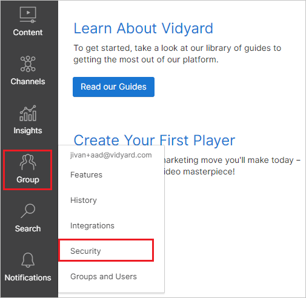
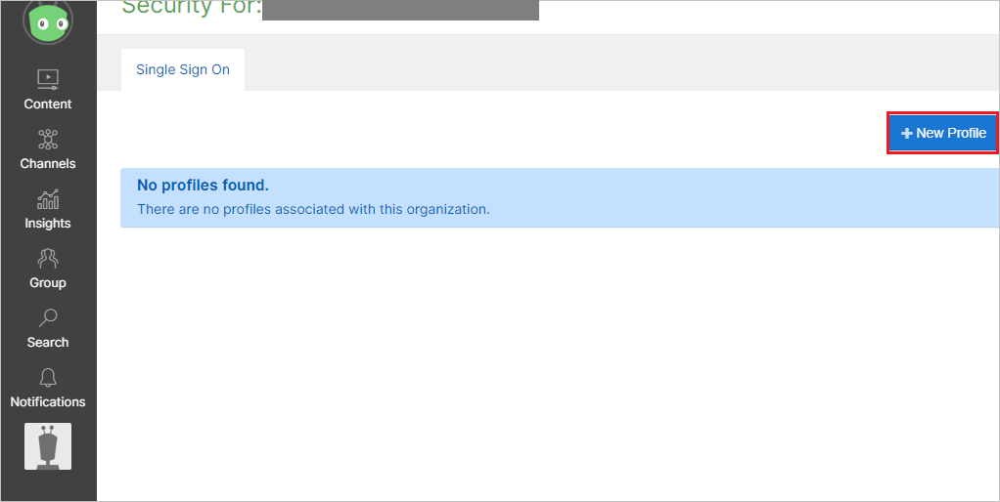
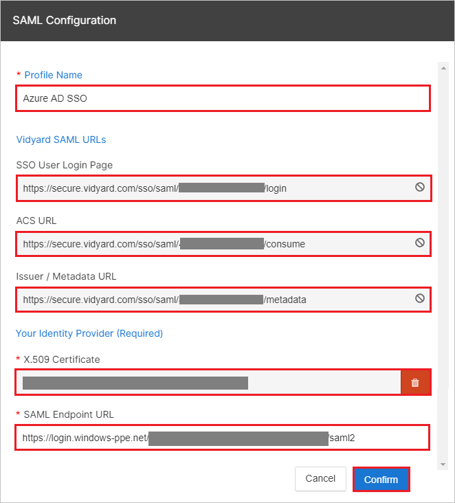
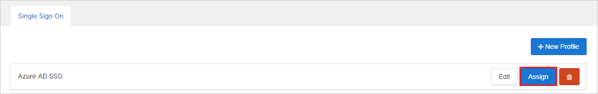
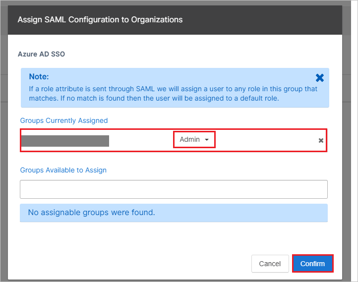

# Tutorial: Azure Active Directory integration with Vidyard

In this tutorial, you learn how to integrate Vidyard with Azure Active Directory (Azure AD).
Integrating Vidyard with Azure AD provides you with the following benefits:

* You can control in Azure AD who has access to Vidyard.
* You can enable your users to be automatically signed-in to Vidyard (Single Sign-On) with their Azure AD accounts.
* You can manage your accounts in one central location - the Azure portal.

If you want to know more details about SaaS app integration with Azure AD, see [What is application access and single sign-on with Azure Active Directory](https://docs.microsoft.com/azure/active-directory/active-directory-appssoaccess-whatis).
If you don't have an Azure subscription, [create a free account](https://azure.microsoft.com/free/) before you begin.

## Prerequisites

To configure Azure AD integration with Vidyard, you need the following items:

* An Azure AD subscription. If you don't have an Azure AD environment, you can get a [free account](https://azure.microsoft.com/free/)
* Vidyard single sign-on enabled subscription

## Scenario description

In this tutorial, you configure and test Azure AD single sign-on in a test environment.

* Vidyard supports **SP** and **IDP** initiated SSO

* Vidyard supports **Just In Time** user provisioning

## Adding Vidyard from the gallery

To configure the integration of Vidyard into Azure AD, you need to add Vidyard from the gallery to your list of managed SaaS apps.

**To add Vidyard from the gallery, perform the following steps:**

1. In the **[Azure portal](https://portal.azure.com)**, on the left navigation panel, click **Azure Active Directory** icon.

	

2. Navigate to **Enterprise Applications** and then select the **All Applications** option.

	

3. To add new application, click **New application** button on the top of dialog.

	

4. In the search box, type **Vidyard**, select **Vidyard** from result panel then click **Add** button to add the application.

	 

## Configure and test Azure AD single sign-on

In this section, you configure and test Azure AD single sign-on with Vidyard based on a test user called **Britta Simon**.
For single sign-on to work, a link relationship between an Azure AD user and the related user in Vidyard needs to be established.

To configure and test Azure AD single sign-on with Vidyard, you need to complete the following building blocks:

1. **[Configure Azure AD Single Sign-On](#configure-azure-ad-single-sign-on)** - to enable your users to use this feature.
2. **[Configure Vidyard Single Sign-On](#configure-vidyard-single-sign-on)** - to configure the Single Sign-On settings on application side.
3. **[Create an Azure AD test user](#create-an-azure-ad-test-user)** - to test Azure AD single sign-on with Britta Simon.
4. **[Assign the Azure AD test user](#assign-the-azure-ad-test-user)** - to enable Britta Simon to use Azure AD single sign-on.
5. **[Create Vidyard test user](#create-vidyard-test-user)** - to have a counterpart of Britta Simon in Vidyard that is linked to the Azure AD representation of user.
6. **[Test single sign-on](#test-single-sign-on)** - to verify whether the configuration works.

### Configure Azure AD single sign-on

In this section, you enable Azure AD single sign-on in the Azure portal.

To configure Azure AD single sign-on with Vidyard, perform the following steps:

1. In the [Azure portal](https://portal.azure.com/), on the **Vidyard** application integration page, select **Single sign-on**.

    

2. On the **Select a Single sign-on method** dialog, select **SAML/WS-Fed** mode to enable single sign-on.

    

3. On the **Set up Single Sign-On with SAML** page, click **Edit** icon to open **Basic SAML Configuration** dialog.

	

4. On the **Basic SAML Configuration** section, if you wish to configure the application in **IDP** initiated mode, perform the following steps:

    

    a. In the **Identifier** text box, type a URL using the following pattern:
    `https://secure.vidyard.com/sso/saml/<unique id>/metadata`

    b. In the **Reply URL** text box, type a URL using the following pattern:
    `https://secure.vidyard.com/sso/saml/<unique id>/consume`

5. Click **Set additional URLs** and perform the following step if you wish to configure the application in **SP** initiated mode:

    

    In the **Sign-on URL** text box, type a URL using the following pattern:
    `https://secure.vidyard.com/sso/saml/<unique id>/login`

	> [!NOTE]
	> These values are not real. You will update these values with the actual Identifier, Reply URL, and Sign-On URL, which is explained later in the tutorial. You can also refer to the patterns shown in the **Basic SAML Configuration** section in the Azure portal.

6. On the **Set up Single Sign-On with SAML** page, in the **SAML Signing Certificate** section, click **Download** to download the **Certificate (Base64)** from the given options as per your requirement and save it on your computer.

	

7. On the **Set up Vidyard** section, copy the appropriate URL(s) as per your requirement.

	

	a. Login URL

	b. Azure AD Identifier

	c. Logout URL

### Configure Vidyard Single Sign-On

1. In a different web browser window, sign in to your Vidyard Software company site as an administrator.

2. From the Vidyard dashboard, select **Group** > **Security**

	

3. Click **New Profile** tab.

	

4. In the **SAML Configuration** section, perform the following steps:

	

	a. Please enter general profile name in the **Profile Name** textbox.

	b. Copy **SSO User Login Page** value and paste it into **Sign on URL** textbox in **Basic SAML Configuration** section on Azure portal.

	c. Copy **ACS URL** value and paste it into **Reply URL** textbox in **Basic SAML Configuration** section on Azure portal.

	d. Copy **Issuer/Metadata URL** value and paste it into **Identifier** textbox in **Basic SAML Configuration** section on Azure portal.

	e. Open your downloaded certificate file from Azure portal in Notepad and then paste it into the **X.509 Certificate** textbox.

	f. In the **SAML Endpoint URL** textbox, paste the value of **Login URL** copied from Azure portal.

	g. Click **Confirm**.

5. From the Single Sign On tab, select **Assign** next to an existing profile

	

	> [!NOTE]
	> Once you have created an SSO profile, assign it to any group(s) for which users will require access through Azure. If the user does not exist within the group to which they were assigned, Vidyard will automatically create a user account and assign their role in real-time.

6. Select your organization group, which is visible in the **Groups Available to Assign**.

	

7. You can see the assigned groups under the **Groups Currently Assigned**. Select a role for the group as per your organization and click **Confirm**.

	

	> [!NOTE]
	> For more information, refer to [this doc](https://knowledge.vidyard.com/hc/articles/360009990033-SAML-based-Single-Sign-On-SSO-in-Vidyard).

### Create an Azure AD test user 

The objective of this section is to create a test user in the Azure portal called Britta Simon.

1. In the Azure portal, in the left pane, select **Azure Active Directory**, select **Users**, and then select **All users**.

    

2. Select **New user** at the top of the screen.

    

3. In the User properties, perform the following steps.

    

    a. In the **Name** field enter **BrittaSimon**.
  
    b. In the **User name** field type brittasimon@yourcompanydomain.extension. For example, BrittaSimon@contoso.com

    c. Select **Show password** check box, and then write down the value that's displayed in the Password box.

    d. Click **Create**.

### Assign the Azure AD test user

In this section, you enable Britta Simon to use Azure single sign-on by granting access to Vidyard.

1. In the Azure portal, select **Enterprise Applications**, select **All applications**, then select **Vidyard**.

	

2. In the applications list, select **Vidyard**.

	

3. In the menu on the left, select **Users and groups**.

    

4. Click the **Add user** button, then select **Users and groups** in the **Add Assignment** dialog.

    

5. In the **Users and groups** dialog select **Britta Simon** in the Users list, then click the **Select** button at the bottom of the screen.

6. If you are expecting any role value in the SAML assertion then in the **Select Role** dialog select the appropriate role for the user from the list, then click the **Select** button at the bottom of the screen.

7. In the **Add Assignment** dialog click the **Assign** button.

### Create Vidyard test user

In this section, a user called Britta Simon is created in Vidyard. Vidyard supports just-in-time user provisioning, which is enabled by default. There is no action item for you in this section. If a user doesn't already exist in Vidyard, a new one is created after authentication.

>[!Note]
>If you need to create a user manually, contact [Vidyard support team](mailto:support@vidyard.com).

### Test single sign-on 

In this section, you test your Azure AD single sign-on configuration using the Access Panel.

When you click the Vidyard tile in the Access Panel, you should be automatically signed in to the Vidyard for which you set up SSO. For more information about the Access Panel, see [Introduction to the Access Panel](https://docs.microsoft.com/azure/active-directory/active-directory-saas-access-panel-introduction).

## Additional Resources

- [List of Tutorials on How to Integrate SaaS Apps with Azure Active Directory](https://docs.microsoft.com/azure/active-directory/active-directory-saas-tutorial-list)

- [What is application access and single sign-on with Azure Active Directory?](https://docs.microsoft.com/azure/active-directory/active-directory-appssoaccess-whatis)

- [What is Conditional Access in Azure Active Directory?](https://docs.microsoft.com/azure/active-directory/conditional-access/overview)

