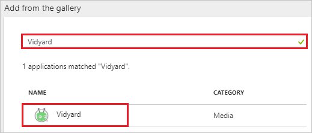
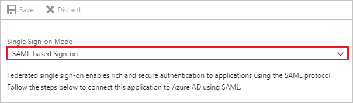
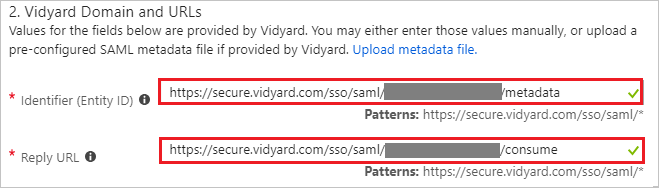
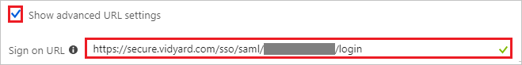
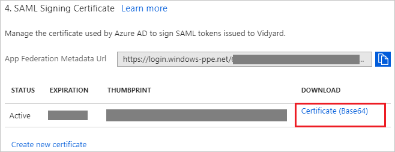
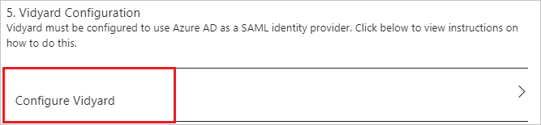

---
title: 'Tutorial: Azure Active Directory integration with Vidyard | Microsoft Docs'
description: Learn how to configure single sign-on between Azure Active Directory and Vidyard.
services: active-directory
documentationCenter: na
author: jeevansd
manager: femila
ms.reviewer: joflore

ms.assetid: bed7df23-6e13-4e7c-b4cc-53ed4804664d
ms.service: active-directory
ms.component: saas-app-tutorial
ms.workload: identity
ms.tgt_pltfrm: na
ms.devlang: na
ms.topic: article
ms.date: 05/22/2018
ms.author: jeedes

---
# Tutorial: Azure Active Directory integration with Vidyard

In this tutorial, you learn how to integrate Vidyard with Azure Active Directory (Azure AD).

Integrating Vidyard with Azure AD provides you with the following benefits:

- You can control in Azure AD who has access to Vidyard.
- You can enable your users to automatically get signed-on to Vidyard (Single Sign-On) with their Azure AD accounts.
- You can manage your accounts in one central location - the Azure portal.

If you want to know more details about SaaS app integration with Azure AD, see [what is application access and single sign-on with Azure Active Directory](../manage-apps/what-is-single-sign-on.md).

## Prerequisites

To configure Azure AD integration with Vidyard, you need the following items:

- An Azure AD subscription
- A Vidyard single sign-on enabled subscription

> [!NOTE]
> To test the steps in this tutorial, we do not recommend using a production environment.

To test the steps in this tutorial, you should follow these recommendations:

- Do not use your production environment, unless it is necessary.
- If you don't have an Azure AD trial environment, you can [get a one-month trial](https://azure.microsoft.com/pricing/free-trial/).

## Scenario description
In this tutorial, you test Azure AD single sign-on in a test environment. 
The scenario outlined in this tutorial consists of two main building blocks:

1. Adding Vidyard from the gallery
1. Configuring and testing Azure AD single sign-on

## Adding Vidyard from the gallery
To configure the integration of Vidyard into Azure AD, you need to add Vidyard from the gallery to your list of managed SaaS apps.

**To add Vidyard from the gallery, perform the following steps:**

1. In the **[Azure portal](https://portal.azure.com)**, on the left navigation panel, click **Azure Active Directory** icon. 

	![The Azure Active Directory button][1]

1. Navigate to **Enterprise applications**. Then go to **All applications**.

	![The Enterprise applications blade][2]
	
1. To add new application, click **New application** button on the top of dialog.

	![The New application button][3]

1. In the search box, type **Vidyard**, select **Vidyard** from result panel then click **Add** button to add the application.

	

## Configure and test Azure AD single sign-on

In this section, you configure and test Azure AD single sign-on with Vidyard based on a test user called "Britta Simon".

For single sign-on to work, Azure AD needs to know what the counterpart user in Vidyard is to a user in Azure AD. In other words, a link relationship between an Azure AD user and the related user in Vidyard needs to be established.

To configure and test Azure AD single sign-on with Vidyard, you need to complete the following building blocks:

1. **[Configure Azure AD Single Sign-On](#configure-azure-ad-single-sign-on)** - to enable your users to use this feature.
1. **[Create an Azure AD test user](#create-an-azure-ad-test-user)** - to test Azure AD single sign-on with Britta Simon.
1. **[Create a Vidyard test user](#create-a-vidyard-test-user)** - to have a counterpart of Britta Simon in Vidyard that is linked to the Azure AD representation of user.
1. **[Assign the Azure AD test user](#assign-the-azure-ad-test-user)** - to enable Britta Simon to use Azure AD single sign-on.
1. **[Test single sign-on](#test-single-sign-on)** - to verify whether the configuration works.

### Configure Azure AD single sign-on

In this section, you enable Azure AD single sign-on in the Azure portal and configure single sign-on in your Vidyard application.

**To configure Azure AD single sign-on with Vidyard, perform the following steps:**

1. In the Azure portal, on the **Vidyard** application integration page, click **Single sign-on**.

	![Configure single sign-on link][4]

1. On the **Single sign-on** dialog, select **Mode** as	**SAML-based Sign-on** to enable single sign-on.
 
	

1. On the **Vidyard Domain and URLs** section, perform the following steps if you wish to configure the application in **IDP** initiated mode:

	

    a. In the **Identifier** textbox, type a URL using the following pattern: `https://secure.vidyard.com/sso/saml/<unique id>/metadata`

	b. In the **Reply URL** textbox, type a URL using the following pattern: `https://secure.vidyard.com/sso/saml/<unique id>/consume`

1. Check **Show advanced URL settings** and perform the following step if you wish to configure the application in **SP** initiated mode:

	

    In the **Sign-on URL** textbox, type a URL using the following pattern: `https://secure.vidyard.com/sso/saml/<unique id>/login`

	> [!NOTE]
	> These values are not real. You will update these values with the actual Identifier, Reply URL, and Sign-On URL, which is explained later in the tutorial

1. On the **SAML Signing Certificate** section, click **Certificate(Base64)** and then save the certificate file on your computer.

	 

1. Click **Save** button.

	

1. On the **Vidyard Configuration** section, click **Configure Vidyard** to open **Configure sign-on** window. Copy the **SAML Single Sign-On Service URL** from the **Quick Reference section.**

	

1. In a different web browser window, log in to your Vidyard Software company site as an administrator.

1. From the Vidyard dashboard, select **Group** > **Security**

	

1. Click **New Profile** tab.

	

1. In the **SAML Configuration** section, perform the following steps:

	

	a. Please enter general profile name in the **Profile Name** textbox.

	b. Copy **SSO User Login Page** value and paste it into **Sign on URL** textbox in **Vidyard Domain and URLs section** on Azure portal.

	c. Copy **ACS URL** value and paste it into **Reply URL** textbox in **Vidyard Domain and URLs section** on Azure portal.

	d. Copy **Issuer/Metadata URL** value and paste it into **Identifier** textbox in **Vidyard Domain and URLs section** on Azure portal.

	e. Open your downloaded certificate file from Azure portal in Notepad and then paste it into the **X.509 Certificate** textbox.

	f. In the **SAML Endpoint URL** textbox, paste the value of **SAML Single Sign-On Service URL** copied from Azure portal.

	g. Click **Confirm**.

1. From the Single Sign On tab, select **Assign** next to an existing profile

	

	> [!NOTE]
	> Once you have created an SSO profile, assign it to any group(s) for which users will require access through Azure. If the user does not exist within the group to which they were assigned, Vidyard will automatically create a user account and assign their role in real-time.

1. Select your organization group, which is visible in the **Groups Available to Assign**.

	

1. You can see the assigned groups under the **Groups Currently Assigned**. Select a role for the group as per your organization and click **Confirm**.

	

	> [!NOTE]
	> For more information, refer [this doc](https://knowledge.vidyard.com/saml-single-sign-on-authentication/saml-based-single-sign-on-sso-in-vidyard).

### Create an Azure AD test user

The objective of this section is to create a test user in the Azure portal called Britta Simon.

   ![Create an Azure AD test user][100]

**To create a test user in Azure AD, perform the following steps:**

1. In the Azure portal, in the left pane, click the **Azure Active Directory** button.

    

1. To display the list of users, go to **Users and groups**, and then click **All users**.

    

1. To open the **User** dialog box, click **Add** at the top of the **All Users** dialog box.

    

1. In the **User** dialog box, perform the following steps:

    

    a. In the **Name** box, type **BrittaSimon**.

    b. In the **User name** box, type the email address of user Britta Simon.

    c. Select the **Show Password** check box, and then write down the value that's displayed in the **Password** box.

    d. Click **Create**.
 
### Create a Vidyard test user

The objective of this section is to create a user called Britta Simon in Vidyard. Vidyard supports just-in-time provisioning, which is by default enabled. There is no action item for you in this section. A new user is created during an attempt to access Vidyard if it doesn't exist yet.
>[!Note]
>If you need to create a user manually, contact [Vidyard support team](mailto:support@vidyard.com).

### Assign the Azure AD test user

In this section, you enable Britta Simon to use Azure single sign-on by granting access to Vidyard.

![Assign the user role][200] 

**To assign Britta Simon to Vidyard, perform the following steps:**

1. In the Azure portal, open the applications view, and then navigate to the directory view and go to **Enterprise applications** then click **All applications**.

	![Assign User][201] 

1. In the applications list, select **Vidyard**.

	  

1. In the menu on the left, click **Users and groups**.

	![The "Users and groups" link][202]

1. Click **Add** button. Then select **Users and groups** on **Add Assignment** dialog.

	![The Add Assignment pane][203]

1. On **Users and groups** dialog, select **Britta Simon** in the Users list.

1. Click **Select** button on **Users and groups** dialog.

1. Click **Assign** button on **Add Assignment** dialog.
	
### Test single sign-on

In this section, you test your Azure AD single sign-on configuration using the Access Panel.

When you click the Vidyard tile in the Access Panel, you should get automatically signed-on to your Vidyard application.
For more information about the Access Panel, see [Introduction to the Access Panel](../user-help/active-directory-saas-access-panel-introduction.md). 

## Additional resources

* [List of Tutorials on How to Integrate SaaS Apps with Azure Active Directory](tutorial-list.md)
* [What is application access and single sign-on with Azure Active Directory?](../manage-apps/what-is-single-sign-on.md)

<!--Image references-->

[1]: ./media/vidyard-tutorial/tutorial_general_01.png
[2]: ./media/vidyard-tutorial/tutorial_general_02.png
[3]: ./media/vidyard-tutorial/tutorial_general_03.png
[4]: ./media/vidyard-tutorial/tutorial_general_04.png

[100]: ./media/vidyard-tutorial/tutorial_general_100.png

[200]: ./media/vidyard-tutorial/tutorial_general_200.png
[201]: ./media/vidyard-tutorial/tutorial_general_201.png
[202]: ./media/vidyard-tutorial/tutorial_general_202.png
[203]: ./media/vidyard-tutorial/tutorial_general_203.png

