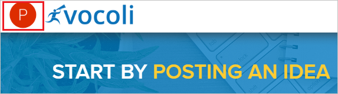
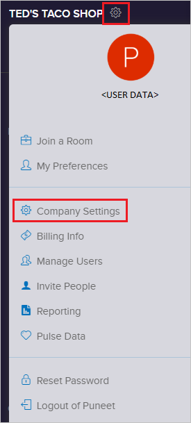
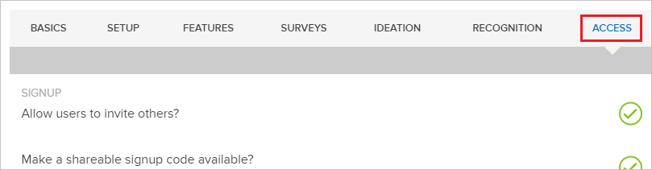
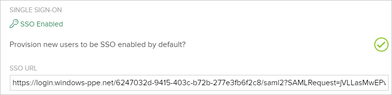
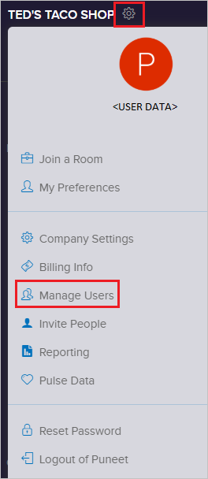
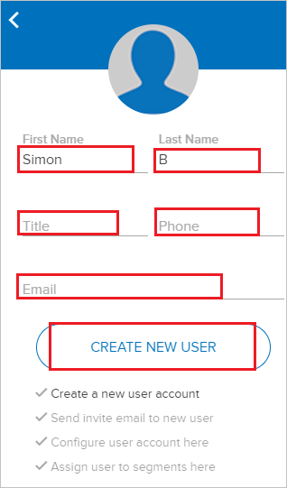
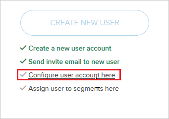
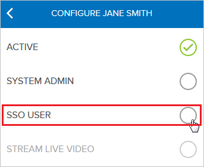
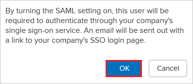

# Tutorial: Azure Active Directory Single sign-on (SSO) integration with Vocoli

In this tutorial, you'll learn how to integrate Vocoli with Azure Active Directory (Azure AD). When you integrate Vocoli with Azure AD, you can:

* Control in Azure AD who has access to Vocoli.
* Enable your users to be automatically signed-in to Vocoli with their Azure AD accounts.
* Manage your accounts in one central location - the Azure portal.

To learn more about SaaS app integration with Azure AD, see [What is application access and single sign-on with Azure Active Directory](https://docs.microsoft.com/azure/active-directory/active-directory-appssoaccess-whatis).

## Prerequisites

To get started, you need the following items:

* An Azure AD subscription. If you don't have a subscription, you can get a [free account](https://azure.microsoft.com/free/).
* Vocoli single sign-on (SSO) enabled subscription.

## Scenario description

In this tutorial, you configure and test Azure AD SSO in a test environment.

* Vocoli supports **IDP** initiated SSO

## Adding Vocoli from the gallery

To configure the integration of Vocoli into Azure AD, you need to add Vocoli from the gallery to your list of managed SaaS apps.

1. Sign in to the [Azure portal](https://portal.azure.com) using either a work or school account, or a personal Microsoft account.
1. On the left navigation pane, select the **Azure Active Directory** service.
1. Navigate to **Enterprise Applications** and then select **All Applications**.
1. To add new application, select **New application**.
1. In the **Add from the gallery** section, type **Vocoli** in the search box.
1. Select **Vocoli** from results panel and then add the app. Wait a few seconds while the app is added to your tenant.

## Configure and test Azure AD single sign-on for Vocoli

Configure and test Azure AD SSO with Vocoli using a test user called **B.Simon**. For SSO to work, you need to establish a link relationship between an Azure AD user and the related user in Vocoli.

To configure and test Azure AD SSO with Vocoli, complete the following building blocks:

1. **[Configure Azure AD SSO](#configure-azure-ad-sso)** - to enable your users to use this feature.
    1. **[Create an Azure AD test user](#create-an-azure-ad-test-user)** - to test Azure AD single sign-on with B.Simon.
    1. **[Assign the Azure AD test user](#assign-the-azure-ad-test-user)** - to enable B.Simon to use Azure AD single sign-on.
1. **[Configure Vocoli SSO](#configure-vocoli-sso)** - to configure the Single Sign-On settings on application side.
    1. **[Create Vocoli test user](#create-vocoli-test-user)** - to have a counterpart of B.Simon in Vocoli that is linked to the Azure AD representation of user.
1. **[Test SSO](#test-sso)** - to verify whether the configuration works.

## Configure Azure AD SSO

Follow these steps to enable Azure AD SSO in the Azure portal.

1. In the [Azure portal](https://portal.azure.com/), on the **Vocoli** application integration page, find the **Manage** section and select **Single sign-on**.
1. On the **Select a Single sign-on method** page, select **SAML**.
1. On the **Set up Single Sign-On with SAML** page, click the edit/pen icon for **Basic SAML Configuration** to edit the settings.

   

1. On the **Basic SAML Configuration** section, enter the values for the following fields:

    In the **Reply URL** text box, type a URL using the following pattern:
    `https://connect.vocoli.com/saml/module.php/saml/sp/saml2-acs.php/default-sp`

1. On the **Set up Single Sign-On with SAML** page, in the **SAML Signing Certificate** section,  find **Certificate (Raw)** and select **Download** to download the certificate and save it on your computer.

	

1. On the **Set up Vocoli** section, copy the appropriate URL(s) based on your requirement.

	

### Create an Azure AD test user

In this section, you'll create a test user in the Azure portal called B.Simon.

1. From the left pane in the Azure portal, select **Azure Active Directory**, select **Users**, and then select **All users**.
1. Select **New user** at the top of the screen.
1. In the **User** properties, follow these steps:
   1. In the **Name** field, enter `B.Simon`.  
   1. In the **User name** field, enter the username@companydomain.extension. For example, `B.Simon@contoso.com`.
   1. Select the **Show password** check box, and then write down the value that's displayed in the **Password** box.
   1. Click **Create**.

### Assign the Azure AD test user

In this section, you'll enable B.Simon to use Azure single sign-on by granting access to Vocoli.

1. In the Azure portal, select **Enterprise Applications**, and then select **All applications**.
1. In the applications list, select **Vocoli**.
1. In the app's overview page, find the **Manage** section and select **Users and groups**.

   

1. Select **Add user**, then select **Users and groups** in the **Add Assignment** dialog.

	

1. In the **Users and groups** dialog, select **B.Simon** from the Users list, then click the **Select** button at the bottom of the screen.
1. If you're expecting any role value in the SAML assertion, in the **Select Role** dialog, select the appropriate role for the user from the list and then click the **Select** button at the bottom of the screen.
1. In the **Add Assignment** dialog, click the **Assign** button.

### Configure Vocoli SSO

1. Open a new web browser window and sign into your Vocoli company site as an administrator.

1. Click **settings** menu by clicking on your **profile picture** in the upper left of the screen.

	

1. Click the **cog** at the top of the slide out to to show the **settings** menu and click **Company Settings**.

	

1. Click the **ACCESS** tab from the Company Settings view.

	

1. On the **SINGLE SIGN-ON** page, perform the following steps:

	

	a. Check the box labeled **Provision new users to be SSO enabled by default?**

	b.

### Create Vocoli test user

To enable Azure AD users, sign in to Vocoli, they must be provisioned into Vocoli. In Vocoli, provisioning is a manual task.

**To provision a user account, perform the following steps:**

1. In a different web browser window, sign in to Vocoli as a Security Administrator.

1. Click on the **profile** picture in the upper-left of your screen.

	

1. From the left menu, click the **cog** at the top to show the **settings** menu and click **Manage Users**.

	

1. Choose the **Floating Action** button in the lower right, and choose **CREATE A USER**.

	

1. The new user slide out will be displayed as below. Fill the required fields like **First Name**, **Last Name**, **Email** etc, then Choose **CREATE NEW USER**.

	

1. To turn on SSO for this user, choose **Configure user account here**.

	

1. The user configuration slide out will be displayed as below, then choose **SSO USER**.

	

1. You’ll be prompted to confirm that you want to turn SSO on for this user. Choose **OK**.

	

## Test SSO

In this section, you test your Azure AD single sign-on configuration using the Access Panel.

When you click the Vocoli tile in the Access Panel, you should be automatically signed in to the Vocoli for which you set up SSO. For more information about the Access Panel, see [Introduction to the Access Panel](https://docs.microsoft.com/azure/active-directory/active-directory-saas-access-panel-introduction).

## Additional resources

- [ List of Tutorials on How to Integrate SaaS Apps with Azure Active Directory ](https://docs.microsoft.com/azure/active-directory/active-directory-saas-tutorial-list)

- [What is application access and single sign-on with Azure Active Directory? ](https://docs.microsoft.com/azure/active-directory/active-directory-appssoaccess-whatis)

- [What is conditional access in Azure Active Directory?](https://docs.microsoft.com/azure/active-directory/conditional-access/overview)

- [Try Vocoli with Azure AD](https://aad.portal.azure.com/)