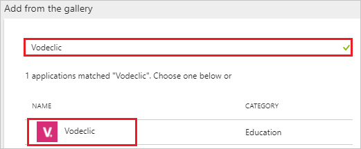
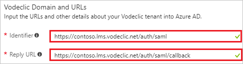
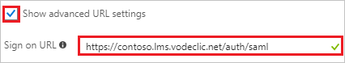
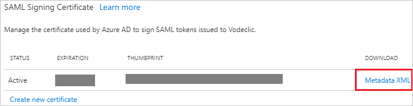

---
title: 'Tutorial: Azure Active Directory integration with Vodeclic | Microsoft Docs'
description: Learn how to configure single sign-on between Azure Active Directory and Vodeclic.
services: active-directory
documentationCenter: na
author: jeevansd
manager: mtillman
ms.reviewer: joflore

ms.assetid: d77a0f53-e3a3-445e-ab3e-119cef6e2e1d
ms.service: active-directory
ms.component: saas-app-tutorial
ms.workload: identity
ms.tgt_pltfrm: na
ms.devlang: na
ms.topic: article
ms.date: 12/06/2017
ms.author: jeedes

---
# Tutorial: Azure Active Directory integration with Vodeclic

In this tutorial, you learn how to integrate Vodeclic with Azure Active Directory (Azure AD).

Integrating Vodeclic with Azure AD provides you with the following benefits:

- You can control in Azure AD who has access to Vodeclic.
- You can enable your users to automatically get signed on to Vodeclic (single sign-on, or SSO) with their Azure AD accounts.
- You can manage your accounts in one central location--the Azure portal.

If you want to know more details about SaaS app integration with Azure AD, see [What is application access and single sign-on with Azure Active Directory?](../manage-apps/what-is-single-sign-on.md).

## Prerequisites

To configure Azure AD integration with Vodeclic, you need the following items:

- An Azure AD subscription
- A Vodeclic SSO-enabled subscription

> [!NOTE]
> To test the steps in this tutorial, we do not recommend using a production environment.

To test the steps in this tutorial, follow these recommendations:

- Don't use your production environment unless it's necessary.
- If you don't have an Azure AD trial environment, [get a one-month free trial](https://azure.microsoft.com/pricing/free-trial/).

## Scenario description
In this tutorial, you test Azure AD single sign-on in a test environment. The scenario outlined in this tutorial consists of two main building blocks:

1. Adding Vodeclic from the gallery
1. Configuring and testing Azure AD single sign-on

## Add Vodeclic from the gallery
To configure the integration of Vodeclic into Azure AD, you need to add Vodeclic from the gallery to your list of managed SaaS apps.

**To add Vodeclic from the gallery, take the following steps:**

1. In the [Azure portal](https://portal.azure.com), in the left pane, select the **Azure Active Directory** icon. 

	![The Azure Active Directory button][1]

1. Go to **Enterprise applications**. Then go to **All applications**.

	![The Enterprise applications blade][2]
	
1. To add a new application, select the **New application** button at the top of the dialog box.

	![The New application button][3]

1. In the search box, type **Vodeclic**. Select **Vodeclic** from the results panel, and then select the **Add** button to add the application.

	

## Configure and test Azure AD single sign-on

In this section, you configure and test Azure AD single sign-on with Vodeclic based on a test user called "Britta Simon."

For single sign-on to work, Azure AD needs to know who the counterpart user in Vodeclic is to a user in Azure AD. In other words, you need to establish a link between an Azure AD user and the related user in Vodeclic.

In Vodeclic, give the value **Username** the same value as **user name** in Azure AD. Now you have established the link between the two users.

To configure and test Azure AD single sign-on with Vodeclic, complete the following building blocks:

1. [Configure Azure AD single sign-On](#configure-azure-ad-single-sign-on) to enable your users to use this feature.
1. [Create an Azure AD test user](#create-an-azure-ad-test-user) to test Azure AD single sign-on with Britta Simon.
1. [Create a Vodeclic test user](#create-a-vodeclic-test-user) to have a counterpart of Britta Simon in Vodeclic that is linked to the Azure AD representation of the user.
1. [Assign the Azure AD test user](#assign-the-azure-ad-test-user) to enable Britta Simon to use Azure AD single sign-on.
1. [Test single sign-on](#test-single-sign-on) to verify whether the configuration works.

### Configure Azure AD single sign-on

In this section, you enable Azure AD single sign-on in the Azure portal and configure single sign-on in your Vodeclic application.

**To configure Azure AD single sign-on with Vodeclic, take the following steps:**

1. In the Azure portal, on the **Vodeclic** application integration page, select **Single sign-on**.

	![Configure single sign-on link][4]

1. In the **Single sign-on** dialog box, under **Single-Sign-on Mode**, select **SAML-based Sign-on** to enable single sign-on.
 
	

1. If you want to configure the application in **IDP** initiated mode, in the **Vodeclic Domain and URLs** section, take the following steps:

	

    a. In the **Identifier** box, type a URL with the following pattern: `https://<companyname>.lms.vodeclic.net/auth/saml`

	b. In the **Reply URL** box, type a URL with the following pattern: `https://<companyname>.lms.vodeclic.net/auth/saml/callback`

1. If you want to configure the application in **SP** initiated mode, select the **Show advanced URL settings** check box, and take the following step:

	

    In the **Sign-on URL** box, type a URL with the following pattern: `https://<companyname>.lms.vodeclic.net/auth/saml`
	 
	> [!NOTE] 
	> These values aren't real. Update these values with the actual identifier, reply URL, and sign-on URL. Contact the [Vodeclic Client support team](mailto:hotline@vodeclic.com) to get these values.

1. In the **SAML Signing Certificate** section, select **Metadata XML**. Then save the metadata file on your computer.

	 

1. Select **Save**.

	
	
1. To configure single sign-on on the **Vodeclic** side, send the downloaded **Metadata XML** to the [Vodeclic support team](mailto:hotline@vodeclic.com). They set this setting to have the SAML SSO connection set properly on both sides.

> [!TIP]
> You can now read a concise version of these instructions inside the [Azure portal](https://portal.azure.com) while you are setting up the app. After you add this app from the **Active Directory** > **Enterprise Applications** section, select the **Single Sign-On** tab and access the embedded documentation through the **Configuration** section at the bottom. You can read more about the embedded documentation feature at [Azure AD embedded documentation]( https://go.microsoft.com/fwlink/?linkid=845985).

### Create an Azure AD test user

The objective of this section is to create a test user in the Azure portal called Britta Simon.

   ![Create an Azure AD test user][100]

**To create a test user in Azure AD, take the following steps:**

1. In the Azure portal, in the left pane, select the **Azure Active Directory** button.

    

1. To display the list of users, go to **Users and groups**. Then select **All users**.

    

1. To open the **User** dialog box, select **Add** at the top of the **All Users** dialog box.

    

1. In the **User** dialog box, take the following steps:

    

    a. In the **Name** box, type **BrittaSimon**.

    b. In the **User name** box, type the email address of user Britta Simon.

    c. Select the **Show Password** check box, and then write down the value that's displayed in the **Password** box.

    d. Select **Create**.
 
### Create a Vodeclic test user

In this section, you create a user called Britta Simon in Vodeclic. Work with the [Vodeclic support team](mailto:hotline@vodeclic.com) to add the users in the Vodeclic platform. Users must be created and activated before you use single sign-on.

> [!NOTE]
> According to application requirements, you might need to get your machine whitelisted. For that to happen, you need to share your public IP address with the [Vodeclic support team](mailto:hotline@vodeclic.com).

### Assign the Azure AD test user

In this section, you enable Britta Simon to use Azure single sign-on by granting access to Vodeclic.

![Assign the user role][200] 

**To assign Britta Simon to Vodeclic, take the following steps:**

1. In the Azure portal, open the applications view, and then go to the directory view. Next, go to **Enterprise applications**, and then select **All applications**.

	![Assign user][201] 

1. In the applications list, select **Vodeclic**.

	  

1. In the menu on the left, select **Users and groups**.

	![The "Users and groups" link][202]

1. Select the **Add** button. Then select **Users and groups** in the **Add Assignment** dialog box.

	![The Add Assignment pane][203]

1. In the **Users and groups** dialog box, select **Britta Simon** in the **Users** list.

1. In the **Users and groups** dialog box, select the **Select** button.

1. In the **Add Assignment** dialog box, select the **Assign** button.
	
### Test single sign-on

In this section, you test your Azure AD single sign-on configuration by using the access panel.

When you select the Vodeclic tile in the access panel, you get automatically signed in to your Vodeclic application.

For more information about the access panel, see [Introduction to the access panel](../user-help/active-directory-saas-access-panel-introduction.md). 

## Additional resources

* [List of tutorials on how to integrate SaaS apps with Azure Active Directory](tutorial-list.md)
* [What is application access and single sign-on with Azure Active Directory?](../manage-apps/what-is-single-sign-on.md)

<!--Image references-->

[1]: ./media/vodeclic-tutorial/tutorial_general_01.png
[2]: ./media/vodeclic-tutorial/tutorial_general_02.png
[3]: ./media/vodeclic-tutorial/tutorial_general_03.png
[4]: ./media/vodeclic-tutorial/tutorial_general_04.png

[100]: ./media/vodeclic-tutorial/tutorial_general_100.png

[200]: ./media/vodeclic-tutorial/tutorial_general_200.png
[201]: ./media/vodeclic-tutorial/tutorial_general_201.png
[202]: ./media/vodeclic-tutorial/tutorial_general_202.png
[203]: ./media/vodeclic-tutorial/tutorial_general_203.png

