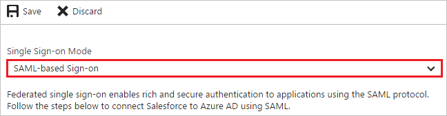
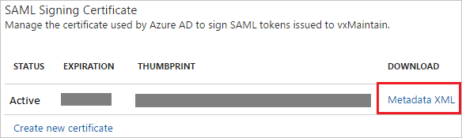
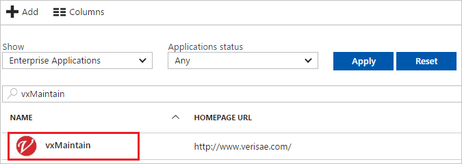

---
title: 'Tutorial: Azure Active Directory integration with vxMaintain | Microsoft Docs'
description: Learn how to configure single sign-on between Azure Active Directory and vxMaintain.
services: active-directory
documentationCenter: na
author: jeevansd
manager: mtillman

ms.assetid: 841a1066-593c-4603-9abe-f48496d73d10
ms.service: active-directory
ms.component: saas-app-tutorial
ms.workload: identity
ms.tgt_pltfrm: na
ms.devlang: na
ms.topic: article
ms.date: 01/26/2018
ms.author: jeedes

---
# Tutorial: Azure Active Directory integration with vxMaintain

In this tutorial, you learn how to integrate vxMaintain with Azure Active Directory (Azure AD).

This integration provides several important benefits. You can:

- Control in Azure AD who has access to vxMaintain.
- Enable your users to automatically sign in to vxMaintain with single sign-on (SSO) by using their Azure AD accounts.
- Manage your accounts in one central location: the Azure portal.

To learn more about SaaS app integration with Azure AD, see [What is application access and single sign-on with Azure Active Directory?](../manage-apps/what-is-single-sign-on.md).

## Prerequisites

To configure Azure AD integration with vxMaintain, you need the following items:

- An Azure AD subscription
- A vxMaintain SSO-enabled subscription

> [!NOTE]
> When you test the steps in this tutorial, we recommend that you do not use a production environment.

To test the steps in this tutorial, follow these recommendations:

- Do not use your production environment, unless it is necessary.
- If you don't have an Azure AD trial environment, you can [get a one-month trial](https://azure.microsoft.com/pricing/free-trial/).

## Scenario description
In this tutorial, you test Azure AD single sign-on in a test environment. 

The scenario that this tutorial outlines consists of two main building blocks:

* Adding vxMaintain from the gallery
* Configuring and testing Azure AD single sign-on

## Add vxMaintain from the gallery
To configure the integration of vxMaintain with Azure AD, you need to add vxMaintain from the gallery to your list of managed SaaS apps.

To add vxMaintain from the gallery, do the following:

1. In the [Azure portal](https://portal.azure.com), in the left pane, select the **Azure Active Directory** button. 

	![The Azure Active Directory button][1]

1. Select **Enterprise applications** > **All applications**.

	![The "Enterprise applications" pane][2]
	
1. To add an application, in the **All applications** dialog box, select **New application**.

	![The "New application" button][3]

1. In the search box, type **vxMaintain**.

	

1. In the results list, select **vxMaintain**, and then select **Add**.

	

##  Configure and test Azure AD single sign-on
In this section, you configure and test Azure AD SSO by using vxMaintain, based on a test user called "Britta Simon."

For SSO to work, Azure AD needs to know the vxMaintain counterpart to the Azure AD user. That is, you must establish a link relationship between the Azure AD user and the corresponding vxMaintain user.

To establish the link relationship, assign the vxMaintain **user name** value as the Azure AD **Username** value.

To configure and test Azure AD SSO by using vxMaintain, complete the following building blocks.

### Configure Azure AD SSO

In this section, you can both enable Azure AD SSO in the Azure portal and configure SSO in your vxMaintain application by doing the following:

1. In the Azure portal, on the **vxMaintain** application integration page, select **Single sign-on**.

	![The "Single sign-on" command][4]

1. To enable SSO, in the **Single Sign-on Mode** drop-down list, select **SAML-based Sign-on**.
 
	

1. Under **vxMaintain Domain and URLs**, do the following:

	

    a. In the **Identifier** box, type a URL that has the following syntax: `https://<company name>.verisae.com`

	b. In the **Reply URL** box, type a URL that has the following syntax: `https://<company name>.verisae.com/DataNett/action/ssoConsume/mobile?_log=true`

	> [!NOTE] 
	> The preceding values are not real. Update them with the actual identifier and reply URL. To obtain the values, contact the [vxMaintain support team](https://www.hubspot.com/company/contact).
 
1. Under **SAML Signing Certificate**, select **Metadata XML**, and then save the metadata file to your computer.

	 

1. Select **Save**.

	

1. To configure **vxMaintain** SSO, send the downloaded **Metadata XML** file to the [vxMaintain support team](https://www.hubspot.com/company/contact).

> [!TIP]
> As you set up the app, you can read a concise version of the preceding instructions in the [Azure portal](https://portal.azure.com). After you add the app from the **Active Directory** > **Enterprise Applications** section, select the **Single Sign-On** tab, and then access the embedded documentation from the **Configuration** section. 
>
>To learn more about the embedded documentation feature, see [Managing single sign-on for enterprise apps](https://go.microsoft.com/fwlink/?linkid=845985).
> 

### Create an Azure AD test user
In this section, you create test user Britta Simon in the Azure portal by doing the following:

![The Azure AD test user][100]

1. In the **Azure portal**, in the left pane, select the **Azure Active Directory** button.

	 

1. To display a list of users, go to **Users and groups** > **All users**.
	
	  
    The **All users** dialog box opens. 

1. To open the **User** dialog box, select **Add**.
 
	 

1. In the **User** dialog box, do the following:
 
	 

    a. In the **Name** box, type **BrittaSimon**.

    b. In the **User name** box, type the email address of test user Britta Simon.

	c. Select the **Show Password** check box, and then note the value that was generated in the **Password** box.

    d. Select **Create**.
 
### Create a vxMaintain test user

In this section, you create test user Britta Simon in vxMaintain. To add users in the vxMaintain platform, work with the [vxMaintain support team](https://www.hubspot.com/company/contact). Before you use SSO, create and activate the users.

### Assign the Azure AD test user

In this section, you enable test user Britta Simon to use Azure SSO by granting access to vxMaintain. To do so, do the following:

![Test user in the Display Name list][200] 

1. In the Azure portal **Applications** view, go to **Directory** view > **Enterprise applications** > **All applications**.

	![The "All applications" link][201] 

1. In the **Applications** list, select **vxMaintain**.

	 

1. In the left pane, select **Users and groups**.

	![The "Users and groups" link][202] 

1. Select **Add** and then, in the **Add Assignment** pane, select **Users and groups**.

	![The "Users and groups" link][203]

1. In the **Users and groups** dialog box, in the **Users** list, select **Britta Simon**, and then select the **Select** button.

1. In the **Add Assignment** dialog box, select **Assign**.
	
### Test your Azure AD single sign-on

In this section, you test your Azure AD SSO configuration by using the Access Panel.

Selecting the **vxMaintain** tile in the Access Panel should sign you in to your vxMaintain application automatically.

For more information about the Access Panel, see [Introduction to the Access Panel](../user-help/active-directory-saas-access-panel-introduction.md).

## Next steps

* [List of tutorials on integrating SaaS apps with Azure Active Directory](tutorial-list.md)
* [What is application access and single sign-on with Azure Active Directory?](../manage-apps/what-is-single-sign-on.md)

<!--Image references-->

[1]: ./media/vxmaintain-tutorial/tutorial_general_01.png
[2]: ./media/vxmaintain-tutorial/tutorial_general_02.png
[3]: ./media/vxmaintain-tutorial/tutorial_general_03.png
[4]: ./media/vxmaintain-tutorial/tutorial_general_04.png

[100]: ./media/vxmaintain-tutorial/tutorial_general_100.png

[200]: ./media/vxmaintain-tutorial/tutorial_general_200.png
[201]: ./media/vxmaintain-tutorial/tutorial_general_201.png
[202]: ./media/vxmaintain-tutorial/tutorial_general_202.png
[203]: ./media/vxmaintain-tutorial/tutorial_general_203.png

