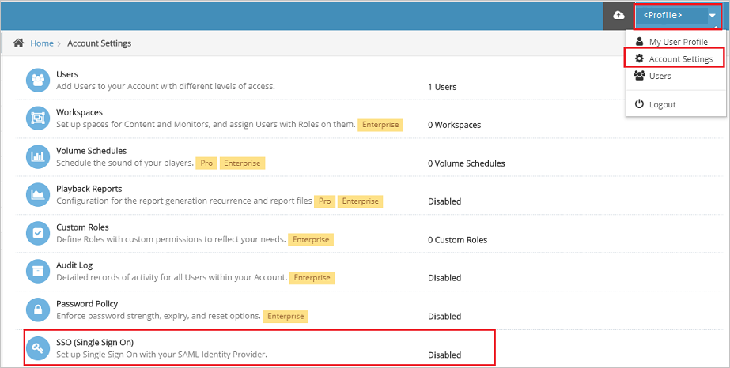

# Tutorial: Azure AD SSO integration with Watch by Colors

In this tutorial, you'll learn how to integrate Watch by Colors with Azure Active Directory (Azure AD). When you integrate Watch by Colors with Azure AD, you can:

* Control in Azure AD who has access to Watch by Colors.
* Enable your users to be automatically signed-in to Watch by Colors with their Azure AD accounts.
* Manage your accounts in one central location - the Azure portal.

## Prerequisites

To get started, you need the following items:

* An Azure AD subscription. If you don't have a subscription, you can get a [free account](https://azure.microsoft.com/free/).
* Watch by Colors single sign-on (SSO) enabled subscription.

## Scenario description

In this tutorial, you configure and test Azure AD SSO in a test environment.

* Watch by Colors supports **SP and IDP** initiated SSO.

## Add Watch by Colors from the gallery

To configure the integration of Watch by Colors into Azure AD, you need to add Watch by Colors from the gallery to your list of managed SaaS apps.

1. Sign in to the Azure portal using either a work or school account, or a personal Microsoft account.
1. On the left navigation pane, select the **Azure Active Directory** service.
1. Navigate to **Enterprise Applications** and then select **All Applications**.
1. To add new application, select **New application**.
1. In the **Add from the gallery** section, type **Watch by Colors** in the search box.
1. Select **Watch by Colors** from results panel and then add the app. Wait a few seconds while the app is added to your tenant.

 Alternatively, you can also use the [Enterprise App Configuration Wizard](https://portal.office.com/AdminPortal/home?Q=Docs#/azureadappintegration). In this wizard, you can add an application to your tenant, add users/groups to the app, assign roles, as well as walk through the SSO configuration as well. [Learn more about Microsoft 365 wizards.](/microsoft-365/admin/misc/azure-ad-setup-guides)

## Configure and test Azure AD SSO for Watch by Colors

Configure and test Azure AD SSO with Watch by Colors using a test user called **B.Simon**. For SSO to work, you need to establish a link relationship between an Azure AD user and the related user in Watch by Colors.

To configure and test Azure AD SSO with Watch by Colors, perform the following steps:

1. **[Configure Azure AD SSO](#configure-azure-ad-sso)** - to enable your users to use this feature.
    1. **[Create an Azure AD test user](#create-an-azure-ad-test-user)** - to test Azure AD single sign-on with B.Simon.
    1. **[Assign the Azure AD test user](#assign-the-azure-ad-test-user)** - to enable B.Simon to use Azure AD single sign-on.
1. **[Configure Watch by Colors SSO](#configure-watch-by-colors-sso)** - to configure the single sign-on settings on application side.
    1. **[Create Watch by Colors test user](#create-watch-by-colors-test-user)** - to have a counterpart of B.Simon in Watch by Colors that is linked to the Azure AD representation of user.
1. **[Test SSO](#test-sso)** - to verify whether the configuration works.

## Configure Azure AD SSO

Follow these steps to enable Azure AD SSO in the Azure portal.

1. In the Azure portal, on the **Watch by Colors** application integration page, find the **Manage** section and select **single sign-on**.
1. On the **Select a single sign-on method** page, select **SAML**.
1. On the **Set up single sign-on with SAML** page, click the pencil icon for **Basic SAML Configuration** to edit the settings.

   

1. On the **Basic SAML Configuration** section the application is pre-configured in **IDP** initiated mode and the necessary URLs are already pre-populated with Azure. The user needs to save the configuration by clicking the **Save** button.

1. Click **Set additional URLs** and perform the following step if you wish to configure the application in **SP** initiated mode:

    In the **Sign-on URL** text box, type the URL:
    `https://app.colorscorporation.com/login`

1. On the **Set up single sign-on with SAML** page, In the **SAML Signing Certificate** section, click copy button to copy **App Federation Metadata Url** and save it on your computer.

	

### Create an Azure AD test user

In this section, you'll create a test user in the Azure portal called B.Simon.

1. From the left pane in the Azure portal, select **Azure Active Directory**, select **Users**, and then select **All users**.
1. Select **New user** at the top of the screen.
1. In the **User** properties, follow these steps:
   1. In the **Name** field, enter `B.Simon`.  
   1. In the **User name** field, enter the username@companydomain.extension. For example, `B.Simon@contoso.com`.
   1. Select the **Show password** check box, and then write down the value that's displayed in the **Password** box.
   1. Click **Create**.

### Assign the Azure AD test user

In this section, you'll enable B.Simon to use Azure single sign-on by granting access to Watch by Colors.

1. In the Azure portal, select **Enterprise Applications**, and then select **All applications**.
1. In the applications list, select **Watch by Colors**.
1. In the app's overview page, find the **Manage** section and select **Users and groups**.
1. Select **Add user**, then select **Users and groups** in the **Add Assignment** dialog.
1. In the **Users and groups** dialog, select **B.Simon** from the Users list, then click the **Select** button at the bottom of the screen.
1. If you're expecting any role value in the SAML assertion, in the **Select Role** dialog, select the appropriate role for the user from the list and then click the **Select** button at the bottom of the screen.
1. In the **Add Assignment** dialog, click the **Assign** button.

## Configure Watch by Colors SSO

1. To automate the configuration within Watch by Colors, you need to install **My Apps Secure Sign-in browser extension** by clicking **Install the extension**.

	

2. After adding extension to the browser, click on **setup Watch by Colors** will direct you to the Watch by Colors application. From there, provide the admin credentials to sign into Watch by Colors. The browser extension will automatically configure the application for you and automate steps 3-5.

	

3. If you want to setup Watch by Colors manually, open a new web browser window and sign into your Watch by Colors company site as an administrator and perform the following steps:

4. On the top-right corner of the page, click on **profile** > **Account Settings** > **SSO (Single Sign On)**.

	

5. On the **SSO (Single Sign On)** page, perform the following steps:

	

	a. Toggle **Enable SAML** to **ON**.

    b. In the **URL** text box, paste the **Federation Metadata Url**, which you have copied from Azure portal.

    c. Click **Import**, then the following fields get auto-populated automatically on the page.

    d. Click **Save**.

### Create Watch by Colors test user

To enable Azure AD users to sign in to Watch by Colors, they must be provisioned into Watch by Colors. In Watch by Colors, provisioning is a manual task.

**To provision a user account, perform the following steps:**

1. Sign in to Watch by Colors as a Security Administrator.

1. On the top-right corner of the page, click on **profile** > **Users** > **Add User**.

	

1. On the **User Details** page, perform the following steps:

    

    a. In **First Name** text box, enter the first name of user like **B**.

    b. In **Last Name** text box, enter the last name of user like **Simon**.

    c. In **Email** text box, enter the email of user like `B.Simon@contoso.com`.

    d. In **Password** text box, enter the password.

    e. Select **Account Permissions** as per your organization.

    f. Click **Save**.

## Test SSO 

In this section, you test your Azure AD single sign-on configuration with following options. 

#### SP initiated:

* Click on **Test this application** in Azure portal. This will redirect to Watch by Colors Sign on URL where you can initiate the login flow.  

* Go to Watch by Colors Sign-on URL directly and initiate the login flow from there.

#### IDP initiated:

* Click on **Test this application** in Azure portal and you should be automatically signed in to the Watch by Colors for which you set up the SSO. 

You can also use Microsoft My Apps to test the application in any mode. When you click the Watch by Colors tile in the My Apps, if configured in SP mode you would be redirected to the application sign on page for initiating the login flow and if configured in IDP mode, you should be automatically signed in to the Watch by Colors for which you set up the SSO. For more information about the My Apps, see [Introduction to the My Apps](../user-help/my-apps-portal-end-user-access.md).

## Next steps

Once you configure Watch by Colors you can enforce session control, which protects exfiltration and infiltration of your organization’s sensitive data in real time. Session control extends from Conditional Access. [Learn how to enforce session control with Microsoft Defender for Cloud Apps](/cloud-app-security/proxy-deployment-aad).
