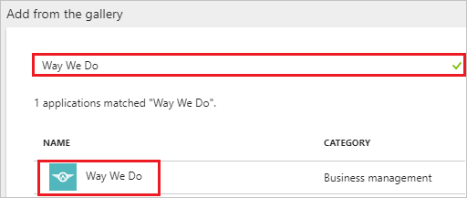
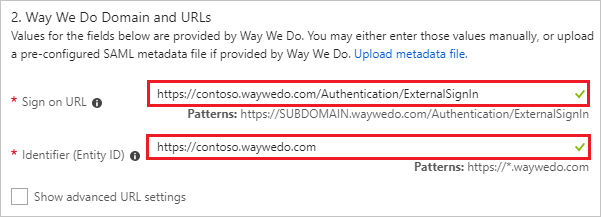
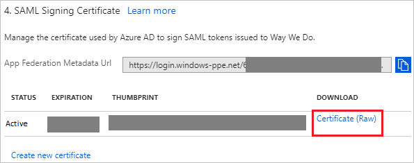
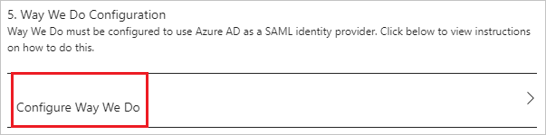
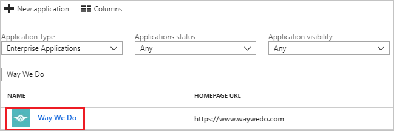

# Tutorial: Azure Active Directory integration with Way We Do

In this tutorial, you learn how to integrate Way We Do with Azure Active Directory (Azure AD).

Integrating Way We Do with Azure AD provides you with the following benefits:

- You can control in Azure AD who has access to Way We Do.
- You can enable your users to automatically get signed-on to Way We Do (Single Sign-On) with their Azure AD accounts.
- You can manage your accounts in one central location - the Azure portal.

If you want to know more details about SaaS app integration with Azure AD, see [what is application access and single sign-on with Azure Active Directory](../manage-apps/what-is-single-sign-on.md).

## Prerequisites

To configure Azure AD integration with Way We Do, you need the following items:

- An Azure AD subscription
- A Way We Do single sign-on enabled subscription

> [!NOTE]
> To test the steps in this tutorial, we do not recommend using a production environment.

To test the steps in this tutorial, you should follow these recommendations:

- Do not use your production environment, unless it is necessary.
- If you don't have an Azure AD trial environment, you can [get a one-month trial](https://azure.microsoft.com/pricing/free-trial/).

## Scenario description
In this tutorial, you test Azure AD single sign-on in a test environment. 
The scenario outlined in this tutorial consists of two main building blocks:

1. Adding Way We Do from the gallery
2. Configuring and testing Azure AD single sign-on

## Adding Way We Do from the gallery
To configure the integration of Way We Do into Azure AD, you need to add Way We Do from the gallery to your list of managed SaaS apps.

**To add Way We Do from the gallery, perform the following steps:**

1. In the **[Azure portal](https://portal.azure.com)**, on the left navigation panel, click **Azure Active Directory** icon. 

	![The Azure Active Directory button][1]

2. Navigate to **Enterprise applications**. Then go to **All applications**.

	![The Enterprise applications blade][2]
	
3. To add new application, click **New application** button on the top of dialog.

	![The New application button][3]

4. In the search box, type **Way We Do**, select **Way We Do** from result panel then click **Add** button to add the application.

	

## Configure and test Azure AD single sign-on

In this section, you configure and test Azure AD single sign-on with Way We Do based on a test user called "Britta Simon".

For single sign-on to work, Azure AD needs to know what the counterpart user in Way We Do is to a user in Azure AD. In other words, a link relationship between an Azure AD user and the related user in Way We Do needs to be established.

To configure and test Azure AD single sign-on with Way We Do, you need to complete the following building blocks:

1. **[Configure Azure AD Single Sign-On](#configure-azure-ad-single-sign-on)** - to enable your users to use this feature.
2. **[Create an Azure AD test user](#create-an-azure-ad-test-user)** - to test Azure AD single sign-on with Britta Simon.
3. **[Create a Way We Do test user](#create-a-way-we-do-test-user)** - to have a counterpart of Britta Simon in Way We Do that is linked to the Azure AD representation of user.
4. **[Assign the Azure AD test user](#assign-the-azure-ad-test-user)** - to enable Britta Simon to use Azure AD single sign-on.
5. **[Test single sign-on](#test-single-sign-on)** - to verify whether the configuration works.

### Configure Azure AD single sign-on

In this section, you enable Azure AD single sign-on in the Azure portal and configure single sign-on in your Way We Do application.

**To configure Azure AD single sign-on with Way We Do, perform the following steps:**

1. In the Azure portal, on the **Way We Do** application integration page, click **Single sign-on**.

	![Configure single sign-on link][4]

2. On the **Single sign-on** dialog, select **Mode** as	**SAML-based Sign-on** to enable single sign-on.
 
	

3. On the **Way We Do Domain and URLs** section, perform the following steps:

	

    a. In the **Sign-on URL** textbox, type a URL using the following pattern: `https://<SUBDOMAIN>.waywedo.com/Authentication/ExternalSignIn`

	b. In the **Identifier** textbox, type a URL using the following pattern: `https://<SUBDOMAIN>.waywedo.com`

	> [!NOTE] 
	> These values are not real. Update these values with the actual Sign-On URL and Identifier. Contact [Way We Do Client support team](mailto:support@waywedo.com) to get these values. 
 
4. On the **SAML Signing Certificate** section, click **Certificate (Raw)** and then save the certificate file on your computer.

	 

5. Click **Save** button.

	

6. On the **Way We Do Configuration** section, click **Configure Way We Do** to open **Configure sign-on** window. Copy the **SAML Entity ID and SAML Single Sign-On Service URL** from the **Quick Reference section.**

	 

7. In a different web browser window, login to Way We Do as a Security Administrator.

8. Click the **person icon** in the top right corner of any page in Way We Do, then click **Account** in the dropdown menu.

	 

9. Click the **menu icon** to open the push navigation menu and Click **Single Sign On**.

	

10. On the **Single sign-on setup** page, perform the following steps:

	

	a. Click the **Turn on single sign-on** toggle to **Yes** to enable Single Sign-On.

	b. In the **Single sign-on name** textbox, enter your name.

	c. In the **Entity ID** textbox, paste the value of **SAML Entity ID**, which you have copied from the Azure portal.

	d. In the **SAML SSO URL** textbox, paste the value of **SAML Single Sign-On Service URL**, which you have copied from the Azure portal.

	e. Upload the certificate by clicking the **select** button next to **Certificate**.

	f. **Optional Settings** -
	
	* Enable Passwords - When this option is disabled, the regular password functions for Way We Do so that users can only use single sign-on.

	* Enable Auto-provisioning - When this is enabled, the email address used to sign-on will be automatically compared to the list of users in Way We Do. If the email address does not match an active user in Way We Do, it automatically adds a new user account for the person signing in, requesting any missing information.

	  > [!NOTE]
	  > Users added through single sign-on are added as general users and are not assigned a role in the system. An Administrator is able to go in and modify their security role as an editor or administrator and can also assign one or several Org Chart roles. 

	g. Click **Save** to persist your settings.

### Create an Azure AD test user

The objective of this section is to create a test user in the Azure portal called Britta Simon.

   ![Create an Azure AD test user][100]

**To create a test user in Azure AD, perform the following steps:**

1. In the Azure portal, in the left pane, click the **Azure Active Directory** button.

    

2. To display the list of users, go to **Users and groups**, and then click **All users**.

    

3. To open the **User** dialog box, click **Add** at the top of the **All Users** dialog box.

    

4. In the **User** dialog box, perform the following steps:

    

    a. In the **Name** box, type **BrittaSimon**.

    b. In the **User name** box, type the email address of user Britta Simon.

    c. Select the **Show Password** check box, and then write down the value that's displayed in the **Password** box.

    d. Click **Create**.
 
### Create a Way We Do test user

The objective of this section is to create a user called Britta Simon in Way We Do. Way We Do supports just-in-time provisioning, which is by default enabled. There is no action item for you in this section. A new user is created during an attempt to access Way We Do if it doesn't exist yet.

> [!Note]
> If you need to create a user manually, contact [Way We Do Client support team](mailto:support@waywedo.com).

### Assign the Azure AD test user

In this section, you enable Britta Simon to use Azure single sign-on by granting access to Way We Do.

![Assign the user role][200] 

**To assign Britta Simon to Way We Do, perform the following steps:**

1. In the Azure portal, open the applications view, and then navigate to the directory view and go to **Enterprise applications** then click **All applications**.

	![Assign User][201] 

2. In the applications list, select **Way We Do**.

	  

3. In the menu on the left, click **Users and groups**.

	![The "Users and groups" link][202]

4. Click **Add** button. Then select **Users and groups** on **Add Assignment** dialog.

	![The Add Assignment pane][203]

5. On **Users and groups** dialog, select **Britta Simon** in the Users list.

6. Click **Select** button on **Users and groups** dialog.

7. Click **Assign** button on **Add Assignment** dialog.
	
### Test single sign-on

In this section, you test your Azure AD single sign-on configuration using the Access Panel.

When you click the Way We Do tile in the Access Panel, you should get automatically signed-on to your Way We Do application.
For more information about the Access Panel, see [Introduction to the Access Panel](../active-directory-saas-access-panel-introduction.md). 

## Additional resources

* [List of Tutorials on How to Integrate SaaS Apps with Azure Active Directory](tutorial-list.md)
* [What is application access and single sign-on with Azure Active Directory?](../manage-apps/what-is-single-sign-on.md)

<!--Image references-->

[1]: ./media/waywedo-tutorial/tutorial_general_01.png
[2]: ./media/waywedo-tutorial/tutorial_general_02.png
[3]: ./media/waywedo-tutorial/tutorial_general_03.png
[4]: ./media/waywedo-tutorial/tutorial_general_04.png

[100]: ./media/waywedo-tutorial/tutorial_general_100.png

[200]: ./media/waywedo-tutorial/tutorial_general_200.png
[201]: ./media/waywedo-tutorial/tutorial_general_201.png
[202]: ./media/waywedo-tutorial/tutorial_general_202.png
[203]: ./media/waywedo-tutorial/tutorial_general_203.png

