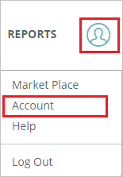
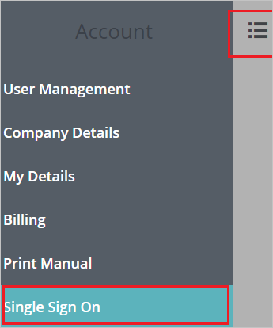
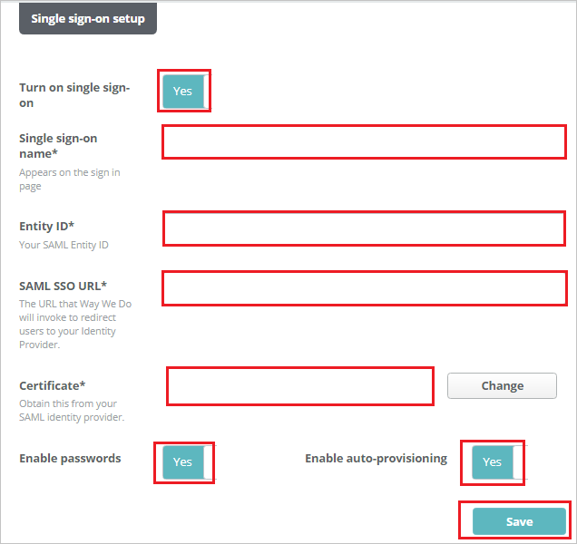

# Tutorial: Azure AD SSO integration with Way We Do

In this tutorial, you'll learn how to integrate Way We Do with Azure Active Directory (Azure AD). When you integrate Way We Do with Azure AD, you can:

* Control in Azure AD who has access to Way We Do.
* Enable your users to be automatically signed-in to Way We Do with their Azure AD accounts.
* Manage your accounts in one central location - the Azure portal.

## Prerequisites

To configure Azure AD integration with Way We Do, you need the following items:

* An Azure AD subscription. If you don't have an Azure AD environment, you can get a [free account](https://azure.microsoft.com/free/).
* Way We Do single sign-on enabled subscription.

## Scenario description

In this tutorial, you configure and test Azure AD SSO in a test environment.

* Way We Do supports **SP** initiated SSO.
* Way We Do supports **Just In Time** user provisioning.

## Add Way We Do from the gallery

To configure the integration of Way We Do into Azure AD, you need to add Way We Do from the gallery to your list of managed SaaS apps.

1. Sign in to the Azure portal using either a work or school account, or a personal Microsoft account.
1. On the left navigation pane, select the **Azure Active Directory** service.
1. Navigate to **Enterprise Applications** and then select **All Applications**.
1. To add new application, select **New application**.
1. In the **Add from the gallery** section, type **Way We Do** in the search box.
1. Select **Way We Do** from results panel and then add the app. Wait a few seconds while the app is added to your tenant.

 Alternatively, you can also use the [Enterprise App Configuration Wizard](https://portal.office.com/AdminPortal/home?Q=Docs#/azureadappintegration). In this wizard, you can add an application to your tenant, add users/groups to the app, assign roles, as well as walk through the SSO configuration as well. [Learn more about Microsoft 365 wizards.](/microsoft-365/admin/misc/azure-ad-setup-guides)

## Configure and test Azure AD SSO for Way We Do

Configure and test Azure AD SSO with Way We Do using a test user called **B.Simon**. For SSO to work, you need to establish a link relationship between an Azure AD user and the related user in Way We Do.

To configure and test Azure AD SSO with Way We Do, perform the following steps:

1. **[Configure Azure AD SSO](#configure-azure-ad-sso)** - to enable your users to use this feature.
    1. **[Create an Azure AD test user](#create-an-azure-ad-test-user)** - to test Azure AD single sign-on with B.Simon.
    1. **[Assign the Azure AD test user](#assign-the-azure-ad-test-user)** - to enable B.Simon to use Azure AD single sign-on.
1. **[Configure Way We Do SSO](#configure-way-we-do-sso)** - to configure the single sign-on settings on application side.
    1. **[Create Way We Do test user](#create-way-we-do-test-user)** - to have a counterpart of B.Simon in Way We Do that is linked to the Azure AD representation of user.
1. **[Test SSO](#test-sso)** - to verify whether the configuration works.

## Configure Azure AD SSO

Follow these steps to enable Azure AD SSO in the Azure portal.

1. In the Azure portal, on the **Way We Do** application integration page, find the **Manage** section and select **Single sign-on**.
1. On the **Select a Single sign-on method** page, select **SAML**.
1. On the **Set up Single Sign-On with SAML** page, click the pencil icon for **Basic SAML Configuration** to edit the settings.

   

1. On the **Basic SAML Configuration** section, perform the following steps:  

    a. In the **Identifier (Entity ID)** text box, type a URL using the following pattern:
    `https://<SUBDOMAIN>.waywedo.com`

	b. In the **Sign on URL** text box, type a URL using the following pattern:
    `https://<SUBDOMAIN>.waywedo.com/Authentication/ExternalSignIn`

	> [!NOTE]
	> These values are not real. Update these values with the actual Identifier and Sign on URL. Contact [Way We Do Client support team](mailto:support@waywedo.com) to get these values. You can also refer to the patterns shown in the **Basic SAML Configuration** section in the Azure portal.

1. On the **Set up Single Sign-On with SAML** page, in the **SAML Signing Certificate** section, find **Certificate (Raw)** and select **Download** to download the certificate and save it on your computer.

   

1. On the **Set up Way We Do** section, copy the appropriate URL(s) based on your requirement.

   

### Create an Azure AD test user

In this section, you'll create a test user in the Azure portal called B.Simon.

1. From the left pane in the Azure portal, select **Azure Active Directory**, select **Users**, and then select **All users**.
1. Select **New user** at the top of the screen.
1. In the **User** properties, follow these steps:
   1. In the **Name** field, enter `B.Simon`.  
   1. In the **User name** field, enter the username@companydomain.extension. For example, `B.Simon@contoso.com`.
   1. Select the **Show password** check box, and then write down the value that's displayed in the **Password** box.
   1. Click **Create**.

### Assign the Azure AD test user

In this section, you'll enable B.Simon to use Azure single sign-on by granting access to Way We Do.

1. In the Azure portal, select **Enterprise Applications**, and then select **All applications**.
1. In the applications list, select **Way We Do**.
1. In the app's overview page, find the **Manage** section and select **Users and groups**.
1. Select **Add user**, then select **Users and groups** in the **Add Assignment** dialog.
1. In the **Users and groups** dialog, select **B.Simon** from the Users list, then click the **Select** button at the bottom of the screen.
1. If you're expecting any role value in the SAML assertion, in the **Select Role** dialog, select the appropriate role for the user from the list and then click the **Select** button at the bottom of the screen.
1. In the **Add Assignment** dialog, click the **Assign** button.

## Configure Way We Do SSO

1. In a different web browser window, sign in to your Way We Do company site as an administrator

1. Click the **person icon** in the top right corner of any page in Way We Do, then click **Account** in the dropdown menu.

    

1. Click the **menu icon** to open the push navigation menu and Click **Single Sign On**.

    

1. On the **Single sign-on setup** page, perform the following steps:

    

    1. Click the **Turn on single sign-on** toggle to **Yes** to enable Single Sign-On.

	1. In the **Single sign-on name** textbox, enter your name.

	1. In the **Entity ID** textbox, paste the value of **Azure AD Identifier**, which you have copied from the Azure portal.

	1. In the **SAML SSO URL** textbox, paste the value of **Login URL**, which you have copied from the Azure portal.

	1. Upload the certificate by clicking the **select** button next to **Certificate**.

	1. **Optional Settings** -

	    * Enable Passwords - When this option is disabled, the regular password functions for Way We Do so that users can only use single sign-on.

        * Enable Auto-provisioning - When this is enabled, the email address used to sign-on will be automatically compared to the list of users in Way We Do. If the email address does not match an active user in Way We Do, it automatically adds a new user account for the person signing in, requesting any missing information.

          > [!NOTE]
          > Users added through single sign-on are added as general users and are not assigned a role in the system. An Administrator is able to go in and modify their security role as an editor or administrator and can also assign one or several Org Chart roles.

    1. Click **Save** to persist your settings.
    
### Create Way We Do test user

In this section, a user called Britta Simon is created in Way We Do. Way We Do supports just-in-time user provisioning, which is enabled by default. There is no action item for you in this section. If a user doesn't already exist in Way We Do, a new one is created after authentication.

> [!Note]
> If you need to create a user manually, contact [Way We Do Client support team](mailto:support@waywedo.com).

## Test SSO

In this section, you test your Azure AD single sign-on configuration with following options. 

* Click on **Test this application** in Azure portal. This will redirect to Way We Do Sign-on URL where you can initiate the login flow. 

* Go to Way We Do Sign-on URL directly and initiate the login flow from there.

* You can use Microsoft My Apps. When you click the Way We Do tile in the My Apps, this will redirect to Way We Do Sign-on URL. For more information about the My Apps, see [Introduction to the My Apps](../user-help/my-apps-portal-end-user-access.md).

## Next steps

Once you configure Way We Do you can enforce session control, which protects exfiltration and infiltration of your organization’s sensitive data in real time. Session control extends from Conditional Access. [Learn how to enforce session control with Microsoft Cloud App Security](/cloud-app-security/proxy-deployment-aad).