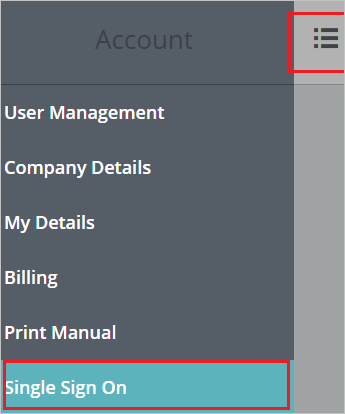
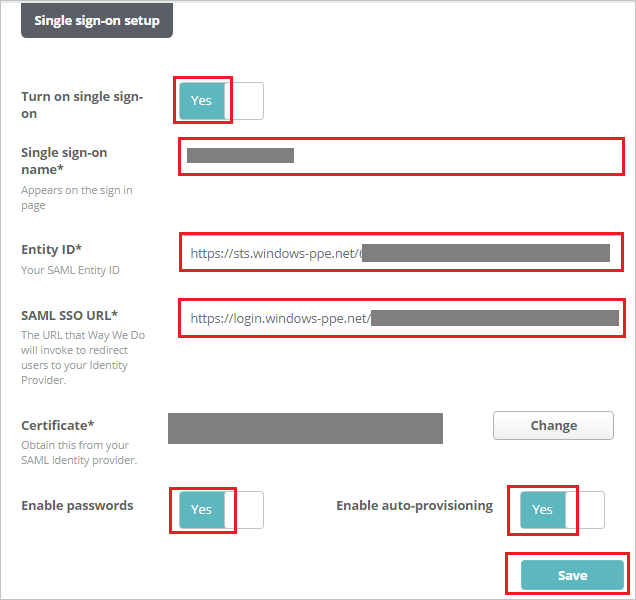

# Tutorial: Azure Active Directory integration with Way We Do

In this tutorial, you learn how to integrate Way We Do with Azure Active Directory (Azure AD).
Integrating Way We Do with Azure AD provides you with the following benefits:

* You can control in Azure AD who has access to Way We Do.
* You can enable your users to be automatically signed in to Way We Do (Single Sign-On) with their Azure AD accounts.
* You can manage your accounts in one central location - the Azure portal.

If you want to know more details about SaaS app integration with Azure AD, see [What is application access and single sign-on with Azure Active Directory](https://docs.microsoft.com/azure/active-directory/active-directory-appssoaccess-whatis).
If you don't have an Azure subscription, [create a free account](https://azure.microsoft.com/free/) before you begin.

## Prerequisites

To configure Azure AD integration with Way We Do, you need the following items:

* An Azure AD subscription. If you don't have an Azure AD environment, you can get a [free account](https://azure.microsoft.com/free/)
* Way We Do single sign-on enabled subscription

## Scenario description

In this tutorial, you configure and test Azure AD single sign-on in a test environment.

* Way We Do supports **SP** initiated SSO

* Way We Do supports **Just In Time** user provisioning

## Adding Way We Do from the gallery

To configure the integration of Way We Do into Azure AD, you need to add Way We Do from the gallery to your list of managed SaaS apps.

**To add Way We Do from the gallery, perform the following steps:**

1. In the **[Azure portal](https://portal.azure.com)**, on the left navigation panel, click **Azure Active Directory** icon.

	

2. Navigate to **Enterprise Applications** and then select the **All Applications** option.

	

3. To add new application, click **New application** button on the top of dialog.

	

4. In the search box, type **Way We Do**, select **Way We Do** from result panel then click **Add** button to add the application.

	

## Configure and test Azure AD single sign-on

In this section, you configure and test Azure AD single sign-on with Way We Do based on a test user called **Britta Simon**.
For single sign-on to work, a link relationship between an Azure AD user and the related user in Way We Do needs to be established.

To configure and test Azure AD single sign-on with Way We Do, you need to complete the following building blocks:

1. **[Configure Azure AD single sign-On](#configure-azure-ad-single-sign-on)** - to enable your users to use this feature.
2. **[Configure Way We Do single sign-On](#configure-way-we-do-single-sign-on)** - to configure the Single Sign-On settings on application side.
3. **[Create an Azure AD test user](#create-an-azure-ad-test-user)** - to test Azure AD single sign-on with Britta Simon.
4. **[Assign the Azure AD test user](#assign-the-azure-ad-test-user)** - to enable Britta Simon to use Azure AD single sign-on.
5. **[Create Way We Do test user](#create-way-we-do-test-user)** - to have a counterpart of Britta Simon in Way We Do that is linked to the Azure AD representation of user.
6. **[Test single sign-on](#test-single-sign-on)** - to verify whether the configuration works.

### Configure Azure AD single sign-on

In this section, you enable Azure AD single sign-on in the Azure portal.

To configure Azure AD single sign-on with Way We Do, perform the following steps:

1. In the [Azure portal](https://portal.azure.com/), on the **Way We Do** application integration page, select **Single sign-on**.

    

2. On the **Select a Single sign-on method** dialog, select **SAML/WS-Fed** mode to enable single sign-on.

    

3. On the **Set up Single Sign-On with SAML** page, click **Edit** icon to open **Basic SAML Configuration** dialog.

	

4. On the **Basic SAML Configuration** section, perform the following steps:

    

	a. In the **Sign on URL** text box, type a URL using the following pattern:
    `https://<SUBDOMAIN>.waywedo.com/Authentication/ExternalSignIn`

    b. In the **Identifier (Entity ID)** text box, type a URL using the following pattern:
    `https://<SUBDOMAIN>.waywedo.com`

	> [!NOTE]
	> These values are not real. Update these values with the actual Sign on URL and Identifier. Contact [Way We Do Client support team](mailto:support@waywedo.com) to get these values. You can also refer to the patterns shown in the **Basic SAML Configuration** section in the Azure portal.

5. On the **Set up Single Sign-On with SAML** page, in the **SAML Signing Certificate** section, click **Download** to download the **Certificate (Raw)** from the given options as per your requirement and save it on your computer.

	

6. On the **Set up Way We Do** section, copy the appropriate URL(s) as per your requirement.

	

	a. Login URL

	b. Azure AD Identifier

	c. Logout URL

### Configure Way We Do Single Sign-On

1. In a different web browser window, sign in to Way We Do as a Security Administrator.

2. Click the **person icon** in the top right corner of any page in Way We Do, then click **Account** in the dropdown menu.

	 

3. Click the **menu icon** to open the push navigation menu and Click **Single Sign On**.

	

4. On the **Single sign-on setup** page, perform the following steps:

	

	a. Click the **Turn on single sign-on** toggle to **Yes** to enable Single Sign-On.

	b. In the **Single sign-on name** textbox, enter your name.

	c. In the **Entity ID** textbox, paste the value of **Azure AD Identifier**, which you have copied from the Azure portal.

	d. In the **SAML SSO URL** textbox, paste the value of **Login URL**, which you have copied from the Azure portal.

	e. Upload the certificate by clicking the **select** button next to **Certificate**.

	f. **Optional Settings** -
	
	* Enable Passwords - When this option is disabled, the regular password functions for Way We Do so that users can only use single sign-on.

	* Enable Auto-provisioning - When this is enabled, the email address used to sign-on will be automatically compared to the list of users in Way We Do. If the email address does not match an active user in Way We Do, it automatically adds a new user account for the person signing in, requesting any missing information.

	  > [!NOTE]
	  > Users added through single sign-on are added as general users and are not assigned a role in the system. An Administrator is able to go in and modify their security role as an editor or administrator and can also assign one or several Org Chart roles. 

	g. Click **Save** to persist your settings.

### Create an Azure AD test user 

The objective of this section is to create a test user in the Azure portal called Britta Simon.

1. In the Azure portal, in the left pane, select **Azure Active Directory**, select **Users**, and then select **All users**.

    

2. Select **New user** at the top of the screen.

    

3. In the User properties, perform the following steps.

    

    a. In the **Name** field enter **BrittaSimon**.
  
    b. In the **User name** field type `brittasimon@yourcompanydomain.extension`. For example, BrittaSimon@contoso.com

    c. Select **Show password** check box, and then write down the value that's displayed in the Password box.

    d. Click **Create**.

### Assign the Azure AD test user

In this section, you enable Britta Simon to use Azure single sign-on by granting access to Way We Do.

1. In the Azure portal, select **Enterprise Applications**, select **All applications**, then select **Way We Do**.

	

2. In the applications list, select **Way We Do**.

	

3. In the menu on the left, select **Users and groups**.

    

4. Click the **Add user** button, then select **Users and groups** in the **Add Assignment** dialog.

    

5. In the **Users and groups** dialog select **Britta Simon** in the Users list, then click the **Select** button at the bottom of the screen.

6. If you are expecting any role value in the SAML assertion then in the **Select Role** dialog select the appropriate role for the user from the list, then click the **Select** button at the bottom of the screen.

7. In the **Add Assignment** dialog click the **Assign** button.

### Create Way We Do test user

In this section, a user called Britta Simon is created in Way We Do. Way We Do supports just-in-time user provisioning, which is enabled by default. There is no action item for you in this section. If a user doesn't already exist in Way We Do, a new one is created after authentication.

> [!Note]
> If you need to create a user manually, contact [Way We Do Client support team](mailto:support@waywedo.com).

### Test single sign-on 

In this section, you test your Azure AD single sign-on configuration using the Access Panel.

When you click the Way We Do tile in the Access Panel, you should be automatically signed in to the Way We Do for which you set up SSO. For more information about the Access Panel, see [Introduction to the Access Panel](https://docs.microsoft.com/azure/active-directory/active-directory-saas-access-panel-introduction).

## Additional Resources

- [List of Tutorials on How to Integrate SaaS Apps with Azure Active Directory](https://docs.microsoft.com/azure/active-directory/active-directory-saas-tutorial-list)

- [What is application access and single sign-on with Azure Active Directory?](https://docs.microsoft.com/azure/active-directory/active-directory-appssoaccess-whatis)

- [What is conditional access in Azure Active Directory?](https://docs.microsoft.com/azure/active-directory/conditional-access/overview)

