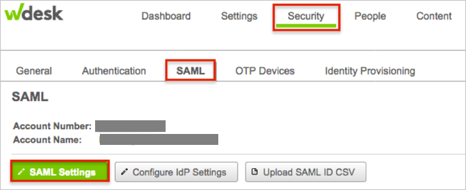
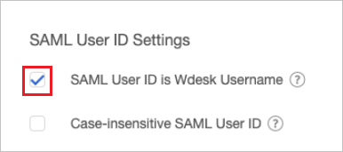
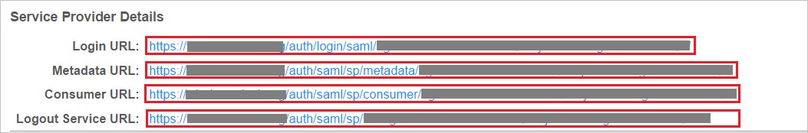
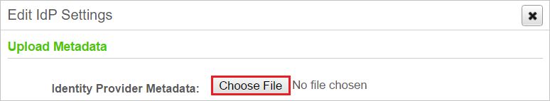
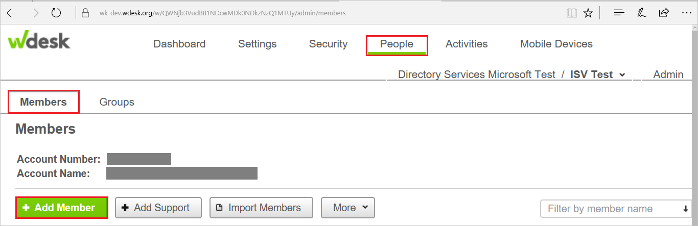
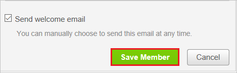

# Tutorial: Azure Active Directory single sign-on (SSO) integration with Wdesk

In this tutorial, you'll learn how to integrate Wdesk with Azure Active Directory (Azure AD). When you integrate Wdesk with Azure AD, you can:

* Control in Azure AD who has access to Wdesk.
* Enable your users to be automatically signed-in to Wdesk with their Azure AD accounts.
* Manage your accounts in one central location - the Azure portal.

To learn more about SaaS app integration with Azure AD, see [What is application access and single sign-on with Azure Active Directory](https://docs.microsoft.com/azure/active-directory/active-directory-appssoaccess-whatis).

## Prerequisites

To get started, you need the following items:

* An Azure AD subscription. If you don't have a subscription, you can get a [free account](https://azure.microsoft.com/free/).
* Wdesk single sign-on (SSO) enabled subscription.

## Scenario description

In this tutorial, you configure and test Azure AD single sign-on in a test environment.

* Wdesk supports **SP** and **IDP** initiated SSO
* Once you configure Wdesk you can enforce Session control, which protect exfiltration and infiltration of your organization’s sensitive data in real-time. Session control extend from Conditional Access. [Learn how to enforce session control with Microsoft Cloud App Security](https://docs.microsoft.com/cloud-app-security/proxy-deployment-aad)

## Adding Wdesk from the gallery

To configure the integration of Wdesk into Azure AD, you need to add Wdesk from the gallery to your list of managed SaaS apps.

1. Sign in to the [Azure portal](https://portal.azure.com) using either a work or school account, or a personal Microsoft account.
1. On the left navigation pane, select the **Azure Active Directory** service.
1. Navigate to **Enterprise Applications** and then select **All Applications**.
1. To add new application, select **New application**.
1. In the **Add from the gallery** section, type **Wdesk** in the search box.
1. Select **Wdesk** from results panel and then add the app. Wait a few seconds while the app is added to your tenant.

## Configure and test Azure AD single sign-on

In this section, you configure and test Azure AD single sign-on with Wdesk based on a test user called **Britta Simon**.
For single sign-on to work, a link relationship between an Azure AD user and the related user in Wdesk needs to be established.

To configure and test Azure AD SSO with Wdesk, complete the following building blocks:

1. **[Configure Azure AD SSO](#configure-azure-ad-sso)** - to enable your users to use this feature.
    1. **[Create an Azure AD test user](#create-an-azure-ad-test-user)** - to test Azure AD single sign-on with B.Simon.
    1. **[Assign the Azure AD test user](#assign-the-azure-ad-test-user)** - to enable B.Simon to use Azure AD single sign-on.
1. **[Configure Wdesk SSO](#configure-wdesk-sso)** - to configure the single sign-on settings on application side.
    1. **[Create Wdesk test user](#create-wdesk-test-user)** - to have a counterpart of B.Simon in Wdesk that is linked to the Azure AD representation of user.
1. **[Test SSO](#test-sso)** - to verify whether the configuration works.

### Configure Azure AD SSO

In this section, you enable Azure AD single sign-on in the Azure portal.

To configure Azure AD single sign-on with Wdesk, perform the following steps:

1. In the [Azure portal](https://portal.azure.com/), on the **Wdesk** application integration page, select **Single sign-on**.

    

2. On the **Select a Single sign-on method** dialog, select **SAML/WS-Fed** mode to enable single sign-on.

    

3. On the **Set up Single Sign-On with SAML** page, click **Edit** icon to open **Basic SAML Configuration** dialog.

	

4. On the **Basic SAML Configuration** section, if you wish to configure the application in **IDP** initiated mode, perform the following steps:

    

    a. In the **Identifier** text box, type a URL using the following pattern:
    `https://<subdomain>.wdesk.com/auth/saml/sp/metadata/<instancename>`

    b. In the **Reply URL** text box, type a URL using the following pattern:
    `https://<subdomain>.wdesk.com/auth/saml/sp/consumer/<instancename>`

5. Click **Set additional URLs** and perform the following step if you wish to configure the application in **SP** initiated mode:

    

    In the **Sign-on URL** text box, type a URL using the following pattern:
    `https://<subdomain>.wdesk.com/auth/login/saml/<instancename>`

	> [!NOTE]
	> These values are not real. Update these values with the actual Identifier, Reply URL, and Sign-On URL. You get these values from WDesk portal when you configure the SSO.

4. On the **Set up Single Sign-On with SAML** page, in the **SAML Signing Certificate** section, click **Download** to download the **Federation Metadata XML** from the given options as per your requirement and save it on your computer.

	

6. On the **Set up Wdesk** section, copy the appropriate URL(s) as per your requirement.

	

	a. Login URL

	b. Azure AD Identifier

	c. Logout URL

### Create an Azure AD test user 

The objective of this section is to create a test user in the Azure portal called Britta Simon.

1. In the Azure portal, in the left pane, select **Azure Active Directory**, select **Users**, and then select **All users**.

    

2. Select **New user** at the top of the screen.

    

3. In the User properties, perform the following steps.

    

    a. In the **Name** field enter **BrittaSimon**.
  
    b. In the **User name** field type brittasimon@yourcompanydomain.extension. For example, BrittaSimon@contoso.com

    c. Select **Show password** check box, and then write down the value that's displayed in the Password box.

    d. Click **Create**.

### Assign the Azure AD test user

In this section, you enable Britta Simon to use Azure single sign-on by granting access to Wdesk.

1. In the Azure portal, select **Enterprise Applications**, select **All applications**, then select **Wdesk**.

	

2. In the applications list, select **Wdesk**.

	

3. In the menu on the left, select **Users and groups**.

    

4. Click the **Add user** button, then select **Users and groups** in the **Add Assignment** dialog.

    

5. In the **Users and groups** dialog select **Britta Simon** in the Users list, then click the **Select** button at the bottom of the screen.

6. If you are expecting any role value in the SAML assertion then in the **Select Role** dialog select the appropriate role for the user from the list, then click the **Select** button at the bottom of the screen.

7. In the **Add Assignment** dialog click the **Assign** button.

## Configure Wdesk SSO

1. In a different web browser window, sign in to Wdesk as a Security Administrator.

2. In the bottom left, click **Admin** and choose **Account Admin**:
 
     

3. In Wdesk Admin, navigate to **Security**, then **SAML** > **SAML Settings**:

    

1. Under **SAML User ID Settings**, check **SAML User ID is Wdesk Username**.

    

4. Under **General Settings**, check the **Enable SAML Single Sign On**:

    

5. Under **Service Provider Details**, perform the following steps:

    

	  a. Copy the **Login URL** and paste it in **Sign-on Url** textbox on Azure portal.
   
	  b. Copy the **Metadata Url** and paste it in **Identifier** textbox on Azure portal.
	   
	  c. Copy the **Consumer url** and paste it in **Reply Url** textbox on Azure portal.
   
	  d. Click **Save** on Azure portal to save the changes.      

6. Click **Configure IdP Settings** to open **Edit IdP Settings** dialog. Click **Choose File** to locate the **Metadata.xml** file you saved from Azure portal, then upload it.
    
    
  
7. Click **Save changes**.

    

### Create Wdesk test user

To enable Azure AD users to sign in to Wdesk, they must be provisioned into Wdesk. In Wdesk, provisioning is a manual task.

**To provision a user account, perform the following steps:**

1. Sign in to Wdesk as a Security Administrator.

2. Navigate to **Admin** > **Account Admin**.

     

3. Click **Members** under **People**.

4. Now click **Add Member** to open **Add Member** dialog box. 
   
      

5. In **User** text box, enter the username of user like b.simon@contoso.com and click **Continue** button.

    

6.  Enter the details as shown below:
  
    
 
    a. In **E-mail** text box, enter the email of user like b.simon@contoso.com.

    b. In **First Name** text box, enter the first name of user like **B**.

    c. In **Last Name** text box, enter the last name of user like **Simon**.

7. Click **Save Member** button.  

    

### Test SSO 

In this section, you test your Azure AD single sign-on configuration using the Access Panel.

When you click the Wdesk tile in the Access Panel, you should be automatically signed in to the Wdesk for which you set up SSO. For more information about the Access Panel, see [Introduction to the Access Panel](https://docs.microsoft.com/azure/active-directory/active-directory-saas-access-panel-introduction).

## Additional Resources

- [List of Tutorials on How to Integrate SaaS Apps with Azure Active Directory](https://docs.microsoft.com/azure/active-directory/active-directory-saas-tutorial-list)

- [What is application access and single sign-on with Azure Active Directory?](https://docs.microsoft.com/azure/active-directory/active-directory-appssoaccess-whatis)

- [What is Conditional Access in Azure Active Directory?](https://docs.microsoft.com/azure/active-directory/conditional-access/overview)

- [What is session control in Microsoft Cloud App Security?](https://docs.microsoft.com/cloud-app-security/proxy-intro-aad)