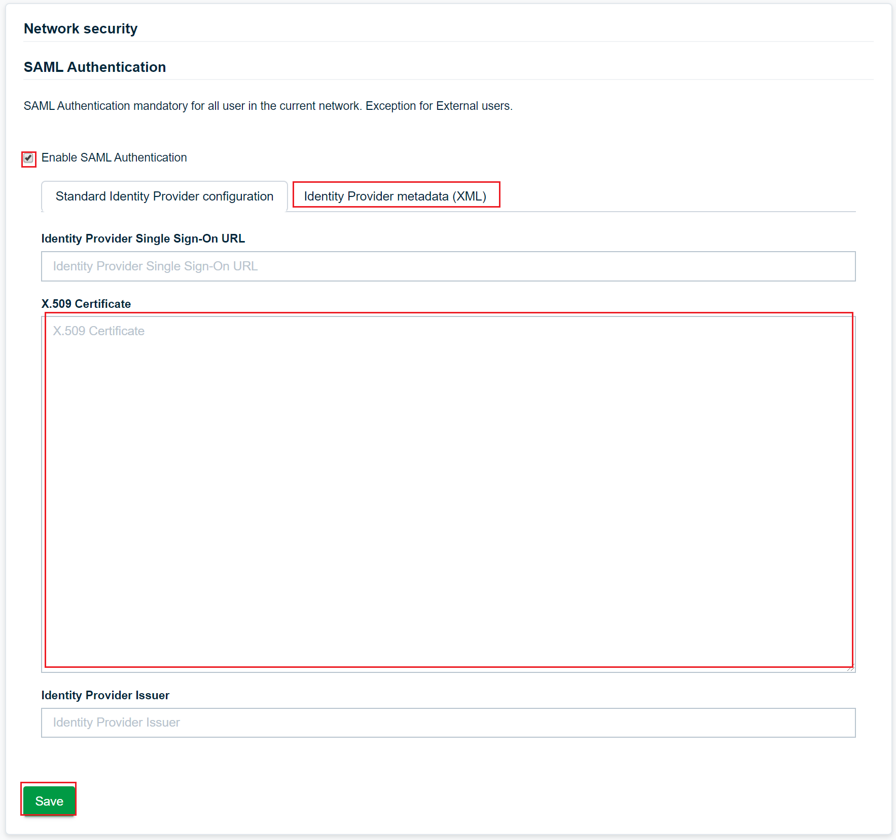

# Tutorial: Azure Active Directory single sign-on (SSO) integration with WEDO

In this tutorial, you'll learn how to integrate WEDO with Azure Active Directory (Azure AD). When you integrate WEDO with Azure AD, you can:

* Control in Azure AD who has access to WEDO.
* Enable your users to be automatically signed-in to WEDO with their Azure AD accounts.
* Manage your accounts in one central location - the Azure portal.

To learn more about SaaS app integration with Azure AD, see [What is application access and single sign-on with Azure Active Directory](https://docs.microsoft.com/azure/active-directory/active-directory-appssoaccess-whatis).

## Prerequisites

To get started, you need the following items:

* An Azure AD subscription. If you don't have a subscription, you can get a [free account](https://azure.microsoft.com/free/).
* WEDO single sign-on (SSO) enabled subscription. Please contact [WEDO Client support team](mailto:info@wedo.swiss) to get a SSO subscription.

## Scenario description

In this tutorial, you configure and test Azure AD SSO in a test environment.

* WEDO supports **SP and IDP** initiated SSO

* [Once you configure the WEDO you can enforce session controls, which protect exfiltration and infiltration of your organization’s sensitive data in real-time. Session controls extend from Conditional Access. Learn how to enforce session control with Microsoft Cloud App Security](https://docs.microsoft.com/cloud-app-security/proxy-deployment-any-app).

## Adding WEDO from the gallery

To configure the integration of WEDO into Azure AD, you need to add WEDO from the gallery to your list of managed SaaS apps.

1. Sign in to the [Azure portal](https://portal.azure.com) using either a work or school account, or a personal Microsoft account.
1. On the left navigation pane, select the **Azure Active Directory** service.
1. Navigate to **Enterprise Applications** and then select **All Applications**.
1. To add new application, select **New application**.
1. In the **Add from the gallery** section, type **WEDO** in the search box.
1. Select **WEDO** from results panel and then add the app. Wait a few seconds while the app is added to your tenant.

## Configure and test Azure AD single sign-on for WEDO

Configure and test Azure AD SSO with WEDO using a test user called **B.Simon**. For SSO to work, you need to establish a link relationship between an Azure AD user and the related user in WEDO.

To configure and test Azure AD SSO with WEDO, complete the following building blocks:

1. **[Configure Azure AD SSO](#configure-azure-ad-sso)** - to enable your users to use this feature.
    * **[Create an Azure AD test user](#create-an-azure-ad-test-user)** - to test Azure AD single sign-on with B.Simon.
    * **[Assign the Azure AD test user](#assign-the-azure-ad-test-user)** - to enable B.Simon to use Azure AD single sign-on.
1. **[Configure WEDO SSO](#configure-wedo-sso)** - to configure the single sign-on settings on application side.
    * **[Create WEDO test user](#create-wedo-test-user)** - to have a counterpart of B.Simon in WEDO that is linked to the Azure AD representation of user.
1. **[Test SSO](#test-sso)** - to verify whether the configuration works.

## Configure Azure AD SSO

Follow these steps to enable Azure AD SSO in the Azure portal.

1. In the [Azure portal](https://portal.azure.com/), on the **WEDO** application integration page, find the **Manage** section and select **single sign-on**.
1. On the **Select a single sign-on method** page, select **SAML**.
1. On the **Set up single sign-on with SAML** page, click the edit/pen icon for **Basic SAML Configuration** to edit the settings.

   

1. On the **Basic SAML Configuration** section, if you wish to configure the application in **IDP** initiated mode, enter the values for the following fields:

    a. In the **Identifier** text box, type a URL using the following pattern:
    `https://<SUBDOMAIN>.wedo.swiss/sp/acs`

    b. In the **Reply URL** text box, type a URL using the following pattern:
    `https://<SUBDOMAIN>.wedo.swiss/sp/acs`

1. Click **Set additional URLs** and perform the following step if you wish to configure the application in **SP** initiated mode:

    In the **Sign-on URL** text box, type a URL using the following pattern:
    `https://<SUBDOMAIN>.wedo.swiss/`

	> [!NOTE]
	> These values are not real. Update these values with the actual Identifier, Reply URL and Sign-on URL. Contact [WEDO Client support team](mailto:info@wedo.swiss) to get these values. You can also refer to the patterns shown in the **Basic SAML Configuration** section in the Azure portal.

1. WEDO application expects the SAML assertions in a specific format, which requires you to add custom attribute mappings to your SAML token attributes configuration. The following screenshot shows the list of default attributes.

	| Name | Source Attribute|
	| ------------ | --------- |
	| email | user.email |
	| firstName | user.firstName |
    | lastName | user.lasttName |
	| userName | user.userName |

1. On the **Set up single sign-on with SAML** page, in the **SAML Signing Certificate** section,  find **Federation Metadata XML** and select **Download** to download the certificate and save it on your computer.

	

1. On the **Set up WEDO** section, copy the appropriate URL(s) based on your requirement.

	

### Create an Azure AD test user

In this section, you'll create a test user in the Azure portal called B.Simon.

1. From the left pane in the Azure portal, select **Azure Active Directory**, select **Users**, and then select **All users**.
1. Select **New user** at the top of the screen.
1. In the **User** properties, follow these steps:
   1. In the **Name** field, enter `B.Simon`.  
   1. In the **User name** field, enter the username@companydomain.extension. For example, `B.Simon@contoso.com`.
   1. Select the **Show password** check box, and then write down the value that's displayed in the **Password** box.
   1. Click **Create**.

### Assign the Azure AD test user

In this section, you'll enable B.Simon to use Azure single sign-on by granting access to WEDO.

1. In the Azure portal, select **Enterprise Applications**, and then select **All applications**.
1. In the applications list, select **WEDO**.
1. In the app's overview page, find the **Manage** section and select **Users and groups**.

   

1. Select **Add user**, then select **Users and groups** in the **Add Assignment** dialog.

	

1. In the **Users and groups** dialog, select **B.Simon** from the Users list, then click the **Select** button at the bottom of the screen.
1. If you're expecting any role value in the SAML assertion, in the **Select Role** dialog, select the appropriate role for the user from the list and then click the **Select** button at the bottom of the screen.
1. In the **Add Assignment** dialog, click the **Assign** button.

## Configure WEDO SSO

Follow these steps to enable Azure AD SSO in WEDO.

1. Log in [WEDO](https://login.wedo.swiss/). You need to have **administrator role**.
1. In the Profile settings, select the menu **Authentication** in the section **Network settings**.
1. On the **SAML Authentication** page, perform the following steps:

   

   a. Enable **SAML Authentication**.

   b. Select the **Identity Provider metadata (XML)** tab.

   c. Open the downloaded **Federation Metadata XML** from Azure portal into Notepad and copy the content of metadata XML and paste it into **X.509 Certificate** textbox.

   d. Click on **Save**

### Create WEDO test user

In this section, you'll create a test user in WEDO called Bob Simon. Information must matches from *Create an Azure AD test user*.

1. From the Profile setting in WEDO, select **Users** from *Network settings* section.
1. Click **Add user**.
1. In the Add user popup, fill the user's information

    a. First name `B`.

    b. Last name `Simon`.

    c. Enter the email `username@companydomain.extension`. For example, `B.Simon@contoso.com`. It is mandatory to have email with the same domain as your company short name.

    d. User type `User`.

    e. Click **Create user**.

    f. In the *Select teams* page, click **Save**.

    g.  In the *Invite user* page, click **Yes**.

1. Validate the user using the link you received by email

> [!NOTE]
> If you want to create a fake user (email above does not exist in your network), contact [our support](mailto:info@wedo.swiss) to validate the user*.

## Test SSO

In this section, you test your Azure AD single sign-on configuration using the Access Panel.

When you click the WEDO tile in the Access Panel, you should be automatically signed in to the WEDO for which you set up SSO. For more information about the Access Panel, see [Introduction to the Access Panel](https://docs.microsoft.com/azure/active-directory/active-directory-saas-access-panel-introduction).

## Additional resources

- [ List of Tutorials on How to Integrate SaaS Apps with Azure Active Directory ](https://docs.microsoft.com/azure/active-directory/active-directory-saas-tutorial-list)

- [What is application access and single sign-on with Azure Active Directory? ](https://docs.microsoft.com/azure/active-directory/active-directory-appssoaccess-whatis)

- [What is conditional access in Azure Active Directory?](https://docs.microsoft.com/azure/active-directory/conditional-access/overview)

- [Try WEDO with Azure AD](https://aad.portal.azure.com/)

- [What is session control in Microsoft Cloud App Security?](https://docs.microsoft.com/cloud-app-security/proxy-intro-aad)

- [How to protect WEDO with advanced visibility and controls](https://docs.microsoft.com/cloud-app-security/proxy-intro-aad)
