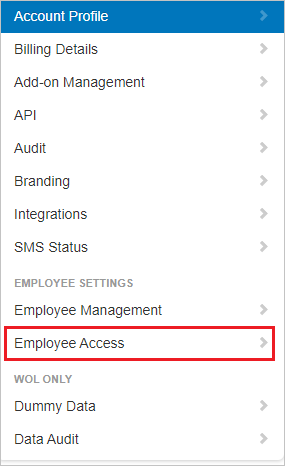

# Tutorial: Azure AD SSO integration with WhosOnLocation

In this tutorial, you'll learn how to integrate WhosOnLocation with Azure Active Directory (Azure AD). When you integrate WhosOnLocation with Azure AD, you can:

* Control in Azure AD who has access to WhosOnLocation.
* Enable your users to be automatically signed-in to WhosOnLocation with their Azure AD accounts.
* Manage your accounts in one central location - the Azure portal.

## Prerequisites

To get started, you need the following items:

* An Azure AD subscription. If you don't have a subscription, you can get a [free account](https://azure.microsoft.com/free/).
* WhosOnLocation single sign-on (SSO) enabled subscription.
* Along with Cloud Application Administrator, Application Administrator can also add or manage applications in Azure AD.
For more information, see [Azure built-in roles](../roles/permissions-reference.md).

## Scenario description

In this tutorial, you configure and test Azure AD SSO in a test environment.

* WhosOnLocation supports **SP** initiated SSO.

## Add WhosOnLocation from the gallery

To configure the integration of WhosOnLocation into Azure AD, you need to add WhosOnLocation from the gallery to your list of managed SaaS apps.

1. Sign in to the Azure portal using either a work or school account, or a personal Microsoft account.
1. On the left navigation pane, select the **Azure Active Directory** service.
1. Navigate to **Enterprise Applications** and then select **All Applications**.
1. To add new application, select **New application**.
1. In the **Add from the gallery** section, type **WhosOnLocation** in the search box.
1. Select **WhosOnLocation** from results panel and then add the app. Wait a few seconds while the app is added to your tenant.

 Alternatively, you can also use the [Enterprise App Configuration Wizard](https://portal.office.com/AdminPortal/home?Q=Docs#/azureadappintegration). In this wizard, you can add an application to your tenant, add users/groups to the app, assign roles, as well as walk through the SSO configuration as well. [Learn more about Microsoft 365 wizards.](/microsoft-365/admin/misc/azure-ad-setup-guides)

## Configure and test Azure AD SSO for WhosOnLocation

Configure and test Azure AD SSO with WhosOnLocation using a test user called **B.Simon**. For SSO to work, you need to establish a link relationship between an Azure AD user and the related user in WhosOnLocation.

To configure and test Azure AD SSO with WhosOnLocation, perform the following steps:

1. **[Configure Azure AD SSO](#configure-azure-ad-sso)** - to enable your users to use this feature.
    1. **[Create an Azure AD test user](#create-an-azure-ad-test-user)** - to test Azure AD single sign-on with B.Simon.
    1. **[Assign the Azure AD test user](#assign-the-azure-ad-test-user)** - to enable B.Simon to use Azure AD single sign-on.
1. **[Configure WhosOnLocation SSO](#configure-whosonlocation-sso)** - to configure the single sign-on settings on application side.
    1. **[Create WhosOnLocation test user](#create-whosonlocation-test-user)** - to have a counterpart of B.Simon in WhosOnLocation that is linked to the Azure AD representation of user.
1. **[Test SSO](#test-sso)** - to verify whether the configuration works.

## Configure Azure AD SSO

Follow these steps to enable Azure AD SSO in the Azure portal.

1. In the Azure portal, on the **WhosOnLocation** application integration page, find the **Manage** section and select **single sign-on**.
1. On the **Select a single sign-on method** page, select **SAML**.
1. On the **Set up single sign-on with SAML** page, click the pencil icon for **Basic SAML Configuration** to edit the settings.

    

1. On the **Basic SAML Configuration** section, perform the following steps:

    a. In the **Identifier (Entity ID)** text box, type a URL using the following pattern:
    `https://login.whosonlocation.com/saml/metadata/<CUSTOM_ID>`

    b. In the **Reply URL** text box, type a URL using the following pattern:
    `https://login.whosonlocation.com/saml/acs/<CUSTOM_ID>`
    
	c. In the **Sign on URL** text box, type a URL using the following pattern:
    `https://login.whosonlocation.com/saml/login/<CUSTOM_ID>`

	> [!NOTE]
	> These values are not real. Update these values with the actual Identifier, Reply URL and Sign on URL. Contact [WhosOnLocation Client support team](mailto:support@whosonlocation.com) to get these values. You can also refer to the patterns shown in the **Basic SAML Configuration** section in the Azure portal.

1. On the **Set up single sign-on with SAML** page, in the **SAML Signing Certificate** section,  find **Certificate (Base64)** and select **Download** to download the certificate and save it on your computer.

	

1. On the **Set up WhosOnLocation** section, copy the appropriate URL(s) based on your requirement.

	

### Create an Azure AD test user

In this section, you'll create a test user in the Azure portal called B.Simon.

1. From the left pane in the Azure portal, select **Azure Active Directory**, select **Users**, and then select **All users**.
1. Select **New user** at the top of the screen.
1. In the **User** properties, follow these steps:
   1. In the **Name** field, enter `B.Simon`.  
   1. In the **User name** field, enter the username@companydomain.extension. For example, `B.Simon@contoso.com`.
   1. Select the **Show password** check box, and then write down the value that's displayed in the **Password** box.
   1. Click **Create**.

### Assign the Azure AD test user

In this section, you'll enable B.Simon to use Azure single sign-on by granting access to WhosOnLocation.

1. In the Azure portal, select **Enterprise Applications**, and then select **All applications**.
1. In the applications list, select **WhosOnLocation**.
1. In the app's overview page, find the **Manage** section and select **Users and groups**.
1. Select **Add user**, then select **Users and groups** in the **Add Assignment** dialog.
1. In the **Users and groups** dialog, select **B.Simon** from the Users list, then click the **Select** button at the bottom of the screen.
1. If you're expecting any role value in the SAML assertion, in the **Select Role** dialog, select the appropriate role for the user from the list and then click the **Select** button at the bottom of the screen.
1. In the **Add Assignment** dialog, click the **Assign** button.

## Configure WhosOnLocation SSO

1. In a different browser window, sign on to your WhosOnLocation company site as administrator.

2. Click on **Tools** -> **Account**.

    

3. In the left side navigator, select **Employee Access**.

    

4. Perform the following steps in the following page.

    

    a. Change **Single sign-on with SAML** to **Yes**.

    b. In the **Issuer URL** textbox, paste the **Entity ID** value which you have copied from the Azure portal.

    c. In the **SSO Endpoint** textbox, paste the **Login URL** value which you have copied from the Azure portal.

    d. Open the downloaded **Certificate (Base64)** from the Azure portal into Notepad and paste the content into the **Certificate** textbox.

    e. Click on **Save SAML Configuration**.

### Create WhosOnLocation test user

In this section, you create a user called B.Simon in WhosOnLocation. Work with [WhosOnLocation support team](mailto:support@whosonlocation.com) to add the users in the WhosOnLocation platform. Users must be created and activated before you use single sign-on.

## Test SSO 

In this section, you test your Azure AD single sign-on configuration with following options. 

* Click on **Test this application** in Azure portal. This will redirect to WhosOnLocation Sign-On URL where you can initiate the login flow. 

* Go to WhosOnLocation Sign-On URL directly and initiate the login flow from there.

* You can use Microsoft My Apps. When you click the WhosOnLocation tile in the My Apps, this will redirect to WhosOnLocation Sign-On URL. For more information about the My Apps, see [Introduction to the My Apps](../user-help/my-apps-portal-end-user-access.md).

## Next steps

Once you configure WhosOnLocation you can enforce session control, which protects exfiltration and infiltration of your organization’s sensitive data in real time. Session control extends from Conditional Access. [Learn how to enforce session control with Microsoft Cloud App Security](/cloud-app-security/proxy-deployment-aad).