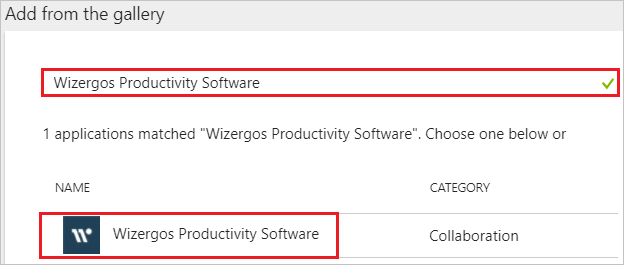
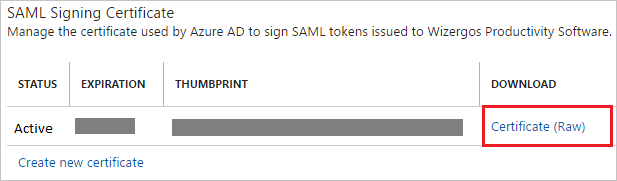
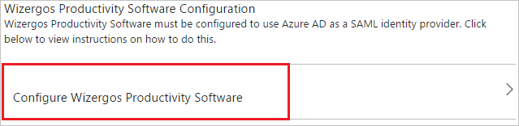
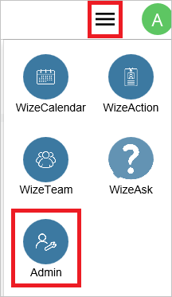
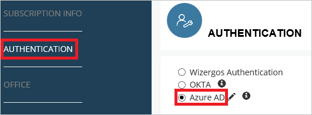

---
title: 'Tutorial: Azure Active Directory integration with Wizergos Productivity Software | Microsoft Docs'
description: Learn how to configure single sign-on between Azure Active Directory and Wizergos Productivity Software.
services: active-directory
documentationCenter: na
author: jeevansd
manager: mtillman
ms.reviewer: joflore

ms.assetid: acc04396-13c5-4c24-ab9a-30fbc9234ebd
ms.service: active-directory
ms.component: saas-app-tutorial
ms.workload: identity
ms.tgt_pltfrm: na
ms.devlang: na
ms.topic: article
ms.date: 11/24/2017
ms.author: jeedes

---
# Tutorial: Azure Active Directory integration with Wizergos Productivity Software

In this tutorial, you learn how to integrate Wizergos Productivity Software with Azure Active Directory (Azure AD).

Integrating Wizergos Productivity Software with Azure AD provides you with the following benefits:

- You can control in Azure AD who has access to Wizergos Productivity Software.
- You can enable your users to automatically get signed-on to Wizergos Productivity Software (Single Sign-On) with their Azure AD accounts.
- You can manage your accounts in one central location - the Azure portal.

If you want to know more details about SaaS app integration with Azure AD, see [what is application access and single sign-on with Azure Active Directory](../manage-apps/what-is-single-sign-on.md).

## Prerequisites

To configure Azure AD integration with Wizergos Productivity Software, you need the following items:

- An Azure AD subscription
- A Wizergos Productivity Software single sign-on enabled subscription

> [!NOTE]
> To test the steps in this tutorial, we do not recommend using a production environment.

To test the steps in this tutorial, you should follow these recommendations:

- Do not use your production environment, unless it is necessary.
- If you don't have an Azure AD trial environment, you can [get a one-month trial](https://azure.microsoft.com/pricing/free-trial/).

## Scenario description
In this tutorial, you test Azure AD single sign-on in a test environment. 
The scenario outlined in this tutorial consists of two main building blocks:

1. Adding Wizergos Productivity Software from the gallery
1. Configuring and testing Azure AD single sign-on

## Adding Wizergos Productivity Software from the gallery
To configure the integration of Wizergos Productivity Software into Azure AD, you need to add Wizergos Productivity Software from the gallery to your list of managed SaaS apps.

**To add Wizergos Productivity Software from the gallery, perform the following steps:**

1. In the **[Azure portal](https://portal.azure.com)**, on the left navigation panel, click **Azure Active Directory** icon. 

	![The Azure Active Directory button][1]

1. Navigate to **Enterprise applications**. Then go to **All applications**.

	![The Enterprise applications blade][2]
	
1. To add new application, click **New application** button on the top of dialog.

	![The New application button][3]

1. In the search box, type **Wizergos Productivity Software**, select **Wizergos Productivity Software** from result panel then click **Add** button to add the application.

	

## Configure and test Azure AD single sign-on

In this section, you configure and test Azure AD single sign-on with Wizergos Productivity Software based on a test user called "Britta Simon".

For single sign-on to work, Azure AD needs to know what the counterpart user in Wizergos Productivity Software is to a user in Azure AD. In other words, a link relationship between an Azure AD user and the related user in Wizergos Productivity Software needs to be established.

In Wizergos Productivity Software, assign the value of the **user name** in Azure AD as the value of the **Username** to establish the link relationship.

To configure and test Azure AD single sign-on with Wizergos Productivity Software, you need to complete the following building blocks:

1. **[Configure Azure AD Single Sign-On](#configure-azure-ad-single-sign-on)** - to enable your users to use this feature.
1. **[Create an Azure AD test user](#create-an-azure-ad-test-user)** - to test Azure AD single sign-on with Britta Simon.
1. **[Create a Wizergos Productivity Software test user](#create-a-wizergos-productivity-software-test-user)** - to have a counterpart of Britta Simon in Wizergos Productivity Software that is linked to the Azure AD representation of user.
1. **[Assign the Azure AD test user](#assign-the-azure-ad-test-user)** - to enable Britta Simon to use Azure AD single sign-on.
1. **[Test single sign-on](#test-single-sign-on)** - to verify whether the configuration works.

### Configure Azure AD single sign-on

In this section, you enable Azure AD single sign-on in the Azure portal and configure single sign-on in your Wizergos Productivity Software application.

**To configure Azure AD single sign-on with Wizergos Productivity Software, perform the following steps:**

1. In the Azure portal, on the **Wizergos Productivity Software** application integration page, click **Single sign-on**.

	![Configure single sign-on link][4]

1. On the **Single sign-on** dialog, select **Mode** as	**SAML-based Sign-on** to enable single sign-on.
 
	

1. On the **Wizergos Productivity Software Domain and URLs** section, perform the following steps:

	

    In the **Identifier** textbox, type the URL: `http://www.wizergos.net`

1. On the **SAML Signing Certificate** section, click **Certificate** and then save the certificate file on your computer.

	 

1. Click **Save** button.

	

1. On the **Wizergos Productivity Software Configuration** section, click **Configure Wizergos Productivity Software** to open **Configure sign-on** window. Copy the **Sign-Out URL, SAML Entity ID, and SAML Single Sign-On Service URL** from the **Quick Reference section.**

	 

1. In a different web browser window, sign-on to your Wizergos Productivity Software tenant as an administrator.

1. From the hamburger menu, select **Admin**.

	

1. In Admin page on left hand menu select **AUTHENTICATION** and click on **Azure AD**.

	

1. Perform the following steps on **AUTHENTICATION** section.

	
	
	a. Click **UPLOAD** button to upload the downloaded certificate from Azure AD.
	
	b. In the **Issuer URL** textbox, paste the **SAML Entity ID** value which you have copied from Azure portal.
	
	c. In the **Single Sign-On URL** textbox, paste the **SAML Single Sign-On Service URL** value which you have copied from Azure portal.
	
	d. In the **Single Sign-Out URL** textbox, paste the **Sign-Out URL** value which you have copied from Azure portal.
	
	e. Click **Save** button.

> [!TIP]
> You can now read a concise version of these instructions inside the [Azure portal](https://portal.azure.com), while you are setting up the app!  After adding this app from the **Active Directory > Enterprise Applications** section, simply click the **Single Sign-On** tab and access the embedded documentation through the **Configuration** section at the bottom. You can read more about the embedded documentation feature here: [Azure AD embedded documentation]( https://go.microsoft.com/fwlink/?linkid=845985)
> 

### Create an Azure AD test user

The objective of this section is to create a test user in the Azure portal called Britta Simon.

   ![Create an Azure AD test user][100]

**To create a test user in Azure AD, perform the following steps:**

1. In the Azure portal, in the left pane, click the **Azure Active Directory** button.

    

1. To display the list of users, go to **Users and groups**, and then click **All users**.

    

1. To open the **User** dialog box, click **Add** at the top of the **All Users** dialog box.

    

1. In the **User** dialog box, perform the following steps:

    

    a. In the **Name** box, type **BrittaSimon**.

    b. In the **User name** box, type the email address of user Britta Simon.

    c. Select the **Show Password** check box, and then write down the value that's displayed in the **Password** box.

    d. Click **Create**.
 
### Create a Wizergos Productivity Software test user

In this section, you create a user called Britta Simon in Wizergos Productivity Software. Please work with [Wizergos Productivity Software support team](mailTo:support@wizergos.com) to add the users in the Wizergos Productivity Software platform.

### Assign the Azure AD test user

In this section, you enable Britta Simon to use Azure single sign-on by granting access to Wizergos Productivity Software.

![Assign the user role][200] 

**To assign Britta Simon to Wizergos Productivity Software, perform the following steps:**

1. In the Azure portal, open the applications view, and then navigate to the directory view and go to **Enterprise applications** then click **All applications**.

	![Assign User][201] 

1. In the applications list, select **Wizergos Productivity Software**.

	  

1. In the menu on the left, click **Users and groups**.

	![The "Users and groups" link][202]

1. Click **Add** button. Then select **Users and groups** on **Add Assignment** dialog.

	![The Add Assignment pane][203]

1. On **Users and groups** dialog, select **Britta Simon** in the Users list.

1. Click **Select** button on **Users and groups** dialog.

1. Click **Assign** button on **Add Assignment** dialog.
	
### Test single sign-on

In this section, you test your Azure AD single sign-on configuration using the Access Panel.

When you click the Wizergos Productivity Software tile in the Access Panel, you should get automatically signed-on to your Wizergos Productivity Software application.
For more information about the Access Panel, see [Introduction to the Access Panel](../user-help/active-directory-saas-access-panel-introduction.md). 

## Additional resources

* [List of Tutorials on How to Integrate SaaS Apps with Azure Active Directory](tutorial-list.md)
* [What is application access and single sign-on with Azure Active Directory?](../manage-apps/what-is-single-sign-on.md)

<!--Image references-->

[1]: ./media/wizergosproductivitysoftware-tutorial/tutorial_general_01.png
[2]: ./media/wizergosproductivitysoftware-tutorial/tutorial_general_02.png
[3]: ./media/wizergosproductivitysoftware-tutorial/tutorial_general_03.png
[4]: ./media/wizergosproductivitysoftware-tutorial/tutorial_general_04.png

[100]: ./media/wizergosproductivitysoftware-tutorial/tutorial_general_100.png

[200]: ./media/wizergosproductivitysoftware-tutorial/tutorial_general_200.png
[201]: ./media/wizergosproductivitysoftware-tutorial/tutorial_general_201.png
[202]: ./media/wizergosproductivitysoftware-tutorial/tutorial_general_202.png
[203]: ./media/wizergosproductivitysoftware-tutorial/tutorial_general_203.png

