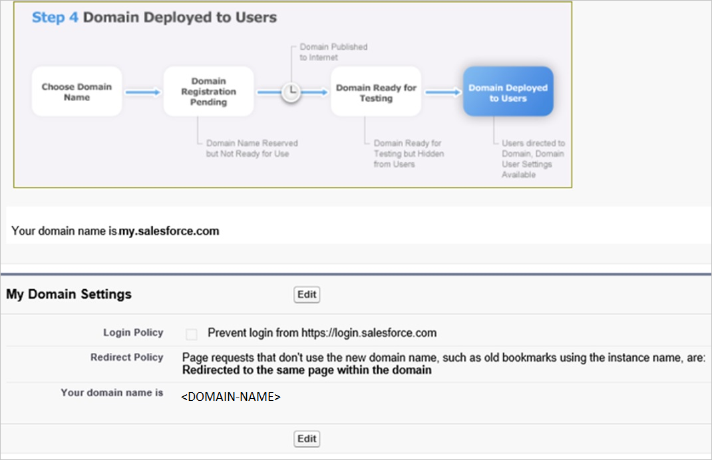
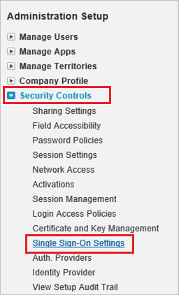
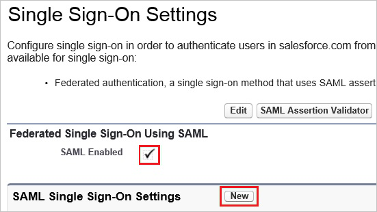
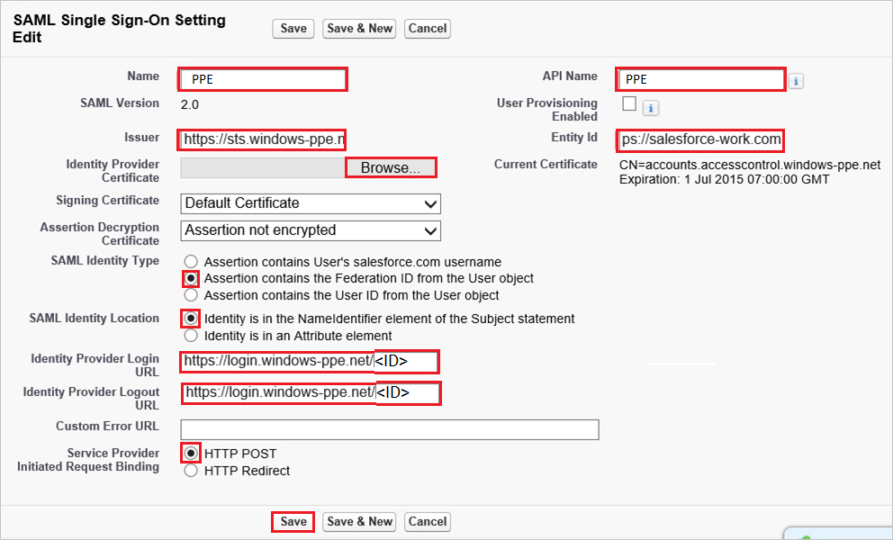
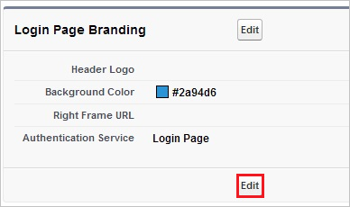
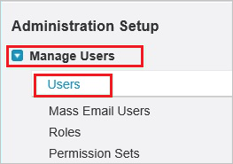

# Tutorial: Azure Active Directory integration with Work.com

In this tutorial, you'll learn how to integrate Work.com with Azure Active Directory (Azure AD). When you integrate Work.com with Azure AD, you can:

* Control in Azure AD who has access to Work.com.
* Enable your users to be automatically signed-in to Work.com with their Azure AD accounts.
* Manage your accounts in one central location - the Azure portal.

## Prerequisites

To configure Azure AD integration with Work.com, you need the following items:

* An Azure AD subscription. If you don't have an Azure AD environment, you can get a [free account](https://azure.microsoft.com/free/)
* Work.com single sign-on enabled subscription.

## Scenario description

In this tutorial, you configure and test Azure AD SSO in a test environment.

* Work.com supports **SP** initiated SSO.

## Add Work.com from the gallery

To configure the integration of Work.com into Azure AD, you need to add Work.com from the gallery to your list of managed SaaS apps.

1. Sign in to the Azure portal using either a work or school account, or a personal Microsoft account.
1. On the left navigation pane, select the **Azure Active Directory** service.
1. Navigate to **Enterprise Applications** and then select **All Applications**.
1. To add new application, select **New application**.
1. In the **Add from the gallery** section, type **Work.com** in the search box.
1. Select **Work.com** from results panel and then add the app. Wait a few seconds while the app is added to your tenant.

 Alternatively, you can also use the [Enterprise App Configuration Wizard](https://portal.office.com/AdminPortal/home?Q=Docs#/azureadappintegration). In this wizard, you can add an application to your tenant, add users/groups to the app, assign roles, as well as walk through the SSO configuration as well. [Learn more about Microsoft 365 wizards.](/microsoft-365/admin/misc/azure-ad-setup-guides)

## Configure and test Azure AD SSO for Work.com

Configure and test Azure AD SSO with Work.com using a test user called **B.Simon**. For SSO to work, you need to establish a link relationship between an Azure AD user and the related user in Work.com.

To configure and test Azure AD SSO with Work.com, perform the following steps:

1. **[Configure Azure AD SSO](#configure-azure-ad-sso)** - to enable your users to use this feature.
    1. **[Create an Azure AD test user](#create-an-azure-ad-test-user)** - to test Azure AD single sign-on with B.Simon.
    2. **[Assign the Azure AD test user](#assign-the-azure-ad-test-user)** - to enable B.Simon to use Azure AD single sign-on.
2. **[Configure Work.com SSO](#configure-workcom-sso)** - to configure the single sign-on settings on application side.
    1. **[Create Work.com test user](#create-workcom-test-user)** - to have a counterpart of B.Simon in Work.com that is linked to the Azure AD representation of user.
3. **[Test SSO](#test-sso)** - to verify whether the configuration works.

## Configure Azure AD SSO

Follow these steps to enable Azure AD SSO in the Azure portal.

1. In the Azure portal, on the **Work.com** application integration page, find the **Manage** section and select **single sign-on**.
1. On the **Select a single sign-on method** page, select **SAML**.
1. On the **Set up single sign-on with SAML** page, click the pencil icon for **Basic SAML Configuration** to edit the settings.

   

4. On the **Basic SAML Configuration** section, perform the following steps:

    In the **Sign-on URL** text box, type a URL using the following pattern:
    `http://<companyname>.my.salesforce.com`

	> [!NOTE]
	> The value is not real. Update the value with the actual Sign-On URL. Contact [Work.com Client support team](https://help.salesforce.com/articleView?id=000159855&type=3) to get the value. You can also refer to the patterns shown in the **Basic SAML Configuration** section in the Azure portal.

5. On the **Set up Single Sign-On with SAML** page, in the **SAML Signing Certificate** section, click **Download** to download the **Certificate (Base64)** from the given options as per your requirement and save it on your computer.

	

6. On the **Set up Work.com** section, copy the appropriate URL(s) as per your requirement.

	

### Create an Azure AD test user

In this section, you'll create a test user in the Azure portal called B.Simon.

1. From the left pane in the Azure portal, select **Azure Active Directory**, select **Users**, and then select **All users**.
2. Select **New user** at the top of the screen.
3. In the **User** properties, follow these steps:
   1. In the **Name** field, enter `B.Simon`.  
   2. In the **User name** field, enter the username@companydomain.extension. For example, `B.Simon@contoso.com`.
   3. Select the **Show password** check box, and then write down the value that's displayed in the **Password** box.
   4. Click **Create**.

### Assign the Azure AD test user

In this section, you'll enable B.Simon to use Azure single sign-on by granting access to Work.com.

1. In the Azure portal, select **Enterprise Applications**, and then select **All applications**.
2. In the applications list, select **Work.com**.
3. In the app's overview page, find the **Manage** section and select **Users and groups**.
4. Select **Add user**, then select **Users and groups** in the **Add Assignment** dialog.
5. In the **Users and groups** dialog, select **B.Simon** from the Users list, then click the **Select** button at the bottom of the screen.
6. If you are expecting a role to be assigned to the users, you can select it from the **Select a role** dropdown. If no role has been set up for this app, you see "Default Access" role selected.
7. In the **Add Assignment** dialog, click the **Assign** button.

## Configure Work.com SSO

1. Sign in to your Work.com tenant as administrator.

2. Go to **Setup**.
   
    

3. On the left navigation pane, in the **Administer** section, click **Domain Management** to expand the related section, and then click **My Domain** to open the **My Domain** page. 
   
    

4. To verify that your domain has been set up correctly, make sure that it is in “**Step 4 Deployed to Users**” and review your “**My Domain Settings**”.
   
    

5. Sign in to your Work.com tenant.

6. Go to **Setup**.
    
    

7. Expand the **Security Controls** menu, and then click **Single Sign-On Settings**.
    
    

8. On the **Single Sign-On Settings** dialog page, perform the following steps:
    
    
    
    a. Select **SAML Enabled**.
    
    b. Click **New**.

9. In the **SAML Single Sign-On Settings** section, perform the following steps:
    
    
    
    a. In the **Name** textbox, type a name for your configuration.  
       
    > [!NOTE]
    > Providing a value for **Name** does automatically populate the **API Name** textbox.
    
    b. In **Issuer** textbox, paste the value of **Azure AD Identifier** which you have copied from Azure portal.
    
    c. To upload the downloaded certificate from Azure portal, click **Browse**.
    
    d. In the **Entity Id** textbox, type `https://salesforce-work.com`.
    
    e. As **SAML Identity Type**, select **Assertion contains the Federation ID from the User object**.
    
    f. As **SAML Identity Location**, select **Identity is in the NameIdentfier element of the Subject statement**.
    
    g. In **Identity Provider Login URL** textbox, paste the value of **Login URL** which you have copied from Azure portal.

    h. In **Identity Provider Logout URL** textbox, paste the value of **Logout URL** which you have copied from Azure portal.
    
    i. As **Service Provider Initiated Request Binding**, select **HTTP Post**.
    
    j. Click **Save**.

10. In your Work.com classic portal, on the left navigation pane, click **Domain Management** to expand the related section, and then click **My Domain** to open the **My Domain** page. 
    
    

11. On the **My Domain** page, in the **Login Page Branding** section, click **Edit**.
    
    

12. On the **Login Page Branding** page, in the **Authentication Service** section, the name of your **SAML SSO Settings** is displayed. Select it, and then click **Save**.
    
    

### Create Work.com test user

For Azure Active Directory users to be able to sign in, they must be provisioned to Work.com. In the case of Work.com, provisioning is a manual task.

### To configure user provisioning, perform the following steps:

1. Sign on to your Work.com company site as an administrator.

2. Go to **Setup**.
   
    

3. Go to **Manage Users \> Users**.
   
    

4. Click **New User**.
   
    

5. In the User Edit section, perform the following steps, in attributes of a valid Azure AD account you want to provision into the related textboxes:
   
    
   
    a. In the **First Name** textbox, type the **first name** of the user **Britta**.
	
	b. In the **Last Name** textbox, type the **last name** of the user **Simon**.
	
	c. In the **Alias** textbox, type the **name** of the user **BrittaS**.
    
    d. In the **Email** textbox, type the **email address** of user Brittasimon@contoso.com.
    
    e. In the **User Name** textbox, type a user name of user like Brittasimon@contoso.com.
    
    f. In the **Nick Name** textbox, type a **nick name** of user **Simon**.
    
    g. Select **Role**, **User License**, and **Profile**.
	
	h. Click **Save**.  
      
    > [!NOTE]
    > The Azure AD account holder will get an email including a link to confirm the account before it becomes active.
    > 

## Test SSO

In this section, you test your Azure AD single sign-on configuration with following options. 

* Click on **Test this application** in Azure portal. This will redirect to Work.com Sign-on URL where you can initiate the login flow. 

* Go to Work.com Sign-on URL directly and initiate the login flow from there.

* You can use Microsoft My Apps. When you click the Work.com tile in the My Apps, this will redirect to Work.com Sign-on URL. For more information about the My Apps, see [Introduction to the My Apps](https://support.microsoft.com/account-billing/sign-in-and-start-apps-from-the-my-apps-portal-2f3b1bae-0e5a-4a86-a33e-876fbd2a4510).

## Next steps

Once you configure Work.com you can enforce session control, which protects exfiltration and infiltration of your organization’s sensitive data in real time. Session control extends from Conditional Access. [Learn how to enforce session control with Microsoft Defender for Cloud Apps](/cloud-app-security/proxy-deployment-aad).